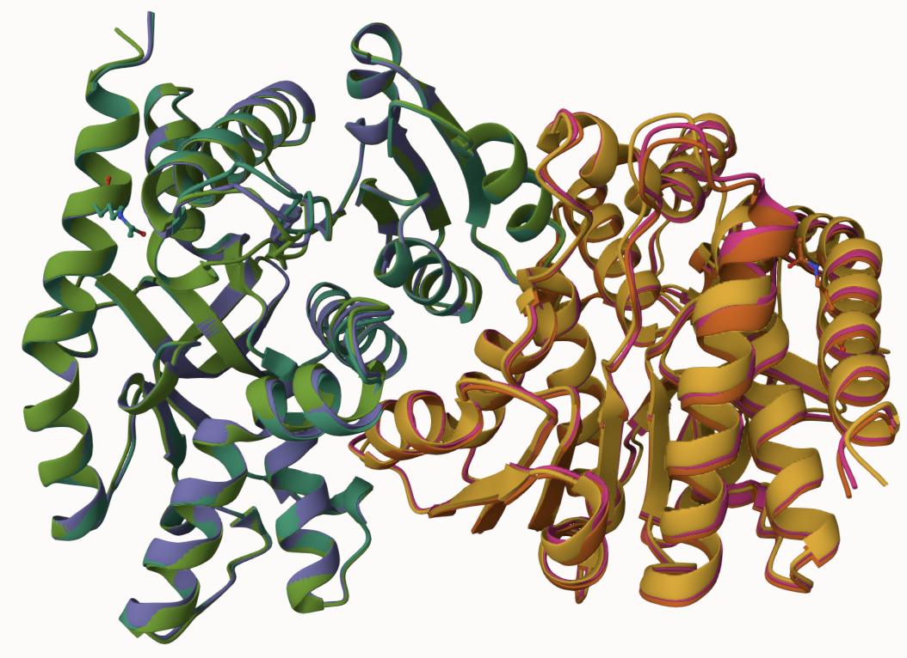
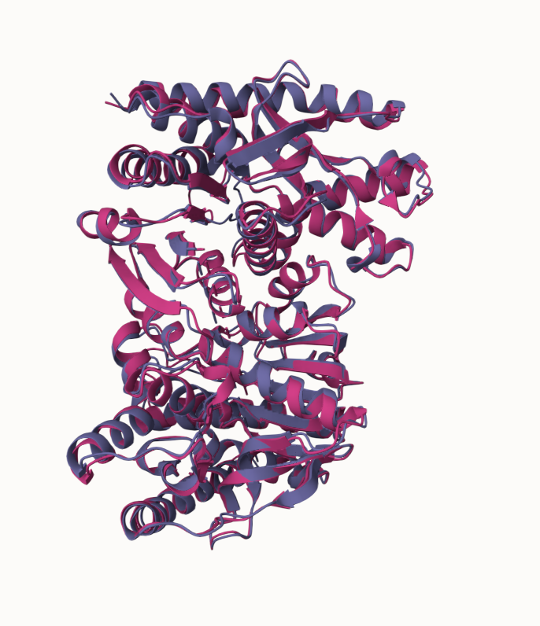
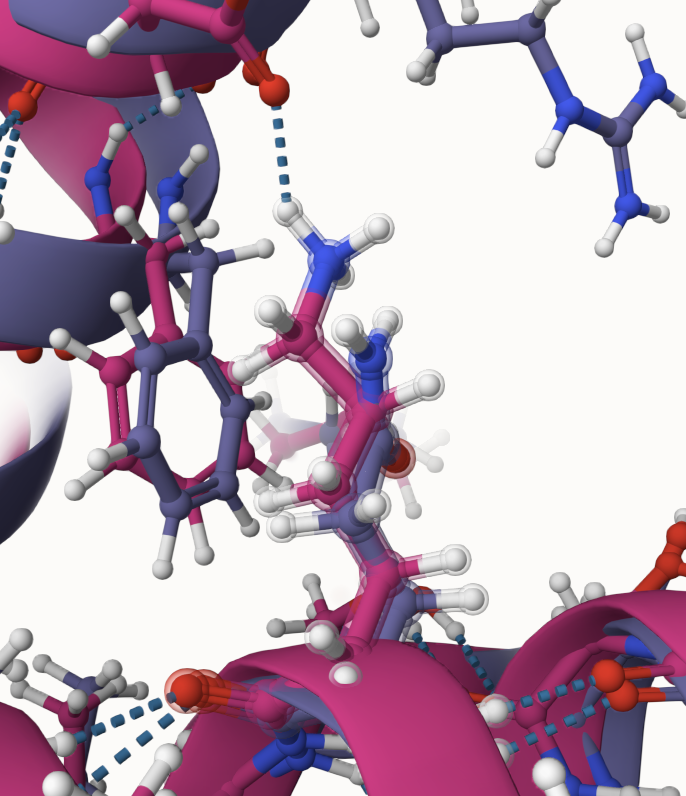
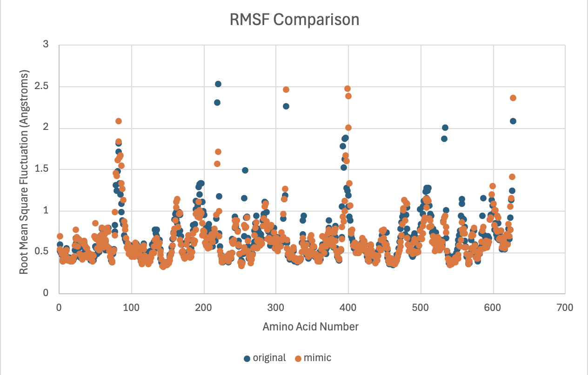
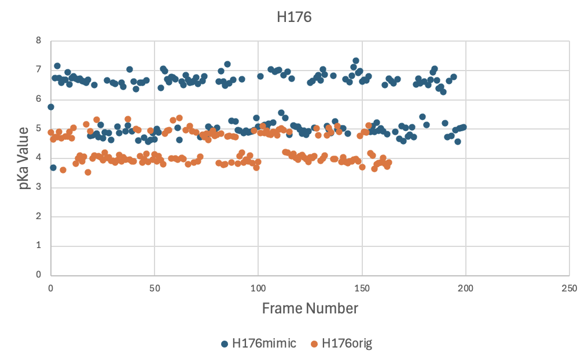
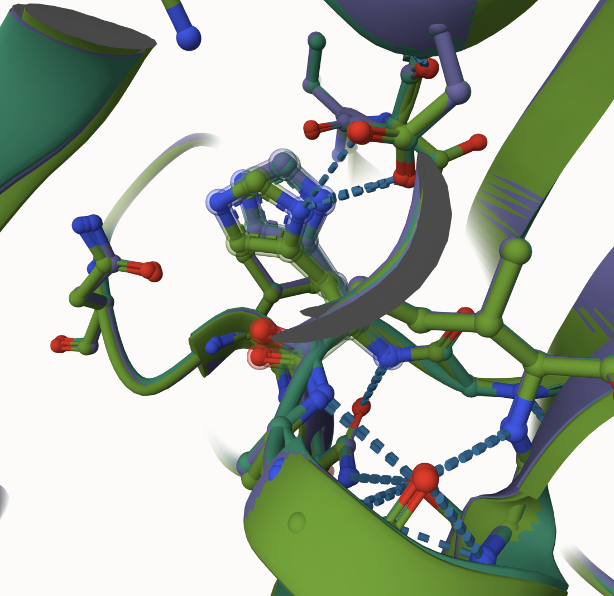
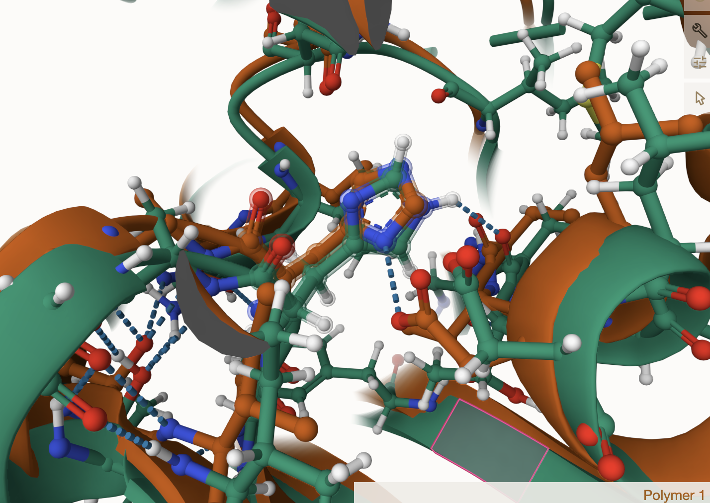

# Human Mitochondrial MDH2
# UniProt ID: P40926
# Variation: acetylation of K329 (acK305 in structure)

## Description

In a study conducted in October of this year, lysine 329 (K329) of human mitochondrial malate dehydrogenase 2 (MDH2) was identified as an acetylated site in acute myeloid leukemia MV4-11 cells. However, detailed information on the site’s structural conformation and interactions remains limited. 

# Comparison of MDH2, acetylated MDH2, and Mimic Variant of MDH2

1. Alignment of MDH2 (purple), MDH2 with acK329 (turquoise), and K329Q (green)

2. Modification site alignment within MDH2
_site_compare.png)

The 305 (329) site is located in the final alpha helix of the dimer of human MDH2, just 9 amino acids away from the C-terminus of the sequence. This site is 14.97 angstroms away from the active site, H176, and is on the periphery of the protein, opposite the dimer interface.

Unmodified interactions: ASP87, ALA301, and PHE309
Modified interactions: ALA301 and PHE309
Mimic Interactions: ALA301, and SER122

## Effect of the sequence variant and PTM on MDH dynamics

1. The RMSD of the final frame from MD simulations of MDH2 and MDHK177Q was 1.28 Å. The unmodified MDH2 is shown in purple while the modified form is shown in pink.

2. After simulation, the overall protein structures are similar other than being slightly offset. The post-simulation site loses its interaction with ASP187.

3. After simulation, the dynamics as described by the root mean square fluctuation (RMSF) value were compared. In the plot, there are differences between the unmodified (blue) and K329Q (orange) around amino acids 220 and 530. Although these residues have no interactions within the active site as well as no interactions with any of the ligands from Project 3, the decreased RMSF in the mimic variant in these positions suggests increased rigidity.

4. When we look at the pKa values of the active site residue, H176, the mimic state consistently exhibits higher pKa values than those of the unmodified state.

5. In the active site, H176, interactions and structure differences can be observed. Original (purple) and PTM (turquoise) appear overlapping, but the mimic (green) is slightly offset. 
Unmodified interactions: ASN121 and ASP149 (1 interaction)
Modified interactions: ASN121 and ASP149 (2 interactions)
Mimic Interactions: ASN121 and ASP149 (2 interactions)

The mimic variant diverged the most from the unmodified MDH2, changing in both interactions and geometry.

## Comparison of the mimic and the authentic PTM

The RMSD of K329Q and acK329 was 1.43 Å. The overall structures are mostly, similar, but in the active site the H176 side chain twists and has different interactions.

The mimic variant is not a good predictor of the authentic PTM.

## Deposition Date

## License

Shield: [![CC BY-NC 4.0][cc-by-nc-shield]][cc-by-nc]

This work is licensed under a
[Creative Commons Attribution-NonCommercial 4.0 International License][cc-by-nc].

[![CC BY-NC 4.0][cc-by-nc-image]][cc-by-nc]

[cc-by-nc]: https://creativecommons.org/licenses/by-nc/4.0/
[cc-by-nc-image]: https://licensebuttons.net/l/by-nc/4.0/88x31.png
[cc-by-nc-shield]: https://img.shields.io/badge/License-CC%20BY--NC%204.0-lightgrey.svg

## References

* Kuhn, M.; Rakus, J.; Quenet, D. Acetylation, ADP-Ribosylation and Methylation of Malate Dehydrogenase. Essays in Biochemistry 2024. 

