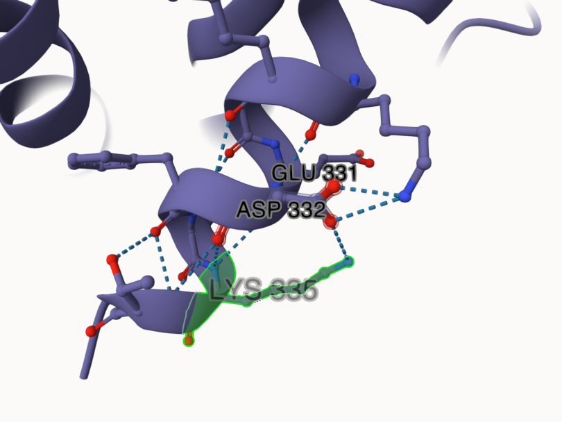
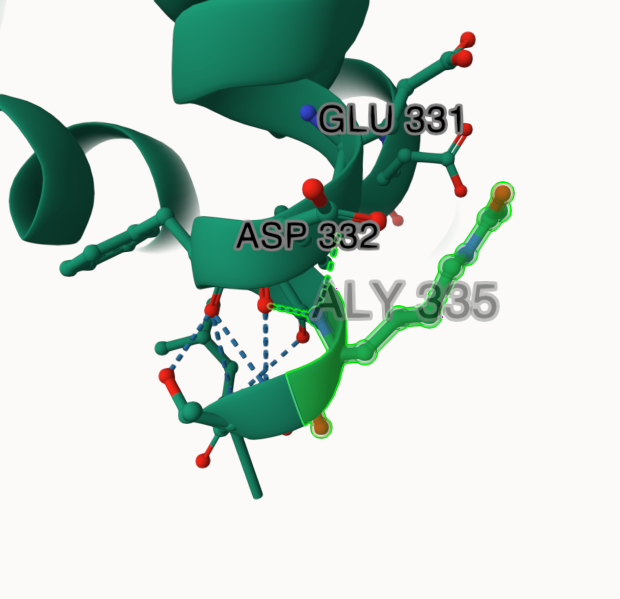
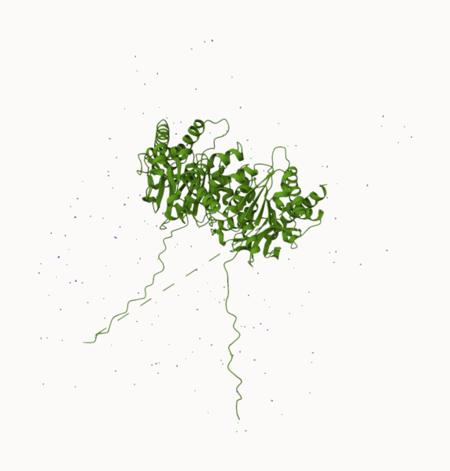
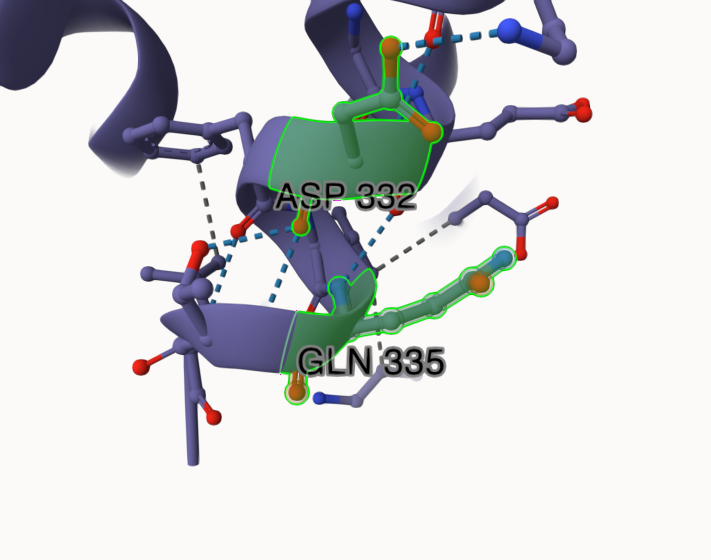
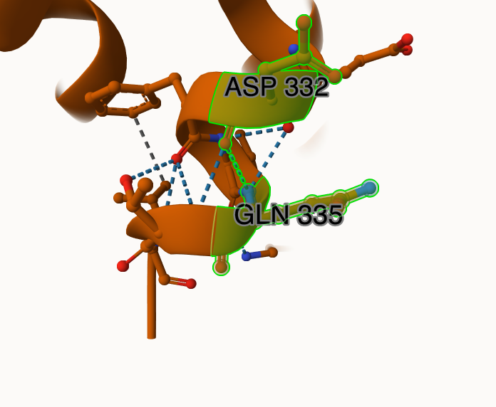
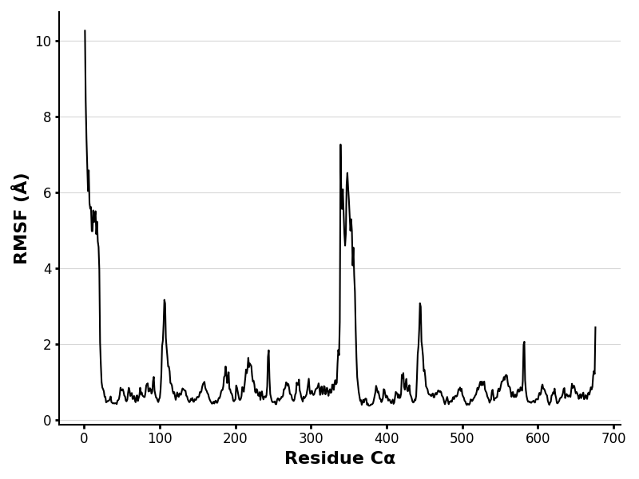
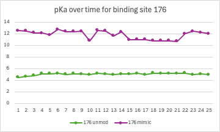

# human MDH2
# P40926
# acK335

## Description

Up to this point in the semester, we have been researching the human protein malate dehydrogenase one and two, with my group specifically focusing on two, the mitochondrial version. Previously, we found MDH2’s structure and function, and now we are modifying this protein to see how it reacts to change. Modification in proteins can lead to many different ramifications and possible outcomes, to the way the protein is organized, stability, and if the protein functions if at all. Many different concepts of biochemistry are involved with the world’s everyday functionalities such as thermodynamics, weak interactions, free energy, steady-states, and biochemical pathways can all be applied at a molecular level to try and give answers to today's many conundrums. One of these major conundrums that correlates with the protein we are currently studying is cancer. There are many researchers, past and current, that have been studying the effects of modified malate dehydrogenase on the human body. A ton of different modifications could potentially be to blame for these problems, and that is why we have each been assigned a modification to study. We are testing this modification through a reliable version of the PTM on the amino acid and then a mimic variant that acts as another way to view the modification through acting like the post translational modification. The modification given to me was the acetylation of amino acid 335, which is a lysine(K). The acetylation turns the lysine into a Glutamine(Q). Acetylation of lysine is when an acetyl group (COCH3) is added onto the amino group side chain of lysine. As you can see in Figure 1, a normal lysine has a positive charge on its side chain and in the glutamine, it has turned to a neutral charge. The K335 modification site has been previously talked about in Kuhn’s article about MDH PTM modifications. Structure and function change are not mentioned, however it was said that the acetylation of K335 has shown up on the radar to be linked with myeloid leukemia MV4-11 cells (Kuhn). One thing to note in this specific modification is that it is the 335th amino acid out of 338 total amino acids in the protein. This means it is at the very end of the sequence, often called the C-terminal, and is relatively close to the active site which is histidine 200. From previous knowledge of C-terminals we know that it can influence  protein folding and stability as well as code for degradation pathways. Because the location of this amino acid is on the tail end of MDH, it makes it more susceptible to post-translational modifications. Nevertheless, the end terminal of a protein is very important due to its major role in regulation, interaction, and possible degradation. Modification of lysine 335 specifically is located on an alpha helix at the very end of the protein, and is about 66.5 angstroms away from any dimer interface.  The active site and substrate binding site are about 23.8 angstroms away from lysine 335 which is still a close enough range to have indirect effects to that region, like conformational changes in the active site. In the unmodified MDH2 protein, the lysine has various weak interactions between aspartic acid 332, glutamic acid 331. The positive amino R group on the side chain of the lysine gives a hydrogen to the oxygen on the side chain of the aspartic acid. The normal amino group of the lysine gives another two hydrogen bonds to the carbonyl group of aspartic acid 332 and glutamic acid 331. However, in the PTM modified and mimic variant images, you can see that the side chain hydrogen bond disappears and it is no longer bonded to the aspartic acid side chain oxygen (Figure 2).  

1. image of the unmodified site

2. image of modification site

## Effect of the sequence variant and PTM on MDH dynamics

Part 3 from the Project 4 report
As far as structure change goes for the PTM modified MDH2 and the mimic variant MDH2, there aren't too many changes at the site of modification. As described previously, the biggest change from the site is the switch of the positive NH3 on the lysine from the unmodified version to the polar uncharged side chains of the mimic glutamine and the PTM. As a result of this change, the hydrogen bond from aspartic acid 332 is lost in the mimic and modified version of the protein. This positive charge most likely provided stability between helices and could have contributed to interactions with other negatively charged molecules on different proteins involved in the metabolic pathway of MDH2. Positively charged residues are normally more involved in pH sensitive functions, so due to the modification or mimic variant the pH of the protein changed. The pH most likely became higher pH, due to the positive charge becoming neutral, which is seen in basic conditions. 
	In the active site of the protein, there was only one visible change in structure and it was only on the mimic variant (Figure 3). One of the hydrogen bonds that is sprouting from the nitrogen of the active site, histidine 200, to the aspartic acid 173 is gone in the mimic version. The modified version is completely similar around the active site. This bond participates in the active site formation and the mechanistic function of the protein. The hydrogen bonds to the nitrogen from Asp173 provide stability to the active site when the substrate starts binding, so having one of these missing could potentially hinder the ability of the mechanism to produce oxaloacetate, due to it being unstable. If the protein is unable to carry out the mechanism needed to make oxaloacetate, MDH2 could become dysfunctional. This dysfunctional MDH2 would directly affect glycolysis and could lead to the accumulation of cytoplasmic NADH. 
	To get a better understanding of the effect the mimic variant modification had on the unmodified MDH2, it was run through multiple colabs to gather data on differences and similarities between the two. The images of the modification site before and after the simulation are pictured below (Figure4). As seen in Figure 4, there is a hydrogen bond that is lost between Asp332 and the modification site Gln335. The RMSD value between the two is a 1.67 meaning the two aren’t directly similar and come with differences in stability.  

1. Image of aligned PDB files (no solvent)

2. Image of the site with the aligned PDB files (no solvent)

3. Annotated RMSF plot showing differences between the simulations

4. Annotated plots of pKa for the key amino acids

Description of the data and changes

The next data that I used to compare the simulated mimic variant to the unmodified MDH2 was a RMSF plot. This plot lets you see the dynamic spots and key sites in the protein. There was a big peak in the modified region around 335, this is most likely due to the acetylation and the fact that it occurs in a C-terminal. In the unmodified MDH2 there are many more dynamic spots of the protein, such as 225, 310, and 410. There are still small peaks in this RMSF plot that may indicate that residual data from the unmodified version but overall it seems this mimic variant acetylation has muted the dynamism of the protein. 
	To see a change in pKa values between the mimic variant and the unmodified protein, I graphed the change in pKa over time on an important part of the MDH2 protein, binding site 176 (Figure 6). In the graph, there is a significant jump between the two. Unmodified MDH2 stays around 4.2-5.5 pKa, while the mimic variant stays around 10.8-12.3 pKa. This relates to the binding site being an arginine, which is a positively charged side chain. It seems that the pKa values of the mimic are becoming higher, which matches a more basic environment and is why positively charged side chains are turning neutral, much like our ac335 modified site. These positively charged side chains are becoming less acidic, meaning they are becoming less likely to accept a proton. Figure 7 shows the RMSD values of the mimic variant, the highest value it reaches is around 3.4. This high RMSD value indicates that the mimic variant is not as stable as the unmodified MDH2 which stays at a value around 1.6. There is also not a clear point where it reaches equalization, meaning the mimic is quite unstable. 
## Comparison of the mimic and the authentic PTM

The molecular dynamics of the mimic variant had both been compared, but the question still arose of how these modifications differed and compared to one another.  When first structurally compared in Mol*, their RMSD value was 2.23. This number means the two structures are not very similar side by side. However, the PTM modified and mimic variant both had a 1.22 RMSD value when compared to the unmodified MDH2 protein. The ac335 modification did not have any differences in weak interaction between the mimic and PTM modified version. They both lost the positively charged lysine for a neutral charged side chain. At the active site, the mimic variant did have a missing hydrogen bond to the surrounding asp173 amino acid, and the modification did not. At important binding sites, they did not differ in hydrophobic or hydrogen bonds (Figure 8). The missing active site hydrogen bond in the mimic would be the only difference that could potentially tinker the mimicking ability of the variant and with the MDH2 protein. 
	The mimic variant provided a shorter side chain than the PTM modification model which changes the sterics of MDH2, but not to the full potential that the PTM can because of its longer side chain. This steric hindrance affects a protein's ability to fold and stabilize which is why the mimic might have given those very high RMSD values. 
	While the mimic may have some analytical relevance to the PTM modified model, it is not a perfect representation of the PTM modified model. The mimic captured certain elements of the PTM model through the change of the amino acid to a  neutral side chain and keeping the same bonds throughout most of the structure. But, this mimic tended to over exaggerate certain aspects of the PTM model, such as the loss of the active site hydrogen bond and the unstableness of the MDH2 protein as a whole. The mimic was good at trying to copy the acetylation of lysine at amino acid 335, but these PTM usually have a different way of influencing proteins that mimics simply cannot do with just a single substitution mutation. In this case, the mimic is not a crowning replacement for the PTM modification in the acetylation of lysine 335 in MDH2, but it can be used to understand the basic change of the mutation and how it could potentially alter the protein.

## Authors

Contributors names

Tori Herndon

## Deposition Date

December 6th, 2024
## License

Shield: [![CC BY-NC 4.0][cc-by-nc-shield]][cc-by-nc]

This work is licensed under a
[Creative Commons Attribution-NonCommercial 4.0 International License][cc-by-nc].

[![CC BY-NC 4.0][cc-by-nc-image]][cc-by-nc]

[cc-by-nc]: https://creativecommons.org/licenses/by-nc/4.0/
[cc-by-nc-image]: https://licensebuttons.net/l/by-nc/4.0/88x31.png
[cc-by-nc-shield]: https://img.shields.io/badge/License-CC%20BY--NC%204.0-lightgrey.svg

## References

* Citation1 

* Citation2 

* Citation3 

* Citation4 
