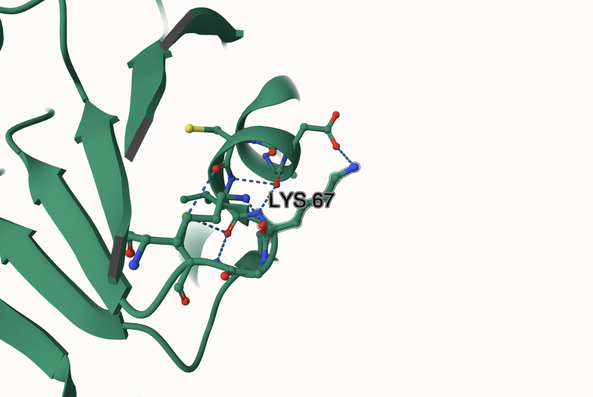
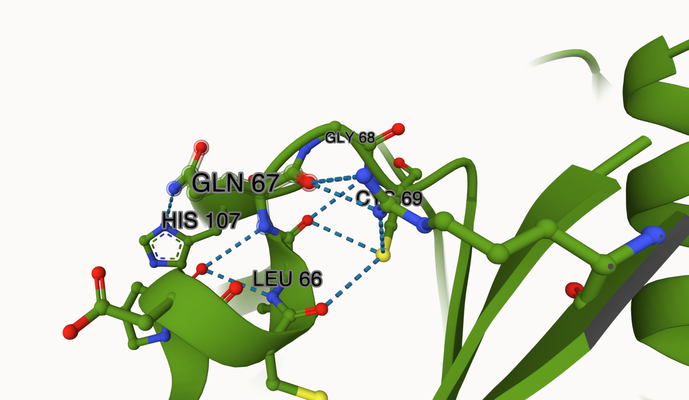
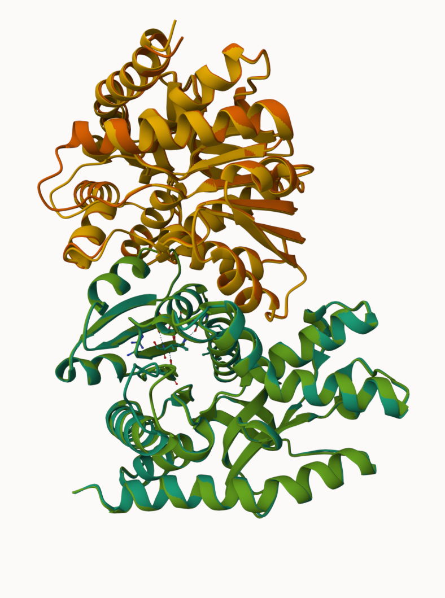
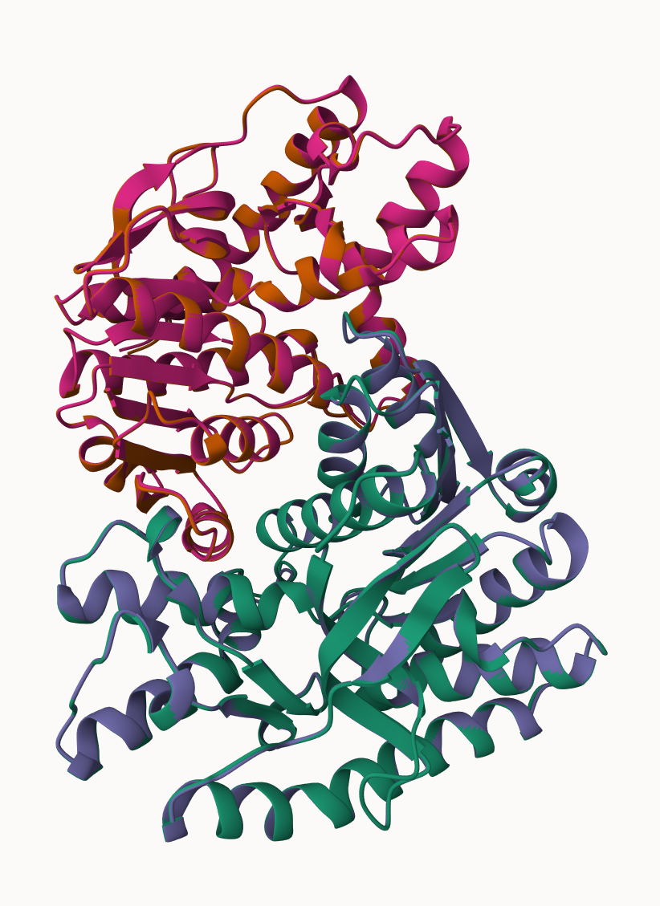
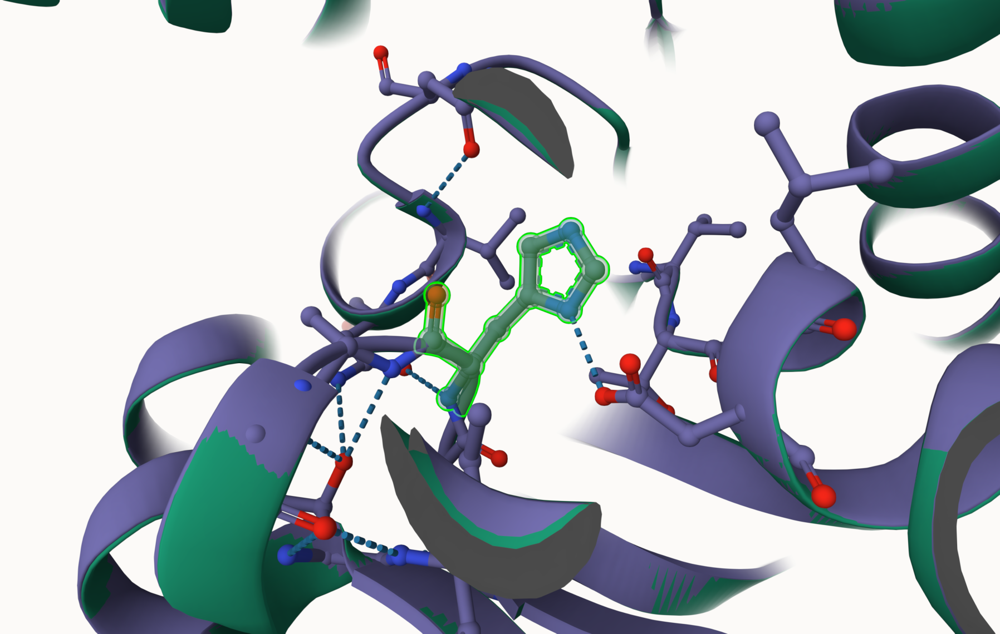
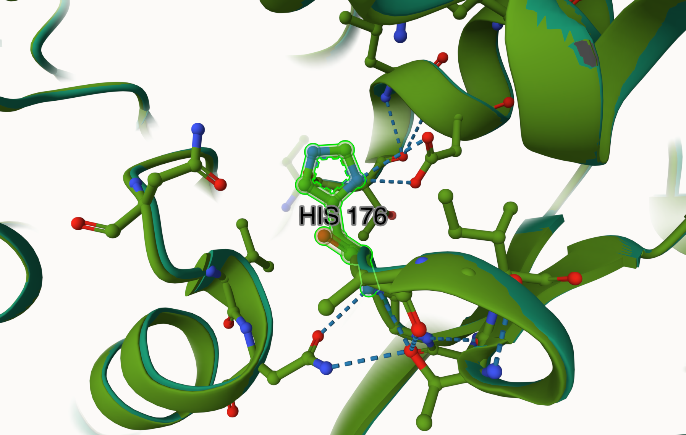
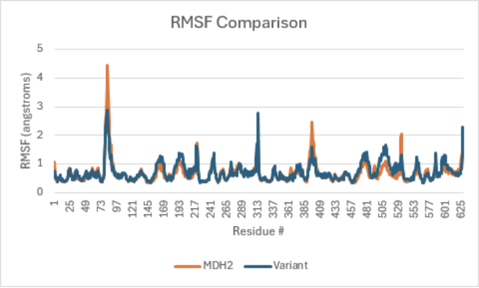
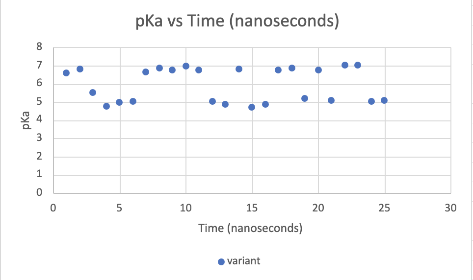
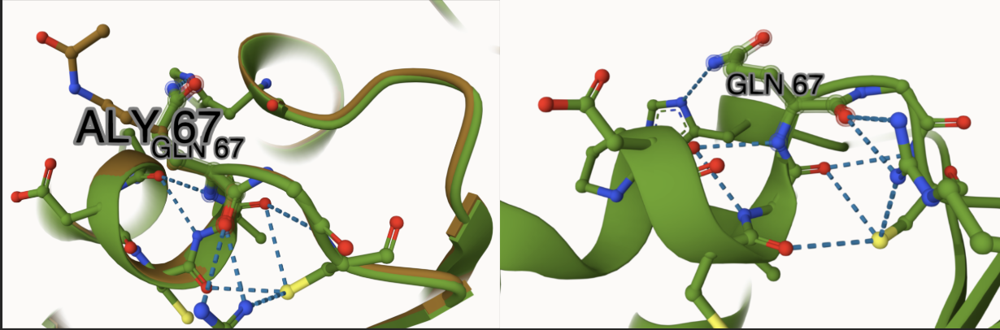

# Homo sapiens (Human) MDH2
# P40926
# Variation: acetylation of K91 (pK67 in structure)

## Description

1. image of the unmodified site

2. image of modification site

## Effect of the sequence variant and PTM on MDH dynamics

1. Image of aligned PDB files (no solvent)

2. Image of the site with the aligned PDB files (no solvent)

3. Annotated RMSF plot showing differences between the simulations

4. Annotated plots of pKa for the key amino acids

## Comparison of the mimic and the authentic PTM

include images as needed

## Authors

Ivy Ray

## Deposition Date

## License

Shield: [![CC BY-NC 4.0][cc-by-nc-shield]][cc-by-nc]

This work is licensed under a
[Creative Commons Attribution-NonCommercial 4.0 International License][cc-by-nc].

[![CC BY-NC 4.0][cc-by-nc-image]][cc-by-nc]

[cc-by-nc]: https://creativecommons.org/licenses/by-nc/4.0/
[cc-by-nc-image]: https://licensebuttons.net/l/by-nc/4.0/88x31.png
[cc-by-nc-shield]: https://img.shields.io/badge/License-CC%20BY--NC%204.0-lightgrey.svg

## References

* (1) Ait-El-Mkadem, S.; Dayem-Quere, M.; Gusic, M.; Chaussenot, A.; Bannwarth, S.; François, B.; Genin, E. C.; Fragaki, K.; Volker-Touw, C. L. M.; Vasnier, C.; Serre, V.; Van Gassen, K. L. I.; Lespinasse, F.; Richter, S.; Eisenhofer, G.; Rouzier, C.; Mochel, F.; De Saint-Martin, A.; Abi Warde, M.-T.; De Sain-van Der Velde, M. G. M.; Jans, J. J. M.; Amiel, J.; Avsec, Z.; Mertes, C.; Haack, T. B.; Strom, T.; Meitinger, T.; Bonnen, P. E.; Taylor, R. W.; Gagneur, J.; Van Hasselt, P. M.; Rötig, A.; Delahodde, A.; Prokisch, H.; Fuchs, S. A.; Paquis-Flucklinger, V. Mutations in MDH2, Encoding a Krebs Cycle Enzyme, Cause Early-Onset Severe Encephalopathy. The American Journal of Human Genetics 2017, 100 (1), 151–159. https://doi.org/10.1016/j.ajhg.2016.11.014.

