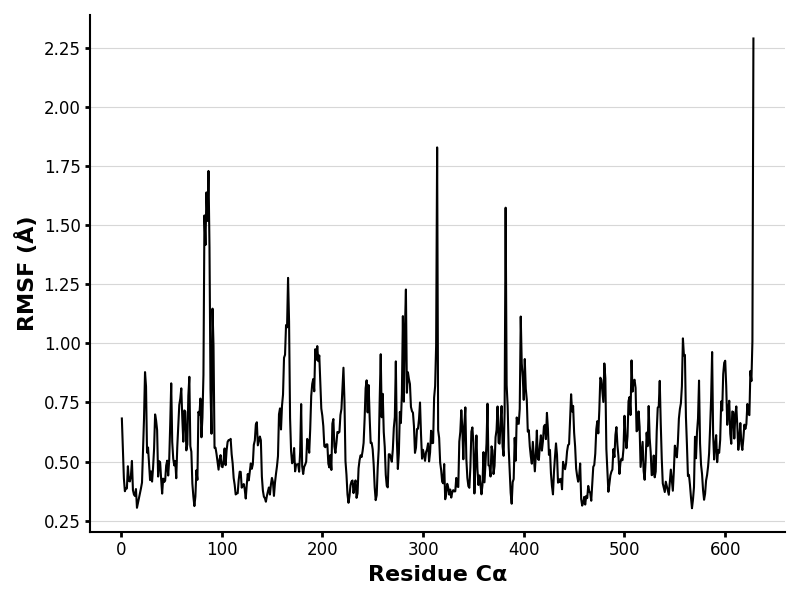
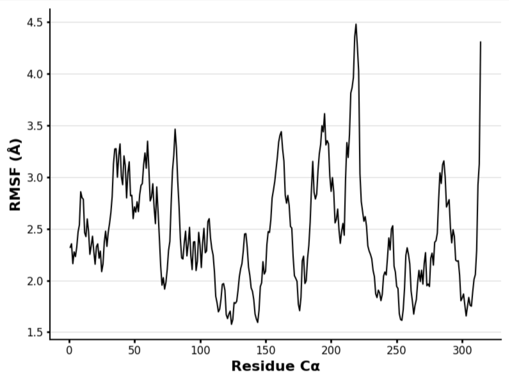

# Human MDH2

# P40926

# Acetylation of K78

## Description

# Malate dehydrogenase, known as MDH, is an enzyme that catalyzes the reduction of L-malate to oxaloacetate using NAD+ as a cofactor. This reaction is necessary for the citric acid cycle as well metabolism in the human body. Human MDH2 is the enzyme that will be focused on in this report, which is the mitochondrial isoform involved in the citric acid cycle. I will be comparing unmodified human MDH2 to a modified structure of MDH2 with an acetylated lysine post-translational modification (PTM). Lysine acetylation is a reversible PTM modification of proteins and plays a key role in regulating cellular functions including gene expression, transcription activity, protein stability, stress response, apoptosis, cellular differentiation, and energy metabolism. It has been shown that lysine acetylation can increase enzyme activity in MDH (Venkat, et al., 2019). The acetylation of lysine 54 removes its positive charge, which can affect substrate or NAD+ binding (Choudhary, et al., 2009). Acetylation can also help regulate energy metabolism and impact levels of metabolic intermediates. Since both the mimic and modified structures have the same active site, this could suggest that catalytic activity is not affected, and the enzyme may retain its ability to bind cofactors such as NAD+. The mimic sequence replaces lysine (K) 78 with glutamine (Q), and is the structure that will be used in Boltz and the Colab simulations. In the processing sequence, amino acid K will be in the 54th position.

1.  image of the unmodified site 

2.  image of modification site 

## Effect of the sequence variant and PTM on MDH dynamics

Colab 2 produced RMSF scores, which measure how much each residue in a
protein fluctuates during molecular dynamics simulations. The higher the
RMSF score, the more flexibility in the protein. The mimic RMSF plot
reveals more residues than the original MDH2 plot. It shows that the
mimic is more stable with limited flexibility compared to the unmodified
structure. The unmodified MDH2 plot shows higher RMSF values, meaning it
is more dynamic.

1.  Image of aligned PDB files (no solvent) 

2.  Image of the site with the aligned PDB files (no solvent) 

3.  Annotated RMSF plot showing differences between the simulations
    

4.  Annotated plots of pKa for the key amino acids ![Chart revealing the
    pka value of active site HIS 176 in the mimic structure.]
    (images/mimic_pka.png)

![pka value of HIS 176 in the unmodified structure, with its mean being
slightly lower than the mimic.] (images/unmodified_pka.png)

5.  If needed, show ligand bound images and how modification affects
    substrate binding ![AlphaFill image displaying a cation-pi
    interaction between active site HIS 176 and NAD+.] (images/NAD.png)

Description of the data and changes

## Comparison of the mimic and the authentic PTM

Comparing the mimic and modified MDH2 structures in MolStar, they have
extremely similar structures, with only a few differences. Looking at
the active site, the mimic interacts with amino acid ARG 86, and is
connected through a cation-pi interaction. The modified sequence does
not have any pi interactions near the active site, and does not interact
with ARG 86. The other weak interactions present are similar between the
two models, showing primarily hydrogen bonding between the active site
and the surrounding amino acids. The cation-pi interaction may indicate
a more stable binding site for oxaloacetate or malate. In addition, the
unmodified MDH2 structure does not show any pi interactions between the
active site either. This may imply that the mimic structure is also more
stable than the unmodified version.

include images as needed 

### Colab notebook links

MD_step1.ipynb MD_step2.ipynb

## Authors

Ella Walton

## Deposition Date

5/7/2025

## License

Shield: 

This work is licensed under a [Creative Commons
Attribution-NonCommercial 4.0 International
License](https://creativecommons.org/licenses/by-nc/4.0/).

## References

-   Choudhary, Chunaram, et al. “Lysine Acetylation Targets Protein
    Complexes and Co-Regulates Major Cellular Functions.” Science, vol.
    325, no. 5942, Aug. 2009, pp. 834–40.
    <https://doi.org/10.1126/science.1175371>.
    

-   Venkat, Sumana, et al. “Studying the Lysine Acetylation of Malate
    Dehydrogenase.” Journal of Molecular Biology, vol. 429, no. 9, May
    2017, pp. 1396–405. ScienceDirect,
    <https://doi.org/10.1016/j.jmb.2017.03.027>.
    

\*Baird, Lisa M., et al. “Malate Dehydrogenase in Plants: Evolution,
Structure, and a Myriad of Functions.” Essays in Biochemistry, edited by
Joseph Provost et al., vol. 68, no. 2, Oct. 2024, pp. 221–33.
<https://doi.org/10.1042/EBC20230089>. ![10.1042/EBC20230089]
(<https://doi.org/10.1042/EBC20230089>)
