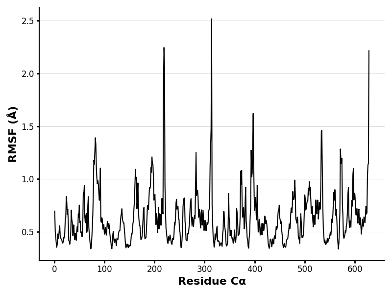

# Homo sapiens MDH2

# P40926

# Acetylation of K91 (K67 in structure)

## Description

The modification site in human malate dehydrogenase 2 at amino acid 91
has been researched before. In human MDH2 the amino acid at 91 is
normally lysine but from a particular sequence from UnitProt, the lysine
is at position 67.

# Part 1 from Project 4 report outline (with citations as appropriate)

1.  image of the unmodified site 

2.  image of modification site 

## Effect of the sequence variant and PTM on MDH dynamics

Part 3 from the Project 4 report

1.  Image of aligned PDB files (no solvent) 

2.  Image of the site with the aligned PDB files (no solvent) 

3.  Annotated RMSF plot showing differences between the simulations
    

4.  Annotated plots of pKa for the key amino acids 

5.  If needed, show ligand bound images and how modification affects
    substrate binding

After the simulation, the overall structure is similar although slight
changes can have effects on the function of MDH2.

## Comparison of the mimic and the authentic PTM

The glutamine and acetylated lysine both still form hydrogen bonds like
to the unmodified lysine. While both of these alterations maintain
similar hydrogen bonding, their effects on pKa suggest that they do not
fully replicate the function of MDH2.

### Colab notebook links

05012025_Colab_MD_simulation_Step1v2.ipynb
05012025_Colab_of_MDanalysis_Step2.ipynb

## Authors

Shana Love

## Deposition Date

## License

Shield: 

This work is licensed under a [Creative Commons
Attribution-NonCommercial 4.0 International
License](https://creativecommons.org/licenses/by-nc/4.0/).

## References

-   Lisa M. Baird, Christopher E. Berndsen, Jonathan D. Monroe; Malate
    dehydrogenase in plants: evolution, structure, and a myriad of
    functions. Essays Biochem 3 October 2024; 68 (2):
    221–233.[10,1042](https://doi.org/10.1042/EBC20230089)

-   Takahashi-Íñiguez, T.; Aburto-Rodríguez, N.; Vilchis-González, A.
    L.; Flores, M. E. Function, Kinetic Properties, Crystallization, and
    Regulation of Microbial Malate Dehydrogenase. J Zhejiang Univ Sci B
    2016, 17 (4),
    247–261.[10.1631](https://doi.org/10.1631/jzus.B1500219)

-   Venkat, S.; Gregory, C.; Sturges, J.; Gan, Q.; Fan, C. Studying the
    Lysine Acetylation of Malate Dehydrogenase. J Mol Biol 2017, 429
    (9), 1396–1405.[10.1016](https://doi.org/10.1016/j.jmb.2017.03.027)

-   Pogostin, B. H.; Malmendal, A.; Londergan, C. H.; Åkerfeldt, K. S.
    pKa Determination of a Histidine Residue in a Short Peptide Using
    Raman Spectroscopy. Molecules 2019, 24 (3),
    405.[10.3390](https://doi.org/10.3390/molecules24030405)
