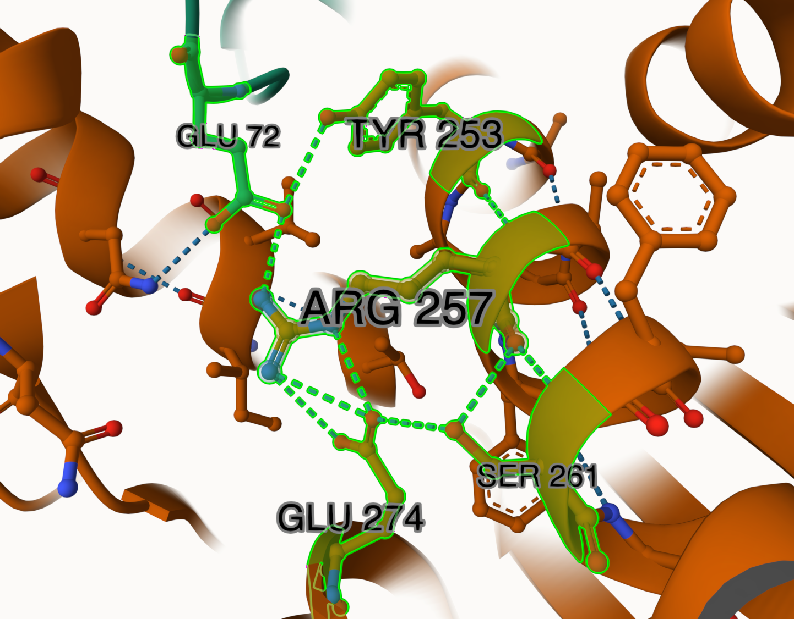
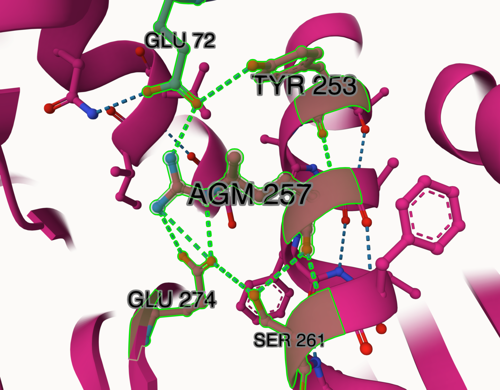
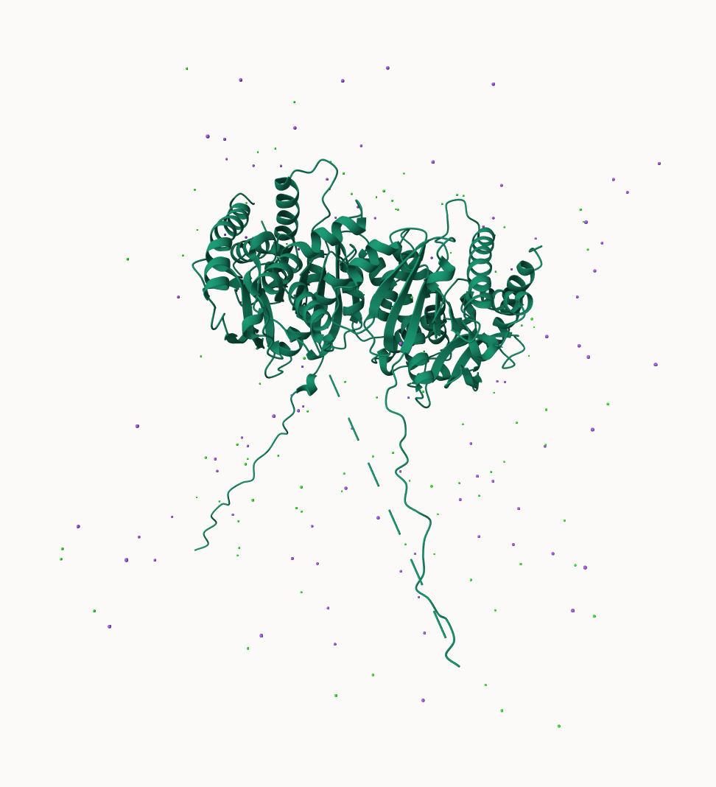
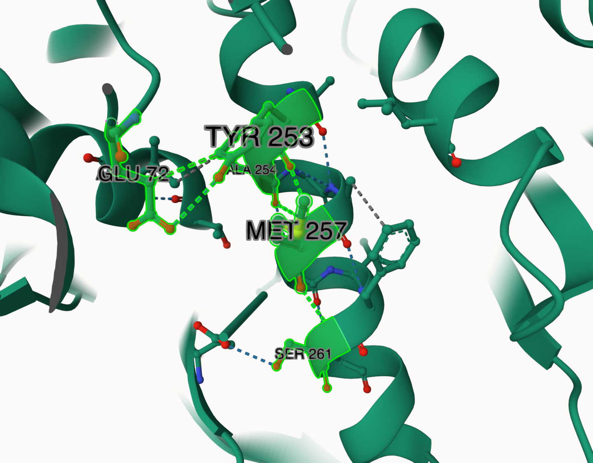
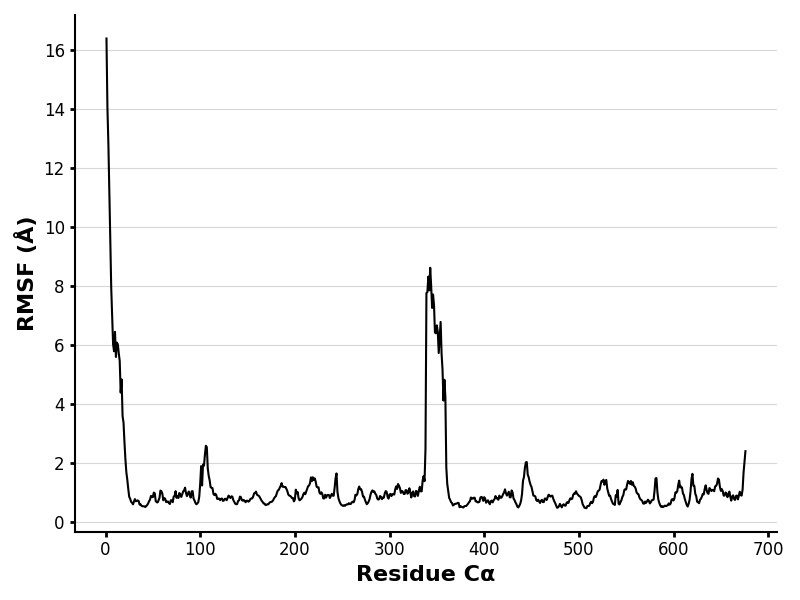
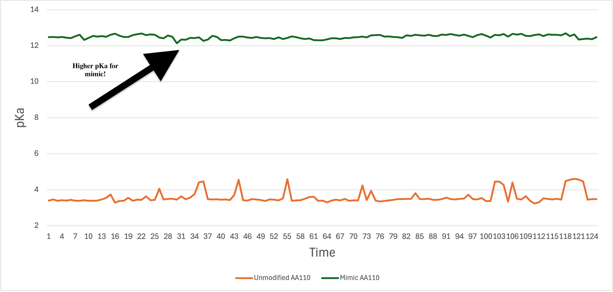

# Human MDH2
# P40926
# me257R

## Description

The post-transcriptional modification I researched was a methylation of amino acid 257 arginine. Methylation of MDH2 R257 has previously been discussed in two proteomic studies and one review article; however, the resulting structural and functional changes were not investigated (Kuhn et al. 2024; Larsen et al. 2016; Maron et al. 2021). The modification site is 257R, which lies within an alpha helix. 257R is just 3.8 Å away from the MDH2 dimer interface and forms a hydrogen bond with 72E of the alternate strand (Fig 1). It is also 14.8 Å from the active site (200H), and 10.1 Å from its nearest binding site (251M), which is within the same alpha helix. Within the unmodified MDH2 model, 257R forms one hydrogen bond with 72E (alternate strand), one with 253Y, three with 274E, and two with 261S (Fig 2). The modified model appears to form the exact same interactions (Fig 3). However, the mimic model variant forms zero interactions with 72E of the alternate chain or 274E but forms the same interactions as the other two models with 253Y and 261S (Fig 4).

1. image of the unmodified site

2. image of modification site

## Effect of the sequence variant and PTM on MDH dynamics

There was a significant shift in structure after the molecular dynamics simulation. The mimic variant lost all non-covalent interactions within its active site 200H (Fig 7). Before the simulation, the mimic exhibited hydrogen bonding to 173D, 145N, and 170T. Post-simulation, the variant shows a total lack of weak interactions at 200H. This suggests a major change in the active site function, possibly even causing a loss of function. The weak interactions provide the active site with stability and shape the binding pocket. With these interactions gone, stability within the active site is going to be significantly reduced. Furthermore, interactions with the modification site also changed. Previously, the modification site showed three hydrogen bonds at the 257R site and no interaction with the alternate chain. Post-simulation, 257R lost one hydrogen bond with 261S, gained hydrogen bonding with 254A, but still shows no interaction with 72E of the alternate chain (Fig 8).
Additionally, the simulated RMSF plot for the mimic variant was quite different from the RMSF for our unmodified protein (Figs 9 & 10). The massive spikes in RMSF values located at the beginning and middle of the mimic plot are due to the highly dynamic tails of the protein. Also, in the mimic plot, we can see spikes reaching ~2 Å around amino acids 110, 220, 450, and 670 (Fig 10). This is interesting because 110 and 200 are binding and active sites, respectively, and their spikes can also be seen in the unmodified RMSF plot (Fig 9). However, the unmodified RMSF plot seems to have some of these peaks at a higher intensity (reaching ~2.5 Å instead of ~2 Å) and much lower peaks at the tail regions. This means that the change in structure within the mimic variant has resulted in less dynamic active and binding regions, and highly dynamic tail regions. Finally, looking at RMSD over time, we see a continual rise over the length of the simulation, indicating the protein may lack a stable equilibrium (Fig 11). The RMSD value also reaches an incredibly high value of 5. This means the protein may be extremely unstable and make dramatic shifts in structure over time.
To observe changes in pKa, I looked at a key binding site of hMDH2, 110R. Comparing the pKa plots, we can see the mimic has a significantly higher pKa at ~12.5 and less variation over time (Fig 12). On the other hand, the unmodified enzyme shows a much lower pKa of ~3.5 and much higher variation over time. This means that within the mimic variant, the 110R binding site has become significantly less acidic. The modification must have altered the surrounding environment, such as by reducing local non-covalent interactions, thereby stabilizing the protonated form of the residue and raising its pKa. The reduced variation indicates that the mimic 110R binding site exhibits a more stable ionization state under the given conditions. This suggests the conditions stabilizing the protonated form of the residue are extremely strong and stable.

1. Image of aligned PDB files (no solvent)

2. Image of the site with the aligned PDB files (no solvent)

3. Annotated RMSF plot showing differences between the simulations

4. Annotated plots of pKa for the key amino acids

## Comparison of the mimic and the authentic PTM

The structural analysis of the mimic variant reveals significant deviations from the PTM-modified model (Figs 2–6). The mimic showed a reduction of non-covalent interactions and altered proximities to key sites. These observations raised my suspicions about the mimic's accuracy as a representation of the modified protein. Molecular dynamics simulations confirmed these suspicions, showing that the mimic variant demonstrated substantial functional and structural differences from the unmodified protein's performance.
Specifically, within the modification site of 257R, the PTM-modified protein model retained all hydrogen bonds seen in the unmodified protein, suggesting structural and functional integrity is preserved. Whereas the mimic loses critical hydrogen bonds with residues 72E (alternate chain) and 274E, retaining only interactions within the alpha helix (253Y and 261S). Loss of interactions with the dimer interface suggests reduced stability of the dimer structure, possibly affecting overall function. Additionally, within the active site, the modified model is consistent with the unmodified protein by maintaining two hydrogen bonds with 173D and one with 145N. The mimic active site loses one hydrogen bond with 173D and forms a new interaction with 170T. These differences will likely cause a structural shift in the mimic variant's active site and create function that is less efficient than the PTM model.
Additionally, the simulation revealed that the mimic shows a continual rise in RMSD, reaching a maximum value of 5, indicating instability and substantial structural changes over time (Fig 12). The unmodified protein reached equilibrium quickly and achieved a maximum value of 1.6 when studied in project 2. The mimic variant's instability demonstrates that it is likely very functionally different from the PTM model. Additionally, the mimic exhibits greater fluctuations in RMSF than the unmodified protein, particularly in the highly dynamic tail regions, further indicating altered flexibility and structural instability (Figs 9 & 10). Finally, the pKa plot of the mimic shows a significantly higher pKa (~12.5 vs. ~3.5), suggesting alterations in the ionization states and non-covalent interactions of binding sites (Fig 12).
Together, these findings indicate that the mimic variant of hMDH2 is not a functional representation of the PTM-modified model. The mimic exhibits major deviations in structural stability, functional site interactions, and overall dynamics.

## Authors

Samuel J. Krauss

## Deposition Date

## License

Shield: [![CC BY-NC 4.0][cc-by-nc-shield]][cc-by-nc]

This work is licensed under a
[Creative Commons Attribution-NonCommercial 4.0 International License][cc-by-nc].

[![CC BY-NC 4.0][cc-by-nc-image]][cc-by-nc]

[cc-by-nc]: https://creativecommons.org/licenses/by-nc/4.0/
[cc-by-nc-image]: https://licensebuttons.net/l/by-nc/4.0/88x31.png
[cc-by-nc-shield]: https://img.shields.io/badge/License-CC%20BY--NC%204.0-lightgrey.svg

## References

* Kuhn, M. L.; Rakus, J. F.; Quenet, D. Acetylation, ADP-Ribosylation and Methylation of Malate. Essays Biochem2024, 68 (2), 199–212. 
* Larsen, S. C.; Sylvestersen, K. B.; Mund, A.; Lyon, D.; Mullari, M.; Madsen, M. V.; Daniel, J. A.; Jensen, L. J.; Nielsen, M. L. Proteome-Wide Analysis of Arginine Monomethylation Reveals Widespread Occurrence in Human Cells. Sci. Signal. 2016, 9 (443). 
* Maron, M. I.; Lehman, S. M.; Gayatri, S.; DeAngelo, J. D.; Hegde, S.; Lorton, B. M.; Sun, Y.; Bai, D. L.; Sidoli, S.; Gupta, V.; Marunde, M. R.; Bone, J. R.; Sun, Z.-W.; Bedford, M. T.; Shabanowitz, J.; Chen, H.; Hunt, D. F.; Shechter, D. Independent Transcriptomic and Proteomic Regulation by Type I and II Protein Arginine Methyltransferases. iScience 2021, 24 (9), 102971. 
