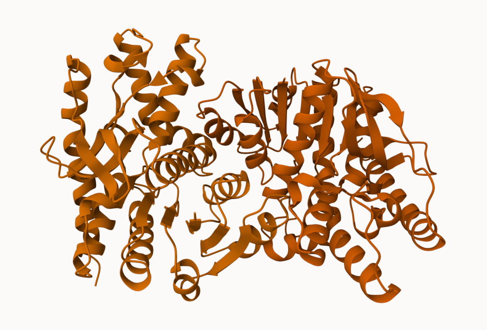
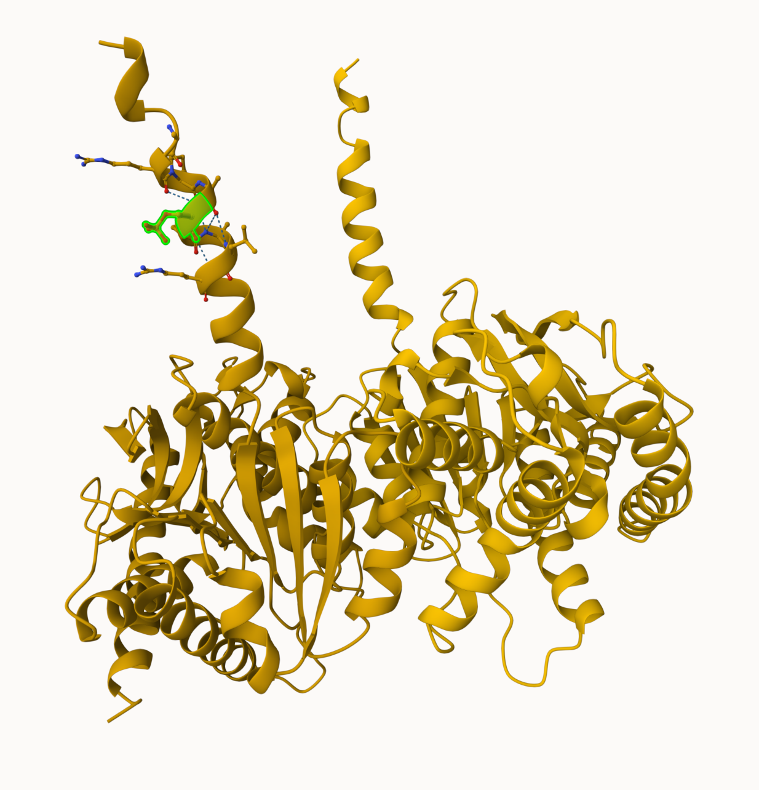
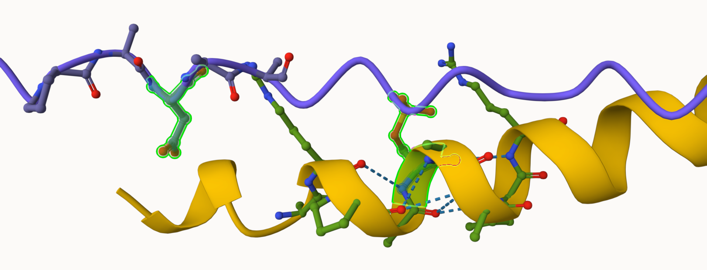
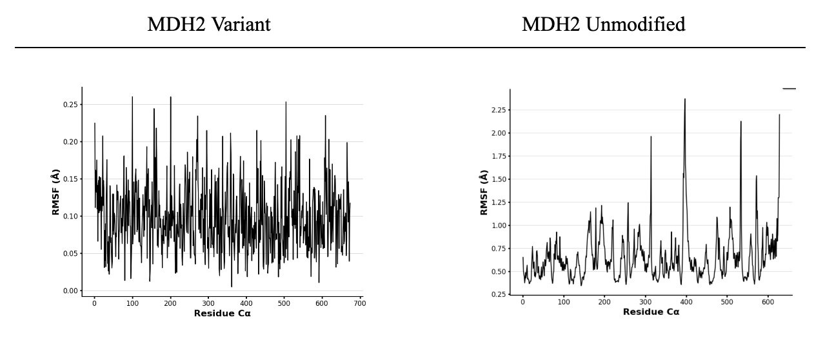
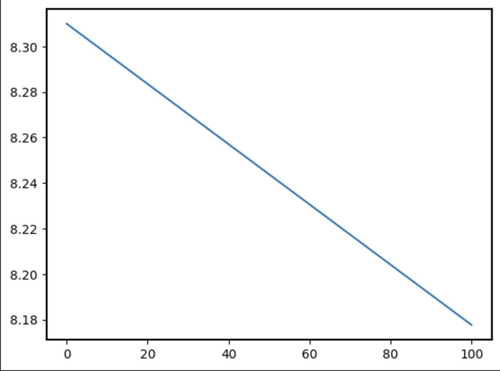
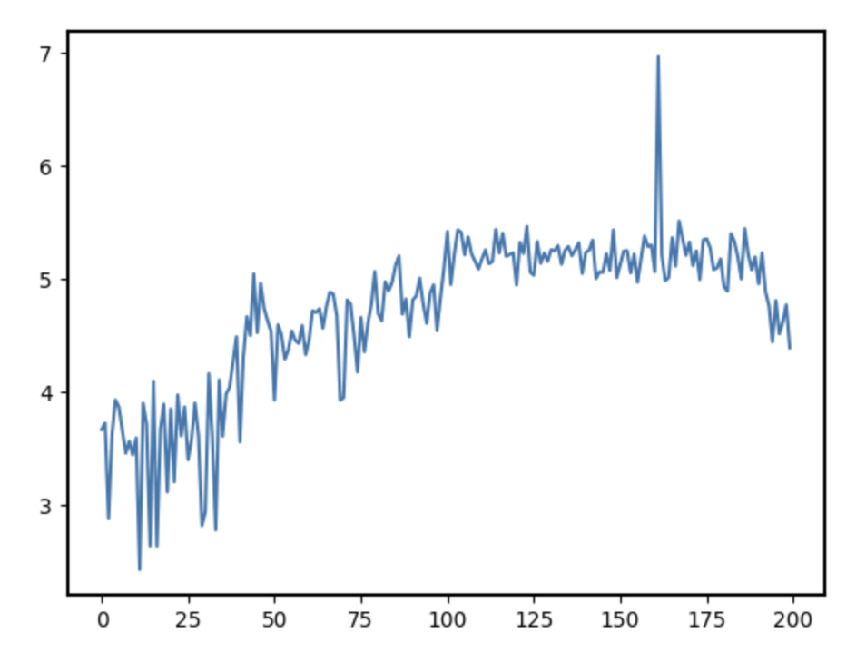

# Malate dehydrogenase, mitochondrial MDH2
# Uniprot ID: P40926
# Variation: phosphorylation of S10

## Description

# Serine 10 in the transient peptide of the mitochondrial enzyme MDH2. Both a mimic variant and a PTM were created for MDH2 to analyze the effects of protein modification on the enzyme. On the variant the modification is on a helix. On the PTM the modification is on a loop. The site of the modification does not exist on a non-modified MDH2. RMSF plots and pKa values are used to determine if there are any differences in structure and function between the three versions of MDH2 due to modification. 

1. image of the unmodified protein

2. image of modification site

3. image of MDH2 alignments
!(Alignment of MDH2, MDH2 with phospho S10, and MDH2 with S10D](images/MDH2_combined_pS10.png)

4. image of MDH2 alignments at modification site

## Due to the site not existing in MDH2 because of the location of pS10 and S10D being in the transient peptide sequence, there were no dynamic affects of the modifications on MDH2.

Part 3 from the Project 4 report

1. Image of aligned PDB files (no solvent)

2. Image of the site with the aligned PDB files (no solvent)

3. Annotated RMSF plot showing differences between the simulations

4. Annotated plots of pKa for the key amino acids

5. If needed, show ligand bound images and how modification affects substrate binding

As anticipated, because the region of modification was not in a region significant to the protein, the RMSF chart demonstrates high flexibility and mobility in high peaks indicating the region is highly disordered. The MDH2 unmodified highlights the effect of the modification when demonstrating the differences in flexibility and stability throughout the region. Increased RMSF values near residues in the N-terminal loop, where the serine-to-alanine substitution occurs, indicate enhanced flexibility in this region compared to the unmodified protein.

## Comparison of the mimic and the authentic PTM

The largest difference between the mimic and the authentic PTM are the shapes of the transient peptide sequence. In the authentic PTM the modification occurs on a loop indicating high flexibility. In the mimic variant the modification occurs on a helix indicating a structural part of the protein. The PTM version of MDH2 with pS10 may not have any effect on the key part of the protein, including the dimer interface, because there are no weak interactions present; however, the regions surrounding the modification site on the mimic variant of MDH2 with S10D exhibit heightened dynamics on the helix, potentially impacting their interactions with other domains or subunits of the protein that do directly affect the proteins structure and stability. These subtle shifts can be caused by a redistribution of weak interactions starting at the transient peptide sequence. Changing these hydrogen bonds or Van der Waals interactions, could influence the overall stability of the protein.

Part 4 from the Project 4 report outline
include images as needed

## Authors

Nadya Beltre-Ovalles

## Deposition Date

## License

Shield: [![CC BY-NC 4.0][cc-by-nc-shield]][cc-by-nc]

This work is licensed under a
[Creative Commons Attribution-NonCommercial 4.0 International License][cc-by-nc].

[![CC BY-NC 4.0][cc-by-nc-image]][cc-by-nc]

[cc-by-nc]: https://creativecommons.org/licenses/by-nc/4.0/
[cc-by-nc-image]: https://licensebuttons.net/l/by-nc/4.0/88x31.png
[cc-by-nc-shield]: https://img.shields.io/badge/License-CC%20BY--NC%204.0-lightgrey.svg

## References

* Filtz, T. M.; Vogel, W. K.; Leid, M. Regulation of Transcription Factor Activity by Interconnected Post-Translational Modifications. Trends in Pharmacological Sciences 2014, 35 (2), 76–85. 

