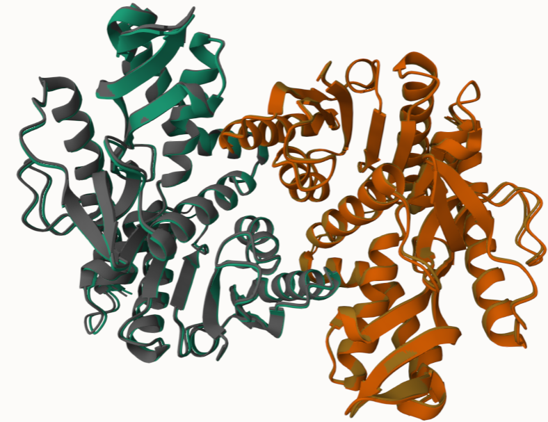

# Homo sapiens MDH1
# Uniprot ID: P40925
# Variation: phosphorylation of S146 

## Description

This study explores modification of malate dehydrogenase, MDH-1, at position 146, a coil, in the unmodified version and position 145 in the modified post - translational modification (PTM) and mimic version. In the unmodified protein, the amino acid is isoleucine 146 (Ile146), a non-polar amino acid. Looking at the  mimic variant version, isoleucine is replaced with a serine (Ser146) also a neutrally charged amino acid, however, that position in the modified amino is turned into phosphoserine which is a negatively charged amino acid.  Since the mimic variant includes a negatively charged amino acid in a coil, the site can act as a link to create helices or sheets that will decrease the flexibility in that region. The designated site for modification selected (145/146) is nowhere near the active site or dimer interface so the phosphate group and phosphoserine do not weaken the dimer formation to destabilize the active dimeric form.  There should be little to no change in terms of function or stability within or between the protein.  It is worth noting that the PTM and mimic site 145 is located at the opposite side of the unmodified 145 site. The closest binding site to the assigned position is a substrate binding site (131) in all 3 versions which is not close enough to influence the secondary structure function or efficiency.  

1.  Alignment of MDH1 (grey), MDH1 with a phosphate group (yellow), and MDH1 PTM phosphoserine (green) at residue 145 demonstrating hydrogen bonding between Ser145 to Lys121 & Asp116. 

2.  Alignment of PTM position 145 demonstrating hydrogen bonding between Asp145 to Asp116; outlined. 

3. Alignment of unmodified, PTM, and mimic variant at the active site . 

The figures above demonstrate that the modified amino acid residue 145 is on the surface of the protein, far from the active site and dimer interface which is demonstrated by the ligands. Furthermore, the PTM and mimic variant models form hydrogen bonds with the same amino acids despite the bulky phosphate group included in one of them. 

## Effect of the sequence variant and PTM on MDH dynamics

The figures above demonstrate that the overall structure between the modified and mimic variant models are the same. In the 2 figures at the modified site demonstrate the same hydrogen bonds being made with the phosphoserine and phosphate group. 

![Graph demonstrating the root mean square fluctuation(RMSF) of each amino acid in MDH1]  

Despite the modification at site 145, there is not as big a deviation indicated in the figure above. The active site, SER187, has no amino acids/substrates close in proximity to the modification and therefore has little to no impact on the structure as indicated by the low RMSF. Phosphoserine is a bulky phosphate group holding a negative charge that alters local electrostatics. This charge has the potential to disrupt interactions with other positively charged residues or form new hydrogen bonds. The phosphate group could have sterically hindered nearby residues ultimately changing the function of the protein. Overall, the modification changes the structure to create more hydrogen bonds between other secondary structures that stabilize the overall structure. 

The largest peak on this graph occurs at residue 97 (2nd image) which is ARG97(purple and green) in both versions of the MDH1 protein in which 2 alpha helices are hydrogen bonded together in the mimic due to the confirmation of arginine to glutamate 322 (GLU322). The hydrogen bond between the 2 helices (purple) provides a lot more stability and rigidity in that structure creating the large peak in the RMSF.

Phosphoserine (orange) located at 145 in the 3rd image is able to make a hydrogen bond with nearby residues including ASP116 and LYS121, connected by a hydrogen bond but the bulky has the potential to sterically hinder other molecules from bonding to or around it. 

At residue GLU205, in the 4th image both versions of the protein bond 3 beta sheets to each other. The amount of bonds between them, however, differ in number. GLU205 (mimic variant/green) has 1 oxygen hydrogen bonded to the phosphate on LYS178 but GLU205 (PTM/purple) has 2 oxygen hydrogen bonded to the same phosphate on LYS178 making the structure slightly more stable. 

Any change in the pKa that’s greater than pKa/closer to 0.8 - 1 is indicative of big changes in the environment around that particular amino acid and that may correlate with what we saw in the RMSF plot dynamics. That can tell us the pronation state or if the environment around that specific amino acid is changing which can suggest that there may be an environmental induced gain or loss of a proton important for catalysis. In Figure 5a., the pKa range fluctuates the most around 2.8 - 4.2 demonstrating the variability of residue at 145 over time. The pKa begins relatively high (~4.2) but decreases implying that the environment around site 145 is stabilizing into a more acidic state. This fall is potentially due to local conformational changes that expose the phosphate group to more negative charges or polar environments. The next region to look at on the graph are at the sharp drops  in pKa from 3.8 to 2.8 around 99t  and 155t that could indicate a major conformational change in MDH1 that possibly expose the phosphate group to very charged/polar environments that continuously decrease the pKa. Phosphate groups are quite acidic (2.1 range) and the sharp drops in pKa imply that those groups are more exposed over time. The low pKa (~3) between 150 - 200 suggest that the phosphate group is deprotonated and negatively charged under physiological conditions that contribute to local electrostatic effects. Moving over to Figure 5b., the plots shown include the active sites, its residues, and then the modified site. The phosphate group at the modified site greatly lowers its pKa which establishes a very acidic and negatively charged region in MDH1 that could change protonation states of proximal residues (e.g. 186 and 252) through electrostatic interactions. Residue 186 and 252 are histidines, as indicated by the lower pKa value of 6, which likely are more neutral within the physiological pH. The negatively charged phosphoserine at residue 145 can interact with HIS186 that stabilizes its neutrality or pulls the pKa lower to strengthen its ability to accept protons by the binding site (as HIS186 is adjacent to 187). At residue 145 in the variant, however, there is a negative charge present that can affect the electrostatic environment at sites 186 and 187. This can amplify residue 186 interactions with positively charged substrates and stabilize the binding pocket that will in turn enhance affinity/selectivity that can improve efficiency of the protein. 

## Comparison of the mimic and the authentic PTM

The RMSD plot provides an idea of whether the protein reaches a fixed state during the simulation but is not as efficient when comparing the two structures. Beginning at 0, is an indication that the structure matches the initial conformation. It rapidly jumps to 0.8 Å almost immediately after which represents the structure deviations as the program begins to equilibrate. Up until 1.1 Å, the system maintains a stable equilibrium with conformational flexibility; the steady increase, while present, is not enough to indicate much of a difference between the PTM and mimic which is why it is assumed that the protein equilibrates at this time. As the simulation progresses, the steady increase in RMSD from 1.1 - 0.2 Å demonstrates the protein losing stability as the atoms within the molecule begin to deviate from their reference position. This is expected as this change indicates a difference in structure (e.g. the differences between the PTM and mimic).  While RMSD detects deviations or time - dependent movement of the overall structure, RMSF, Figure 3., analyzes the measure of each position of an atom or group of atoms relative to the average standard of each residue’s position. 

## Authors 

Contributors names
Liliana Gines 

## Deposition Date 

12/06/2024

## License

Shield: [![CC BY-NC 4.0][cc-by-nc-shield]][cc-by-nc]

This work is licensed under a
[Creative Commons Attribution-NonCommercial 4.0 International License][cc-by-nc].

[![CC BY-NC 4.0][cc-by-nc-image]][cc-by-nc]

[cc-by-nc]: https://creativecommons.org/licenses/by-nc/4.0/
[cc-by-nc-image]: https://licensebuttons.net/l/by-nc/4.0/88x31.png
[cc-by-nc-shield]: https://img.shields.io/badge/License-CC%20BY--NC%204.0-lightgrey.svg

## References

* Carugo, O.; Pongor, S. A Normalized Root-Mean-Square Distance for Comparing Protein Three-Dimensional Structures. Protein Sci 2001, 10 (7), 1470–1473.

* Eo, Y.; Duong, M. T. H.; Ahn, H.-C. Structural Comparison of hMDH2 Complexed with Natural Substrates and Cofactors: The Importance of Phosphate Binding for Active Conformation and Catalysis. Biomolecules 2022, 12 (9), 1175. https://doi.org/10.3390/biom12091175.

*RMSD/RMSF Analysis | BioChemCoRe 2018. https://ctlee.github.io/BioChemCoRe-2018/rmsd-rmsf/ (accessed 2024-12-06). 

*UniProt. https://www.uniprot.org/uniprotkb/P40925/entry#ptm_processing (accessed 2024-12-06).
