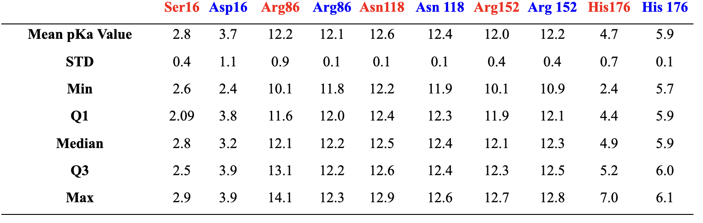

# Human MDH2
# P40926
# Phosphorylation of S16

## Description

# Serine 16 of human malate dehydrogenase 2 (MDH2), has been identified as a potential post-translational modification site, specifically undergoing phosphorylation (SEP16). Phosphorylation of S16 is likely involved in regulating MDH2's activity or its interaction with mitochondrial import machinery. However, this modification site is not widely conserved in other species, and there are currently no direct functional studies detailing its impact on MDH2 activity or its role in human metabolism. Further investigation is needed to determine how SEP influences MDH2's mitochondria targeting and overall cellular function (Torres et al., 2024).

1. image of the unmodified site

2. image of modification site

## Effect of the sequence variant and PTM on MDH dynamics

Part 3 from the Project 4 report

1. Image of aligned PDB files (no solvent)

2. Image of the site with the aligned PDB files (no solvent)

3. Annotated RMSF plot showing differences between the simulations

4. Annotated plots of pKa for the key amino acids

## Authors

Devon Bjorge

## 12/06/2024

## License

Shield: [![CC BY-NC 4.0][cc-by-nc-shield]][cc-by-nc]

This work is licensed under a
[Creative Commons Attribution-NonCommercial 4.0 International License][cc-by-nc].

[![CC BY-NC 4.0][cc-by-nc-image]][cc-by-nc]

[cc-by-nc]: https://creativecommons.org/licenses/by-nc/4.0/
[cc-by-nc-image]: https://licensebuttons.net/l/by-nc/4.0/88x31.png
[cc-by-nc-shield]: https://img.shields.io/badge/License-CC%20BY--NC%204.0-lightgrey.svg

## References

* Citation1 [10.1371/journal.pone.0284541.](https://doi.org/10.1371/journal.pone.0284541.)

* Citation2 [10.1371/journal.pbio.3002508.](https://doi.org/10.1371/journal.pbio.3002508.)

* Citation3 [10.1093/oxfordjournals.jbchem.a022036.](https://doi.org/10.1093/oxfordjournals.jbchem.a022036.)

* Citation4 [10.1007/s00018-016-2280-4.](https://doi.org/10.1007/s00018-016-2280-4.)

* Citation5 [10.3389/fcell.2024.1405393.](https://doi.org/10.3389/fcell.2024.1405393.)
