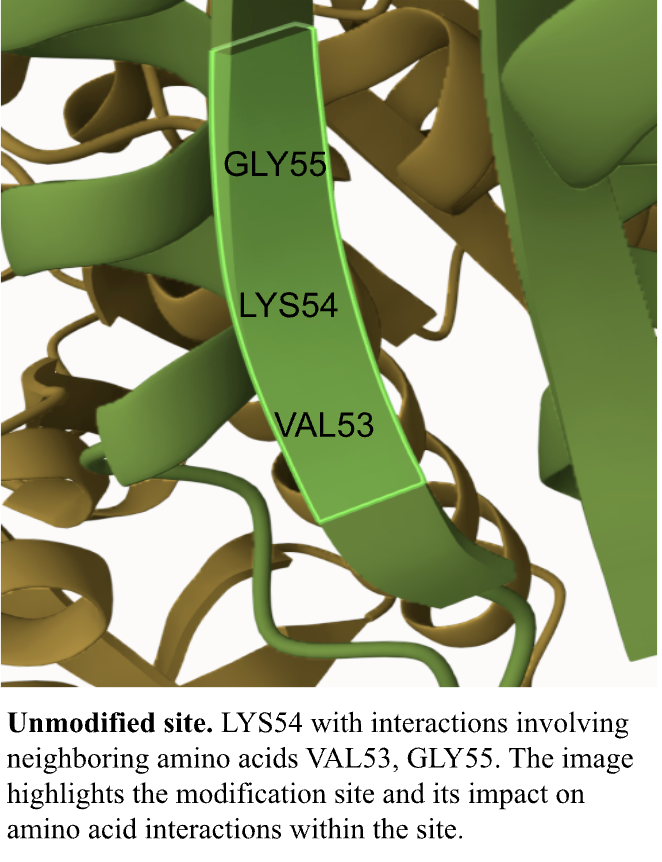
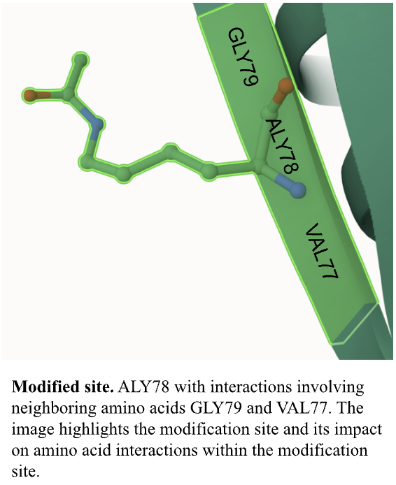
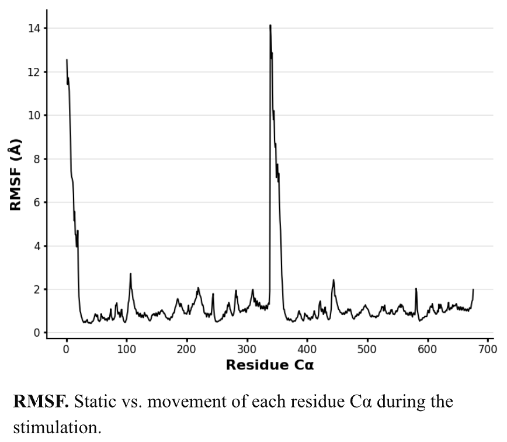

# Homo sapiens (Human) MDH2
# Uniprot ID: P40926
# Variation: Acetylation of K176 (pS177 in structure) 

## Description

The modified amino acid site GLN K→Q is located at position 78, within a beta-pleated sheet structure, and is relatively close to the dimer interface. LYS54, in contrast, is earlier in the sequence because, in Project 2, the first portion of the protein was removed, resulting in a shorter sequence. Notably, the active sites of all three protein structures (variant, unmodified, and modified) are centrally positioned within the protein. This central localization is significant, as it places the active site near the dimer interface, where the monomer portions interact.

1. image of the unmodified site

2. image of modification site

Broader Metabolic Pathway Impact:
Modifications to MDH2, such as the K → Q mutation, impair its ability to produce oxaloacetate, a critical substrate for citrate synthesis in the citric acid cycle (Genecards, 2024). This disruption limits the initiation and progression of the cycle, leading to metabolic imbalances. Ultimately, this loss of efficiency alters cellular homeostasis and increases oxidative stress, which can have widespread effects on cellular function and energy production.

1. Image of aligned PDB files (no solvent)

2. Image of the site with the aligned PDB files (no solvent)

3. Annotated RMSF plot showing differences between the simulations

4. Annotated plots of pKa for the key amino acids 

Dynamic pKa variation of the histidine residue (HIS200) over the course of the simulation, with the normal pKa of histidine being approximately 6. The fluctuations in pKa indicate that the environment around the amino acid is changing, resulting in the gain or loss of a proton. A sharp decrease in pKa, as observed at specific points, suggests that the histidine residue becomes deprotonated under physiological pH conditions. Comparatively, sharp increases in pKa suggest the residue is in a protonated state. These changes reflect a dynamic environment, possibly due to interactions within the protein or with nearby residues, affecting the chemical properties of histidine. The observed range of pKa values is consistent with histidine's behavior as an amino acid with an acidic side chain, capable of losing or gaining a proton within this range. This variability highlights the functional and reactive nature of histidine in different environmental conditions. 

## Authors

Corrinne Cullina
## December 6

## License

Shield: [![CC BY-NC 4.0][cc-by-nc-shield]][cc-by-nc]

This work is licensed under a
[Creative Commons Attribution-NonCommercial 4.0 International License][cc-by-nc].

[![CC BY-NC 4.0][cc-by-nc-image]][cc-by-nc]

[cc-by-nc]: https://creativecommons.org/licenses/by-nc/4.0/
[cc-by-nc-image]: https://licensebuttons.net/l/by-nc/4.0/88x31.png
[cc-by-nc-shield]: https://img.shields.io/badge/License-CC%20BY--NC%204.0-lightgrey.svg

## References

* MDH2 Gene - Malate Dehydrogenase 2. genecards suite. (2024b, October 2). https://www.genecards.org/cgi-bin/carddisp.pl?gene=MDH2 

* Uniprot website fallback message. 2002. UniProt. (n.d.). https://www.uniprot.org/ 
