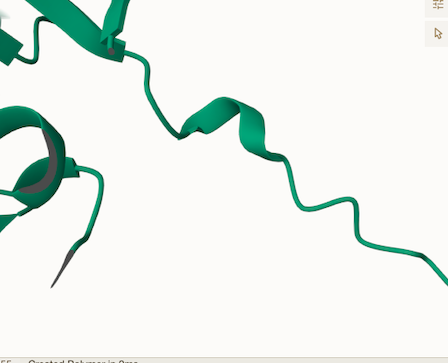
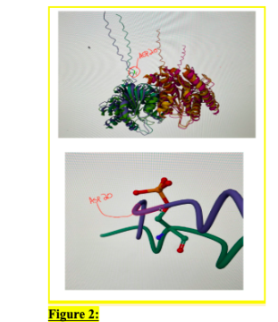
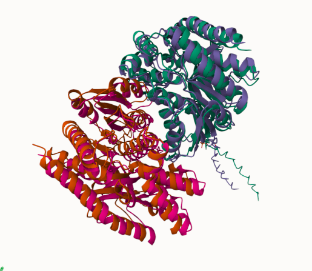
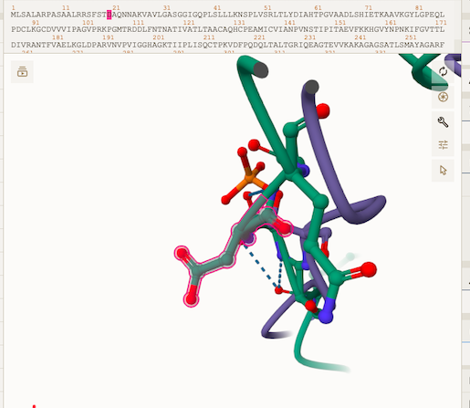
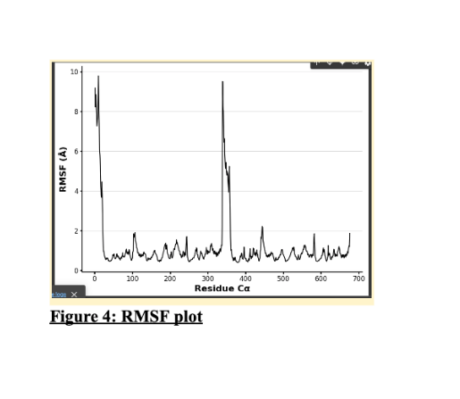
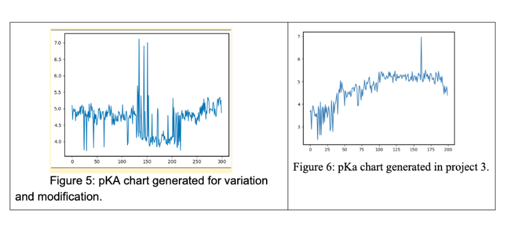

# Human MDH2 
# Uniprot number: pS18
# phosphorylation of S18 (pS18 in structure)

## Description

There was no research previously done on the variant #18 S->D. The description of the modification that was preformed is as follows: MDH2 sequence was changed at the amino acid #18 from an S to a D. This modification is at the very beginning and thus it is far away from the molecular structure itself, as seen in Alpha Fold when superimposed (Figure 1 shows that there are no interactions being done). This location is called mitochondrial transit peptide. The location of the modification is on a loop, according to visuals in Mol*, see Figure 1., and literature which says aspartate has a high affinity to loops. When addressing amino acid interactions in any of the three states, it is impossible, at this researcher’s level, to view or describe since the variation site is so far away from the main structure. No images of modification sites and their weak interactions could be found. 
Further research on the literature showed the lack of information out there. As one article states, transit peptides help the protein translocate to the mitochondria but nothing more was discussed or seemed to be found or studied. One explanation on why there is a lack of information is that only about  15% of molecules (in this source’s case it was pre-mMDH) contain a full length transit peptide and that small amount limits the amount of conclusions one can draw about the presence of transit peptides and what their function is. 

1. image of the unmodified site

2. image of modification site

3. Image of superimposed unmodified, mimic, and PTM variant structure. 

## Effect of the sequence variant and PTM on MDH dynamics

1. Image of aligned PDB files (no solvent)

2. Image of the site with the aligned PDB files (no solvent)

3. Annotated RMSF plot showing differences between the simulations

In figure 4, the plot shows the pS18 amino acid is a high and very dynamic peak. Further evidence that the modification is flexible and dynamic. No changes in RMSF in key sites. 

4. Annotated plots of pKa for the key amino acids

 

In figure 5 and 6, this researcher compared the pKa charts from the variation and the original MDH2 plot from project 3. As seen in the plot, there are no or very minimal effects on the active sites, and they have similar pKas. This is further evidence that the assigned pS18 modification had little to no effect on the protein function and structure. 

## Comparison of the mimic and the authentic PTM

Part 4 from the Project 4 report outline
include images as needed

	The model and simulation data match well with the PTM modified protein. No evidence of structure or function change. I would say the mimic variant is a good approximation of the PTM.

## Authors 
Rebekah Cashion

Contributors names

## Deposition Date
December 6, 2024

## License

Shield: [![CC BY-NC 4.0][cc-by-nc-shield]][cc-by-nc]

This work is licensed under a
[Creative Commons Attribution-NonCommercial 4.0 International License][cc-by-nc].

[![CC BY-NC 4.0][cc-by-nc-image]][cc-by-nc]

[cc-by-nc]: https://creativecommons.org/licenses/by-nc/4.0/
[cc-by-nc-image]: https://licensebuttons.net/l/by-nc/4.0/88x31.png
[cc-by-nc-shield]: https://img.shields.io/badge/License-CC%20BY--NC%204.0-lightgrey.svg

## References

* Kurmangaliyev, Y. Z.; Goland, A.; Gelfand, M. S. Evolutionary Patterns of Phosphorylated Serines. Biology Direct 2011, 6 (1)  

* UniProt. Uniprot.org. https://www.uniprot.org/uniprotkb/P40926/entry#ptm_processing (accessed 2024-12-06).
[DOI](DOI link)

* Gavenonis, J.; Sheneman, B. A.; Siegert, T. R.; Eshelman, M. R.; Kritzer, J. A. Comprehensive Analysis of Loops at Protein-Protein Interfaces for Macrocycle Design. Nature Chemical Biology 2014, 10 (9), 716–722. 

* Yumi Eo; Hoai, T.; Ahn, H.-C. Structural Comparison of HMDH2 Complexed with Natural Substrates and Cofactors: The Importance of Phosphate Binding for Active Conformation and Catalysis. Biomolecules 2022, 12 (9), 1175–1175. 

* Gietl, C.; Seidel, C.; Svendsen, I. Plant Glyoxysomal but Not Mitochondrial Malate Dehydrogenase Can Fold without Chaperone Assistance. Biochimica et Biophysica Acta (BBA) - Bioenergetics 1996, 1274 (1), 48–58.
 00009-6.)