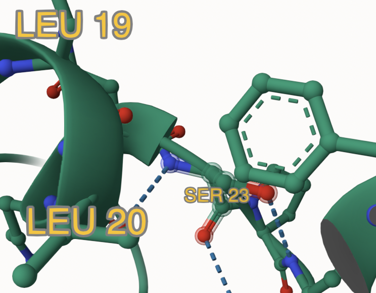
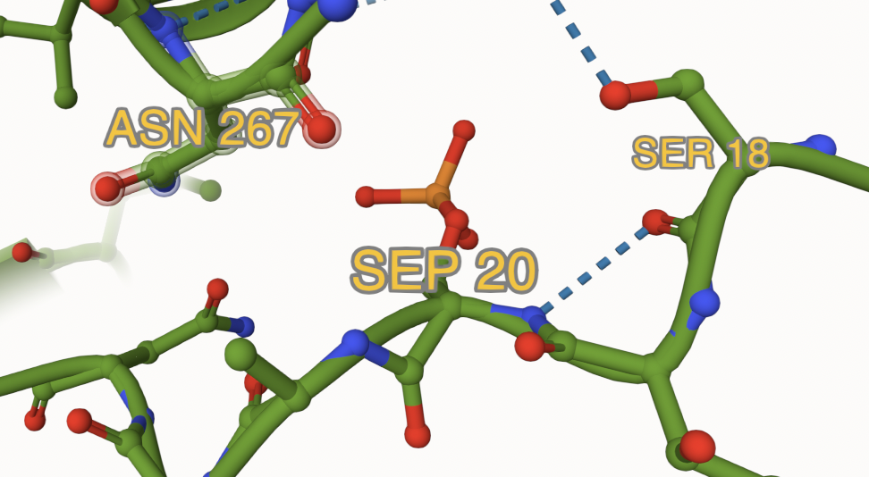
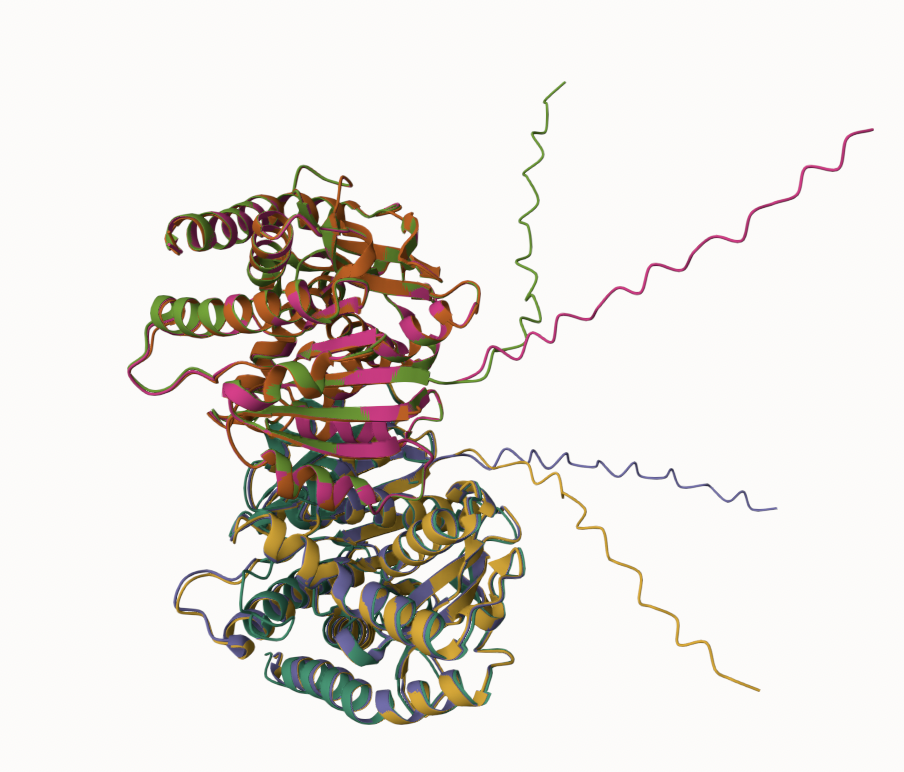
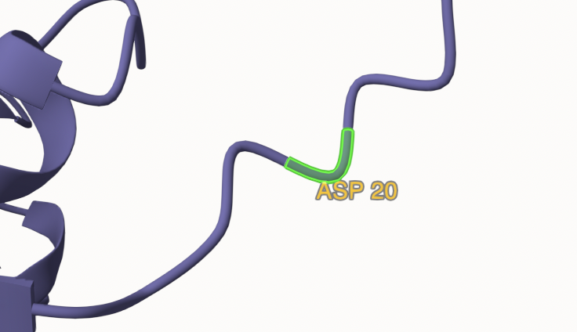
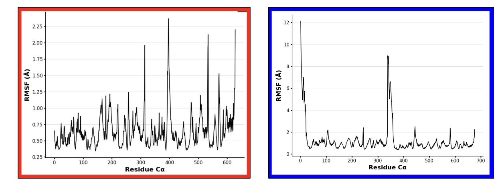
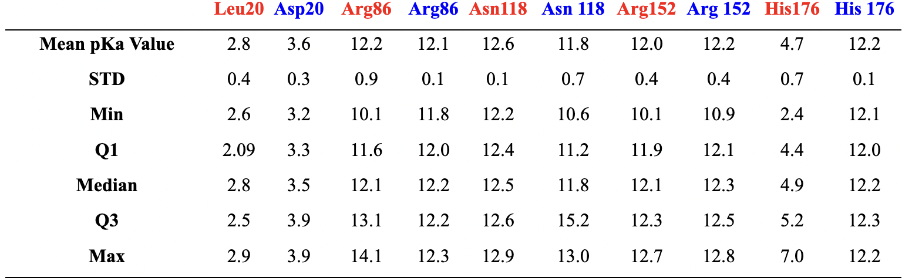

# Human Malate Dehydrogenase 2 
# P40926
# Phosphorlated serine 

## Description

# Part 1 from Project 4 report outline (with citations as appropriate)
Residue 20 of MDH2 has received little attention in prior research, likely due to its seemingly insignificant position within the protein. This residue lies within the transient peptide region which is a segment that is frequently excluded from detailed studies. In its unmodified state, residue 20 is a leucine, which can undergo post-translational modification to phosphorylated serine or be mimicked by a substitution to aspartic acid. A loop is a dynamic and flexible region that connects secondary structural elements like α-helices and β-sheets. These forms are all situated within a loop.

1. image of the unmodified site

2. image of modification site

## Effect of the sequence variant and PTM on MDH dynamics

Part 3 from the Project 4 report

1. Image of aligned PDB files (no solvent)

2. Image of the site with the aligned PDB files (no solvent)

3. Annotated RMSF plot showing differences between the simulations

4. Annotated plots of pKa for the key amino acids

Description of the data and changes
The comparison of mean pKa values and statistical metrics between unmodified MDH2 (red) and the mimic variant S20D (blue) reveals significant shifts, particularly at the modification site (residue 20) and select active site residues. For residue 20, the mean pKa value increases from 2.8 (Leu20) to 3.6 (Asp20), reflecting the introduction of a negatively charged aspartic acid residue in the mimic variant. This shift is caused by the altered protonation properties due to the mutation, as aspartic acid has a carboxylate group capable of deprotonation at higher pH levels. The reduced standard deviation (STD) for Asp20 suggests more consistent protonation behavior in the mimic variant compared to Leu20, likely due to the more predictable behavior of acidic residues in the environment. These changes highlight the introduction of an electrostatic effect at the modification site, which may influence the protein's local stability and interactions with other residues or ligands.
In the active site, changes in pKa values for residues like Arg86, Asn118, Arg152, and His176 reflect the long-range effects of the S20D mutation. For example, the decrease in the mean pKa value for Asn118 from 12.6 to 11.8 suggests a destabilization of its protonation state, potentially from shifts in hydrogen bonding or electrostatic interactions. His176 shows a dramatic increase in its mean pKa from 4.7 to 12.2, indicating a significant change in its environment. The large change in values is driven by changes in the local electrostatic landscape caused by the mimic variant. The reduced STD values for residues like Arg86 and His176 in the mimic variant further support a more uniform protonation environment, suggesting that the mutation may stabilize certain active site residues in specific protonation states. Overall, these pKa shifts imply that the S20D mutation introduces electrostatic and conformational changes that propagate to the active site, potentially influencing MDH2's catalytic activity and substrate binding.

## Authors

Ariana Lanzo

## Deposition Date
12/06/2024

## License

Shield: [![CC BY-NC 4.0][cc-by-nc-shield]][cc-by-nc]

This work is licensed under a
[Creative Commons Attribution-NonCommercial 4.0 International License][cc-by-nc].

[![CC BY-NC 4.0][cc-by-nc-image]][cc-by-nc]

[cc-by-nc]: https://creativecommons.org/licenses/by-nc/4.0/
[cc-by-nc-image]: https://licensebuttons.net/l/by-nc/4.0/88x31.png
[cc-by-nc-shield]: https://img.shields.io/badge/License-CC%20BY--NC%204.0-lightgrey.svg

## References

* Citation1 

* Citation2 

* Citation3 

