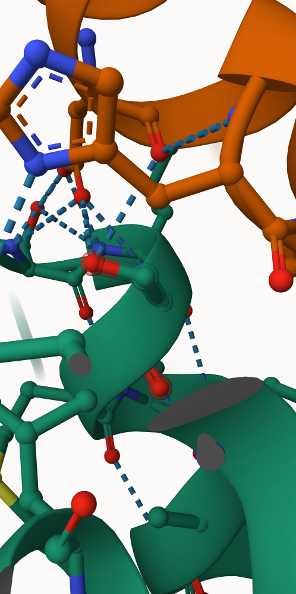
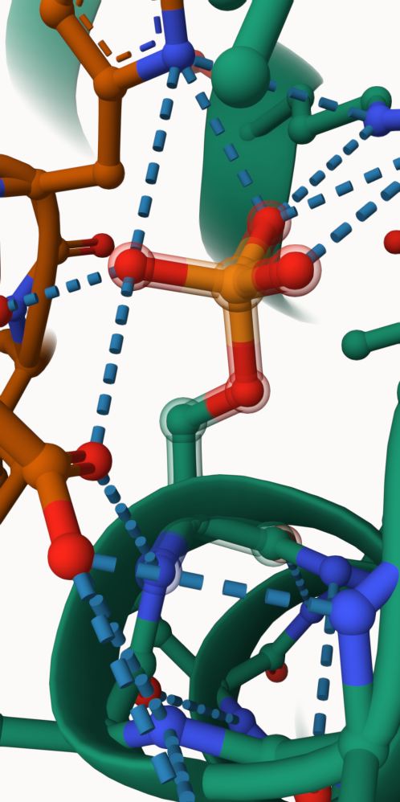
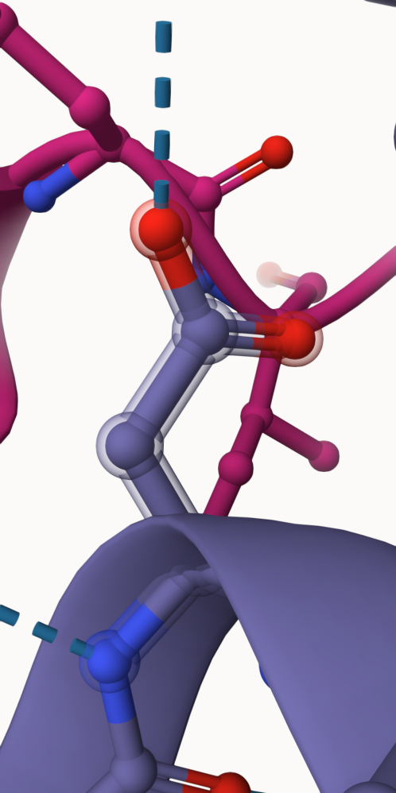
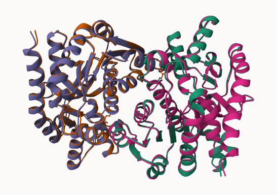
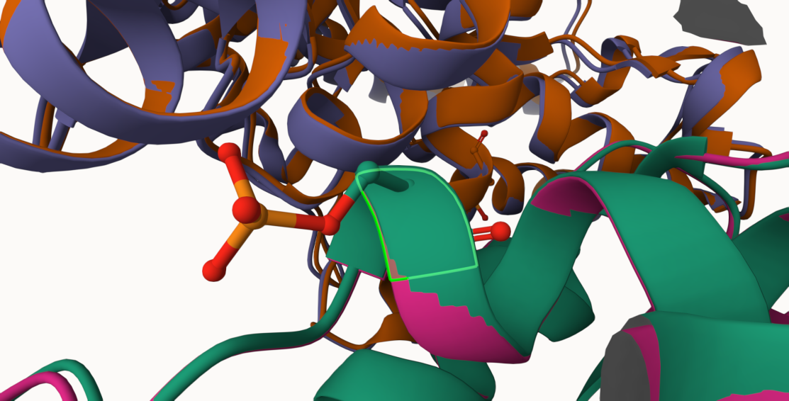
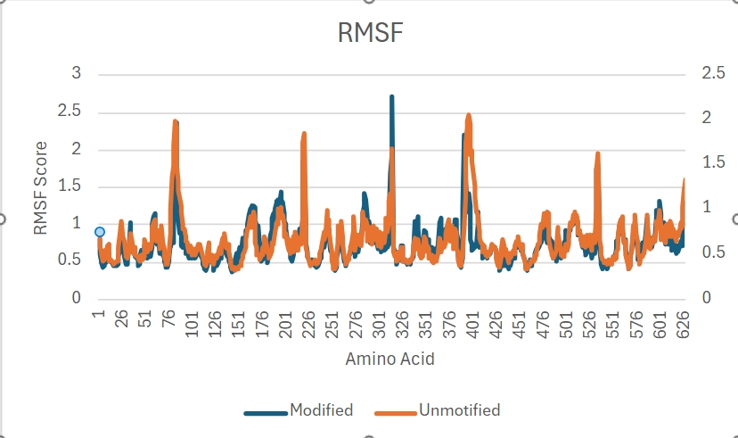
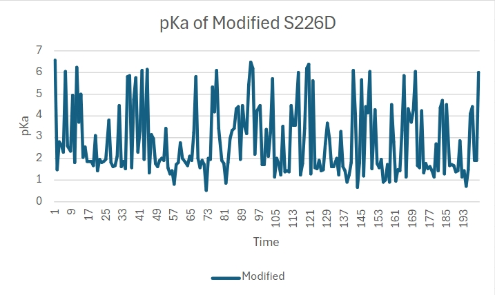
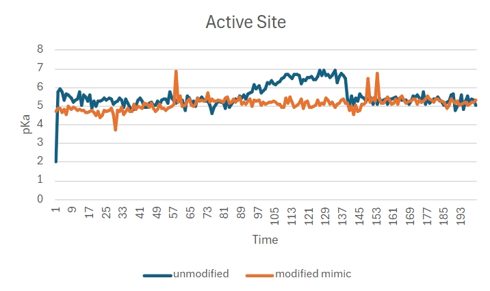

# Human Malate dehydrogenase 2
# P40926
# phosphorylation of S226 (D226 in structure)

The effects of phosphorylation on hMDH2 through post-translational modifications to help understand the effects of function was done on serine 226. The serine experienced an amino acid change to an aspartic acid. This, plus the amino acids' close distance to the active site and a substrate binding site of NAD+ allows for the possibility of a function change to human MDH2.    

The phosphorylation of hMDH2 resulted in an amino acid substitution of serine 226 for aspartic acid 226. This change from a small and polar serine to a large and negatively charged aspartic acid resulted in changes throughout hMDH2.
1. image of the unmodified site

2. image of the modification site

## The data shown below show differences when comparing the modified to the unmodified. Through RMSD, RMSF, and pKa comparison, structural differences were found within the amino acid mimic site and in an important site found within hMDH2.

Part 3 from the Project 4 report

1. Image of aligned PDB files (no solvent)

2. Image of the site with the aligned PDB files (no solvent)

3. Annotated RMSF plot showing differences between the simulations

4. Annotated plots of pKa for the key amino acids

## Authors

Taylor Daniels

## 12/06/2024

## License

Shield: [![CC BY-NC 4.0][cc-by-nc-shield]][cc-by-nc]

This work is licensed under a
[Creative Commons Attribution-NonCommercial 4.0 International License][cc-by-nc].

[![CC BY-NC 4.0][cc-by-nc-image]][cc-by-nc]

[cc-by-nc]: https://creativecommons.org/licenses/by-nc/4.0/
[cc-by-nc-image]: https://licensebuttons.net/l/by-nc/4.0/88x31.png
[cc-by-nc-shield]: https://img.shields.io/badge/License-CC%20BY--NC%204.0-lightgrey.svg

## References

* (1) Eo, Y., Duong, M. T. H., and Ahn, H.-C. (2022, August 25) Structural comparison of HMDH2 complexed with natural substrates and cofactors: The importance of phosphate binding for active conformation and catalysis. MDPI. Multidisciplinary Digital Publishing Institute. 
