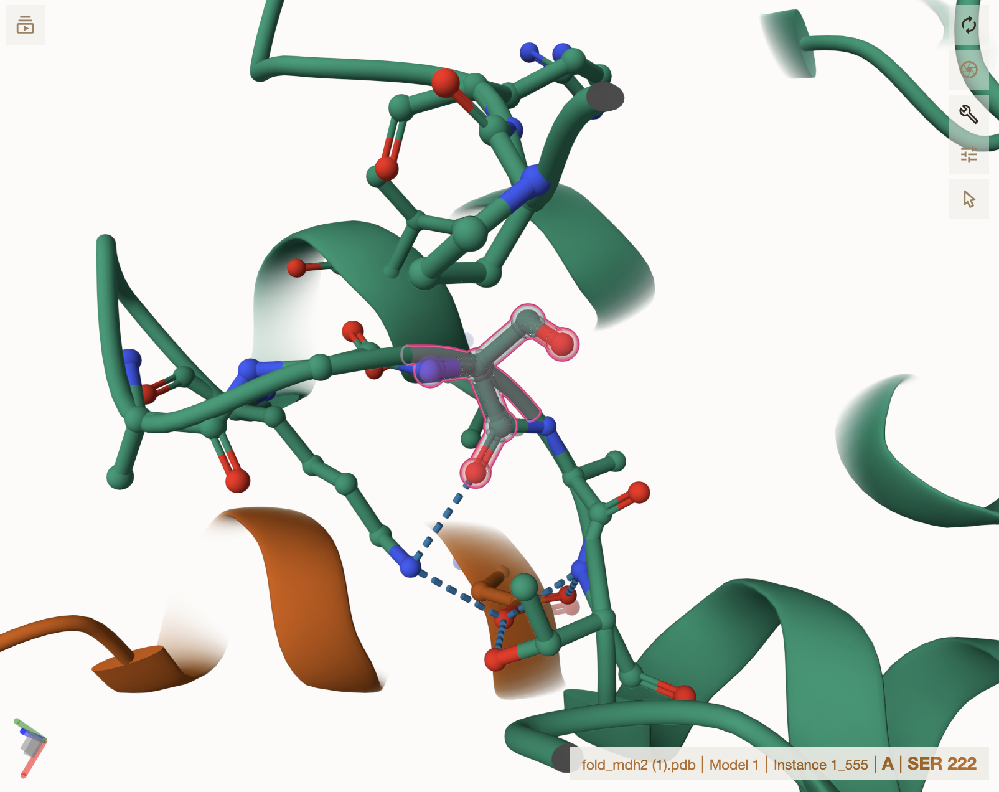
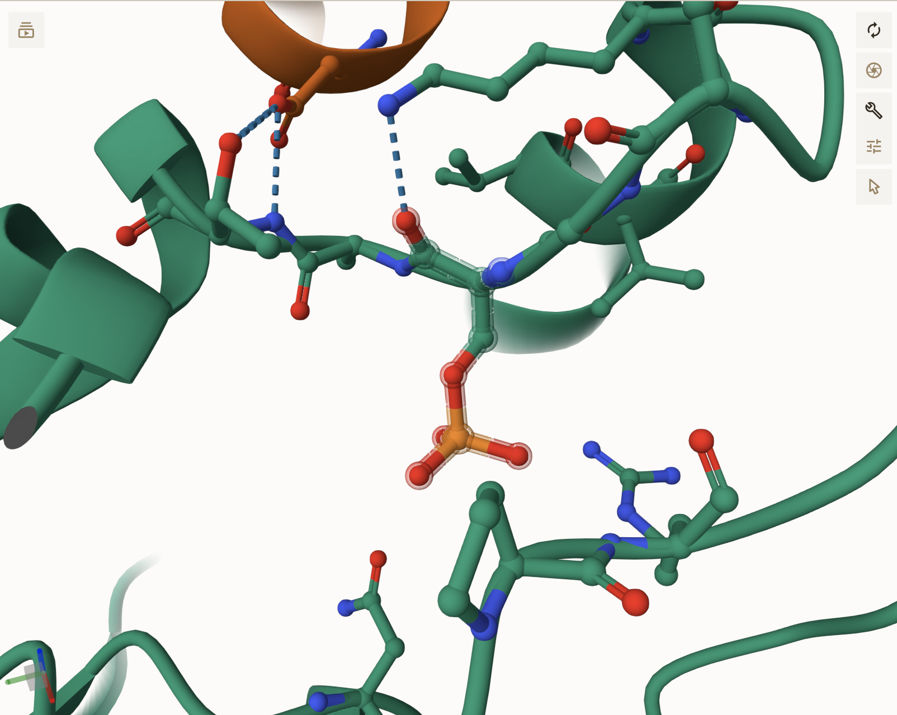
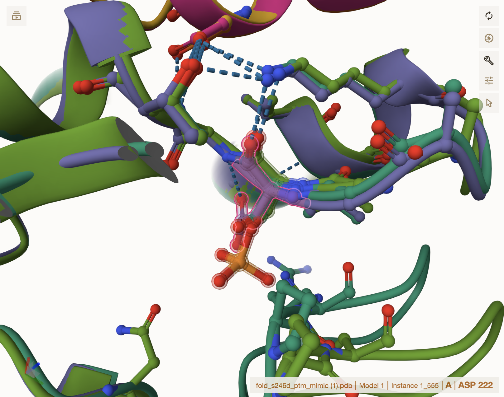
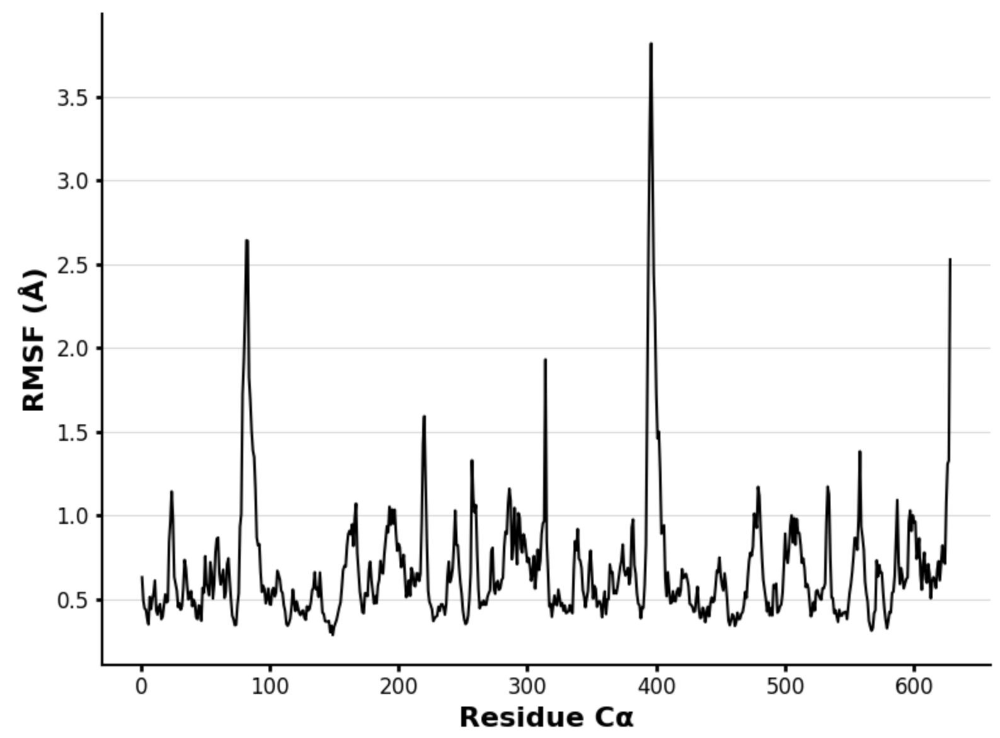

# Homo sapien MDH2
# Uniprot ID: P40926
# Variation: Phosphorylation of S246 (pS222 in structure)

## Description
Serine 246 (222 in this structure) of human Malate Dehydrogenase 2 (MDH2) was identified as a potential post-translational modification site in this study. The modification at this site, including phosphorylation (P246) and its aspartic acid mimic (S246D), was found to induce electrostatic shifts that affect the enzyme's structure, stability, and function. While the S246D mimic captures some of the electrostatic changes of phosphorylation, it does not fully replicate the structural rearrangements and interactions brought about by phosphorylation. These findings suggest that modifications at this site could influence enzyme activity and substrate binding, potentially impacting key metabolic processes like the citric acid cycle. There are no known studies on the functional role of this specific modification in human MDH2 to date.

1. image of the unmodified site

2. image of modification site

## Effect of the sequence variant and PTM on MDH dynamics

1. Image of aligned PDB files (no solvent)

2. Image of the site with the aligned PDB files (no solvent)

3. Annotated RMSF plot showing differences between the simulations

4. Annotated plots of pKa for the key amino acids

5. If needed, show ligand bound images and how modification affects substrate binding

Description of the data and changes
RMSF analysis of unmodified MDH2 revealed stable behavior with notable peaks at residues 90 (RMSF ~1.6) and 310 (RMSF ~1.9), along with smaller peaks at residues 180, 200, 210, 490, and 510, indicating slight flexibility. In contrast, the mimic variant exhibited increased RMSF values, particularly at residues 90 (RMSF ~2.6) and 400 (RMSF ~3.7), suggesting greater flexibility in these regions. The modified MDH2 also showed higher RMSF at residues 220 (RMSF ~1.7), 310 (RMSF ~2.7), 400 (RMSF ~2.3), and 510 (RMSF ~1.5), indicating increased conformational fluctuations. The increase at residue 220, the site of modification, suggests a direct impact of the change on local protein dynamics. The pKa values of histidine at the active site typically range from 5.7 to 6.1, which supports catalysis by allowing partial protonation under physiological conditions. Modifications like the aspartic acid mimic (5.76–6.14) and phosphoserine (5.73–6.05) lower the pKa slightly, affecting protonation states and potentially influencing the enzyme's catalytic mechanism.

## Comparison of the mimic and the authentic PTM

Part 4 from the Project 4 report outline
include images as needed
![The modified MDH2 variant with phosphorylation at residue 220 introduces a bulky phosphate group that disrupts the local loop structure, alters backbone geometry, and changes electrostatic interactions, potentially stabilizing or destabilizing the protein. This modification also affects protein function by modulating interactions, enzyme activity, and substrate binding, and can induce allosteric changes that influence broader regulatory processes. The S246D mimic, where serine is replaced by aspartic acid, creates a similar electrostatic shift, but its bulkier side chain and carboxyl group cause steric clashes and alter protein dynamics differently than phosphorylation. While the mimic can simulate some electrostatic effects, it lacks the complex hydrogen bonding and ionic interactions of phosphorylation. Overall, the S246D mimic approximates some aspects of phosphorylation but cannot capture all of its effects on MDH2.](images/Mimic_Modified_Aligned.png)

## Authors

Contributors names
Eli Brockwell

## Deposition Date
12/06/2024
## License

Shield: [![CC BY-NC 4.0][cc-by-nc-shield]][cc-by-nc]

This work is licensed under a
[Creative Commons Attribution-NonCommercial 4.0 International License][cc-by-nc].

[![CC BY-NC 4.0][cc-by-nc-image]][cc-by-nc]

[cc-by-nc]: https://creativecommons.org/licenses/by-nc/4.0/
[cc-by-nc-image]: https://licensebuttons.net/l/by-nc/4.0/88x31.png
[cc-by-nc-shield]: https://img.shields.io/badge/License-CC%20BY--NC%204.0-lightgrey.svg

## References

* Citation1 de Lorenzo, L.; Stack, T. M. M.; Fox, K. M.; Walstrom, K. M. (2024). Catalytic Mechanism and Kinetics of Malate Dehydrogenase. Essays in Biochemistry, 68 (2), 73–82. 

* Citation2 Vinogradov, A. D. (2008). NADH/NAD+ Interaction with NADH: Ubiquinone Oxidoreductase (Complex I). Biochimica et Biophysica Acta (BBA) - Bioenergetics, 1777 (7–8), 729–734.

* Citation3 Schwartz, S. D. (2023). Protein Dynamics and Enzymatic Catalysis. The Journal of Physical Chemistry B, 127 (12), 2649–2660.

* Citation4 Kotarkonda, L. K.; Sinha, T. P.; Bhoi, S.; Tyagi, A.; Kumar, A.; Singh, V. P.; Bharathala, S. (2023). Nanoparticles as Potential Antimicrobial Agents for Enzyme Immobilization in Antimicrobial Wound Dressings. Antimicrobial Dressings, 43–60.

* Citation5 Strickler, S. S.; Gribenko, A. V.; Gribenko, A. V.; Keiffer, T. R.; Tomlinson, J.; Reihle, T.; Loladze, V. V.; Makhatadze, G. I. (2006). Protein Stability and Surface Electrostatics: A Charged Relationship. Biochemistry, 45 (9).

* Citation6 Tarrant, M. K.; Cole, P. A. (2009). The Chemical Biology of Protein Phosphorylation. Annual Review of Biochemistry, 78 (1), 797–825.

* Citation7 Martinez-Vaz, B. M.; Howard, A. L.; Jamburuthugoda, V. K.; Callahan, K. P. (2024). Insights into the Regulation of Malate Dehydrogenase: Inhibitors, Activators, and Allosteric Modulation by Small Molecules. Essays in Biochemistry, 68 (2), 173–181.

* Citation8 Vander Heiden, M. G.; Cantley, L. C.; Thompson, C. B. (2009). Understanding the Warburg Effect: The Metabolic Requirements of Cell Proliferation. Science, 324 (5930), 1029–1033.

* Citation9 Zhou, H.-X.; Pang, X. (2018). Electrostatic Interactions in Protein Structure, Folding, Binding, and Condensation. Chemical Reviews, 118 (4), 1691–1741.

* Citation10 Selvaraj, C.; Rudhra, O.; Alothaim, A. S.; Alkhanani, M.; Singh, S. K. (2022). Structure and Chemistry of Enzymatic Active Sites That Play a Role in the Switch and Conformation Mechanism. Advances in Protein Chemistry and Structural Biology, 59–83.

* Citation11 Lee, J. M.; Hammarén, H. M.; Savitski, M. M.; Baek, S. H. (2023). Control of Protein Stability by Post-Translational Modifications. Nature Communications, 14 (1). 

* Citation12 Li, X.; Foley, E. A.; Kawashima, S. A.; Molloy, K. R.; Li, Y.; Chait, B. T.; Kapoor, T. M. (2013). Examining Post‐translational Modification‐mediated Protein–Protein Interactions Using a Chemical Proteomics Approach. Protein Science, 22 (3), 287–295.

* Citation13 Kim, M. O.; Nichols, S. E.; Wang, Y.; McCammon, J. A. (2013). Effects of Histidine Protonation and Rotameric States on Virtual Screening of M. Tuberculosis RMLC. Journal of Computer-Aided Molecular Design, 27 (3), 235–246.

* Citation14 Kokkinidis, M.; Glykos, N. M.; Fadouloglou, V. E. (2020). Catalytic Activity Regulation through Post-Translational Modification: The Expanding Universe of Protein Diversity. Advances in Protein Chemistry and Structural Biology, 97–125.

* Citation15 Miranda, F. F.; Thórólfsson, M.; Teigen, K.; Sanchez‐Ruiz, J. M.; Martínez, A. (2004). Structural and Stability Effects of Phosphorylation: Localized Structural Changes in Phenylalanine Hydroxylase. Protein Science, 13 (5), 1219–1226.

* Citation16 Pincus, D.; Pandey, J. P.; Creixell, P.; Resnekov, O.; Reynolds, K. A. (2017). Evolution and engineering of Allosteric regulation in protein kinases.
