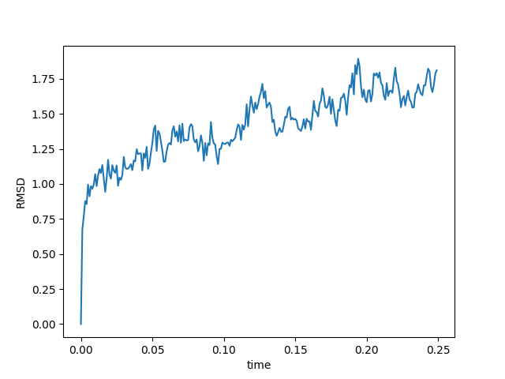

# Homo sapiens MDH2
# Uniprot ID: P40926
# Variation: Phosphorylation of S276 (pS252 in structure) 

## Description

Human malate dehydrogenase 2 (hMDH2) is vital in the citric acid cycle. Recently, serine at position 276 was modified, a previously undocumented change located on a beta-sheet. After splicing, the modification appeared at amino acid 252. In the unmodified MDH2 model, the modified site interacts with several amino acids, while the variant/PTM mimic model includes similar but slightly different interactions. In the modified enzyme, the interactions are slightly varied, indicating the specific amino acid changes.

1. image of the unmodified site

2. image of modification site

3. image PTM mimic model

4. image of modified enzyme model 

## Effect of the sequence variant and PTM on MDH dynamics

The RMSD values reveal minor structural variations between the modified and unmodified models, implying that the overall protein structure remains largely intact and unchanged. Furthermore, replacing serine with aspartic acid or phosphoserine introduces a negative charge, potentially affecting the protein's electrostatic balance and the protonation state of nearby amino acids, which can ultimately alter the enzyme's dynamics. In terms of flexibility, RMSF values show some variability, the most flexible regions remain relatively stable, indicating that these modifications do not significantly impact the movement of most amino acids. The interactions at the active site are largely maintained, suggesting that these modifications do not substantially alter the enzyme's substrate-binding capability. Despite these minor dynamic changes, the modifications are unlikely to significantly affect the enzyme's function within the TCA cycle, as indicated by the consistent amino acid interactions and overall structure. 

1. Image of aligned PDB files (no solvent)

2. Image of the site with the aligned PDB files (no solvent)

## Comparison of the enzyme dynamics 

After simulation, the dynamics as described by the root mean square flucuation (RMSF) value were compared. In the plot, the modified model had areas of high flexibility at amino acids 81-87 and 628, while amino acid 252 remained stable. In contrast, the unmodified model exhibited the highest flexibility at amino acids 83, 397, 533, 534, and 628. Overall, the RMSF values indicated that the flexibility patterns were largely similar, with only minor variations observed between the two models. 

3. Annotated RMSF plot showing differences between the simulations

## Effect of modification on the pKa values 

Overall, the modification did alter the pKa values. Introducing a negative charge due to these modifications altered the electrostatic balance and protonation states of nearby amino acids. This adjustment caused the pKa values to stabilize around 7.8 in the model, differing from the original values in the unmodified protein. 

4. Annotated plots of pKa for the key amino acids
 

5. Image of active site
 ;

## Comparison of the mimic and the authentic PTM

The Root Mean Square Deviation (RMSD) values indicated some differences between the two models. The average RMSD value for the unmodified model was 1.1, while the modified model had an average of 1.4, indicating the unmodified model has higher structural similarity over time. Overall, the structures are similar with no major differences in structure or position. 

1. Image of the RMSD value

## Authors

Lizzie Bryan

## Deposition Date

12/06/2024 

## License

Shield: [![CC BY-NC 4.0][cc-by-nc-shield]][cc-by-nc]

This work is licensed under a
[Creative Commons Attribution-NonCommercial 4.0 International License][cc-by-nc].

[![CC BY-NC 4.0][cc-by-nc-image]][cc-by-nc]

[cc-by-nc]: https://creativecommons.org/licenses/by-nc/4.0/
[cc-by-nc-image]: https://licensebuttons.net/l/by-nc/4.0/88x31.png
[cc-by-nc-shield]: https://img.shields.io/badge/License-CC%20BY--NC%204.0-lightgrey.svg

## References

Atienza, E.; Provost, J. Probing the Impact of Phosphorylation Between MDH2 and CS Interactions Through In-Vitro Crosslinking. Journal of Biological Chemistry 2024, 300 (3). https://doi.org/10.1016/j.jbc.2024.107024. 

18.2: Properties of Amino Acids. Chemistry LibreTexts. https://chem.libretexts.org/Courses/Matanuska-Susitna_College/MatSu_College-CHEM_A104_Introduction_to_Organic_and_Biochemistry/18%3A_Amino_Acids_Proteins_and_Enzymes/18.02%3A_Properties_of_Amino_Acids (accessed 2024-12-03). 

Aminzadeh-Gohari, S.; Feichtinger, R. G.; Kofler, B. Chapter 7 - Energy Metabolism and Metabolic Targeting of Neuroblastoma. In Neuroblastoma; Ray, S. K., Ed.; Academic Press, 2019; pp 113–132. https://doi.org/10.1016/B978-0-12-812005-7.00007-2. 

Harrison, R. M.; Gray, J. J. Prediction of pKa Shifts in Proteins Using a Discrete Rotamer Search and the Rosetta Energy Function; 2005; p 10466. 