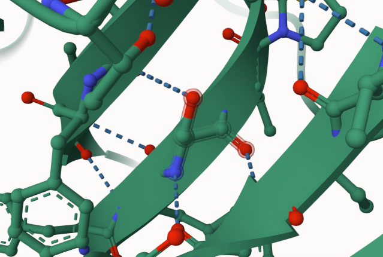
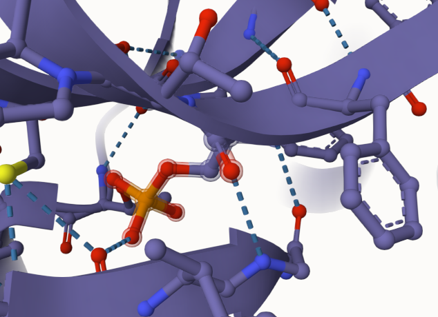
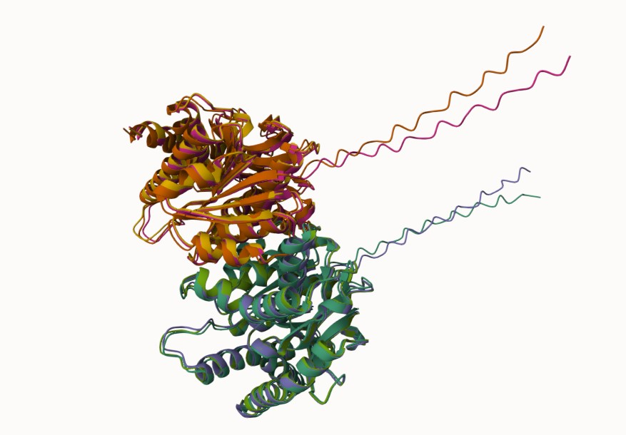
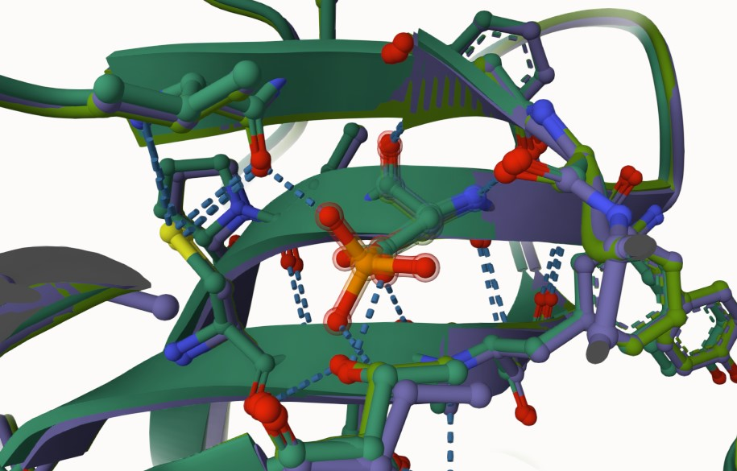
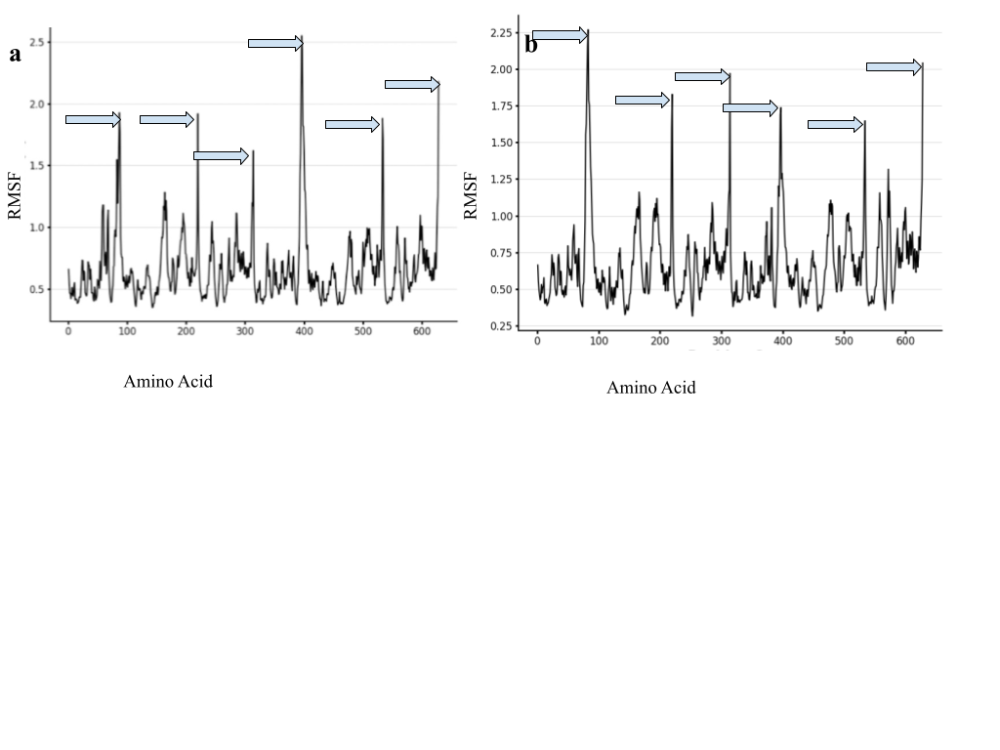
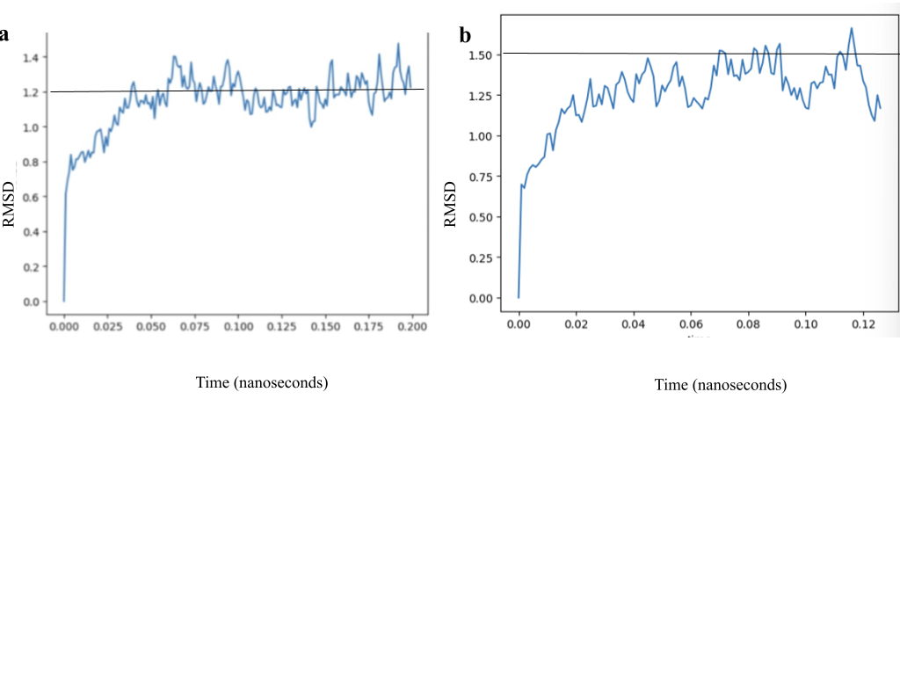
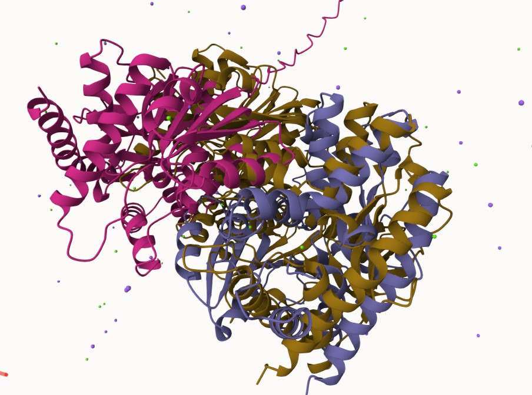

# Homo sapien Malate Dehydrogenase 2
# P40926
# Phosphorylation of Ser265 (pS289 in structure)

## Description

The phosphorylation of serine 289 (PTM) in human malate dehydrogenase 2 (hMDH2) has not been described previously in the literature. The modification is located within a beta sheet in hMDH2. Given its location in a beta-sheet, it was observed that its hydrogen bonds are inter-strand and found between the backbone atoms, contributing to its structural stability (Jakubowski, 2019).The position of the modified site was distant to the dimer interface. In relation to the active site (His 200), the modified site was located adjacently. However, the substrate binding sites Asp 57 and Arg 104 were located distally. In the unmodified state, serine was interacting with Gly 174 and Ser 252. In the modified state, it was interacting with Gly 198, Val 196, and Thr 170. In the variant state, it was interacting only with Gly 198, and Thr 170. 

1. image of the unmodified site

2. image of modification site

## Effect of the sequence variant and PTM on MDH dynamics

There were no visible changes in the structure of the mimic variant after the simulation. The Root Mean Square Fluctuation Plot compares how dynamic a particular amino acid is. The more it moves, the higher the RMSF value will be. In the mimic model the largest peaks appeared around amino acids 80, 210, 310, 390, 550 and 610. In the unmodified model, the largest peaks were found around amino acids 70, 210, 310, 390, 530 and  640. Although the most dynamic areas seem to be consistent, it was apparent in the mimic RMSF plot that the RMSF values differ. In the mimic variant Peak1 was higher at 2.25, peak 2 was slightly lower at 1.8 peak 3 was higher at 1.9 peak 4 was lower at 1.75 peak 5 was lower at 1.65 and lastly peak 6 was slightly lower at around 2.05. These changes mean that the mimic phosphorylation of serine in the variant has caused changes in the motion of the amino acid. The RMSD plot depicts the pKa values of both the unmodified protein and the mimic variant protein leveling off at 1.2 and about 1.5 respectively. Given the slight rise in the leveled off pKa value of the mimic RMSD plot, this indicated a subtle rise in pH, decreasing its acidity and making it less likely that it will donate a proton. However, this difference is not significant enough to contribute to that much of a functional change. (O’Brien, 2012)

1. Image of aligned PDB files (no solvent)

2. Image of the site with the aligned PDB files (no solvent)

3. Annotated RMSF plot showing differences between the simulations

4. Annotated plots of pKa for the key amino acids

## Comparison of the mimic and the authentic PTM

After comparing the mimic variant to the PTM modified model, the model and simulation data on the mimic variant matched up moderately well with the PTM modified protein. Upon viewing both structures in MolStar* the structures did not overlap entirely, but there is complete overlap in some regions. Though the structures are similar, localized conformational changes can most likely be attributed to the slight shift in the coils. These consistencies between the mimic and the PTM suggest that they affect the structure similarly and this was further supported by viewing each structure in MolStar*. This makes sense because the variant’s purpose was to mimic the phosphorylation of the PTM. This was further supported by the modified sites which formed new bonds to the same amino acids compared to that of the unmodified protein. Additionally, new bonds to the same amino acids had been formed in the active sites of the mimic as well as the PTM. Overall, it is reasonable to suggest that the mimic variant was a good approximation of the PTM, being that the structural changes in both models are similar if not entirely the same.

## Authors

Hannah Johnson

## Deposition Date

## License

Shield: [![CC BY-NC 4.0][cc-by-nc-shield]][cc-by-nc]

This work is licensed under a
[Creative Commons Attribution-NonCommercial 4.0 International License][cc-by-nc].

[![CC BY-NC 4.0][cc-by-nc-image]][cc-by-nc]

[cc-by-nc]: https://creativecommons.org/licenses/by-nc/4.0/
[cc-by-nc-image]: https://licensebuttons.net/l/by-nc/4.0/88x31.png
[cc-by-nc-shield]: https://img.shields.io/badge/License-CC%20BY--NC%204.0-lightgrey.svg

## References

* Ait-El-Mkadem, Samira, et al. “Mutations in MDH2, Encoding a Krebs Cycle Enzyme, Cause Early-Onset Severe Encephalopathy.” American Journal of Human Genetics, vol. 100, no. 1, Jan. 2017, pp. 151–59. PubMed, https://doi.org/10.1016/j.ajhg.2016.11.014.  

* O’Brien, E. P.; Brooks, B. R.; Thirumalai, D. Effects of pH on Proteins: Predictions for Ensemble and Single-Molecule Pulling Experiments. J. Am. Chem. Soc. 2012, 134 (2), 979–987. https://doi.org/10.1021/ja206557y. 

