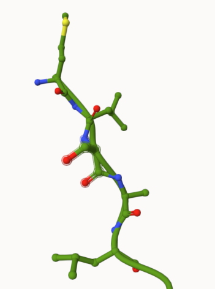
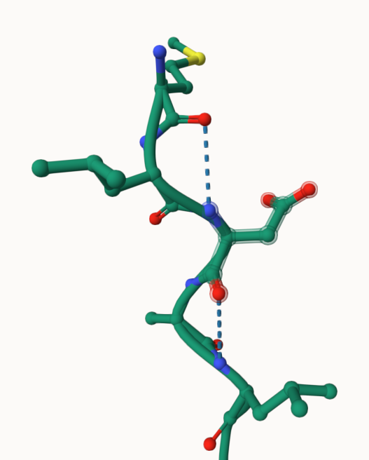
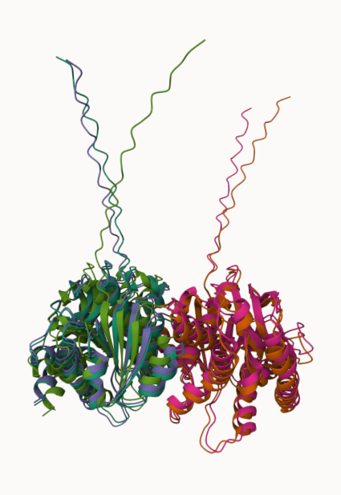
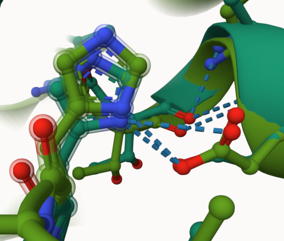
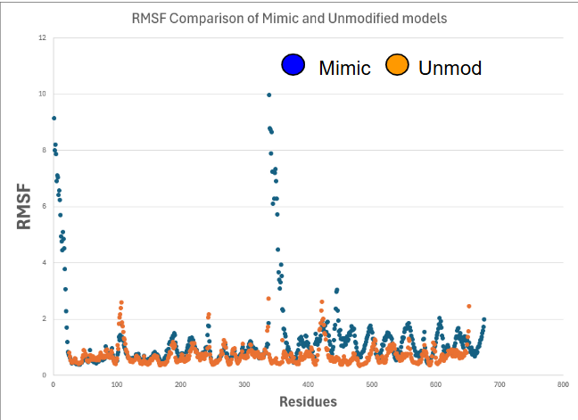
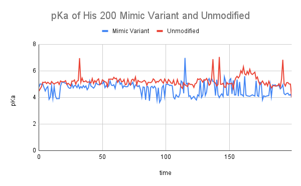

# Human MDH2
# Uniprot ID: P40926
# Variation: Phosphorylation of Ser 3

## Description

Serine 3 is located at the very beginning of the amino acid sequence of human MDH2 on an alpha loop, also called a tail (Figure 1). The modified residue is distant from the dimer interface, substrate binding site, and the active site. This is due to it being located on the alpha loop instead of the main structure.

1. image of the unmodified site

2. image of modification site

## Effect of the sequence variant and PTM on MDH dynamics

Part 3 from the Project 4 report

1. Image of aligned PDB files (no solvent)

2. Image of the active site with the aligned PDB files (no solvent)

3. Annotated RMSF plot showing differences between the simulations

4. Annotated plots of pKa for the key amino acids

## Authors

Gabby Mendez

## Deposition Date
12/06/2024

## License

Shield: [![CC BY-NC 4.0][cc-by-nc-shield]][cc-by-nc]

This work is licensed under a
[Creative Commons Attribution-NonCommercial 4.0 International License][cc-by-nc].

[![CC BY-NC 4.0][cc-by-nc-image]][cc-by-nc]

[cc-by-nc]: https://creativecommons.org/licenses/by-nc/4.0/
[cc-by-nc-image]: https://licensebuttons.net/l/by-nc/4.0/88x31.png
[cc-by-nc-shield]: https://img.shields.io/badge/License-CC%20BY--NC%204.0-lightgrey.svg

## References
Malate Dehydrogenase CUREs Community -Mammalian Cytosolic MDH Regulation, Interactions & Involvement Metabolism/Disease: Mini Review and Literature Summary. https://home.sandiego.edu/~josephprovost/Human%20MDH%20CS%20Summary%20.pdf. 
PhosphoSitePlus. MDH2 (human). Phosphosite.org. https://www.phosphosite.org/proteinAction?id=4151&showAllSites=true (accessed 2024-12-06). 
Chang, N. M.; Rementeria, G. J.; Berquist, B. E.; Provost, J. J. Impact of Phosphorylation on MDH2 Structure, Function and Protein. The FASEB Journal 2020, 34 (S1), 1–1. https://doi.org/10.1096/fasebj.2020.34.s1.02698. 

* Citation1 

* Citation2 
