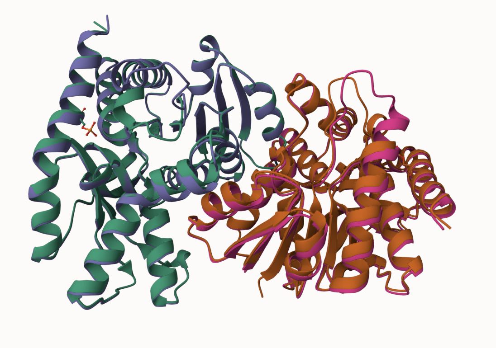
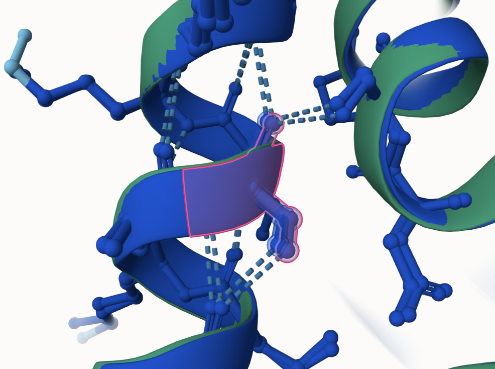
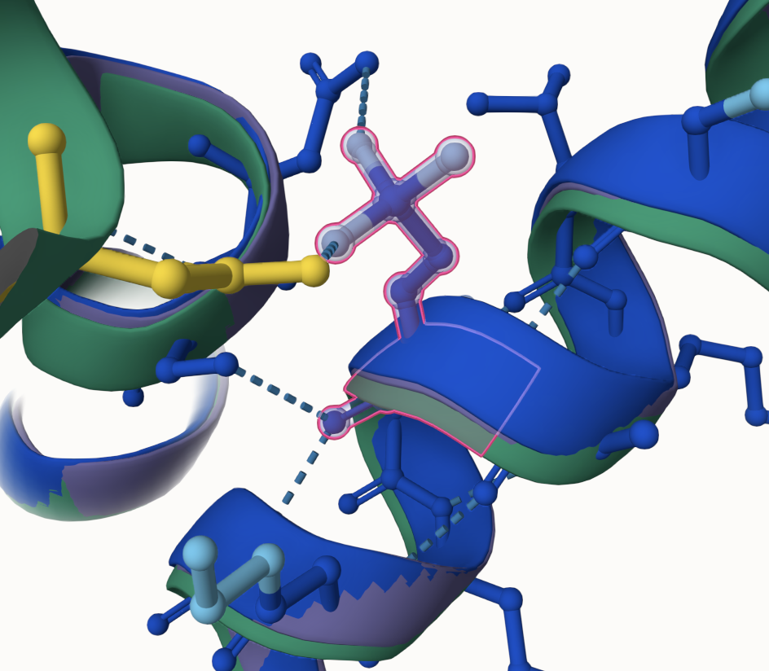
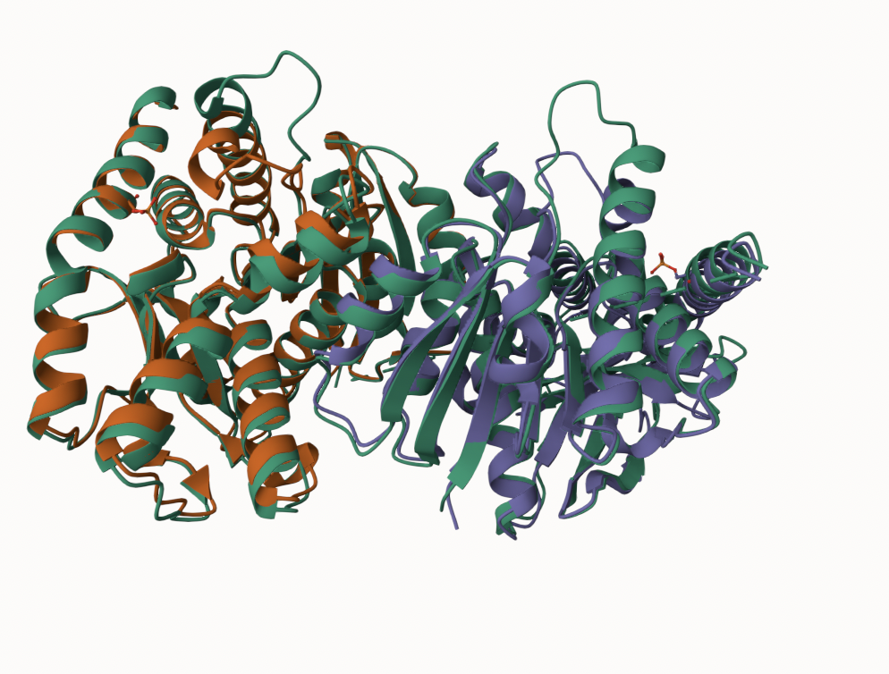
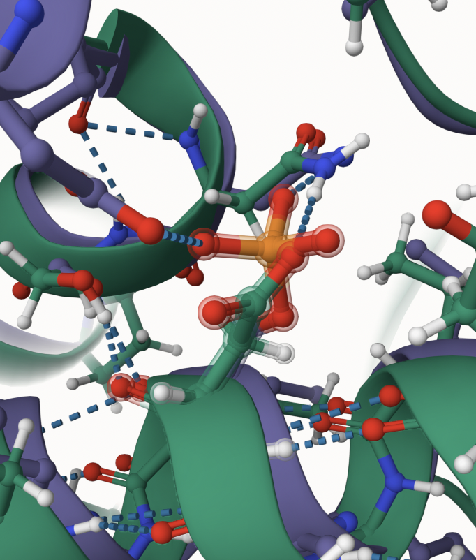
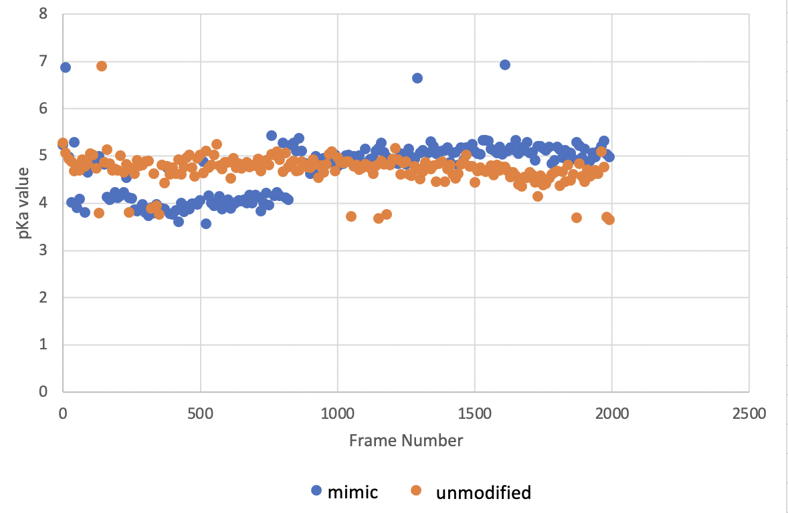
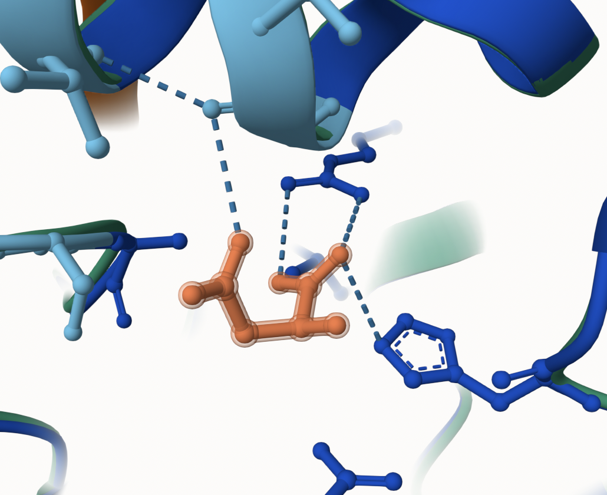
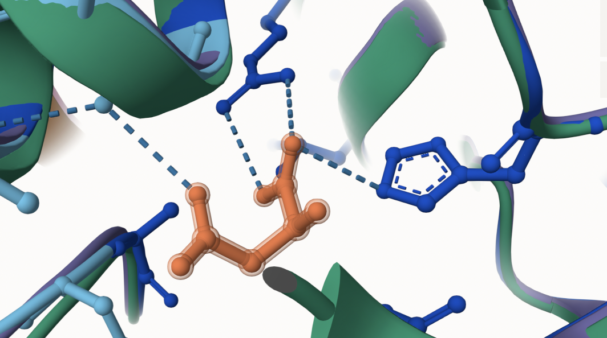

# Human MDH2
# Q75MT9
# pS302

## The modification of Serine 302 in hMDH2 has not been previously researched. This residue was phosphorylated to become phosphoserine and a mimic variant was created. 

1. image of aligned unmodified and modified 

2. image of the unmodified site

3. image of modification site

## Effect of the sequence variant and PTM on MDH dynamics

1. Image of aligned PDB files (no solvent)

2. Image of the site with the aligned PDB files (no solvent)

3. Annotated RMSF plot showing differences between the simulations

4. Annotated plots of pKa for the key amino acids

5. If needed, show ligand bound images and how modification affects substrate binding

Description of the data and changes
1.Substrate binding in unmodified protein 

2.Substrate binding in the modified protein and mimic variant

## Comparison of the mimic and the authentic PTM

![Substrate binding and the active site are similar in the mimic and the modified protein. ]
(images/mod_his.png)

## Authors

Summer Cocks

## Deposition Date

## License

Shield: [![CC BY-NC 4.0][cc-by-nc-shield]][cc-by-nc]

This work is licensed under a
[Creative Commons Attribution-NonCommercial 4.0 International License][cc-by-nc].

[![CC BY-NC 4.0][cc-by-nc-image]][cc-by-nc]

[cc-by-nc]: https://creativecommons.org/licenses/by-nc/4.0/
[cc-by-nc-image]: https://licensebuttons.net/l/by-nc/4.0/88x31.png
[cc-by-nc-shield]: https://img.shields.io/badge/License-CC%20BY--NC%204.0-lightgrey.svg

## References

