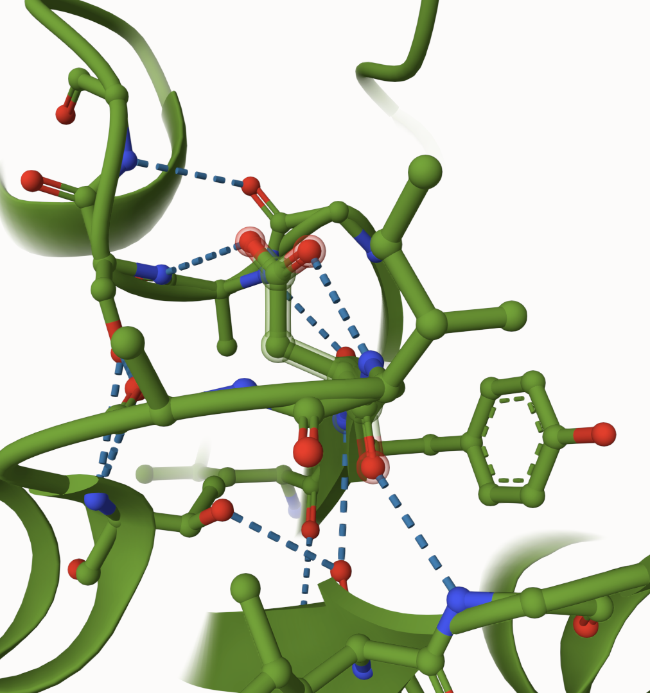
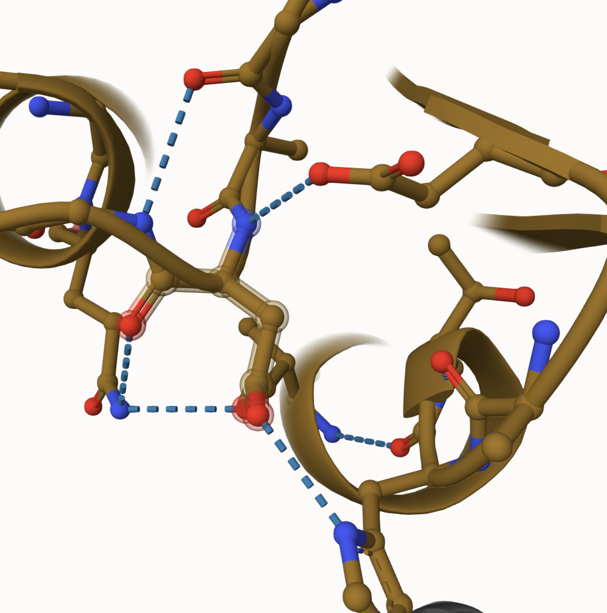
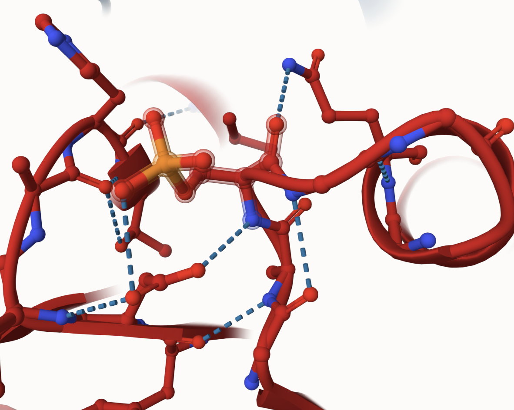
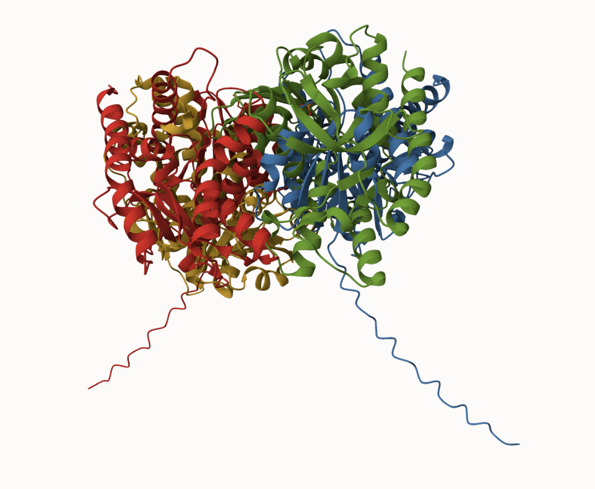
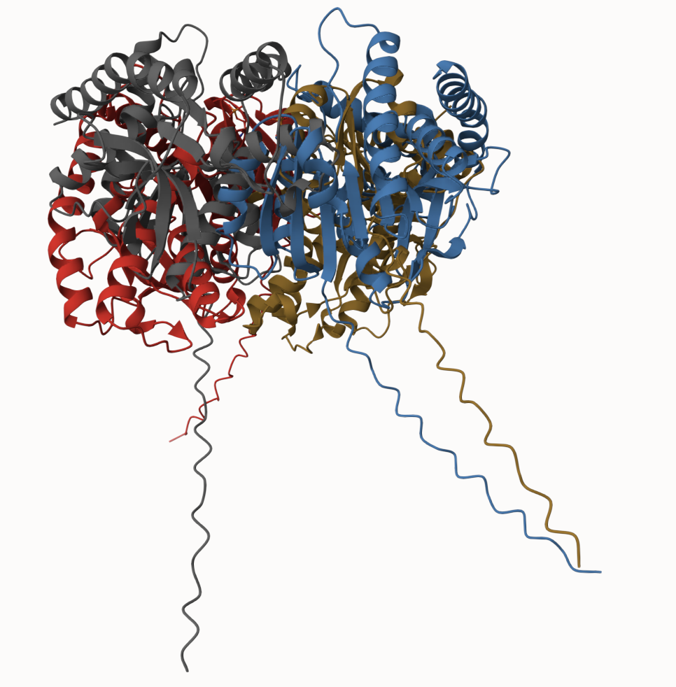

# Human Malate Dehydrogenase 2
# P40926
# Phosphorylation of amino acid 33

## Description

The amino acid I manipulated was positioned at number 33 which is in one of the binding sites for MDH2 (Table 1). This was not previously researched as a post-translational modification (PTM) site. Utilizing AlphaFold1 server, I changed the “S” in the sequence to a “D” for the mimic variant, and for the modified variant, I phosphorylated amino acid 33. After I downloaded my mimic and modified variants I imported them into Mol*, so I could begin viewing the bonds they made and which amino acids were involved. I also imported the original, unmodified sequence. According to Mol*, amino acid 33 was aspartate (ASP). ASP33 may contribute to stabilizing the loop or helix it resides on, which can indirectly maintain the active site's proper alignment. In the unmodified structure, ASP 33 forms hydrogen bonds with serine (SER) 9, glycine (GLY) 58, Isoleucine (ILE) 34, and tyrosine (TYR) 56 (Figure 1A). ASP 33 has a negatively charged carboxyl group that acts as a hydrogen bond acceptor. These interactions reflect the local structural stability of the protein in its native state. Because of these factors, SER 9 likely donates a hydrogen from its hydroxyl group to the carboxylate of ASP 33, and GLY 58 and ILE 34 might interact through backbone atoms rather than side chains because glycine and isoleucine have non-polar or minimal side chains. TYR 56 may donate a hydrogen from its hydroxyl group to Asp 33, further stabilizing the interaction. Once ASP was phosphorylated in the modified variant it was no longer recognized as ASP but phosphoserine (SEP). This could be because phosphorylation typically targets hydroxyl-containing residues. Since ASP 33 was phosphorylated, and the new group closely resembles the structure of SEP, this is likely why Mol* labeled it as SEP1. When talking about the modified variant, I will refer to amino acid 33 as SEP to keep information consistent with the databases I used, like Mol*. SEP forms one hydrogen bond with glutamine (GLN) 38 and two with ASP 57 (Figure 1C). MDH2 functions as a dimer, and phosphorylation of ASP33 may propagate changes to the dimer interface, affecting the enzyme's stability or cooperative interactions between subunits2. This could alter the overall efficiency of malate to oxaloacetate conversion. Phosphorylation adds a bulky, negatively charged phosphate group to the residue, which increases the residue's ability to participate in hydrogen bonding and a​​lters the electrostatic environment, likely repelling or disrupting previous interactions and forming new ones with nearby residues2. GLN 38 likely interacts via its amide group, which is a good hydrogen bond donor, and ASP 57 likely forms two hydrogen bonds with the phosphate group due to the strong electronegativity and increased number of hydrogen bond acceptors in the phosphorylated residue. In the mimic variant, ASP 33 was found to have hydrogen bonds with histidine (HIS) 60, GLN 38, and ASP 57 (Figure 1B). HIS 60 likely interacts via its imidazole ring, which can act as both a hydrogen bond donor and acceptor, accommodating ASP's carboxyl group. GLN 38 forms a hydrogen bond similar to the phosphorylated structure, likely due to spatial proximity. ASP 57 interacts with the carboxyl group of ASP 33, forming stabilizing hydrogen bonds, but the absence of phosphorylation reduces the strength and number of interactions compared to the phosphorylated form. These overall shifts in hydrogen bonding patterns likely have functional implications for MDH2. Phosphorylation can induce conformational changes or alter the enzyme's stability and activity, while the “S” to “D” mutation may partially mimic these effects without replicating them completely. After superimposing the structures to compare, the original structure contains four bonds that are not found in the mimic or modified version. Whereas, the mimic and modified version both have hydrogen bonds to ASP 57 and GLN 38 (Figure 2). Analyzing these structures in Mol* helped  visualize these critical changes and hypothesize about their functional significance.

1. image of the unmodified site

2. image of modification site

## Effect of the sequence variant and PTM on MDH dynamics

1. Image of aligned PDB files (no solvent)

2. Image of the site with the aligned PDB files (no solvent)

3. Annotated RMSF plot showing differences between the simulations

4. Annotated plots of pKa for the key amino acids
![When comparing the pKa trajectory graphs, I looked at amino acid 200 because it’s recognized as the active site (Table 1). Larger pKa fluctuations were seen in the original that suggest greater dynamic variability, potentially indicating a more flexible or less stabilized protein structure (Figure 5). This makes sense because more flexibility in the active site could help the enzyme work more efficiently under a wider range of conditions, so this may indicate that the unmodified version is working more effectively.](images/pka.png)

## Authors

Grace Carpenter

## 12/06/24

## License

Shield: [![CC BY-NC 4.0][cc-by-nc-shield]][cc-by-nc]

This work is licensed under a
[Creative Commons Attribution-NonCommercial 4.0 International License][cc-by-nc].

[![CC BY-NC 4.0][cc-by-nc-image]][cc-by-nc]

[cc-by-nc]: https://creativecommons.org/licenses/by-nc/4.0/
[cc-by-nc-image]: https://licensebuttons.net/l/by-nc/4.0/88x31.png
[cc-by-nc-shield]: https://img.shields.io/badge/License-CC%20BY--NC%204.0-lightgrey.svg

## References

* Park, H.-S. .; Hohn, M. J.; Umehara, T.; Guo, L.-T. .; Osborne, E. M.; Benner, J.; Noren, C. J.; Rinehart, J.; Soll, D. Expanding the Genetic Code of Escherichia Coli with Phosphoserine. Science 2011, 333 (6046), 1151–1154. 

* Provost, J.; Cornely, K.; Mertz, P.; Peterson, C.; Riley, S.; Tarbox, H.; Narasimhan, S.; Pulido, A.; Springer, A. Phosphorylation of Mammalian Cytosolic and Mitochondrial Malate Dehydrogenase: Insights into Regulation. Essays in Biochemistry 2024. 

* Ishida, T.; Kinoshita, K. PrDOS: Prediction of Disordered Protein Regions from Amino Acid Sequence. Nucleic Acids Research 2007, 35 (Web Server), W460–W464. 

* AlphaFold Server  https://alphafoldserver.com/ (accessed 2024-12-05).

* UniProt. https://www.uniprot.org/uniprotkb/P40925/entry (accessed 2024-12-05). 

