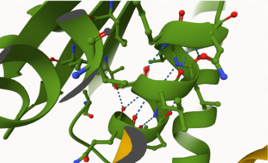

# Homo sapiens MDH2
# P40926
# pS41

## Description

MDH2 is an enzyme that encodes for MDH, which is necessary for the functioning of the Krebs Cycle (Ait-El-Mkadem et al., 2017). This project focuses on the possible effects of Ser 41 phosphorylation compared to the PTM of changing Ser 41 to Asp 41 in hMDH2. Previous research has found that phosphorylation in MDH2 can increase the enzymatic rate. Still, little research has been done on specific phosphorylation sites within MDH2 to come to a complete conclusion on the effects (Provost et al., 2024). However, it is clear that this modification is located on an alpha helix within MDH2. The interactions between the amino acids surrounding the modification change depending on whether Ser is phosphorylated versus if Ser is changed to Asp. Due to previous work with this enzyme, and in order to remain consistent, the MDH2 sequence used contains amino acids 25-338, meaning the amino acid of interest, Ser 41, was Ser 17 in this sequence. The portion of the sequence that was heavily focused on was “GGIGQPLSLLLKNSP”. 

1. image of the unmodified site

2. image of modification site

## Effect of the sequence variant and PTM on MDH dynamics

Upon completing the molecular dynamic simulations for the mimic variant structure, analysis was done for the resulting structure to identify if there were structural, dynamic, or pKa changes. The structure of the product from the first molecular dynamic simulation (Colab Step 1) was inspected first by comparing it to the mimic variant structure obtained from AlphaFold3. Upon alignment of both structures, it was clear that the portion of the sequence of interest was in the same place along the dimer interface, due to the symmetry of the dimeric protein. Looking closer at the amino acid of interest, Asp 17, in both structures it is clear that the amino acid is interacting with surrounding amino acids in the same way. For example, in the mimic structure, Asp 17 interacts with Gly 13 and Lys 21 via hydrogen bonds. In the molecular dynamic simulation product, Asp 17 is also interacting with Gly 13 and Lys 21 via hydrogen bonds, allowing for the conclusion that there was no structure change after the simulation was completed. Additionally, when analyzing the dynamics of the product from the simulation through an RMSF plot there are increases in flexibility approximately around amino acids 100, 300, 400, 530, and 620. When looking at the structure, these areas of flexibility are all alpha helices, however, at the position of the peak there is a Glycine which would increase the flexibility in the alpha helix, a glycine is not present however around amino acid 100, however, due to these peaks not being near the amino acid of interest, I would not suspect the change in amino acid to be the cause of these peaks. When comparing RMSF from the post-simulation mimic to the unmodified structure, the peaks on the graph align almost perfectly, with only two peaks being significantly larger in the post-simulation mimic structure (amino acids 397 and 529) and one peak being much larger in the unmodified structure (amino acid 309). The fact that there are little to no changes in RMSF between both structures allows for the conclusion that there are structural and flexibility changes. When examining pKa differences between the post-simulation mimic and the unmodified structure at the active site (His 176) there were clear differences. The unmodified structure varied greatly with the lowest pKa being around 4.0 and the highest pKa being above 7.0. On the other hand, the post-simulation mimic pKa at the active site seemed to be exponentially increasing and then plateauing or decreasing at the end of the trajectory. These differences in pKa and pKa trends over the trajectory may be due to the change from Ser 17 to Asp 17 in the mimic variant and differences in interactions (due to the negatively charged side chain on the Asp) between neighboring amino acids, however, considering the change in an amino acid is not close to the active site I would not support that conclusion.

1. Image of aligned PDB files (no solvent)

2. Image of the site with the aligned PDB files (no solvent)

3. Annotated RMSF plot showing differences between the simulations

4. Annotated plots of pKa for the key amino acids

## Comparison of the mimic and the authentic PTM

Once the PTM modified, mimic variant, and unmodified structures were aligned analysis of each structure began. In order to focus on the differences between each structure, alignment of the PTM modified structure and the unmodified structure happened first. The portion of the sequence of interest was fully present in both structures and overlapping. Diving deeper, in the PTM modified structure, a phosphate group was added to the oxygen side chain of serine, indicating a structure change. Additionally, the phosphorylated group (SEP) created different interactions with the surrounding amino acids (Ala 8, Gly 13, and Lys 21). Ala 8 and Gly 13 interacted with SEP 17 via hydrogen bonds creating a total of three weak interactions between SEP 17 and Gly 13, one not being with the phosphate group, and two weak interactions between SEP 17 and Ala 8, both being with the phosphate group. SEP 17 interacted with Lys 21 via a hydrogen bond, but not with the phosphate group. In comparison, the unmodified structure lacked that phosphate group seen in the PTM structure, so Ser 17 interacted with Gly 13 and Lys 21 via hydrogen bonds with three total weak interactions occurring from Ser 17. The phosphorylation of Ser 17 happens along the dimer interface which would result in an effect on dimerization, however, this change does not occur near the active site so it would not affect substrate binding.

A comparative analysis between the mimic variant and unmodified was done following the comparison of the PTM modified and unmodified structures, beginning with the alignment of the mimic variant and unmodified structures. In the mimic variant, focusing on the portion of the sequence of interest, Asp 17 is seen in place of Ser 17. Additionally, Asp 17 is seen only interacting with Lys 21 and Gly 13 once via a hydrogen bond. Asp 17 has a negatively charged side chain compared to the original Ser 17, which has an uncharged side chain, resulting in a structural change compared to the Model PDB structure. The negative charge is likely why there is a change in the number of weak interactions between Asp 17 and the surrounding amino acids in contrast to SEP 17 and the surrounding amino acids. Additionally, the change of Ser 17 to Asp 17 is along the dimer interface which would affect dimerization, which could cause changes in the folding of a protein or binding of other molecules. This change is not close to the active site of MDH2 (His 176), therefore, it would not affect substrate binding. While there are interaction differences between the mimic variant and the modified structure, I believe the mimic is a good approximation of the PTM due to the lack of extensive structural changes.  Again due to the little structural changes between the modified structure and mimic variant, I believe there would be minimal changes to the mitochondria and the cytosol, which MDH2 affects most (Priestley et al., 2022). 

## Authors

Alyssa Diana

## December 6, 2024

## License

Shield: [![CC BY-NC 4.0][cc-by-nc-shield]][cc-by-nc]

This work is licensed under a
[Creative Commons Attribution-NonCommercial 4.0 International License][cc-by-nc].

[![CC BY-NC 4.0][cc-by-nc-image]][cc-by-nc]

[cc-by-nc]: https://creativecommons.org/licenses/by-nc/4.0/
[cc-by-nc-image]: https://licensebuttons.net/l/by-nc/4.0/88x31.png
[cc-by-nc-shield]: https://img.shields.io/badge/License-CC%20BY--NC%204.0-lightgrey.svg

## References

* Ait-El-Mkadem, S.; Dayem-Quere, M.; Gusic, M.; Chaussenot, A.; Bannwarth, S.; François, B.; Genin, E. C.; Fragaki, K.; Volker-Touw, C. L. M.; Vasnier, C.; Serre, V.; van Gassen, K. L. I.; Lespinasse, F.; Richter, S.; Eisenhofer, G.; Rouzier, C.; Mochel, F.; De Saint-Martin, A.; Abi Warde, M.-T.; de Sain-van der Velde, M. G. M. Mutations in MDH2, Encoding a Krebs Cycle Enzyme, Cause Early-Onset Severe Encephalopathy. American Journal of Human Genetics 2017, 100 (1), 151–159. 

* Priestley, J. R. C.; Pace, L. M.; Sen, K.; Aggarwal, A.; Alves, C. A. P. F.; Campbell, I. M.; Cuddapah, S. R.; Engelhardt, N. M.; Eskandar, M.; Jolín García, P. C.; Gropman, A.; Helbig, I.; Hong, X.; Gowda, V. K.; Lusk, L.; Trapane, P.; Srinivasan, V. M.; Suwannarat, P.; Ganetzky, R. D. Malate Dehydrogenase 2 Deficiency Is an Emerging Cause of Pediatric Epileptic Encephalopathy with a Recognizable Biochemical Signature. Molecular Genetics and Metabolism Reports 2022, 33, 100931. 

* Provost, J.; Cornely, K.; Mertz, P.; Peterson, C.; Riley, S.; Tarbox, H.; Narasimhan, S.; Pulido, A.; Springer, A. Phosphorylation of Mammalian Cytosolic and Mitochondrial Malate Dehydrogenase: Insights into Regulation. Essays in Biochemistry 2024. 
