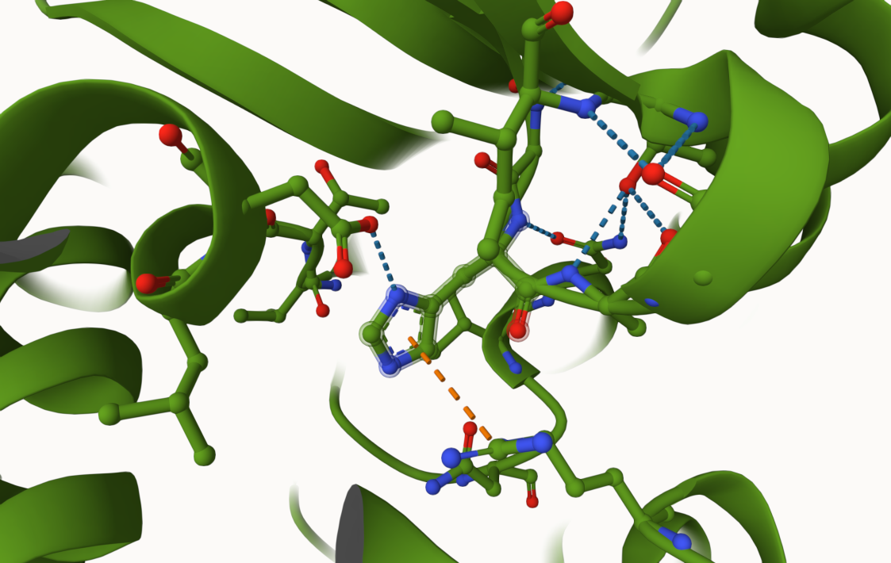
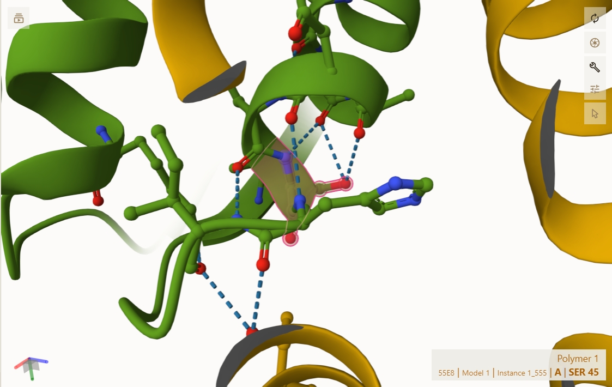
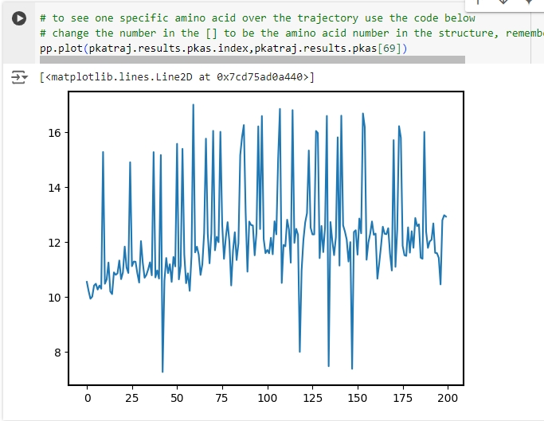

# Human MDH2
# P40926
# pS45

## Description

Human malate dehydrogenase 2 (MDH2) is a dimeric structure that my group and I have been researching for the majority of the semester. This project looks at how post-transitional modification (PTM) plays a role in structure and function. The modification was the phosphorylation of amino acid Serine 45 in the MDH2 sequence. Although phosphorylation of Serine in PTM is one of the most common phosphorylation amino acids, there is no further literature on the PTM of serine in MDH2.

1. image of the unmodified site

2. image of modification site

## Effect of the sequence variant and PTM on MDH dynamics

A Colab analysis was run to numerically check the differences between the mimic and the original. First Root Mean Square Deviance (RMSD) was run: this quantifies the differences in the predicted values and observed values. Then Root Mean Square Fluctuation (RMSF) was run: this quantifies the flexibility of atoms in a protein over a certain period of time.

1. Annotated RMSF plot showing differences between the simulations

2. Annotated plots of pKa for the key amino acids

## Comparison of the mimic and the authentic PTM

In conclusion, my evidence does support the mimic being a good approximation of the PTM due to a higher pKa and a higher RMSF value of His 176 in the mimic variant during the simulations run. This could be due to possible to the higher ionization state with higher pKa values and increased flexibility of the mimic as seen in the higher RMSF value. This can help mimic the functional and structural effects of the actual PTM.

## Authors

Garrett T. Blanchard

## Deposition Date
12/10/2024

## License

Shield: [![CC BY-NC 4.0][cc-by-nc-shield]][cc-by-nc]

This work is licensed under a
[Creative Commons Attribution-NonCommercial 4.0 International License][cc-by-nc].

[![CC BY-NC 4.0][cc-by-nc-image]][cc-by-nc]

[cc-by-nc]: https://creativecommons.org/licenses/by-nc/4.0/
[cc-by-nc-image]: https://licensebuttons.net/l/by-nc/4.0/88x31.png
[cc-by-nc-shield]: https://img.shields.io/badge/License-CC%20BY--NC%204.0-lightgrey.svg

## References

* [Padilla-Mendoza, J. R.; Contis-Montes de Oca, A.; Rodríguez, M. A.; López-Casamichana, M.; Bolaños, J.; Quintas-Granados, L. I.; Reyes-Hernández, O. D.; Fragozo-Sandoval, F.; Reséndiz-Albor, A. A.; Arellano-Gutiérrez, C. V.; López-Reyes, I. Protein Phosphorylation in Serine Residues Correlates with Progression from Precancerous Lesions to Cervical Cancer in Mexican Patients. BioMed Research International 2020, 2020, 5058928.](https://doi.org/10.1155/2020/5058928)

* [Zhong, Q.; Xiao, X.; Qiu, Y.; Xu, Z.; Chen, C.; Chong, B.; Zhao, X.; Hai, S.; Li, S.; An, Z.; Dai, L. Protein Posttranslational Modifications in Health and Diseases: Functions, Regulatory Mechanisms, and Therapeutic Implications. MedComm 2023, 4 (3)](https://doi.org/10.1002/mco2.261)
