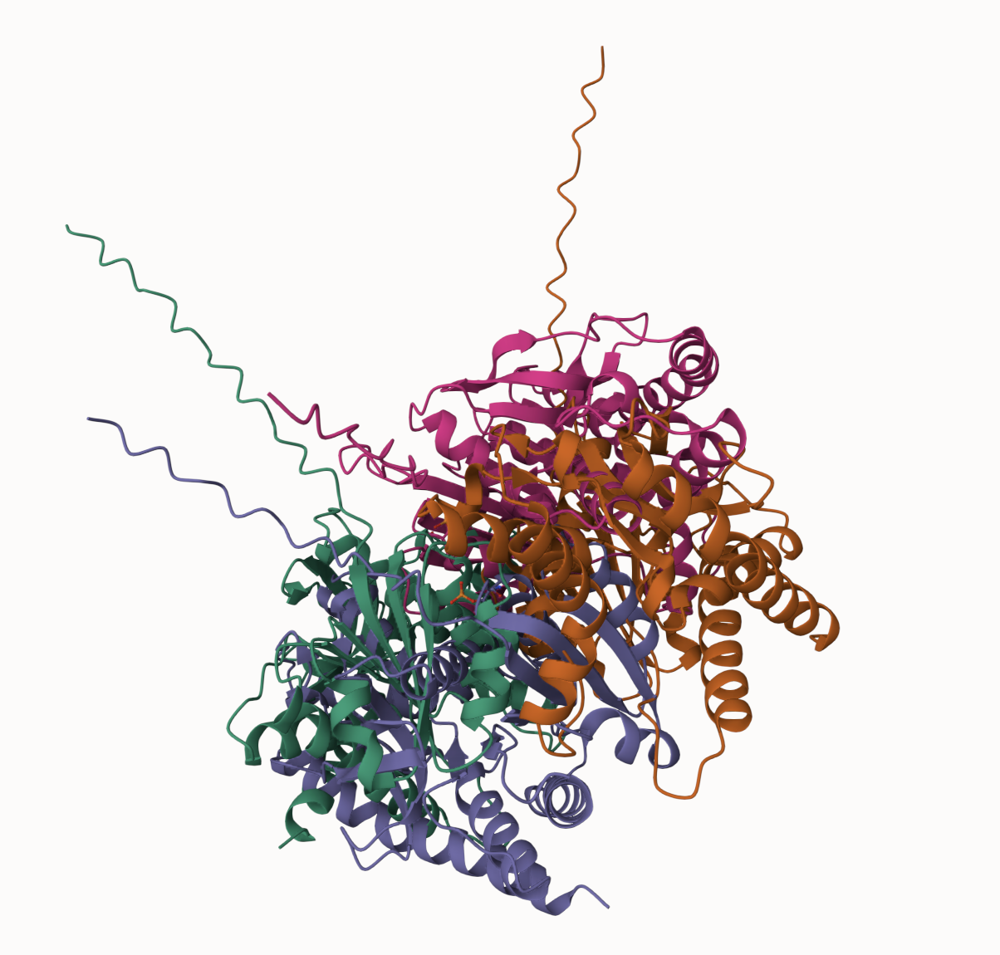
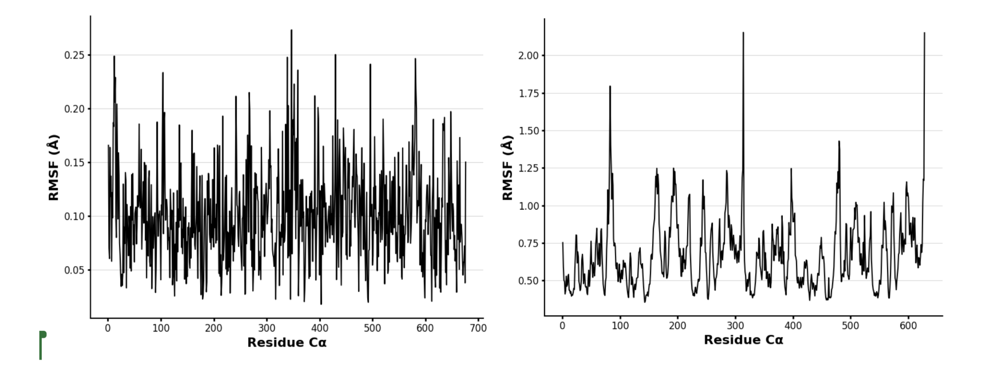

# Human MDH2
# P40926
# Phosphorylation of S47

## Description

This study aimed to investigate post-translational modifications on human malate dehydrogenase 2. Specifically observing the possible effects of serin 47 phosphorylation compared to post-translational modification mimitry.Serine 47 of human MDH2 had not been identified as a post-translationally modified site before this project and there have been no functional studies of the role of this site in human metabolism. Serine 47 is located in the N-terminal region of hMDH2, in a loop structure. This loop is situated near the dimerization interface, which is crucial for the enzyme’s function. My modification site is near amino acids: phosphoserine, Leucine, and valine. 

1. image of the unmodified site

2. image of modification site

## Effect of the sequence variant and PTM on MDH dynamics

1. Image of aligned PDB files (no solvent)

2. Image of the site with the aligned PDB files (no solvent)

3. Annotated RMSF plot showing differences between the simulations

## Authors

Nicole Flagg

## 12/06/24

## License

Shield: [![CC BY-NC 4.0][cc-by-nc-shield]][cc-by-nc]

This work is licensed under a
[Creative Commons Attribution-NonCommercial 4.0 International License][cc-by-nc].

[![CC BY-NC 4.0][cc-by-nc-image]][cc-by-nc]

[cc-by-nc]: https://creativecommons.org/licenses/by-nc/4.0/
[cc-by-nc-image]: https://licensebuttons.net/l/by-nc/4.0/88x31.png
[cc-by-nc-shield]: https://img.shields.io/badge/License-CC%20BY--NC%204.0-lightgrey.svg

## References

* Zhao, X.; León, I. R.; Bak, S.; Mogensen, M.; Wrzesinski, K.; Højlund, K.; Jensen, O. N. Phosphoproteome Analysis of Functional Mitochondria Isolated from Resting Human Muscle Reveals Extensive Phosphorylation of Inner Membrane Protein Complexes and Enzymes. Molecular & Cellular Proteomics 2011.

* Provost, J.; Cornely, K.; Mertz, P.; Peterson, C.; Riley, S.; Tarbox, H.; Narasimhan, S.; Pulido, A.; Springer, A. Phosphorylation of Mammalian Cytosolic and Mitochondrial Malate Dehydrogenase: Insights into Regulation. Essays in Biochemistry 2024.
