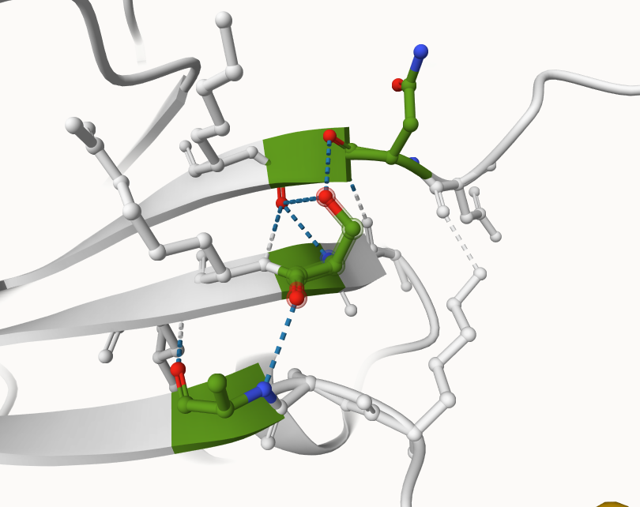
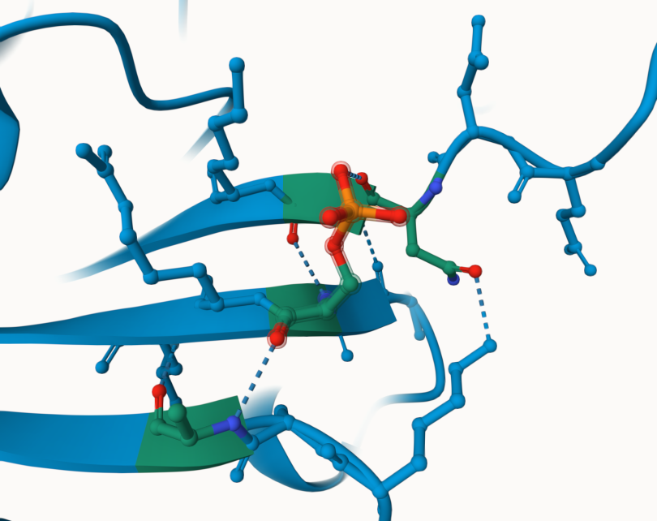
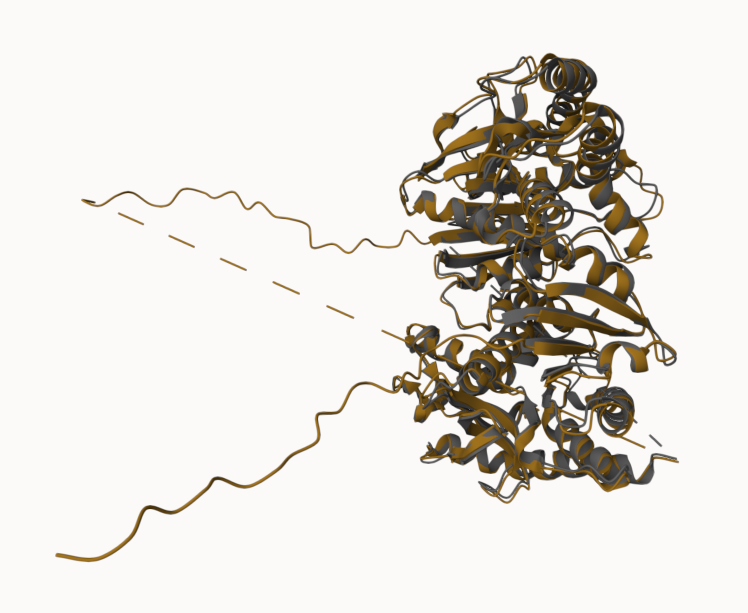
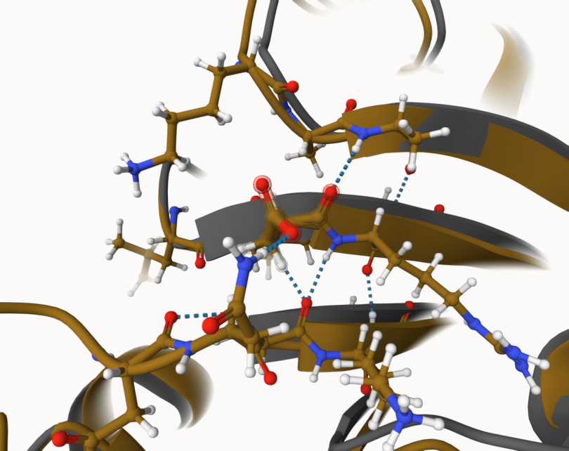
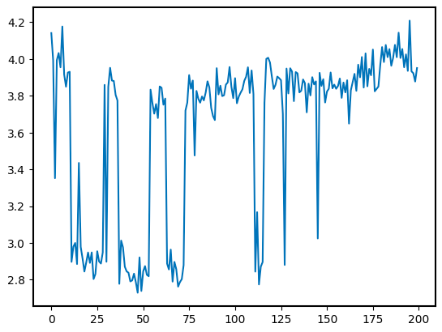

# Homo sapiens MDH2
# Uniprot ID: P40926
# Variation: phosphorylation of S51

## Description

Serine 51 in human MDH2 was post-translationally modified in 2011 by Zhao et al. This study observed various phosphorylation sites in many proteins. While important, this study did not identify how serine 51 modification affected MDH2 function.

1. image of the unmodified site

2. image of modification site

## Effect of the sequence variant and PTM on MDH dynamics

The models of unmodified protein and the PTM mimic were alined. This showed the variation in PTM mimic and the unmodified models. Closer inspection of the model showed no major structural changes in the model or the site where serine 51 was located.

1. Image of aligned PDB files (no solvent)

2. Image of the site with the aligned PDB files (no solvent)

The RMSF values were analyzed. The largest difference was between the PTM mimic and the unmodified model was at around 300 on the x-axis.

3. Annotated RMSF plot showing differences between the simulations

The pKa of aspartic acid 51 of the PTM mimic indicated that the pKa fluctuated significantly. This showed a change in structure and possibly function. It was possible that the PTM mimic could not function the same as the unmodified protein due to structural changed that could result in increased acitivity of MDH2.

4. Annotated plots of pKa for the key amino acids

Overall, the PTM mimic indicated that phosphorylation of serine 51 could cause increased MDH2 activity.

## Comparison of the mimic and the authentic PTM

Comparison of the PTM mimic model and the variant model indicated that no conclusive evidence could be drawn between the differences of the models. The variant model was not run in a molecular dynamics simulation. We can hypothesize that the molecular dynamics simulation would be very similar for the two models. While pKa is important for molecular dynamics, this change may not be as significant as previously hypothesized.

## Authors

Hayley Larson

## Deposition Date

12/6/2024

## License

Shield: [![CC BY-NC 4.0][cc-by-nc-shield]][cc-by-nc]

This work is licensed under a
[Creative Commons Attribution-NonCommercial 4.0 International License][cc-by-nc].

[![CC BY-NC 4.0][cc-by-nc-image]][cc-by-nc]

[cc-by-nc]: https://creativecommons.org/licenses/by-nc/4.0/
[cc-by-nc-image]: https://licensebuttons.net/l/by-nc/4.0/88x31.png
[cc-by-nc-shield]: https://img.shields.io/badge/License-CC%20BY--NC%204.0-lightgrey.svg

## References

* Zhao, X.; León, I. R.; Bak, S.; Mogensen, M.; Wrzesinski, K.; Højlund, K.; Jensen, O. N. Phosphoproteome Analysis of Functional Mitochondria Isolated from Resting Human Muscle Reveals Extensive Phosphorylation of Inner Membrane Protein Complexes and Enzymes. Molecular & Cellular Proteomics 2011, 10 (1), M110.000299. 
