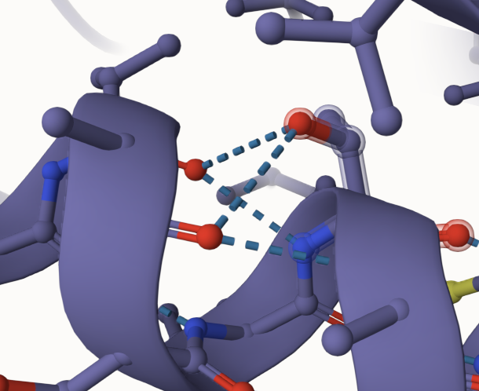
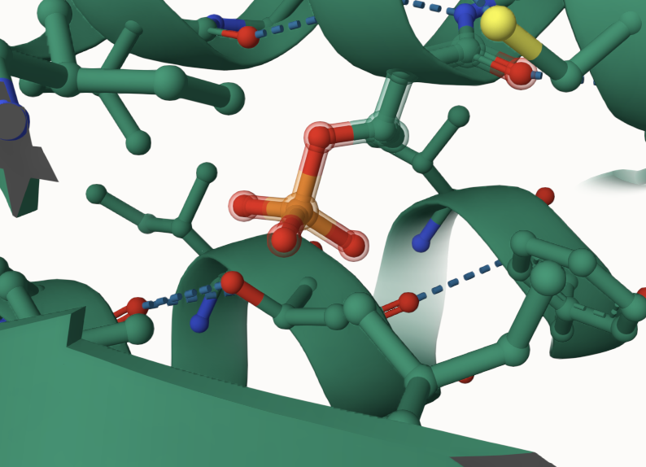
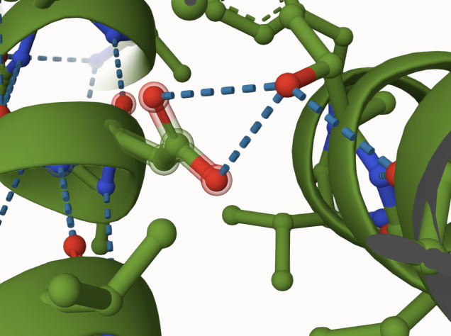
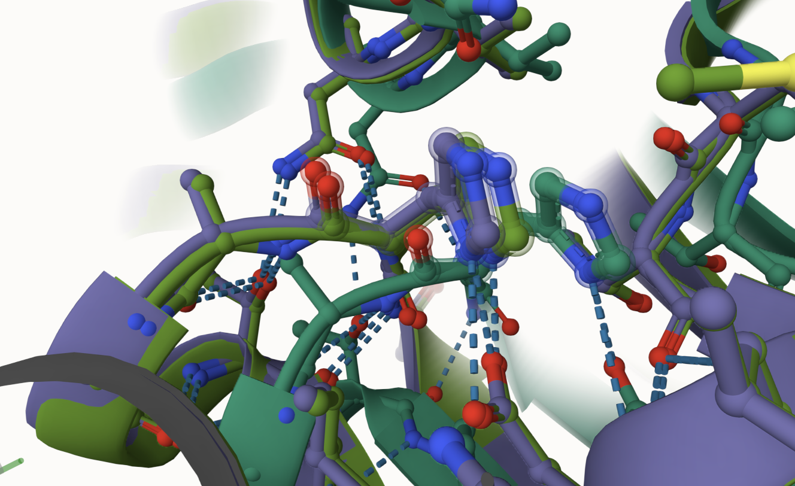
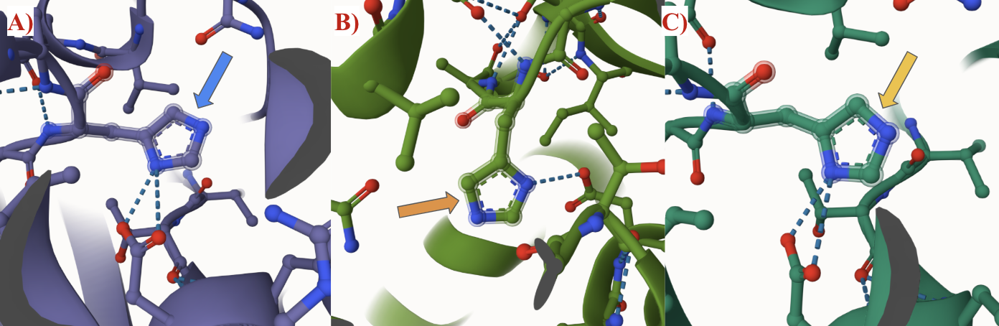
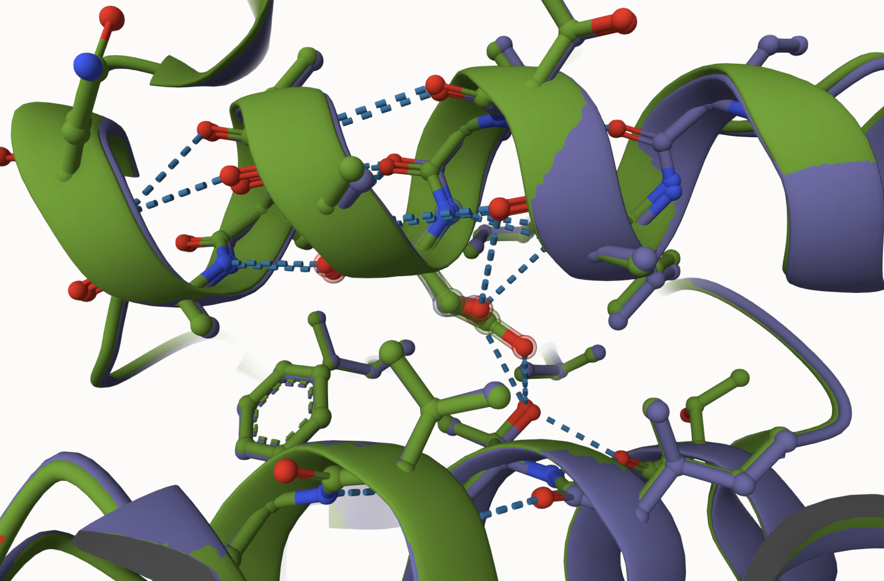
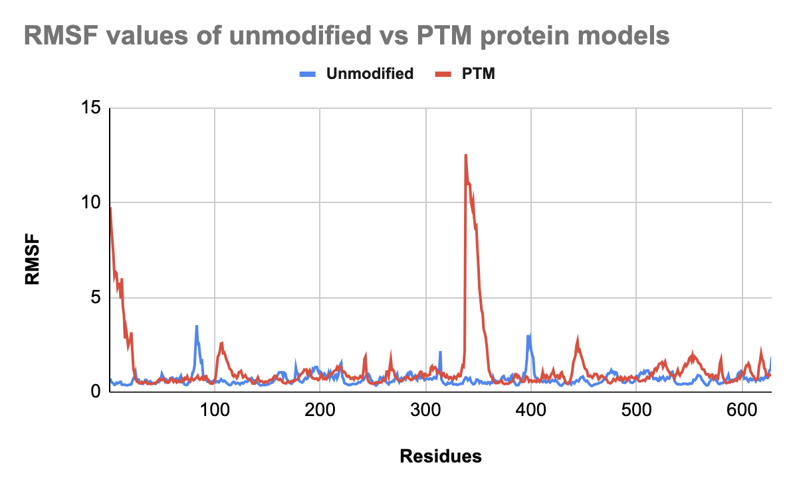
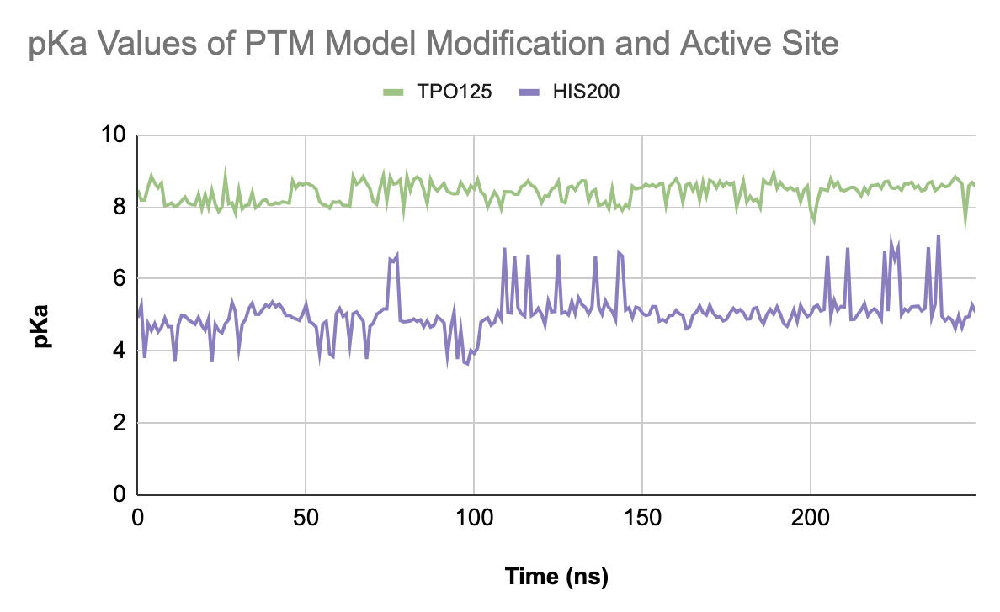
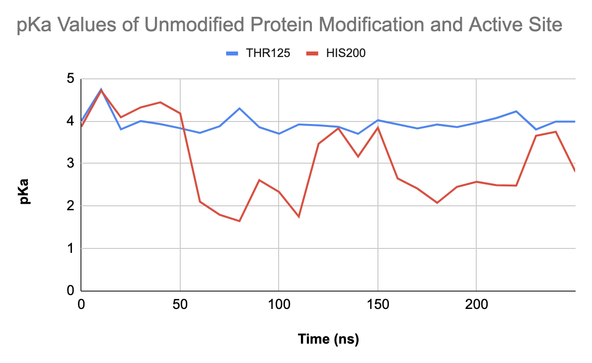

# Malate dehydrogenase MDH2
# Uniprot ID: P40926
# Variation: Phosphorylation of T125

## Description

# Comparison of MDH2, mutant variant, and PTM models

1. When looking at THR125 in the unmodified protein, it interacts with VAL121 and ALA122 by respective hydrogen bonds.

2. When looking at the modification site of the PTM model, the phosphorylated amino acid 125, labeled TPO125, does not interact with any nearby amino acids.

3. In the mimic variant, the modified amino site, ASP125, interacts with THR151 with two hydrogen bonds.

## Effect of the sequence variant and PTM on MDH dynamics

1. When all of the structures are superimposed together, the active site of the PTM is similar but at a slight variation of position and distance away from the unmodified protein, when they, ideally, should be in the same location. However, the active site of the mimic variant and unmodified protein share the same active site location.

2. In the PTM and unmodified variants, the active site interacts with a nearby amino acid ASP173 by two hydrogen bonds (A, C). When looking at the active site of the mimic variant, it now only has one hydrogen bond with ASP173 (B).

3. When superimposed in Molstar, the mimic variant and the unmodified protein had an RMSD value of 0.70 Å, implying very similar structures.

4. The PTM model has an average of higher RMSF values throughout the residues, with an extremely high RMSF value at residue 350 for the PTM model. A relative consistency in flexibility is seen in the unmodified protein model, but there are slight peaks that can be seen around residues 80 and 400.

5. An overall change in pKa between the unmodified protein and the PTM can be seen, and the PTM model’s pKa is much higher than the pKa values of either respective site for the unmodified protein.

## Comparison of the mimic and the authentic PTM

When comparing the mimic variant to the PTM modified model, the two did not appear similar. When superimposed, the RMSD value was 8.16 Å. An RMSD value of 2 Å or less is considered a good alignment score when comparing two protein models (Castro-Alvarez et al. 2017).

## Authors

Taryn Darr

## Deposition Date

## License

Shield: [![CC BY-NC 4.0][cc-by-nc-shield]][cc-by-nc]

This work is licensed under a
[Creative Commons Attribution-NonCommercial 4.0 International License][cc-by-nc].

[![CC BY-NC 4.0][cc-by-nc-image]][cc-by-nc]

[cc-by-nc]: https://creativecommons.org/licenses/by-nc/4.0/
[cc-by-nc-image]: https://licensebuttons.net/l/by-nc/4.0/88x31.png
[cc-by-nc-shield]: https://img.shields.io/badge/License-CC%20BY--NC%204.0-lightgrey.svg

## References

* Castro-Alvarez, A.; Costa, A.; Vilarrasa, J. The Performance of Several Docking Programs at Reproducing Protein–Macrolide-like Crystal Structures. Molecules 2017, 22 (1), 136. ![DOI] https://doi.org/10.3390/molecules22010136
