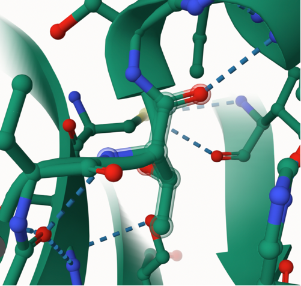
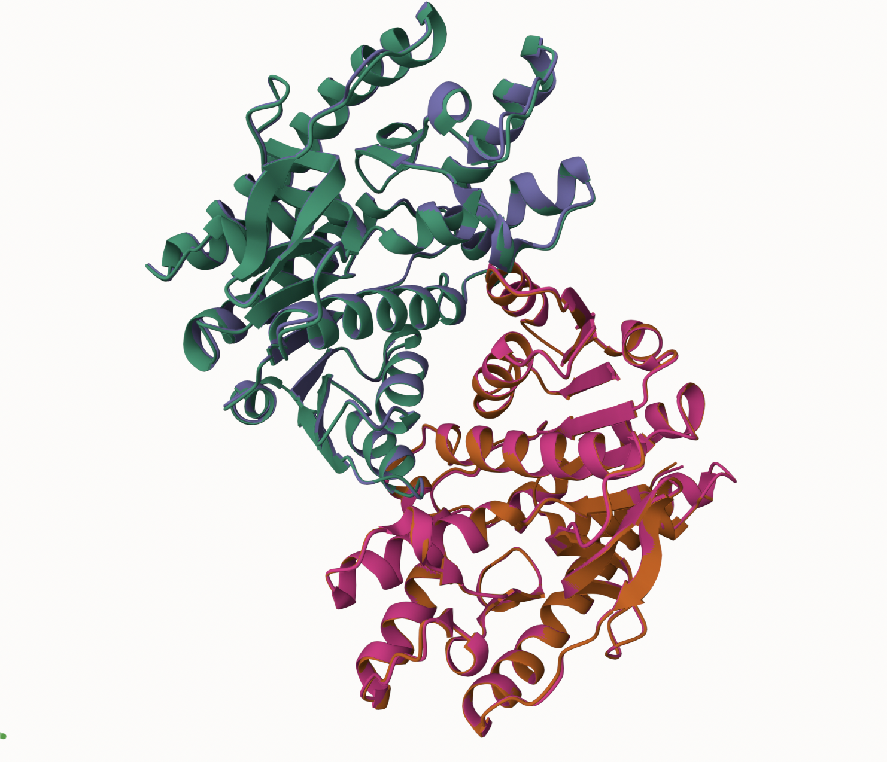
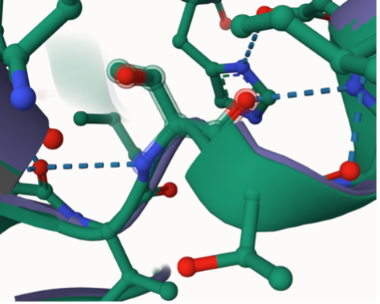

# Human Malate Dehydrogenase
# Uniprot: P40926
# Variation: phosphorylation of T146

## Description

Human MDH2 sequence was changed at threonine 146 to aspartic acid in addition to a phosphorylation PTM. There are no functional studies on this site, structural and functional changes were explored. 

1. image of the unmodified site

2. image of modification site

## The phosphorylation of threonine introduces a negative charge to the amino acid affecting the bonds it makes, in this case allowing for four additional hydrogen bonds. 

1. Image of aligned PDB files (no solvent)

2. Image of the site with the aligned PDB files (no solvent)

3. Annotated RMSF plot showing differences between the simulations

4. Annotated plots of pKa for the key amino acids

## Comparison of the mimic and the authentic PTM

While the mimic variant provides an approximation of the PTM, it is not the best representation as the structures have significant differences. The differences in the hydrogen bonding like the PTM having several more bonds, intermolecular interactions, and potential conformational changes between the two modifications can lead to significant functional differences.

## Authors

Mackenzie Kidwell

## Deposition Date

## License

Shield: [![CC BY-NC 4.0][cc-by-nc-shield]][cc-by-nc]

This work is licensed under a
[Creative Commons Attribution-NonCommercial 4.0 International License][cc-by-nc].

[![CC BY-NC 4.0][cc-by-nc-image]][cc-by-nc]

[cc-by-nc]: https://creativecommons.org/licenses/by-nc/4.0/
[cc-by-nc-image]: https://licensebuttons.net/l/by-nc/4.0/88x31.png
[cc-by-nc-shield]: https://img.shields.io/badge/License-CC%20BY--NC%204.0-lightgrey.svg

## References

*  Kozeleková, A.; Náplavová, A.; Brom, T.; Gašparik, N.; Šimek, J.; Houser, J.; Hritz, J. Phosphorylated and Phosphomimicking Variants May Differ-a Case Study of 14-3-3 Protein. 

