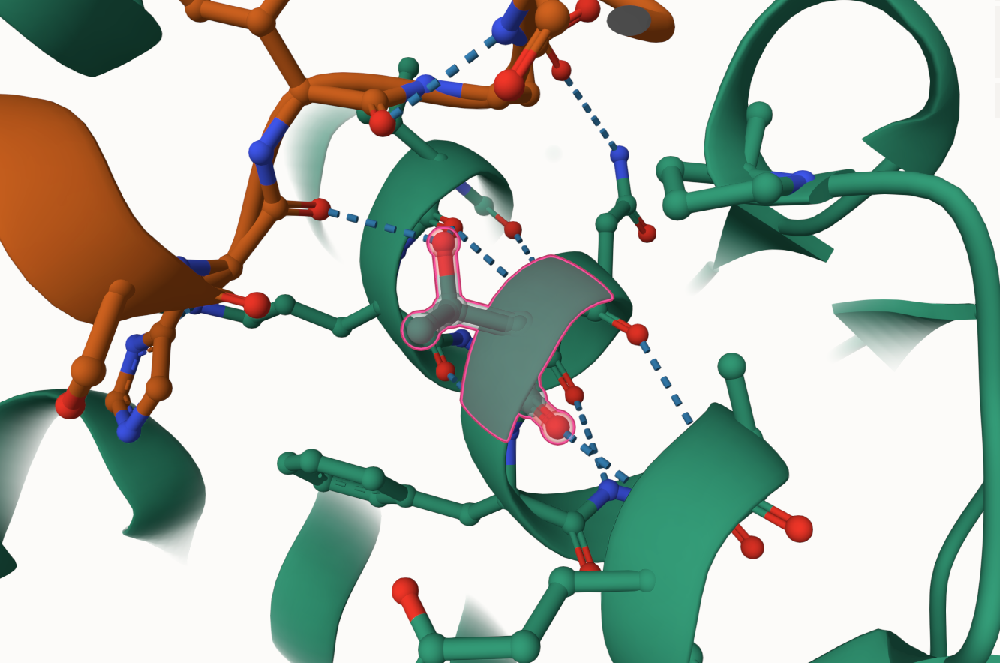
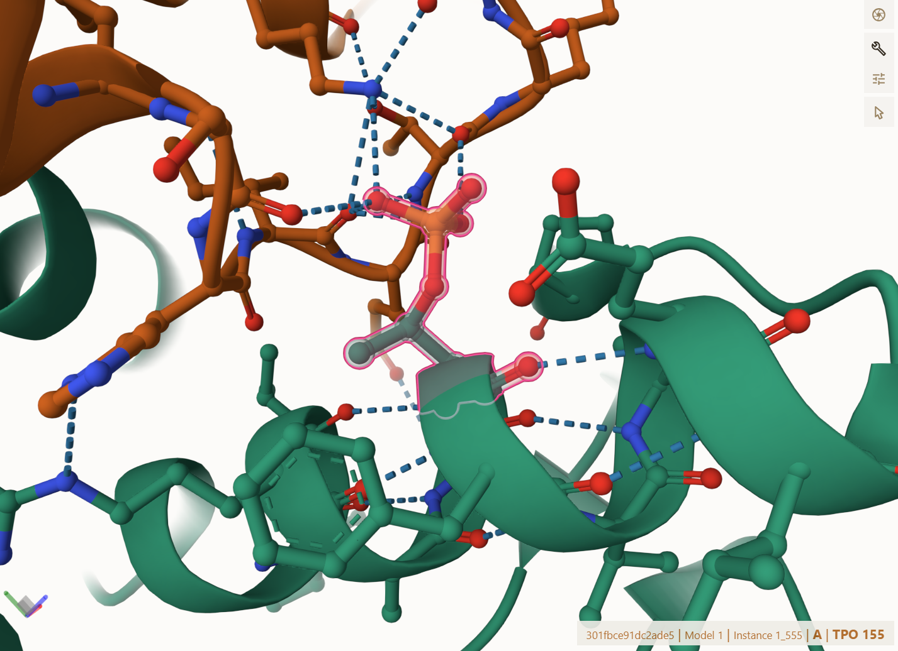
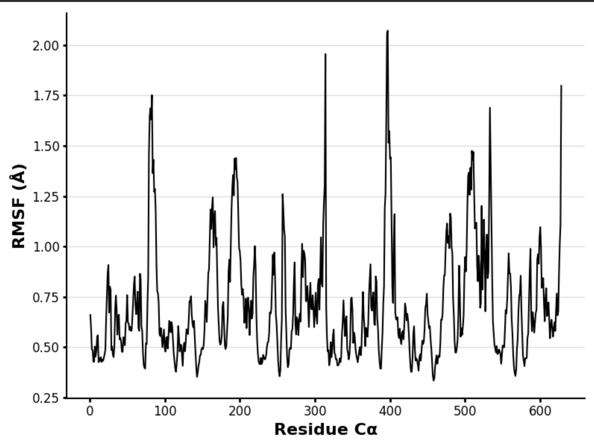
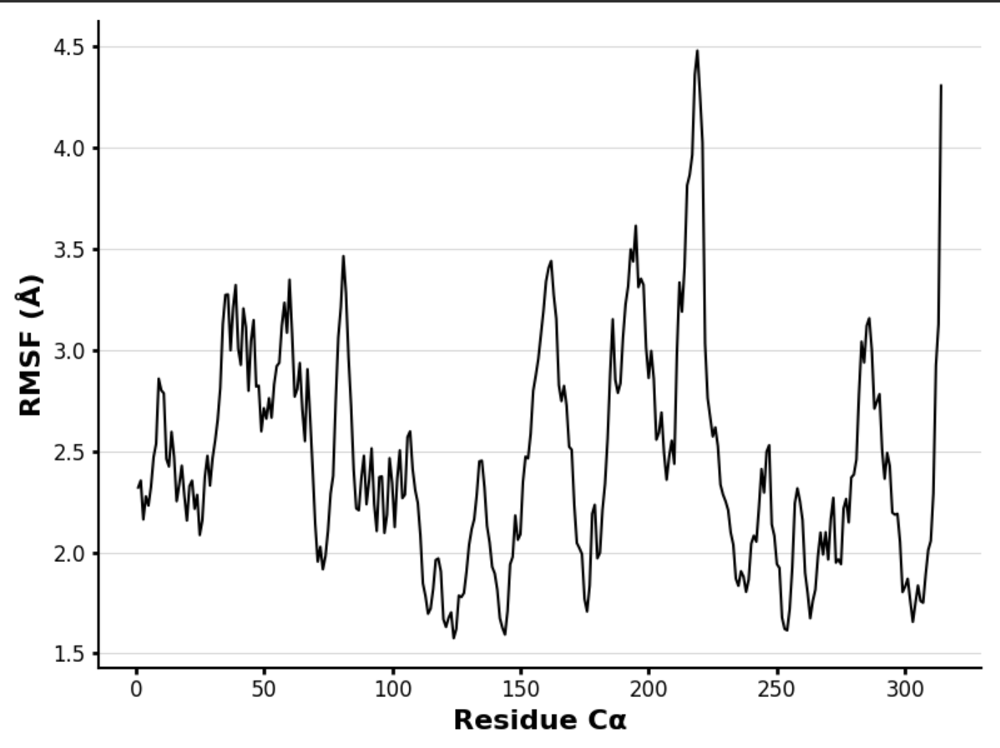
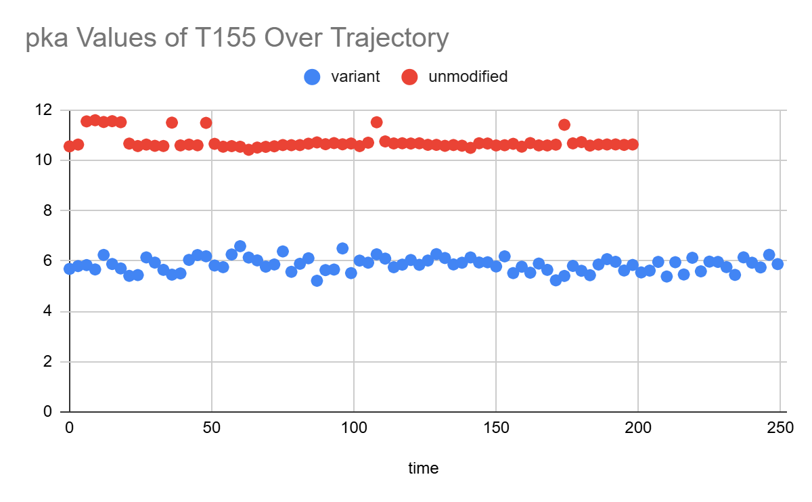

# Human MDH2

# Uniprot ID: P40926

# Variation: phosphorylation of T179 (TPO155 in structure)

## Description

Research indicates that phosphorylation of MDH2 has been described in literature, in relation to cancer metabolism and regulation.3 The specific amino acid T179 has not been explored in depth and requires more research. T179 is within an alpha helix of the unmodified protein structure of MDH2. This alpha helix is positioned near the dimer interface and active site. In the unmodified state T155 is the amino acid of interest when phosphorylated or modified, T155 becomes phosphothreonine (TPO155) but still maintaining some of the same interactions as the unmodified structure.

# Part 1 from Project 4 report outline (with citations as appropriate)

1.  image of the unmodified site 

2.  image of modification site 

## Effect of the sequence variant and PTM on MDH dynamics

Part 3 from the Project 4 report

1.  Image of aligned PDB files (no solvent)

2.  Image of the site with the aligned PDB files (no solvent)

The mimic structure exhibits lower overall RMSF values, ranging from 0.4 to 2.0 Å, with only five sharp peaks above 1.5 Å. This suggests less flexibility suggesting that the mimic structure is a more stable protein structure. In contrast, the unmodified protein fluctuates more, with RMSF values reaching 4.5 Å, indicating greater flexibility and more structural disorder.

 

The mean pKa value of aspartic acid at position 155 is 5.85, compared to 10.74 in the unmodified protein structure. A decrease in pKa value like this after changing the sequence can cause significant alterations in the protein's behavior. Possible implications include enhanced or reduced catalytic efficiency, especially if the residue is substrate binding. Additionally, such a shift may affect the protein’s stability, altering interactions, or disrupting important hydrogen bonds.9 This would explain the loss of the hydrogen bond between histidine. In the context of enzyme function, a lower pKa could make the residue more likely to donate a proton under physiological conditions, thereby modifying the mechanism or rate of catalysis.

5.  If needed, show ligand bound images and how modification affects substrate binding

Description of the data and changes

## Comparison of the mimic and the authentic PTM

Part 4 from the Project 4 report outline include images as needed

### Colab notebook links

Provide file names of completed colab notebooks

## Authors

Sara Stayton

## Deposition Date

## License

Shield: 

This work is licensed under a [Creative Commons Attribution-NonCommercial 4.0 International License](https://creativecommons.org/licenses/by-nc/4.0/).

## References

-   Citation1 

-   Citation2 
