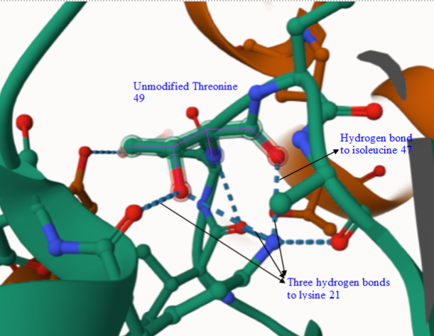
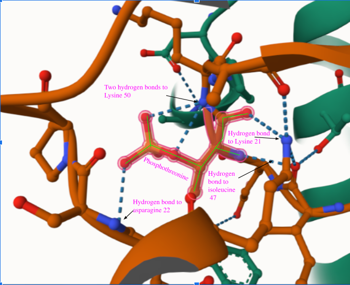
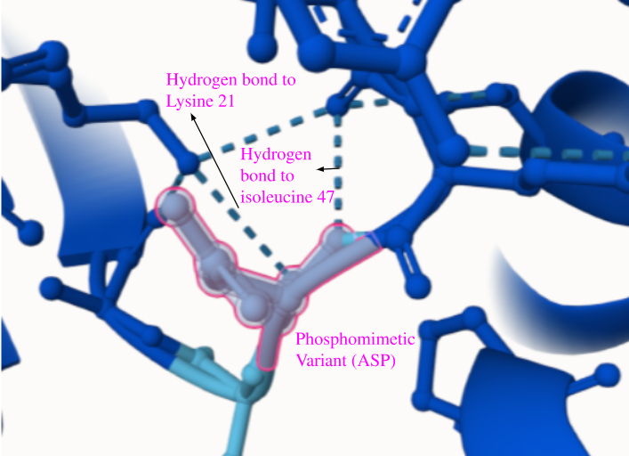
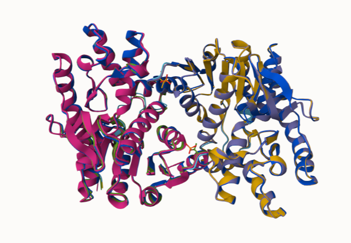
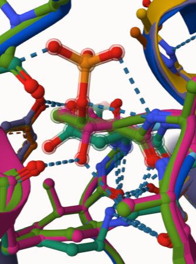

# Human mitochondrial malate dehydrogenase

# Uniprot ID: P40926

# Variation: phosphorylation of T73 (T49 in structure)

## Description

# Threonine 73 of human MDH2 (P40926) has been identified as a phosphorylation site in proteomics studies, but no functional characterization of this modification has been published (1). The site was not discussed in previous structural or enzymatic analyses of MDH2, and its biological significance remains unknown. This threonine residue corresponds to position 49 in the mature, processed enzyme and is located on a loop at the dimer interface. There are currently no reports linking phosphorylation at this site to changes in malate dehydrogenase function, redox balance, or disease.

1.  image of the unmodified site 

2.  image of modification site 

3.  image of variant site 

## Effect of the sequence variant and PTM on MDH dynamics

Part 3 from the Project 4 report

1.  Image of aligned PDB files (no solvent) 

2.  Image of the site with the aligned PDB files (no solvent) 

3.  Annotated RMSF plot showing differences between the simulations ![Following simulation, residue-level flexibility was assessed using RMSF analysis. The plot compares the unmodified MDH2 model (blue) to the phosphomimetic variant (red). Increased fluctuations are observed in the variant around residue 49—the site of the substitution—indicating greater mobility at the dimer interface. Additional differences are seen near residues 300 and 400, regions corresponding to loop segments that may be sensitive to conformational shifts. These changes suggest that introducing a negative charge at the interface alters the dynamic behavior of regions distant from the modification.](images/rmsfplot.png)

4.  Annotated plots of pKa for the key amino acids 

## Contributors names
Olivia Gorra

## 05/07/2025

## License

Shield: 

This work is licensed under a [Creative Commons Attribution-NonCommercial 4.0 International License](https://creativecommons.org/licenses/by-nc/4.0/).

## References

-   (1)Haberman, A.; Peterson, C. N. Genetics of MDH in Humans. Essays in Biochemistry 2024, 68 (2), 107–119. [10.1042/EBC20230078](https://doi.org/10.1042/EBC20230078)
