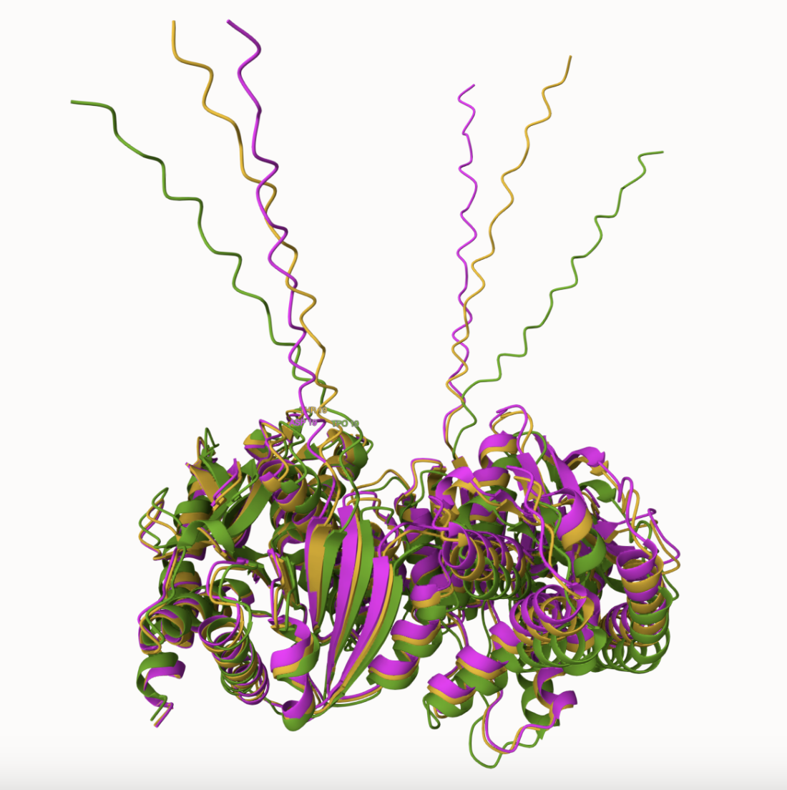
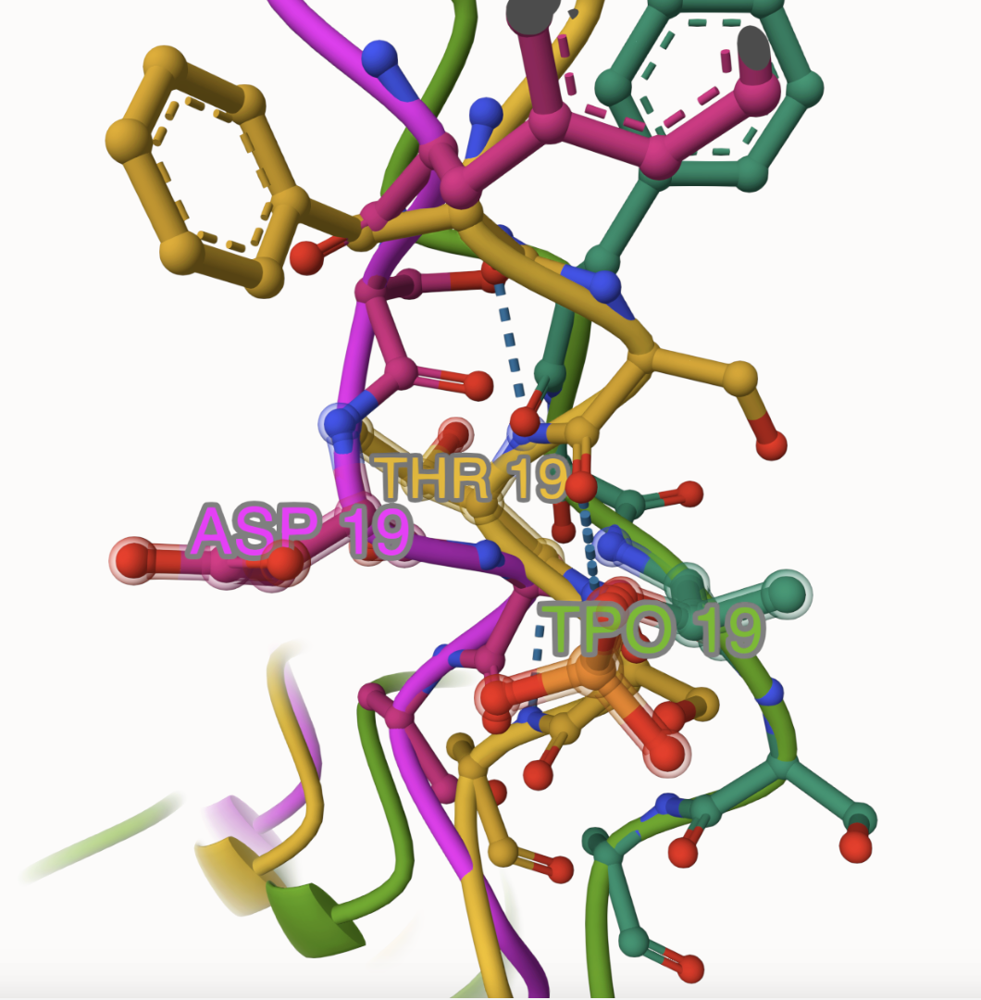
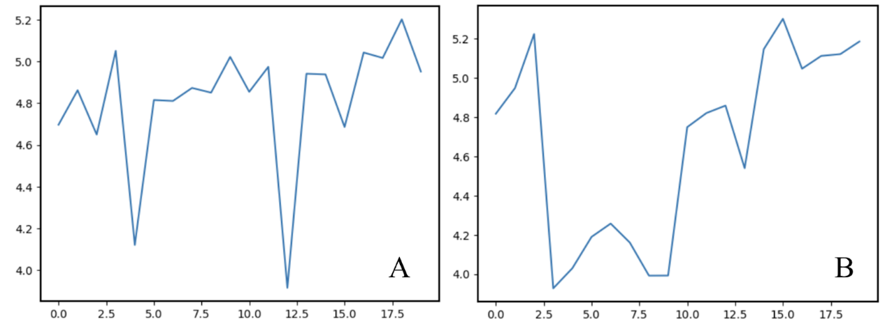
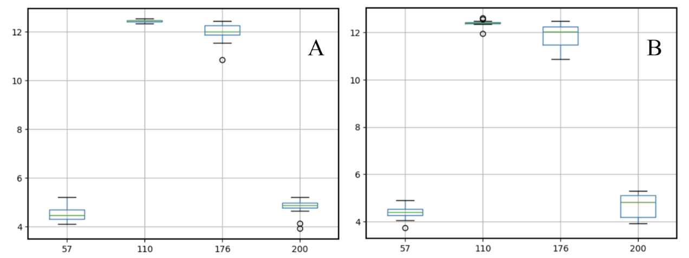
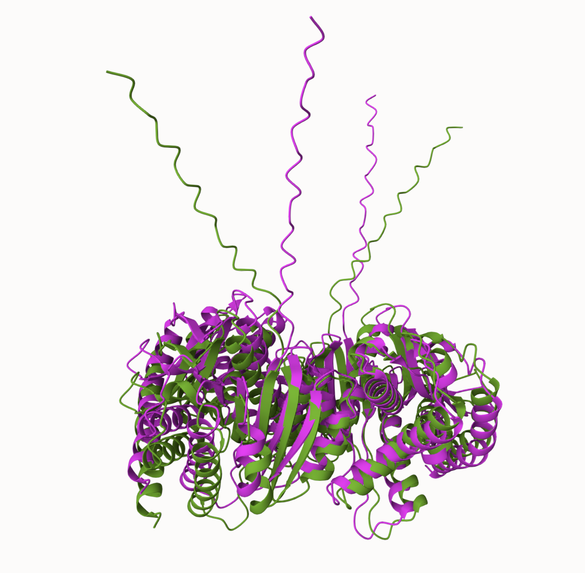
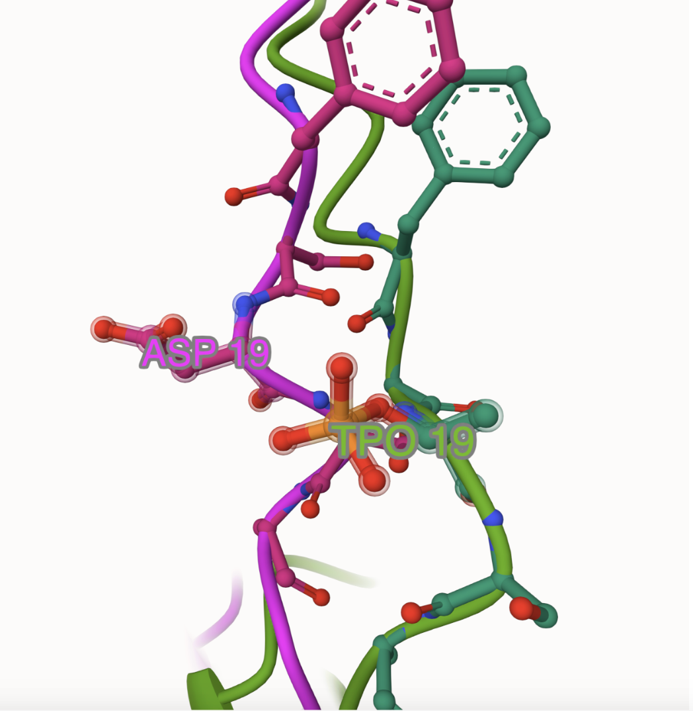
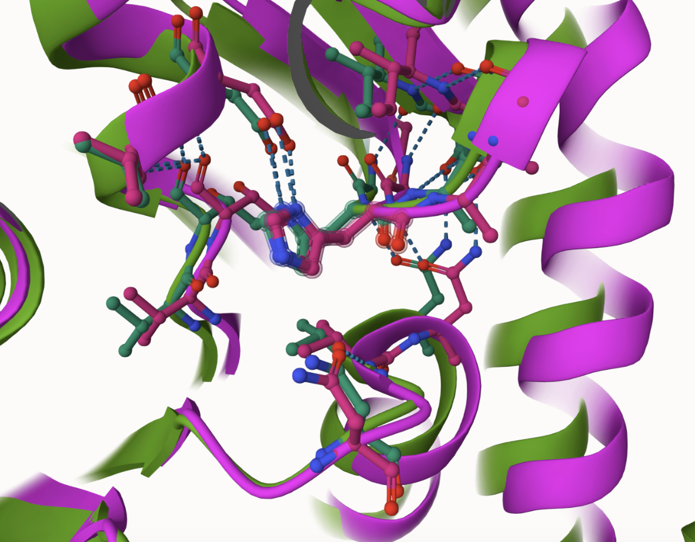
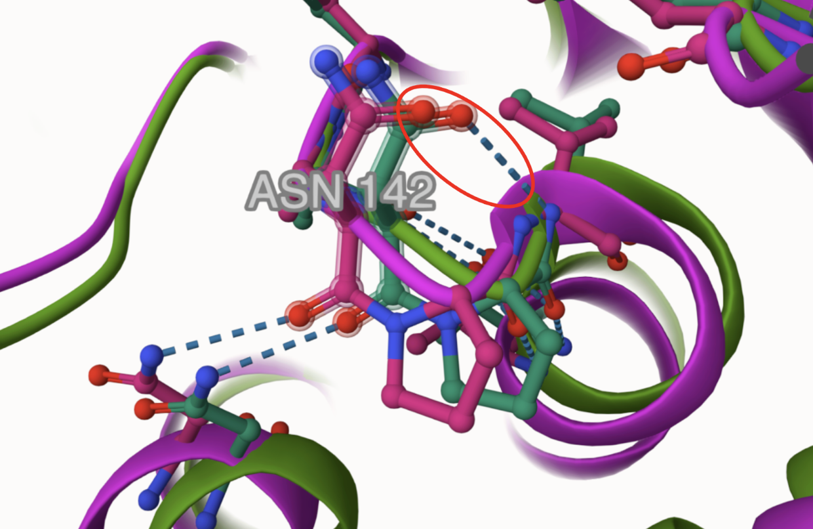

# Homo sapiens MDH2
# Uniprot ID: P40926
# Variation: Phosphorylation of T19

## Description

1. image of the unmodified site

2. image of modification site

## Effect of the sequence variant and PTM on MDH dynamics

1. Image of aligned PDB files (no solvent)

2. Image of the site with the aligned PDB files (no solvent)

3. Annotated RMSF plot showing differences between the simulations

The most significant RMSF spikes are observed in the regions encompassing amino acids 1–24 and 340–370. These fluctuations are expected, as the former corresponds to the transient peptide, which inherently exhibits increased flexibility, while the latter represents the dimer boundary, a region prone to dynamic movement due to inter-subunit interactions. However, the active site remained largely stable, indicating that structural changes were confined to non-catalytic regions. The increased pKa stability in the mimic could influence the protonation state of His200 during catalysis, potentially altering enzymatic efficiency under varying pH conditions.

4. Annotated plots of pKa for the key amino acids

Electrostatic changes were also evident in the mimic variant, particularly at the active site. The pKa of His200, a key catalytic residue, showed greater stability in the mimic variant, maintaining a range of 4.8 to 5 throughout the simulation. In contrast, unmodified MDH2 exhibited broader fluctuations, with pKa values dropping as low as 4.

A similar stabilization pattern was observed for Arg176, with a narrower pKa range in the mimic compared to the unmodified enzyme. 

## Comparison of the mimic and the authentic PTM

Asn142 is involved in stabilizing NAD+ binding, and the absence of this interaction in the mimic could weaken substrate stabilization, potentially reducing catalytic efficiency.

## Authors

Abby G. Kepley

## Deposition Date

12/6/2024

## License

Shield: [![CC BY-NC 4.0][cc-by-nc-shield]][cc-by-nc]

This work is licensed under a
[Creative Commons Attribution-NonCommercial 4.0 International License][cc-by-nc].

[![CC BY-NC 4.0][cc-by-nc-image]][cc-by-nc]

[cc-by-nc]: https://creativecommons.org/licenses/by-nc/4.0/
[cc-by-nc-image]: https://licensebuttons.net/l/by-nc/4.0/88x31.png
[cc-by-nc-shield]: https://img.shields.io/badge/License-CC%20BY--NC%204.0-lightgrey.svg

## References

* Acuner Ozbabacan, S. E.; Engin, H. B.; Gursoy, A.; Keskin, O. Transient Protein-Protein Interactions. Protein Engineering Design and Selection 2011, 24 (9), 635–648. 

* Lasham, J.; Djurabekova, A.; Zickermann, V.; Vonck, J.; Sharma, V. Role of Protonation States in the Stability of Molecular Dynamics Simulations of High-Resolution Membrane Protein Structures. J. Phys. Chem. B 2024, 128 (10), 2304–2316. 
