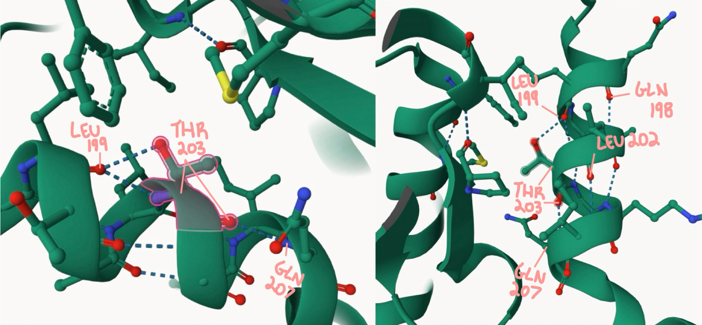
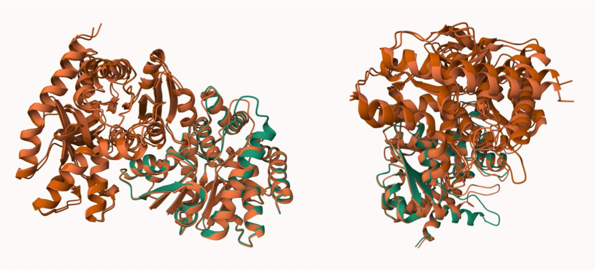
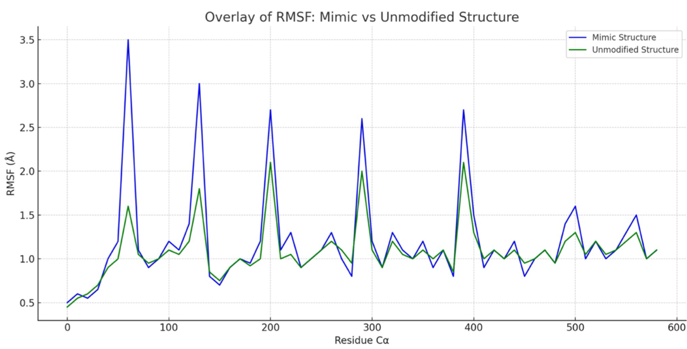
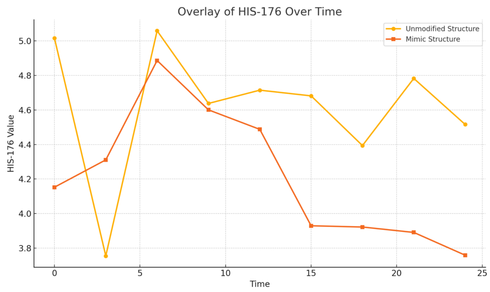
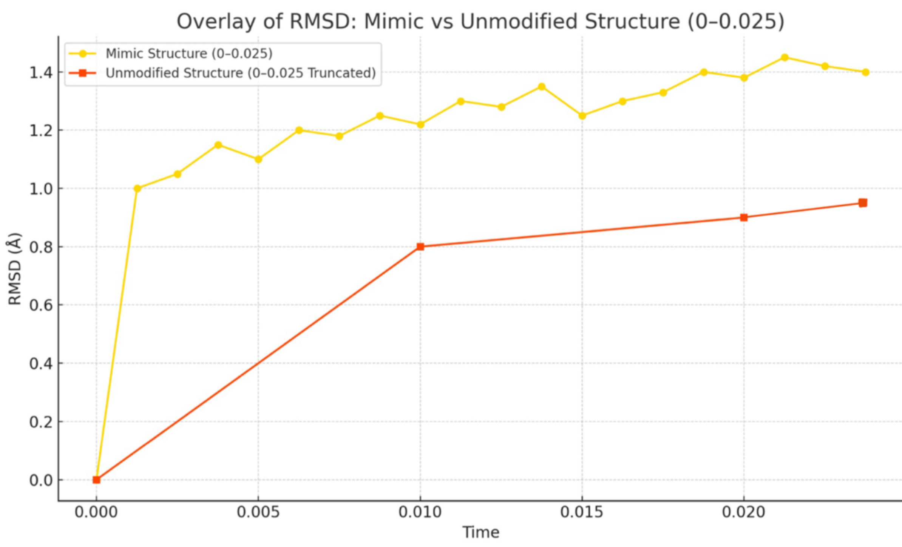
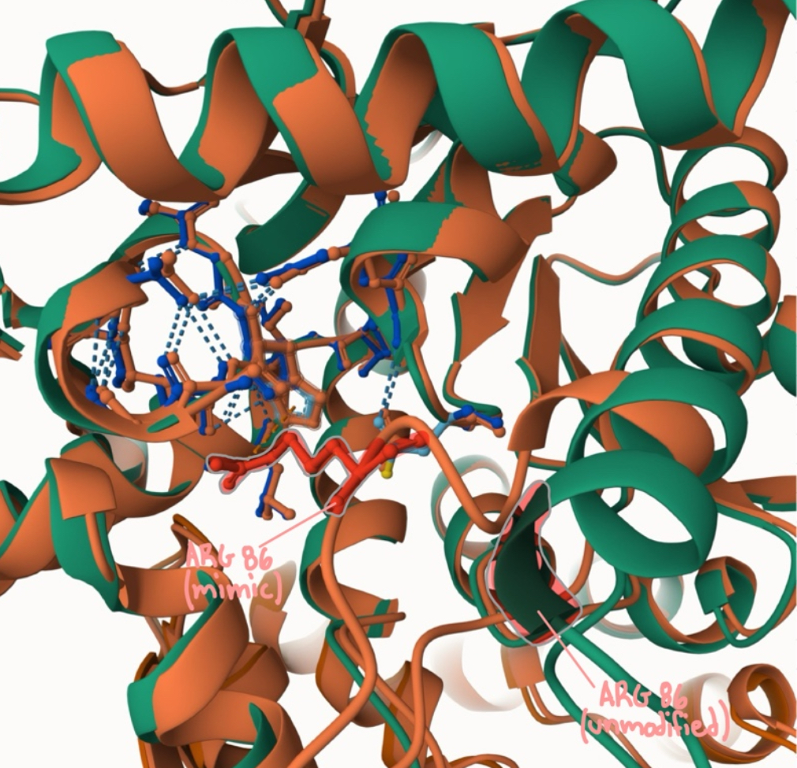
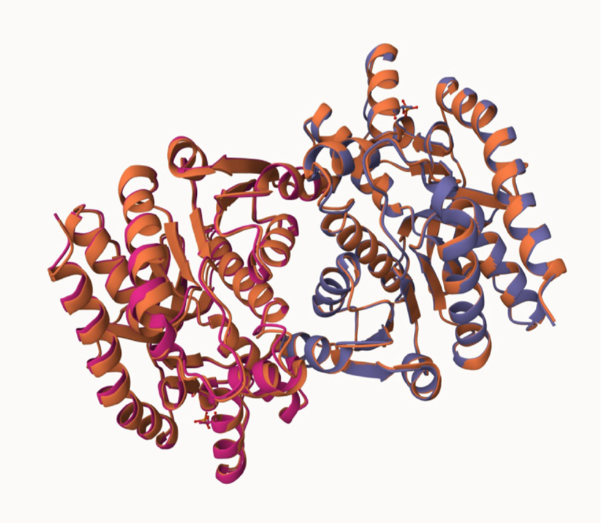

# Human MDH2

# Uniprot ID: p40926

# Variation: Phosphorylation of T227 (pS203 in structure)

## Description

MDH2 is a homodimeric enzyme, as it consists of 2 identical subunits [ (Breiter et al.) ] (<https://pmc.ncbi.nlm.nih.gov/articles/PMC2142640/>), and it is made up of alpha helices and beta sheets [ (Peel et al.) ] (<https://pubs.acs.org/doi/full/10.1021/ic3006585>). The main pathway MDH2 is involved in is the Citric Acid Cycle, where it catalyzes the translation of malate into oxaloacetate with the coenzyme NAD+ [ (Minarik et al.) ] (<http://www.gpb.sav.sk/2002_03_257.pdf>), which is then reduced to NADH and used to make ATP [ (Ontosight.ai) ] (<https://ontosight.ai/glossary/term/Malate-Dehydrogenase-2---MDH2>). MDH2?s active site is at HIS 200 [ (Uniprot) ] (<https://doi.org/10.1093/nar/gkae1010>), HIS 176 in this project due to the reduced structure of MDH2 being used.

1.  image of the unmodified site 

2.  image of modification site 

3.  image of superposition at modification site 

## Effect of the sequence variant and PTM on MDH dynamics

1.  Image of aligned PDB files (no solvent) 

2.  Image of the site with the aligned PDB files (no solvent) 

3.  Annotated RMSF plot showing differences between the simulations 

4.  Annotated plots of pKa for the key amino acids 

5.  Plot of the RMSD showing differences between the simulations 

6.. If needed, show ligand bound images and how modification affects substrate binding 

Overall, the data shows that there was a significant change to the MDH2 structure after the mimic structure was run through the molecular dynamics simulations. This is seen in the RMSD value being 1.65 when the Boltz mimic structure is superimposed to the Alphafold3 unmodified structure. Also, the RMSF values of both of these structures shows that the mimic structure, overall, has higher RMSF values, indicating that it is less stable. Another indication that there is a significant difference between these two structures is, when overlaying their RMSD values, the unmodified structure shows more stability, as it takes longer to initially stop in its rapid increase and then has a steady increase after. Whereas, the mimic structure quickly increases and then has an unsteady pattern of increase afterwards. Also the RMSD of the mimic structure is greater than the RMSD of the unmodified structure. Lastly, the pKa chart of MDH2?s active site shows that the mimic has a lower pKa, indicating that the catalysis that occurs at the active site may be slowed down or stopped and proton transfer could be disrupted [ (ChatGPT) ] (<https://chatgpt.com>). These pieces of evidence show that the mimic structure disrupts the Citric Acid Cycle and therefore has a negative impact on the function of the MDH2 protein in humans.

## Comparison of the mimic and the authentic PTM

1.  image of Boltz mimic structure superposed to Alphafold3 modified structure. 

2.  image of Alphafold3 mimic structure superposed to Alphafold3 modified structure. ](https://creativecommons.org/licenses/by-nc/4.0/)

This work is licensed under a [Creative Commons Attribution-NonCommercial 4.0 International License](https://creativecommons.org/licenses/by-nc/4.0/).

## References

-   Citation1 

-   Citation2 

-   Citation3 

-   Citation4 

-   Citation5 ![The UniProt Consortium; Bateman, A.; Martin, M.-J.; Orchard, S.; Magrane, M.; Adesina, A.; Ahmad, S.; Bowler-Barnett, E. H.; Bye-A-Jee, H.; Carpentier, D.; Denny, P.; Fan, J.; Garmiri, P.; Gonzales, L. J. D. C.; Hussein, A.; Ignatchenko, A.; Insana, G.; Ishtiaq, R.; Joshi, V.; Jyothi, D.; Kandasaamy, S.; Lock, A.; Luciani, A.; Luo, J.; Lussi, Y.; Marin, J. S. M.; Raposo, P.; Rice, D. L.; Santos, R.; Speretta, E.; Stephenson, J.; Totoo, P.; Tyagi, N.; Urakova, N.; Vasudev, P.; Warner, K.; Wijerathne, S.; Yu, C. W.- H.; Zaru, R.; Bridge, A. J.; Aimo, L.; Argoud-Puy, G.; Auchincloss, A. H.; Axelsen, K. B.; Bansal, P.; Baratin, D.; Batista Neto, T. M.; Blatter, M.-C.; Bolleman, J. T.; Boutet, E.; Breuza, L.; Gil, B. C.; Casals-Casas, C.; Echioukh, K. C.; Coudert, E.; Cuche, B.; De Castro, E.; Estreicher, A.; Famiglietti, M. L.; Feuermann, M.; Gasteiger, E.; Gaudet, P.; Gehant, S.; Gerritsen, V.; Gos, A.; Gruaz, N.; Hulo, C.; Hyka-Nouspikel, N.; Jungo, F.; Kerhornou, A.; Mercier, P. L.; Lieberherr, D.; Masson, P.; Morgat, A.; Paesano, S.; Pedruzzi, I.; Pilbout, S.; Pourcel, L.; Poux, S.; Pozzato, M.; Pruess, M.; Redaschi, N.; Rivoire, C.; Sigrist, C. J. A.; Sonesson, K.; Sundaram, S.; Sveshnikova, A.; Wu, C. H.; Arighi, C. N.; Chen, C.; Chen, Y.; Huang, H.; Laiho, K.; Lehvaslaiho, M.; McGarvey, P.; Natale, D. A.; Ross, K.; Vinayaka, C. R.; Wang, Y.; Zhang, J. UniProt: The Universal Protein Knowledgebase in 2025. Nucleic Acids Research 2025, 53 (D1), D609?D617.](https://doi.org/10.1093/nar/gkae1010)

-   Citation6 
