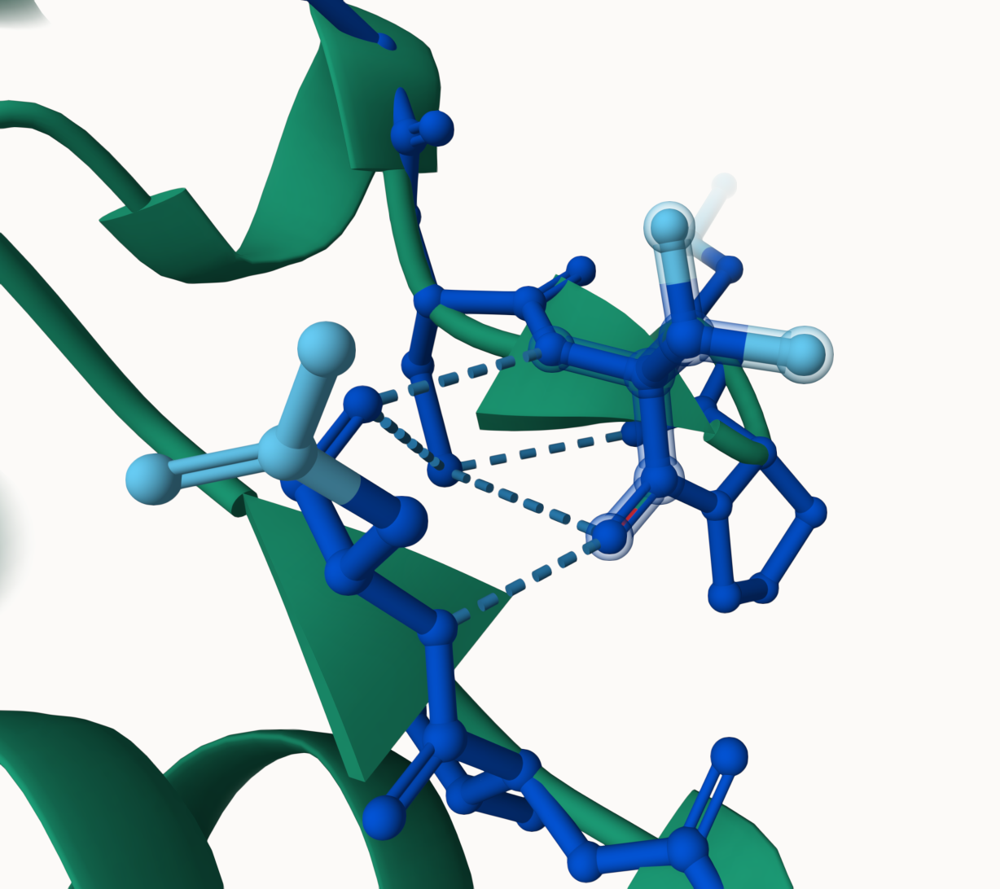
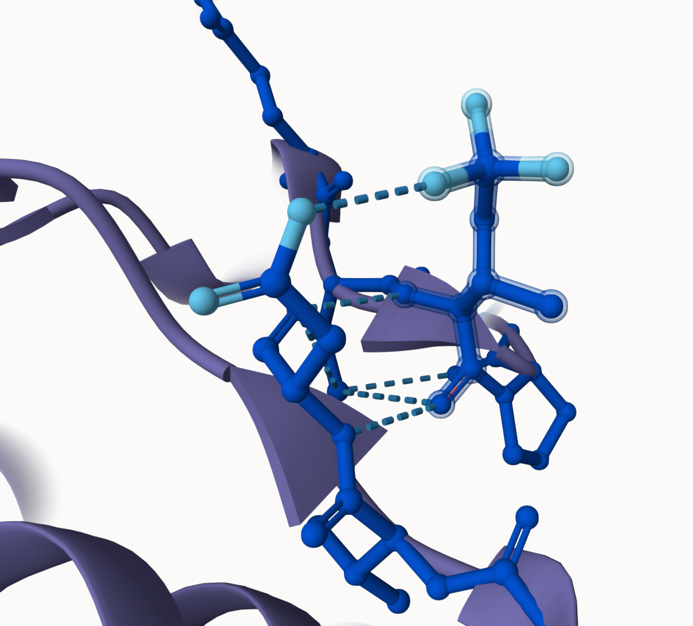
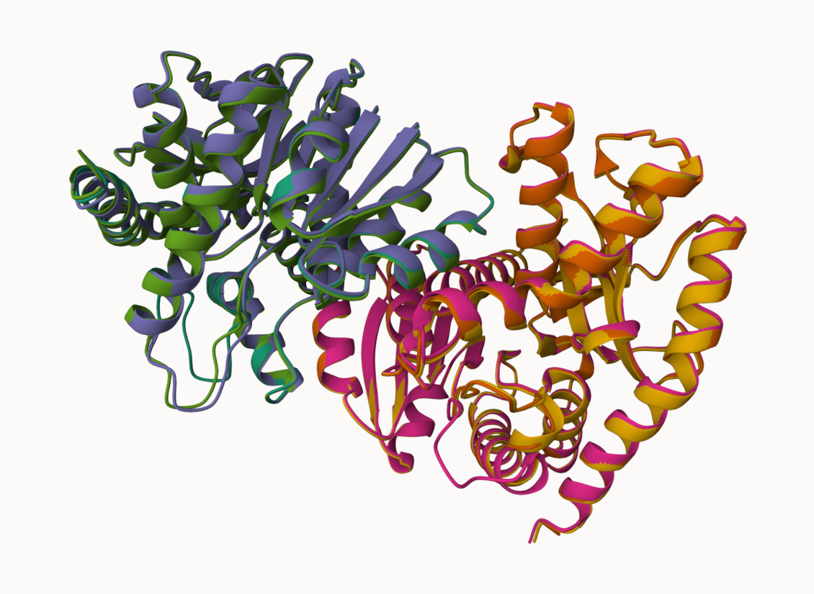
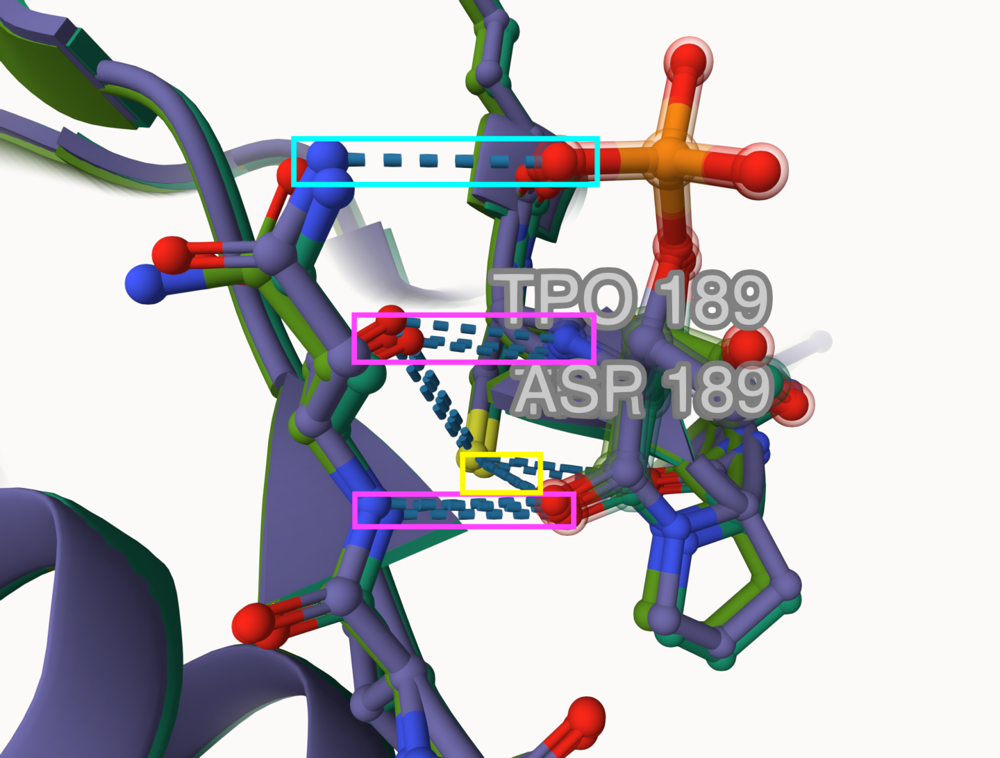
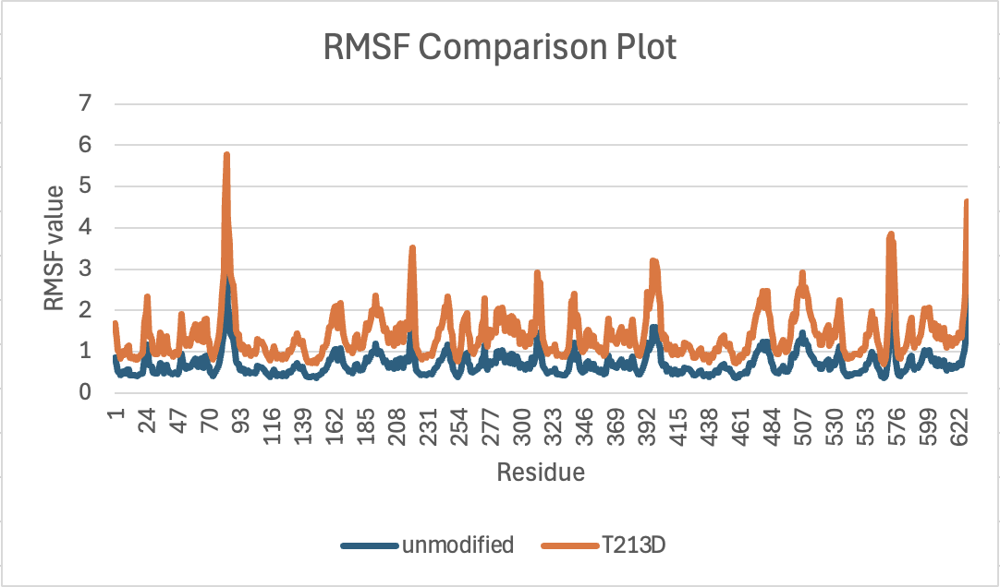
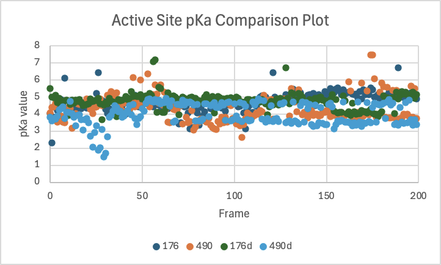
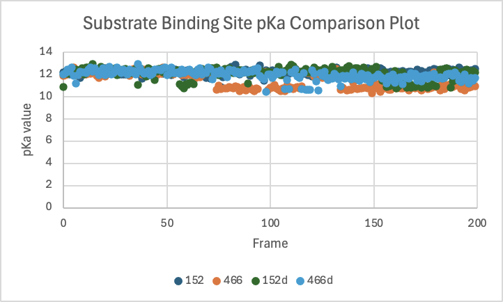
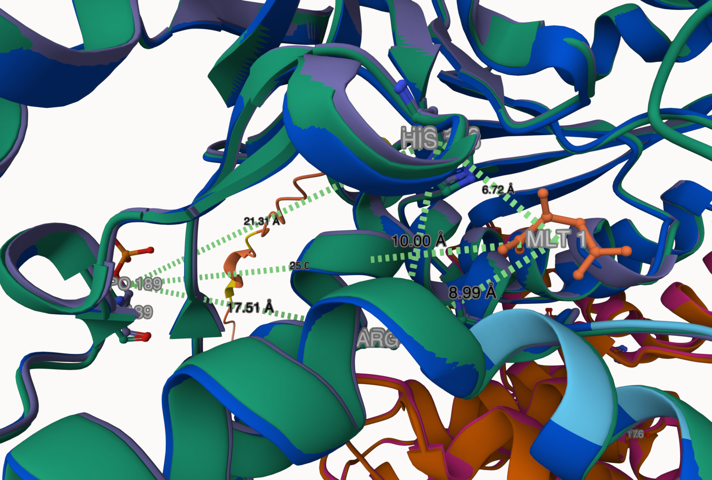
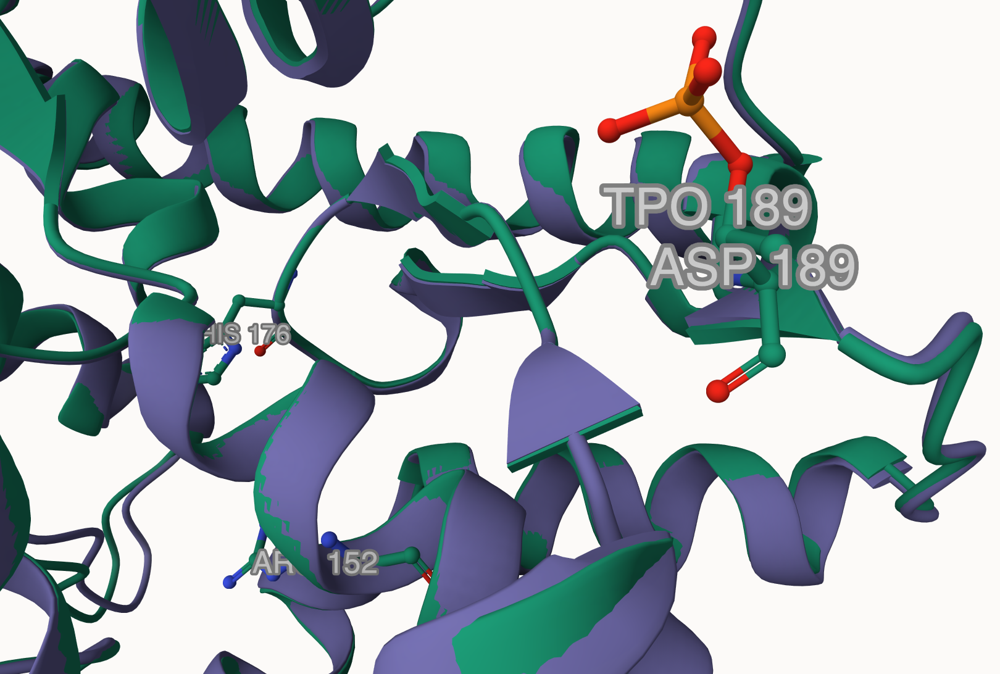
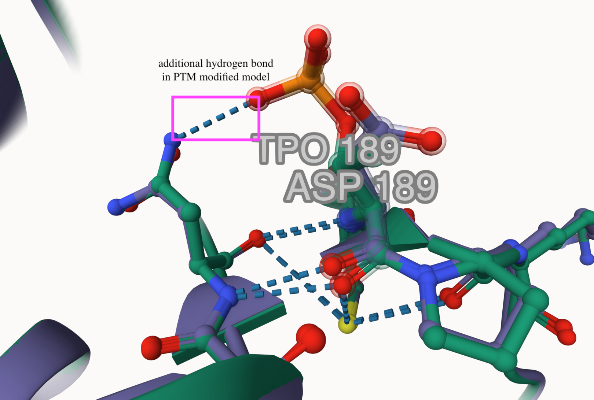

# Human Malate Dehydrogenase 2
# Uniprot ID: P40926
# Variation: phosphorylation of T213 (pT189 in structure)

## Description

The phosphorylation of threonine 213 in Malate Dehydrogenase 2 (MDH2) is still being actively researched, so there are not yet publications in literature regarding its effect on the structure and function of MDH2. *Entry started 12/06/2024 EFG*

# Comparison of MDH2 models and phospho modified MDH2

1. image of the unmodified site

2. image of modification site

The modification site has one more hydrogen bond than the unmodified site.

## Effect of the sequence variant and PTM on MDH dynamics

Alignment of MDH2 (teal/orange), MDH2 with phospoT 213 (purple/magenta), and T213D (green/yellow)

No major differences are observed after aligning the unmodified, PTM modified, and mimic variant models of MDH2.

Modification site alignment within MDH2 (teal), MDH 2 with phosphoT 213 (purple), and T213D (green)

All three models have two hydrogen bonds between themselves and asparagine 169, as well as one hydrogen bond between themselves and cysteine 188. In comparing all three models, the one exception found is the addition of one hydrogen bond between the PTM modified model and asparagine 169; the phospho-threonine at residue 189 of the PTM modified model contains additional oxygen atoms which are able to hydrogen bond with the nitrogen atom found at the end of asparagine 169.

The plot comparing the RMSF values of the unmodified and the mimic variant models reveals a similar pattern between the two models. The mimic variant has RMSF values that are consistently slightly higher than those of the unmodified model. The spike located around residue 300 reflects where the two proteins of the homodimer bind together. The mimic variant presents additional peaks at approximately residues 90, 210, 400, 575, and 620. These peaks signify sections of the mimic variant that have a lot more motion than the rest of the protein. Upon further research, two of these flexible regions, residues ~90 and ~210, are located in coils nearby the active site in monomer A of the dimer, signifying the potential for conformational changes.

Overall the modification did not affect the pKa values of either the active site, histidine, or the substrate binding site, arginine. There are only minor differences in the spread of the data over the simulation which may be due to equilibration.

Modification at residue 189 does not clearly affect the amino acids involved in substrate binding or around the active site due to the sheer distance between them. Histidine 176, the active site which acts as a proton acceptor, is only 6.72Å from (S)-malate, the substrate from which it accepts a proton. Arginine 152, the substrate binding site, holds (S)-malate in place from 8.99Å away. Both of these distances are minimal in comparison to the distance between the modification site and the substrate, which is 25.05Å. Without a change in the function, the broader metabolic pathway that MDH2 participates in should not be affected.

## Comparison of the mimic and the authentic PTM

The modification site is in the same location relative to the active site and substrate binding site. With the modification sites being distant from both the active site and the substrate binding site, they likely do not play a role in the chemistry and overall function of the proteins. 

The weak interactions of the modification site are rather similar as well, with the only difference being the addition of one hydrogen bond in the PTM modified model. This added weak interaction will make the PTM modified model more stable than the mimic variant model, which may have an effect on the protein’s overall function; the more stable a protein is, the less likely it is to unfold and lose its function. As for the residues themselves, aspartic acid and phospho-threonine have the same characteristics; both are polar, negatively charged, and hydrophilic. Considering these factors, this mimic variant is generally a good approximation of the PTM modification; the residues will behave in a similar fashion, with minimal differences in the function of the proteins due to only having one variation in weak interactions.

## Authors

Erin F. Garvert

## Deposition Date
12/06/2024

## License

Shield: [![CC BY-NC 4.0][cc-by-nc-shield]][cc-by-nc]

This work is licensed under a
[Creative Commons Attribution-NonCommercial 4.0 International License][cc-by-nc].

[![CC BY-NC 4.0][cc-by-nc-image]][cc-by-nc]

[cc-by-nc]: https://creativecommons.org/licenses/by-nc/4.0/
[cc-by-nc-image]: https://licensebuttons.net/l/by-nc/4.0/88x31.png
[cc-by-nc-shield]: https://img.shields.io/badge/License-CC%20BY--NC%204.0-lightgrey.svg

## References

* [10.1002](https://doi.org/10.1002/9780470015902.a0003011.pub2)

* [10.1016](10.1016/j.bpj.2013.12.022)
