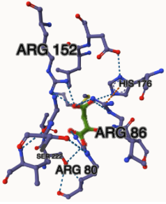
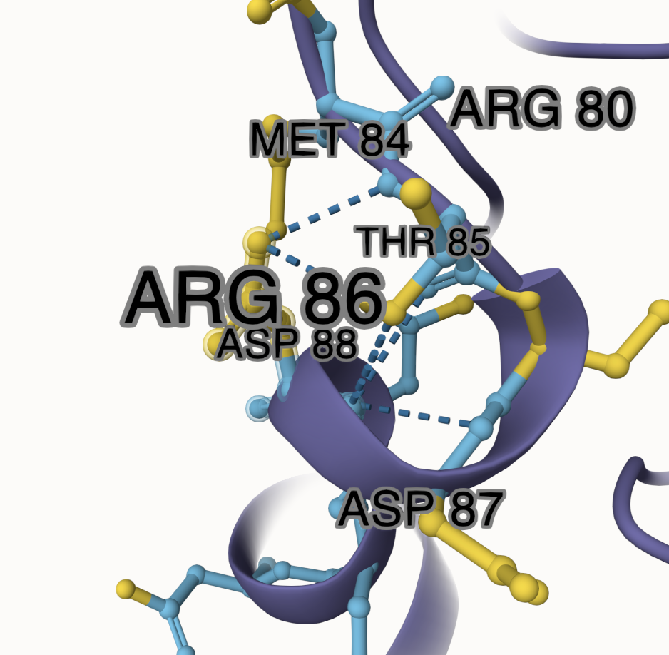
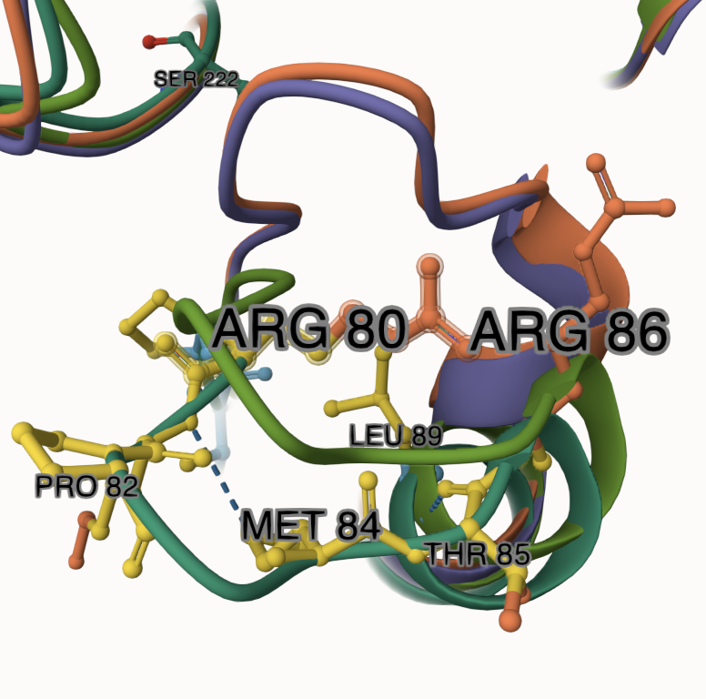

# human mitochondrial malate dehydrogenase 2

# P40926

# IPLISQCTPKVDFPQ

## Description

# Part 1 from Project 4 report outline (with citations as appropriate)

1.  image of the unmodified site 

2.  image of modification site 

## Effect of the sequence variant and PTM on MDH dynamics

Part 3 from the Project 4 report

1.  Image of aligned PDB files (no solvent) ![Superposition of four MDH2 structures highlighting global and local structural differences. Structures include the unmodified (control), AF3 mimic, AF3 modified, and Boltzmann-weighted mimic variants. The alignment was performed using Mol\*, yielding a root mean square fluctuation (RMSF) of 1.54 Å. The conserved core architecture reflects general structural stability, while localized differences, particularly in loop regions and the C-terminal extension, suggest changes in flexibility and potential electrochemical remodeling near the active site.](images/superposition.png)

2.  Image of the site with the aligned PDB files (no solvent) 

3.  Annotated RMSF plot showing differences between the simulations    

4.  Annotated plots of pKa for the key amino acids    

5.  If needed, show ligand bound images and how modification affects substrate binding

Description of the data and changes This dataset includes structural and simulation data comparing unmodified human mitochondrial MDH2 with two modified forms at residue T213: a phosphomimetic variant (T213D) and a model containing an authentic phosphorylation (pT213). Structural models were generated using AlphaFold3 (for unmodified and PTM) and Boltz-1 (for the mimic), then subjected to molecular dynamics simulations via MD Colab. Analyses include RMSD, RMSF, and pKa trajectories to assess changes in flexibility, stability, and electrostatic properties. Key structural differences were identified in the loop containing T213, including altered hydrogen bonding networks, reduced backbone flexibility in the modified variant, and rearranged side chains at the active site. The authentic PTM introduced stronger ionic interactions and greater electrostatic shifts than the mimic, particularly around Arg-80, Arg-86, and Ser-222. Additionally, pKa analysis of His-176 revealed greater variability in the modified structure, indicating potential disruption of catalytic function. These changes were visualized through aligned structure overlays and plotted outputs, providing evidence that while the T213D mimic captures some charge-based effects, it does not fully replicate the spatial or electrochemical impact of true phosphorylation. This analysis also considers how these modifications may affect MDH2’s role in the citric acid cycle.

## Comparison of the mimic and the authentic PTM

Part 4 from the Project 4 report outline include images as needed

![Active site of hMDH2 phosphomimic (T213D) model. Close-up view of the active site from the Boltz-modeled phosphomimetic MDH2 variant, where threonine 213 is substituted with aspartate (D213). Neighboring residues, including LYS217, VAL214, and GLY212, are visualized to assess side chain orientation and potential hydrogen bonding. Dotted lines represent predicted non-covalent interactions. The local environment shows moderate disruption, indicating partial mimicry of the authentic phosphorylated residue.](images/mimic_ptm.png) 

## Authors

Skylar Floyd

## 5/7/25

## License

Shield: 

This work is licensed under a [Creative Commons Attribution-NonCommercial 4.0 International License](https://creativecommons.org/licenses/by-nc/4.0/).

## References

-   Citation1 

-   Citation2 

-   Citation3 

-   Citation4 

-   Citation5 

-   Citation6 

-   Citation7 

-   Citation8 
