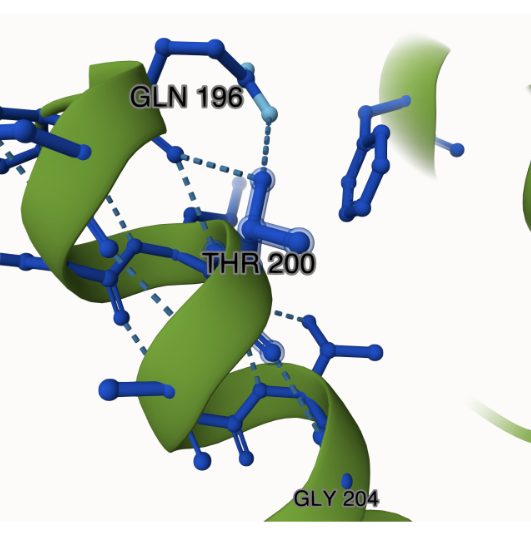
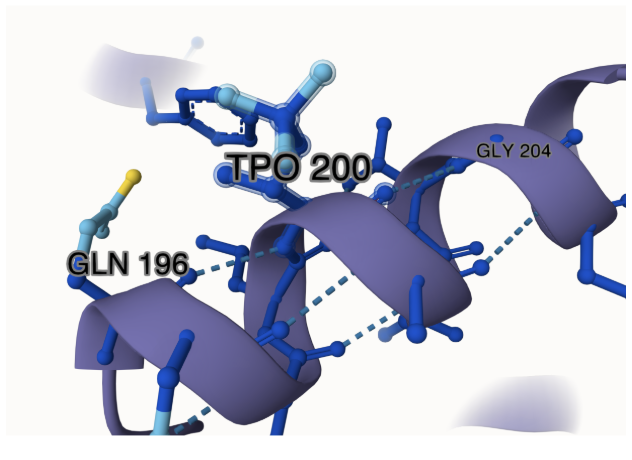
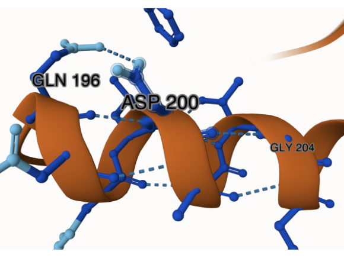
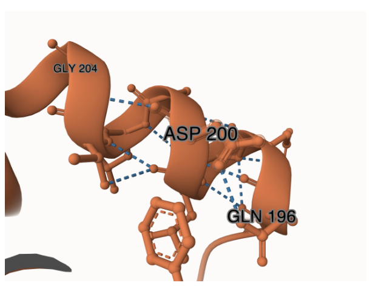
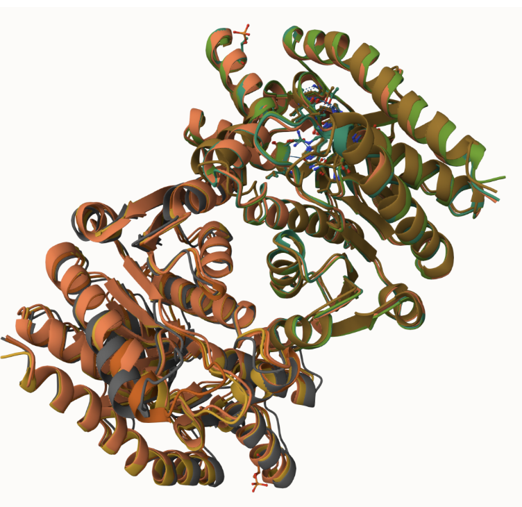
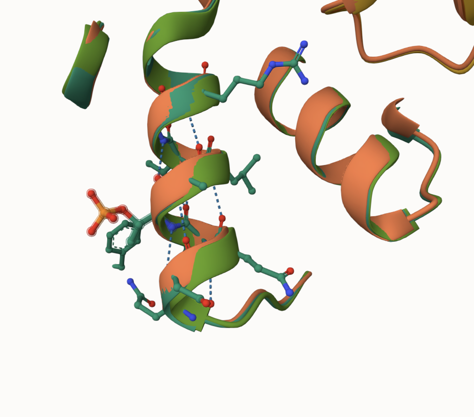
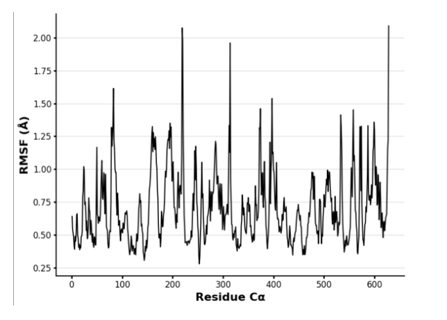
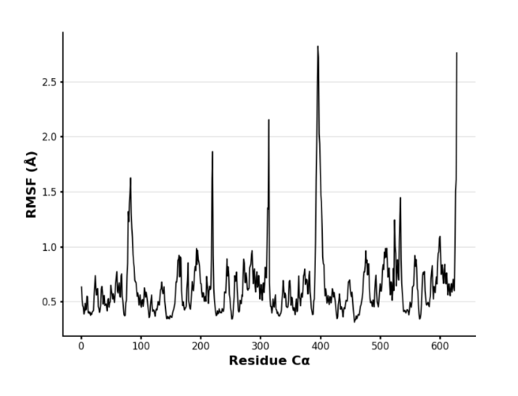
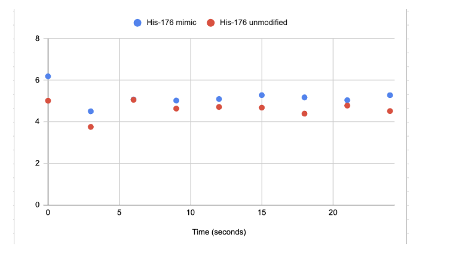

# human MDH2

# Uniprot ID: p40926

# Variation: T224D

## Description

The variant was assigned as T224D. The threonine (T) in the sequence was
first assigned a post-translational modification (PTM) to be
phosphorylated and assigned as the modified variant. The processing
sequence was then entered again, and the threonine was changed to an
aspartic acid (D) and assigned as the mimic variant. The residue of
interest in the processing sequence via UniProt was at residue 200.

1.  image of the unmodified site
     Mol\* analysis of
    residue interactions surrounding the unmodified model in
    MDH2.Thr-200 forms hydrogen bond interactions with Gln-196 and
    Gly-204.

2.  image of modification site 
    Mol\* analysis of residue interactions surrounding phosphorylated
    Thr-200 (TPO-200) in MDH2. The MDH2 structure with a phosphorylated
    Thr-200 was modeled using AlphaFold3 and analyzed in Mol\* to
    explore surrounding interactions.TPO-200 hydrogen bonds with Gln-196
    and Gly-204.

3.  image of modification site
     Mol\* analysis of
    residue interactions surrounding Asp-200 in the AlphaFold3 predicted
    mimic in MDH2. Asp-200 forms hydrogen bonds with residues Gln-196
    and Gly-204.

4.  image of modification site
     Mol\* analysis of
    residue interactions surrounding the Asp-200 (mimic) in MDH2
    generated by Boltz. Asp-200 forms hydrogen bonds with residues
    Gln-196 and Gly-204.

## Effect of the sequence variant and PTM on MDH dynamics

1.  Image of aligned PDB files (no solvent)
     All four MDH2 models: Unmodified
    (Thr-200), PTM (TPO-200), AlphaFold3 mimic (Asp-200), and Boltz
    mimic (Asp-200) are superposed in Mol\*.

2.  Image of the site with the aligned PDB files (no solvent)
     Modification site alignment within
    MDH2. The modification site is at amino acid 200.

3.  Annotated RMSF plot showing differences between the simulations
     Root Mean Square Fluctuation (RMSF)
    plot of the MDH2 mimic variant generated from MD simulations.The
    x-axis represents residue positions in the protein sequence, while
    the y-axis shows how much specific residues are moved during the
    simulation, measured in (Å). Higher values indicate greater
    flexibility in that region of the protein. While lower values
    represent stable and rigid regions.

4.  Annotated RMSF plot showing differences between the simulations
     RMSF plot for the AlphaFold3 MDH2
    dimer (unmodified) based on MD simulations. The x-axis represents
    residue positions in the protein sequence, while the y-axis shows
    how much specific residues are moved during the simulation, measured
    in (Å). Peaks in the graph showed flexibility, whereas lower values
    indicated rigid areas of the protein.

5.  Annotated plots of pKa for the key amino acids
     pKa values of His-176
    over time in the mimic and unmodified MDH2 models. This plot
    compares the predicted pKa values across the MD simulation for both
    the mimic model (blue) and the unmodified model (red).

## Comparison of the mimic and the authentic PTM

The absence of significant structural differences among the mimic and
PTM forms of MDH2 suggests that replacing Thr with Asp at position 200
closely mimics the phosphorylated state at residue 200. The increased
flexibility in the mimic, specifically at His-176, could disrupt the
positioning of essential side chains or backbone atoms. Although the
mimic shows some changes, its chemical differences from a phosphorylated
threonine mean that the same effects cannot be assumed that the PTM
would produce the same effect. The lack of pKa shift also does not
support the idea that the modified active site is chemically disrupted.
The findings suggest that phosphorylation at this site may not influence
MDH2 function by changing its structure.

### Colab notebook links

Provide file names of completed colab notebooks
Copy_of_MDanalysis_Step2.ipynb

## Authors

Caroline Passy

## Deposition Date

5/7/2025

## License

Shield: 

This work is licensed under a [Creative Commons
Attribution-NonCommercial 4.0 International
License](https://creativecommons.org/licenses/by-nc/4.0/).

## References

-   Citation1 [Wolyniak, M. J.; Frazier, R. H.; Gemborys, P. K.;
    Loehr, H. E. Malate Dehydrogenase: A Story of Diverse Evolutionary
    Radiation. Essays in Biochemistry 2024, 68 (2),
    213–220.](https://doi.org/10.1042/EBC20230076)

-   Citation2 [Peterson, C. N.; Cornely, K.; Parente, A. D.;
    Springer, A. L.; Provost, J. J. Uncovering Malate Dehydrogenase:
    Structure, Function and Role in Disease. Essays in Biochemistry
    2024, 68 (2), 53–55.](https://doi.org/10.1042/EBC20240044)

-   Citation3 [Takahashi-Íñiguez, T.; Aburto-Rodríguez, N.;
    Vilchis-González, A. L.; Flores, M. E. Function, Kinetic Properties,
    Crystallization, and Regulation of Microbial Malate
    Dehydrogenase. J. Zhejiang Univ. Sci. B 2016, 17 (4),
    247–261.](https://doi.org/10.1631/jzus.B1500219)

-   Citation4 [Minárik, P.; Tomásková, N.; Kollárová, M.; Antalík, M.
    Malate Dehydrogenases--Structure and Function. Gen Physiol Biophys
    2002, 21 (3), 257–265.]()

-   Citation5 [Ait-El-Mkadem, S.; Dayem-Quere, M.; Gusic, M.;
    Chaussenot, A.; Bannwarth, S.; François, B.; Genin, E. C.; Fragaki,
    K.; Volker-Touw, C. L. M.; Vasnier, C.; Serre, V.; Van Gassen, K. L.
    I.; Lespinasse, F.; Richter, S.; Eisenhofer, G.; Rouzier, C.;
    Mochel, F.; De Saint-Martin, A.; Abi Warde, M.-T.; De Sain-van Der
    Velde, M. G. M.; Jans, J. J. M.; Amiel, J.; Avsec, Z.; Mertes, C.;
    Haack, T. B.; Strom, T.; Meitinger, T.; Bonnen, P. E.; Taylor, R.
    W.; Gagneur, J.; Van Hasselt, P. M.; Rötig, A.; Delahodde, A.;
    Prokisch, H.; Fuchs, S. A.; Paquis-Flucklinger, V. Mutations in
    MDH2, Encoding a Krebs Cycle Enzyme, Cause Early-Onset Severe
    Encephalopathy. The American Journal of Human Genetics 2017, 100
    (1), 151–159.](https://doi.org/10.1016/j.ajhg.2016.11.014)

-   Citation6 [Haberman, A.; Peterson, C. N. Genetics of MDH in Humans.
    Essays in Biochemistry 2024, 68 (2),
    107–119.](https://doi.org/10.1042/EBC20230078)

-   Citation7 [Abramson, J.; Adler, J.; Dunger, J.; Evans, R.; Green,
    T.; Pritzel, A.; Ronneberger, O.; Willmore, L.; Ballard, A. J.;
    Bambrick, J.; Bodenstein, S. W.; Evans, D. A.; Hung, C.-C.; O’Neill,
    M.; Reiman, D.; Tunyasuvunakool, K.; Wu, Z.; Žemgulytė, A.;
    Arvaniti, E.; Beattie, C.; Bertolli, O.; Bridgland, A.; Cherepanov,
    A.; Congreve, M.; Cowen-Rivers, A. I.; Cowie, A.; Figurnov, M.;
    Fuchs, F. B.; Gladman, H.; Jain, R.; Khan, Y. A.; Low, C. M. R.;
    Perlin, K.; Potapenko, A.; Savy, P.; Singh, S.; Stecula, A.;
    Thillaisundaram, A.; Tong, C.; Yakneen, S.; Zhong, E. D.; Zielinski,
    M.; Žídek, A.; Bapst, V.; Kohli, P.; Jaderberg, M.; Hassabis, D.;
    Jumper, J. M. Accurate Structure Prediction of Biomolecular
    Interactions with AlphaFold 3. Nature 2024, 630 (8016),
    493–500.](https://doi.org/10.1038/s41586-024-07487-w)

-   Citation8 [Wohlwend, J.; Corso, G.; Passaro, S.; Reveiz, M.; Leidal,
    K.; Swiderski, W.; Portnoi, T.; Chinn, I.; Silterra, J.; Jaakkola,
    T.; Barzilay, R. Boltz-1: Democratizing Biomolecular Interaction
    Modeling. November 20,
    2024.](https://doi.org/10.1101/2024.11.19.624167)

-   Citation9 [Sehnal, D.; Bittrich, S.; Deshpande, M.; Svobodová, R.;
    Berka, K.; Bazgier, V.; Velankar, S.; Burley, S. K.; Koča, J.;
    Rose, A. S. Mol\* Viewer: Modern Web App for 3D Visualization and
    Analysis of Large Biomolecular Structures. Nucleic Acids Research
    2021, 49 (W1), W431–W437.](https://doi.org/10.1093/nar/gkab314)

-   Citation10 [Google
    Colab](https://colab.research.google.com/drive/1zJ6JtIiYrMaOOn1vom1P0JTUDJwqR2ou?usp=sharing%20(accessed%202025-02-18))

-   Citation11 [The UniProt Consortium; Bateman, A.; Martin, M.-J.;
    Orchard, S.; Magrane, M.; Adesina, A.; Ahmad, S.; Bowler-Barnett, E.
    H.; Bye-A-Jee, H.; Carpentier, D.; Denny, P.; Fan, J.; Garmiri, P.;
    Gonzales, L. J. D. C.; Hussein, A.; Ignatchenko, A.; Insana, G.;
    Ishtiaq, R.; Joshi, V.; Jyothi, D.; Kandasaamy, S.; Lock, A.;
    Luciani, A.; Luo, J.; Lussi, Y.; Marin, J. S. M.; Raposo, P.;
    Rice, D. L.; Santos, R.; Speretta, E.; Stephenson, J.; Totoo, P.;
    Tyagi, N.; Urakova, N.; Vasudev, P.; Warner, K.; Wijerathne, S.;
    Yu, C. W.-H.; Zaru, R.; Bridge, A. J.; Aimo, L.; Argoud-Puy, G.;
    Auchincloss, A. H.; Axelsen, K. B.; Bansal, P.; Baratin, D.; Batista
    Neto, T. M.; Blatter, M.-C.; Bolleman, J. T.; Boutet, E.; Breuza,
    L.; Gil, B. C.; Casals-Casas, C.; Echioukh, K. C.; Coudert, E.;
    Cuche, B.; De Castro, E.; Estreicher, A.; Famiglietti, M. L.;
    Feuermann, M.; Gasteiger, E.; Gaudet, P.; Gehant, S.; Gerritsen, V.;
    Gos, A.; Gruaz, N.; Hulo, C.; Hyka-Nouspikel, N.; Jungo, F.;
    Kerhornou, A.; Mercier, P. L.; Lieberherr, D.; Masson, P.; Morgat,
    A.; Paesano, S.; Pedruzzi, I.; Pilbout, S.; Pourcel, L.; Poux, S.;
    Pozzato, M.; Pruess, M.; Redaschi, N.; Rivoire, C.; Sigrist, C. J.
    A.; Sonesson, K.; Sundaram, S.; Sveshnikova, A.; Wu, C. H.;
    Arighi, C. N.; Chen, C.; Chen, Y.; Huang, H.; Laiho, K.;
    Lehvaslaiho, M.; McGarvey, P.; Natale, D. A.; Ross, K.; Vinayaka, C.
    R.; Wang, Y.; Zhang, J. UniProt: The Universal Protein Knowledgebase
    in 2025. Nucleic Acids Research 2025, 53 (D1),
    D609–D617.](https://doi.org/10.1093/nar/gkae1010)
