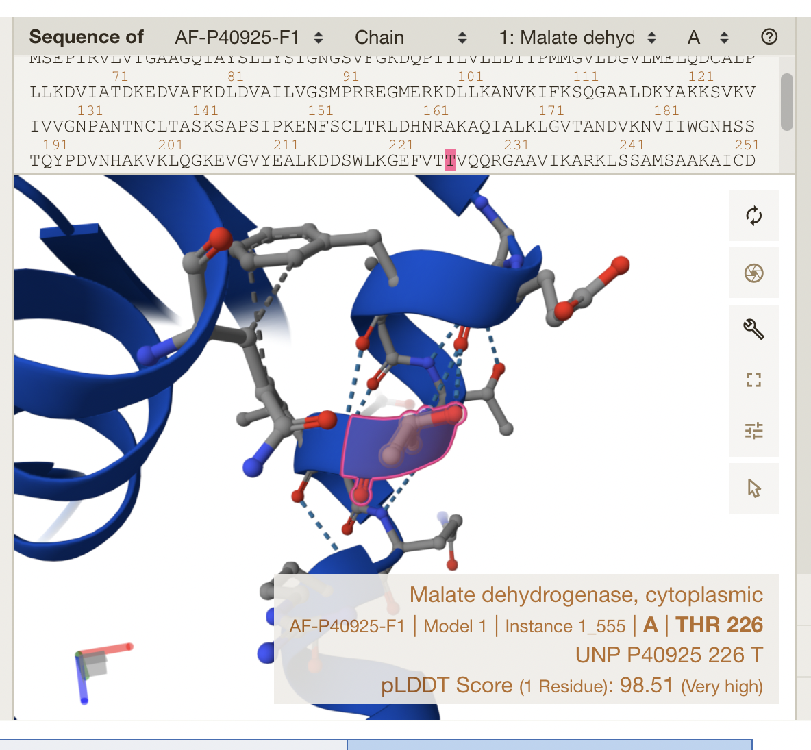
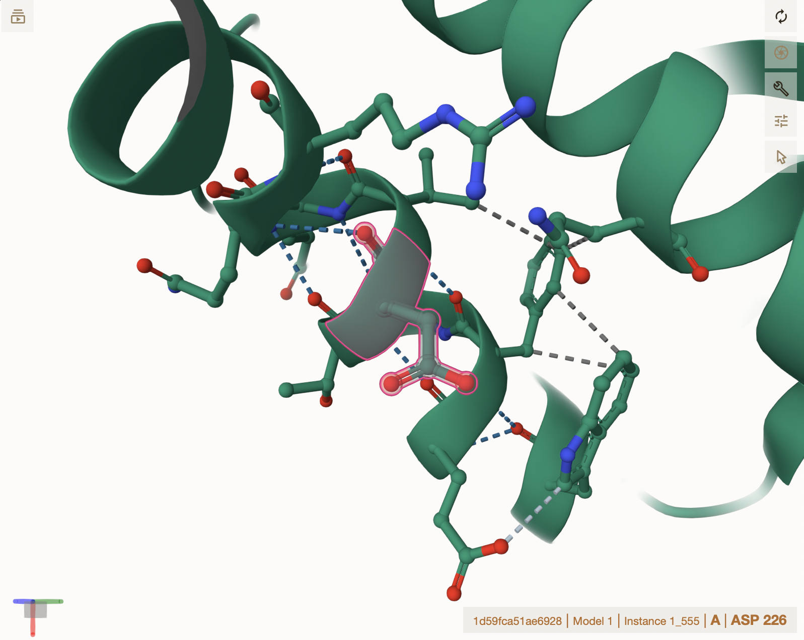
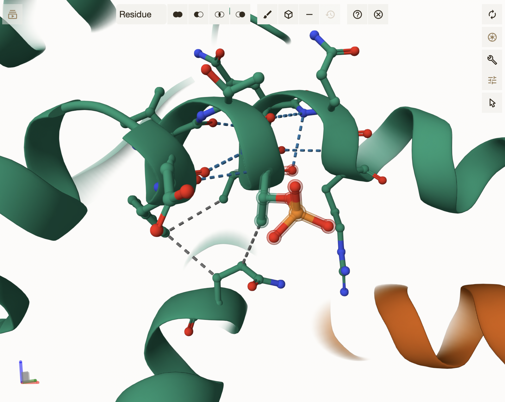
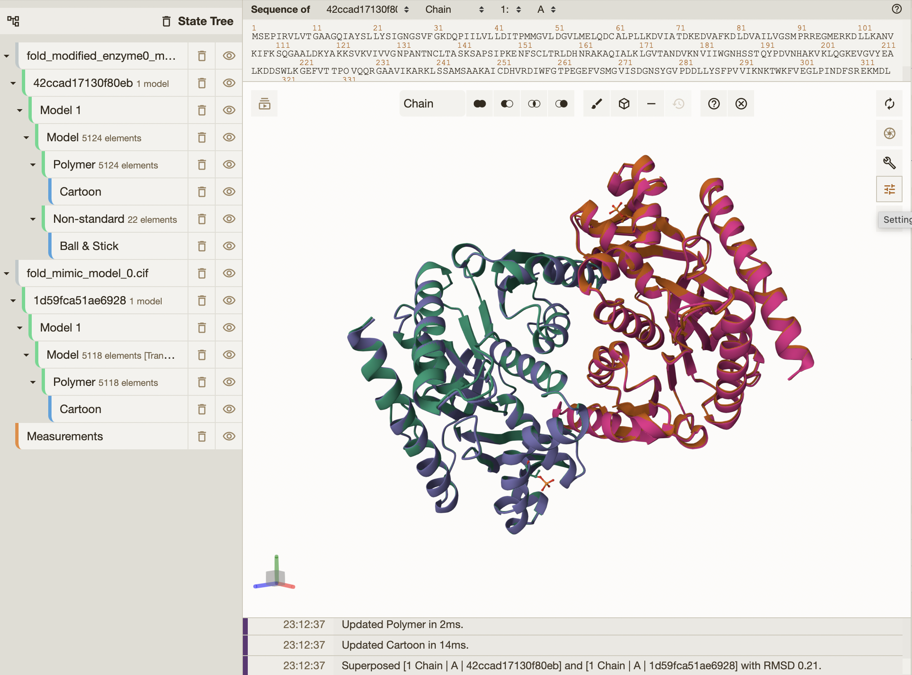
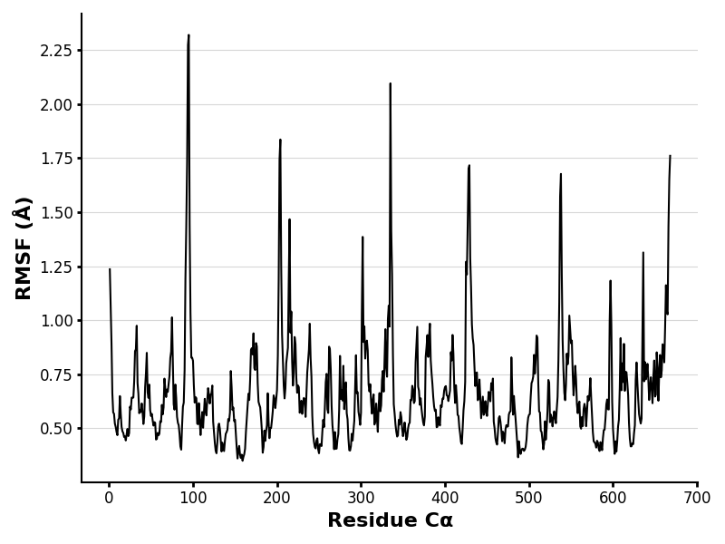
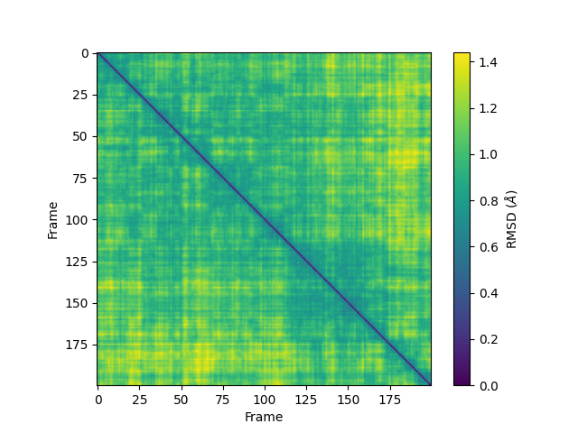
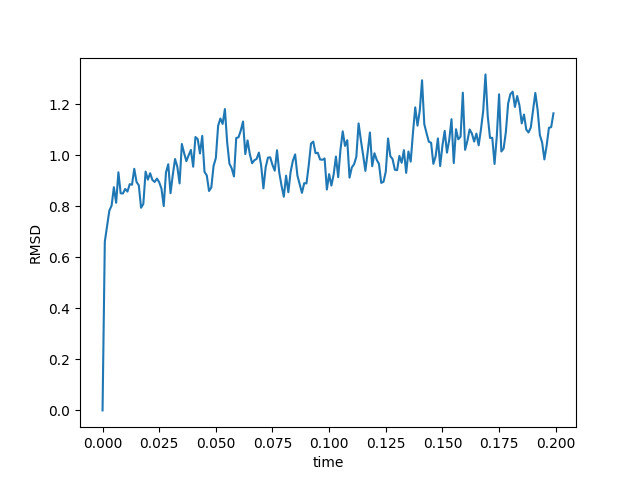

# Human MDH1
# P40925
# Phosphorylation of T226

## Description

THR 266 of human cytosolic MDH1 phosphorylation has not been identified by another study. The location of this modification is in a helix on the perimeter of the structure and relatively close to the dimer interface, and very close to binding site 162 and to active site 187. The unmodified MDH1 sequence had interactions between Threonine (THR226) and the amino acids VAL227, ARG230, GLN229, THR225, GLN228, VAL224, PHE223, GLU222, GLY221, and GLN166. According to the mimic, amino acid 226 was changed from Threonine to Aspartic acid, and it has interactions with amino acids GLN166, PHE223, TRP218, GLU222, VAL227, THR225, GLN229, VAL224, ARG230, and GLN228. The modified structure, however, changed from Threonine to Thrombopoietin (TPO226) and had interactions between amino acids PHE223, GLN166, VAL227, GLU222, VAL224, GLN228, GLN229, THR225, and ARG230. These interactions consist of various hydrogen bonds, hydrophobic contact, and weak hydrogen bonds for the mimic. Knowing this information, we can see where the differences are in structure. Amino acid TRP218 only occurred in the mimic and the original structure did not have GLN228, but it was the only one to have GLY221. Between all the different structures, the mimic was the only one with a weak hydrogen bond, while the modified and original had just hydrophobic contacts and hydrogen bonds. While looking at the bonds associated with the sites, the amino acids involved in the binding sites or active sites are unaffected. The active site is too far to interact, and for the binding site ARG162, I’m seeing an interaction in the mimic structure with ARG230, which is part of the ASP226 site. This creates an arginine-arginine stacking that can make the structure more stable.1

1. image of the unmodified site

2. image of mimic site

3. image of modification site

## Effect of the sequence variant and PTM on MDH dynamics

Changes in interactions between amino acids can cause them to act different toward other molecules depending on the charges of the different atoms involved. 

1. image of the aligned structures in Mol*

3. Annotated RMSF plot showing differences between the simulations

4. Annotated plots of pKa for the key amino acids

5. If needed, show ligand bound images and how modification affects substrate binding

## Comparison of the mimic and the authentic PTM

Using different simulations and softwares can cause structures to change. In this case there was a significant difference between the before and after of step 2 in the Colab provided. More information on how this affects our models will need to be researched. 

1. image of the RMSF

2. image of RMSD compare plot

3. image of RMSD compare plot

## Authors

Kylee Davis 

## Deposition Date

## License

Shield: [![CC BY-NC 4.0][cc-by-nc-shield]][cc-by-nc]

This work is licensed under a
[Creative Commons Attribution-NonCommercial 4.0 International License][cc-by-nc].

[![CC BY-NC 4.0][cc-by-nc-image]][cc-by-nc]

[cc-by-nc]: https://creativecommons.org/licenses/by-nc/4.0/
[cc-by-nc-image]: https://licensebuttons.net/l/by-nc/4.0/88x31.png
[cc-by-nc-shield]: https://img.shields.io/badge/License-CC%20BY--NC%204.0-lightgrey.svg

## References

* (1)Lee, D.; Lee, J.; Seok, C. What Stabilizes Close Arginine Pairing in Proteins? Physical Chemistry Chemical Physics 2013, 15 (16), 5844–5844. 

