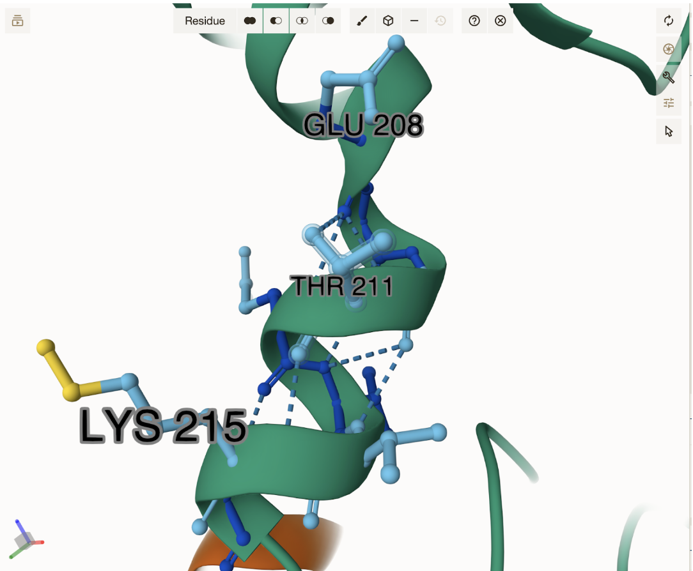
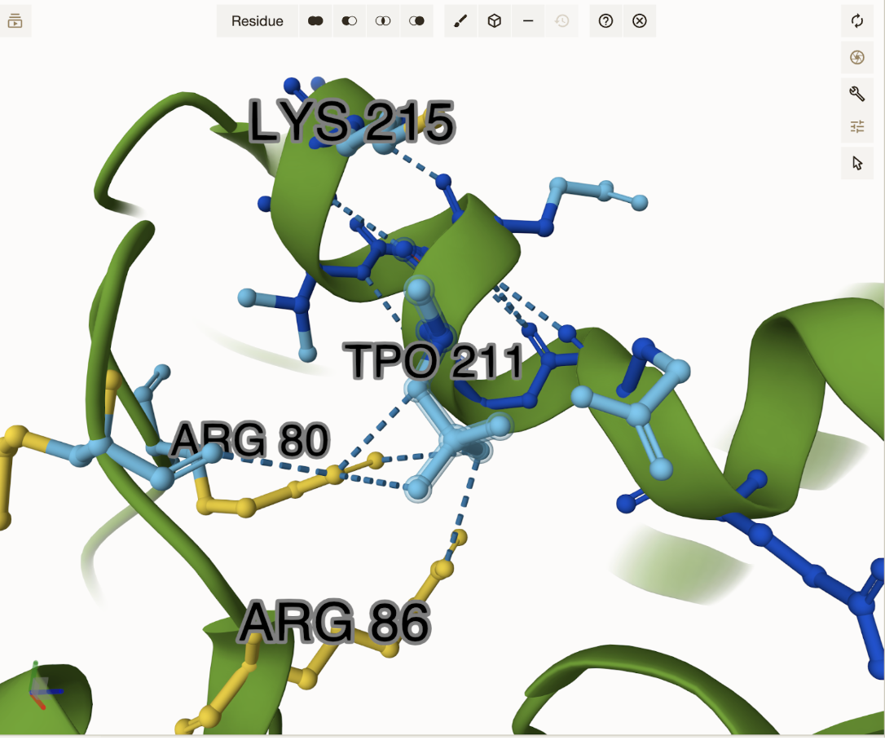
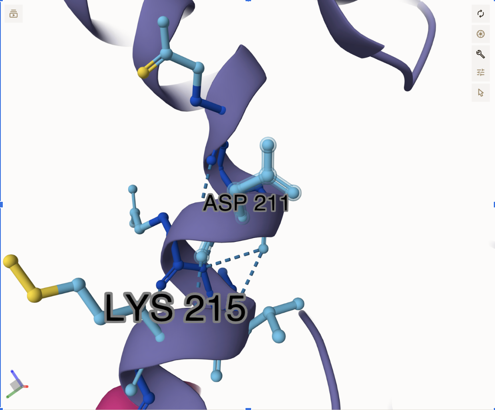
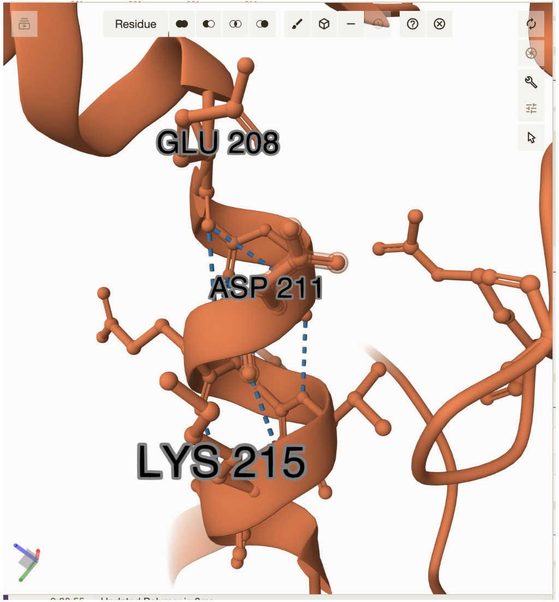
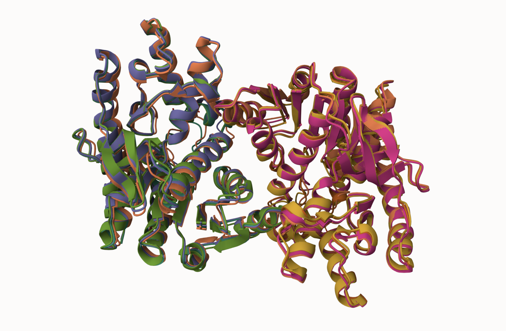
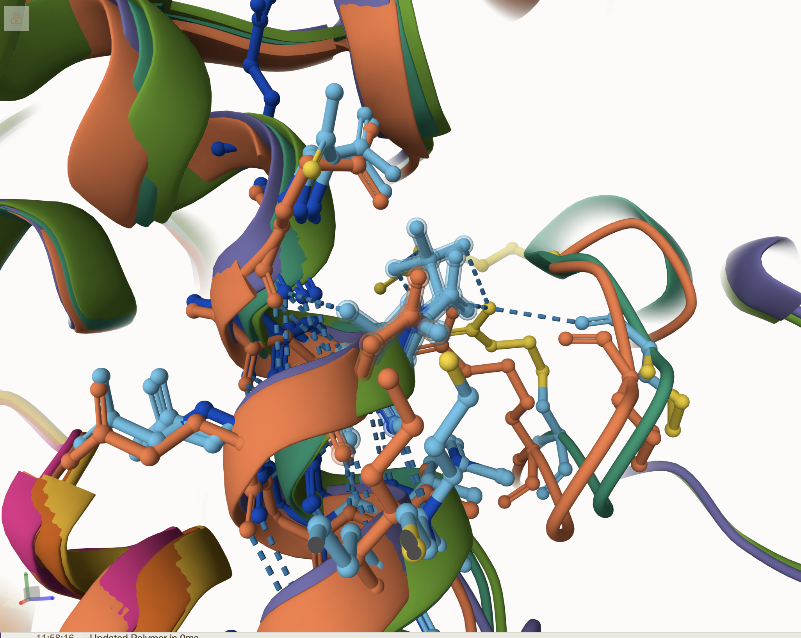
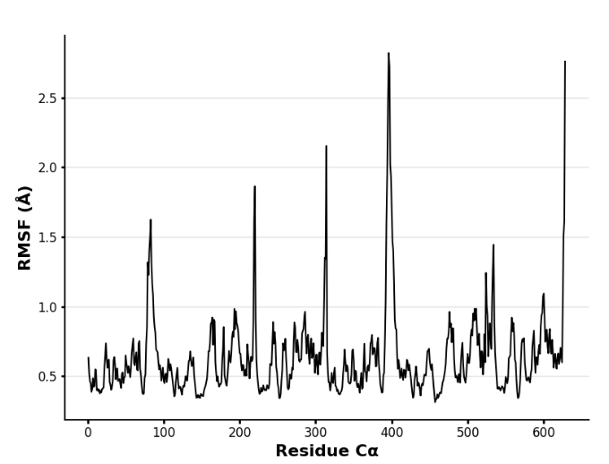
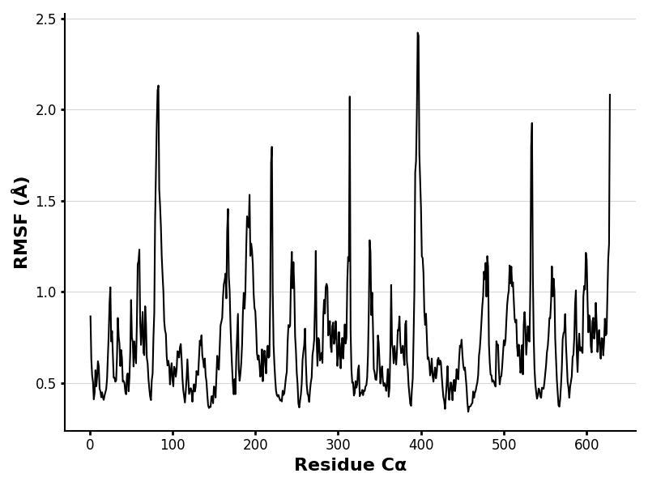
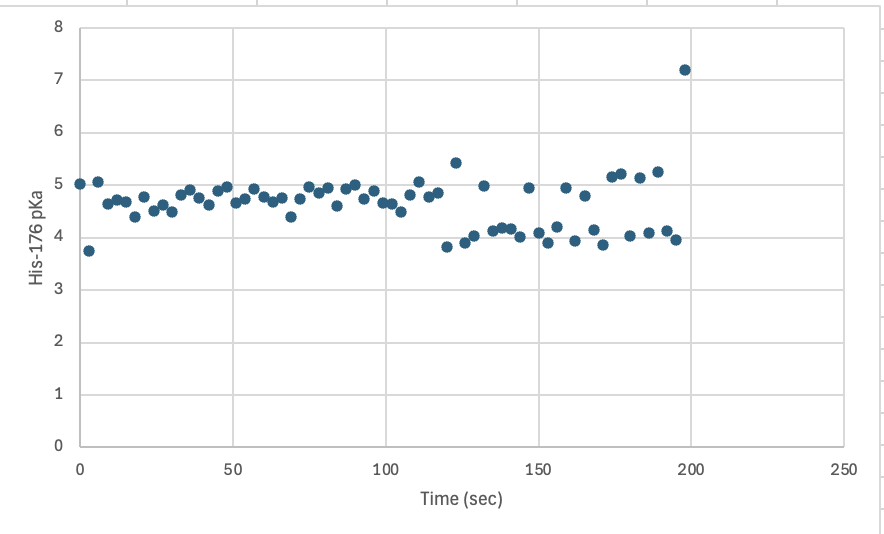
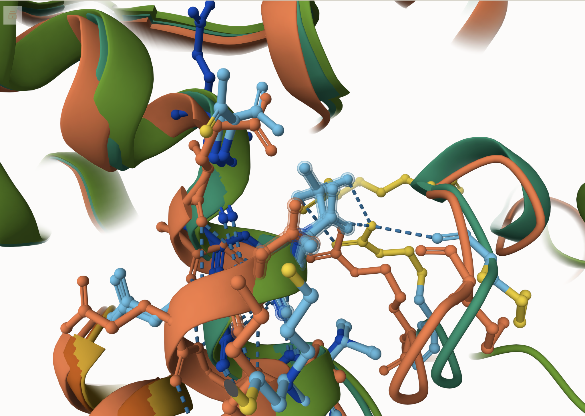

# human MDH2

# Uniprot ID: P40926

# Variation: T235D

## Description

The variant was assigned as T235D. The threonine (T) in the sequence was first assigned a post-translational modification to be phosphorylated and assigned as the modified variant. The processing sequence was then entered again and the threonine was changed to an aspartic acid (D) and assigned as the mimic variant. The residue of interest in the processing sequence via Uniprot was at residue 211.

1.  image of the unmodified site  Original processing sequence of MDH2 modeled in Mol\* through the use of AlphaFold3. Amino acid of interest is Thr-211. Thr-211 is hydrogen bonded to Glu-208 and Lys-215.

2.  image of modification site  Mol\* comparison of the modified variant and the weak interactions it holds with surrounding residues. The modified amino acid of interest is Tpo-211 where the threonine within the processing sequence was phosphorylated through a post-translational modification using AlphaFold3. Tpo-211 is hydrogen bonded to Lys-215, Arg-80, and Arg-86. The arginine residues are involved in the active site of MDH2 and may have functional implications on the protein.

3.  image of modification site  Mol\* comparison of the mimic variant and the weak interactions it holds with surrounding residues. The mimic amino acid of interest was altered from a threonine to a aspartic acid (T235D) through the use of AlphaFold3. The Asp-211 only is hydrogen bonded to Lys-215.

4.  image of modification site  Mol\* comparison of the mimic variant (T235D) through the use of Boltz-1 to model the modification. The amino acid of interest is the Asp-211 and it appears to be hydrogen bonded to Lys-215 and Glu-208. It should be noted that these are the same interactions within the original model of MDH2.

## Effect of the sequence variant and PTM on MDH dynamics

1.  Image of aligned PDB files (no solvent)  Alignment of MDH2 (purple and pink),MDH2 with phospho 135 (turquoise) and T235D (orange, green, and yellow)

2.  Image of the site with the aligned PDB files (no solvent)  Modification site alignment within MDH2. The modification site is at amino acid position 211.

3.  Annotated RMSF plot showing differences between the simulations  RMSF plot produced by MD Colab2 based on the original processing sequence of MDH2 as modeled through AlphaFold3. Lower peaks were observed around residue 176 (His-176). Lower peaks indicated more structural stability and less flexibility within the active site.

 RMSF plot produced from MD Colab 2 based on the mimic sequence of MDH2 as modeled through AlphaFold3. Higher peaks were observed around residue 176 (His-176). Higher peaks were observed which indicated less structural stability and more flexibility.

4.  Annotated plots of pKa for the key amino acids  His-176 pKa plot for original model. The average pKa value was 4.64 with a standard deviation of 0.52. There is a slight outlier around 200 seconds which could indicate a slight conformational change, however based on the average it does not affect the overall statistic.

 His-176 pKa plot for mimic model. The average was 4.89 with a standard deviation of 0.41. There is an outlier around 50 seconds but this does not give enough of an indication that the pKa value drastically changed compared to the original model.

The modified variant seemed to modify the active site due to its proximity to residues involved in the active site specifically surrounding His-176. The RMSF plot also shows some flexibility within the active site which supports the idea that the active site may be compromised. Although the mimic and modified variants were supposed to mimic one another, there slight differences in charge and size caused them to have major differences in their binding. The mimic variant showed no notable changes in binding compared to the original and also did not affect the active or substrate binding site. The pKa values also did not show any significant change and supported that the mimic had no significant changes to its charges or size.

 AlphaFill modeling based on the ligand (OAA) binding to the substrate-binding site. The close proximity of TPO-211 seems to have an effect on ligand binding as well as the active site.

## Comparison of the mimic and the authentic PTM

 Molstar comparison of T235D (mimic) and phosphoT235 (modified) MDH2. The overall structures had differences in their weak interactions. The mimic and original models (orange, light green, and purple) seem to all have weak interactions within the helix structure and had overlapping interactions. The modified model (dark green) had weak interactions outside of the helix structure and seems to have different weak interactions than the other models.

### Colab notebook links

Provide file names of completed colab notebooks Copy_MD_simulation_Step1.ipynb Copy_of_MDanalysis_Step2.ipynb

## Authors

Abby Porter

## Deposition Date

5/7/2025

## License

Shield: 

This work is licensed under a [Creative Commons Attribution-NonCommercial 4.0 International License](https://creativecommons.org/licenses/by-nc/4.0/).

## References

-   Citation1 [Berndsen, C. E.; Bell, J. K. The Structural Biology and Dynamics of Malate Dehydrogenases. Essays in Biochemistry 2024, 68 (2), 57–72. https://doi.org/10.1042/EBC20230082](https://doi.org/10.1042/EBC20230082)

-   Citation2 [Provost, J. J.; Parente, A. D.; Slade, K. M.; Wiese, T. J. Exploring the Uncharted Territory of the Potential Protein–Protein Interactions of Cytosolic Malate Dehydrogenase. Essays in Biochemistry 2024, 68 (2), 83–97. https://doi.org/10.1042/EBC20230083.](https://doi.org/10.1042/EBC20230083)

-   Citation3 [He, C.; Casey, J. L.; Gu, L.; Carter, A. B. Mitochondrial Malate Dehydrogenase (MDH2) Regulates Macrophage Alternative Activation During Pulmonary Fibrosis Development. In D107. MITOCHONDRIA AND ER STRESS IN HOMEOSTASIS AND REPAIR; American Thoracic Society, 2019; pp A7216–A7216. https://doi.org/10.1164/ajrccm-conference.2019.199.1_MeetingAbstracts.A7216.](https://doi.org/10.1164/ajrccm-conference.2019.199.1_MeetingAbstracts.A7216)

-   Citation4 [Parente, A. D.; Bolland, D. E.; Huisinga, K. L.; Provost, J. J. Physiology of Malate Dehydrogenase and How Dysregulation Leads to Disease. Essays in Biochemistry 2024, 68 (2), 121–134. https://doi.org/10.1042/EBC20230085.](https://doi.org/10.1042/EBC20230085)

-   Citation5 [Abramson, J.; Adler, J.; Dunger, J.; Evans, R.; Green, T.; Pritzel, A.; Ronneberger, O.; Willmore, L.; Ballard, A. J.; Bambrick, J.; Bodenstein, S. W.; Evans, D. A.; Hung, C.-C.; O’Neill, M.; Reiman, D.; Tunyasuvunakool, K.; Wu, Z.; Žemgulytė, A.; Arvaniti, E.; Beattie, C.; Bertolli, O.; Bridgland, A.; Cherepanov, A.; Congreve, M.; Cowen-Rivers, A. I.; Cowie, A.; Figurnov, M.; Fuchs, F. B.; Gladman, H.; Jain, R.; Khan, Y. A.; Low, C. M. R.; Perlin, K.; Potapenko, A.; Savy, P.; Singh, S.; Stecula, A.; Thillaisundaram, A.; Tong, C.; Yakneen, S.; Zhong, E. D.; Zielinski, M.; Žídek, A.; Bapst, V.; Kohli, P.; Jaderberg, M.; Hassabis, D.; Jumper, J. M. Accurate Structure Prediction of Biomolecular Interactions with AlphaFold 3. Nature 2024, 630 (8016), 493–500. https://doi.org/10.1038/s41586-024-07487-w.](https://doi.org/10.1038/s41586-024-07487-w)

-   Citation6 [Wohlwend, J.; Corso, G.; Passaro, S.; Reveiz, M.; Leidal, K.; Swiderski, W.; Portnoi, T.; Chinn, I.; Silterra, J.; Jaakkola, T.; Barzilay, R. Boltz-1: Democratizing Biomolecular Interaction Modeling. November 20, 2024. https://doi.org/10.1101/2024.11.19.624167.](https://doi.org/10.1101/2024.11.19.624167)

-   Citation7 [Google Colab. https://colab.research.google.com/drive1zJ6JtIiYrMaOOn1vom1P0JTUDJwqR2ou?usp=sharing (accessed 2025-04-23).](https://colab.research.google.com/drive/1zJ6JtIiYrMaOOn1vom1P0JTUDJwqR2ou?usp=sharing)

-   Citation8 [The UniProt Consortium; Bateman, A.; Martin, M.-J.; Orchard, S.; Magrane, M.; Adesina, A.; Ahmad, S.; Bowler-Barnett, E. H.; Bye-A-Jee, H.; Carpentier, D.; Denny, P.; Fan, J.; Garmiri, P.; Gonzales, L. J. D. C.; Hussein, A.; Ignatchenko, A.; Insana, G.; Ishtiaq, R.; Joshi, V.; Jyothi, D.; Kandasaamy, S.; Lock, A.; Luciani, A.; Luo, J.; Lussi, Y.; Marin, J. S. M.; Raposo, P.; Rice, D. L.; Santos, R.; Speretta, E.; Stephenson, J.; Totoo, P.; Tyagi, N.; Urakova, N.; Vasudev, P.; Warner, K.; Wijerathne, S.; Yu, C. W.-H.; Zaru, R.; Bridge, A. J.; Aimo, L.; Argoud-Puy, G.; Auchincloss, A. H.; Axelsen, K. B.; Bansal, P.; Baratin, D.; Batista Neto, T. M.; Blatter, M.-C.; Bolleman, J. T.; Boutet, E.; Breuza, L.; Gil, B. C.; Casals-Casas, C.; Echioukh, K. C.; Coudert, E.; Cuche, B.; De Castro, E.; Estreicher, A.; Famiglietti, M. L.; Feuermann, M.; Gasteiger, E.; Gaudet, P.; Gehant, S.; Gerritsen, V.; Gos, A.; Gruaz, N.; Hulo, C.; Hyka-Nouspikel, N.; Jungo, F.; Kerhornou, A.; Mercier, P. L.; Lieberherr, D.; Masson, P.; Morgat, A.; Paesano, S.; Pedruzzi, I.; Pilbout, S.; Pourcel, L.; Poux, S.; Pozzato, M.; Pruess, M.; Redaschi, N.; Rivoire, C.; Sigrist, C. J. A.; Sonesson, K.; Sundaram, S.; Sveshnikova, A.; Wu, C. H.; Arighi, C. N.; Chen, C.; Chen, Y.; Huang, H.; Laiho, K.; Lehvaslaiho, M.; McGarvey, P.; Natale, D. A.; Ross, K.; Vinayaka, C. R.; Wang, Y.; Zhang, J. UniProt: The Universal Protein Knowledgebase in 2025. Nucleic Acids Research 2025, 53 (D1), D609–D617. https://doi.org/10.1093/nar/gkae1010.](https://doi.org/10.1093/nar/gkae1010)

-   Citation9 [Sehnal, D.; Bittrich, S.; Deshpande, M.; Svobodová, R.; Berka, K.; Bazgier, V.; Velankar, S.; Burley, S. K.; Koča, J.; Rose, A. S. Mol\* Viewer: Modern Web App for 3D Visualization and Analysis of Large Biomolecular Structures. Nucleic Acids Research 2021, 49 (W1), W431–W437. https://doi.org/10.1093/nar/gkab314.](https://doi.org/10.1093/nar/gkab314)

-   Citation10 [Haberman, A.; Peterson, C. N. Genetics of MDH in Humans. Essays in Biochemistry 2024, 68 (2), 107–119. https://doi.org/10.1042/EBC20230078.](https://doi.org/10.1042/EBC20230078)

-   Citation11 [Voet, D. Fundamentals of Biochemistry, Integrated E-Text with E-Student Companion; Wiley 2017, 2017]()

-   Citation12 [PubChem. Threonine Phosphate. https://pubchem.ncbi.nlm.nih.gov/compound/3246323 (accessed 2025-04-23)](https://pubchem.ncbi.nlm.nih.gov/compound/3246323)

-   Citation13 [Hekkelman, M. L.; De Vries, I.; Joosten, R. P.; Perrakis, A. AlphaFill: Enriching AlphaFold Models with Ligands and Cofactors. Nat Methods 2023, 20 (2), 205–213. <https://doi.org/10.1038/s41592-022-01685-y>.](<https://doi.org/10.1038/s41592-022-01685>

-   Citation14 [Altea-Manzano, P.; Vandekeere, A.; Edwards-Hicks, J.; Roldan, M.; Abraham, E.; Lleshi, X.; Guerrieri, A. N.; Berardi, D.; Wills, J.; Junior, J. M.; Pantazi, A.; Acosta, J. C.; Sanchez-Martin, R. M.; Fendt, S.-M.; Martin-Hernandez, M.; Finch, A. J. Reversal of Mitochondrial Malate Dehydrogenase 2 Enables Anaplerosis via Redox Rescue in Respiration-Deficient Cells. Molecular Cell 2022, 82 (23), 4537-4547.e7. https://doi.org/10.1016/j.molcel.2022.10.005](https://doi.org/10.1016/j.molcel.2022.10.005)
