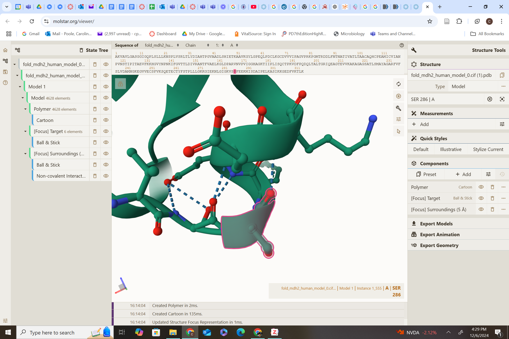
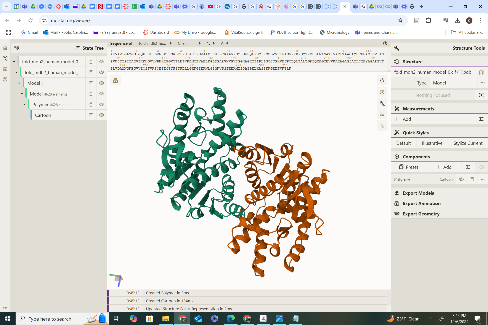
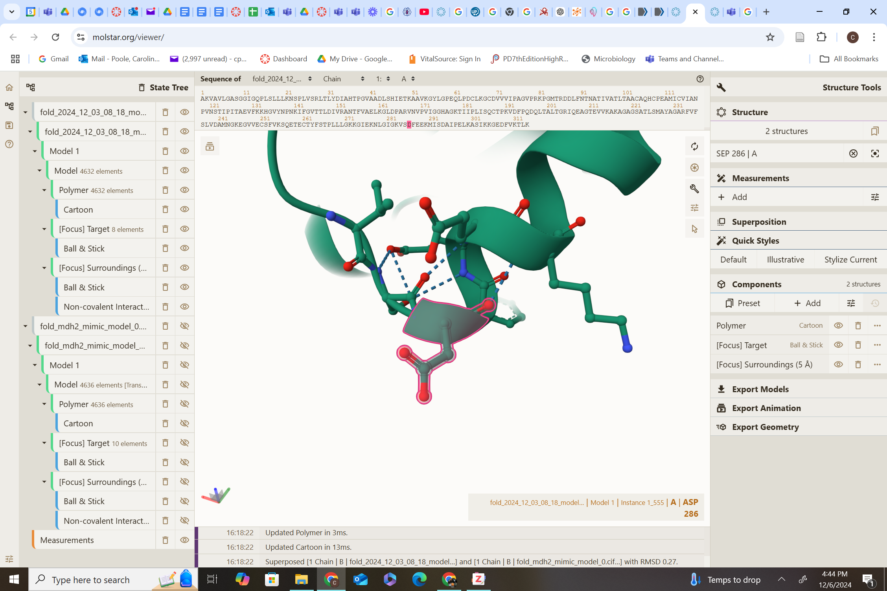
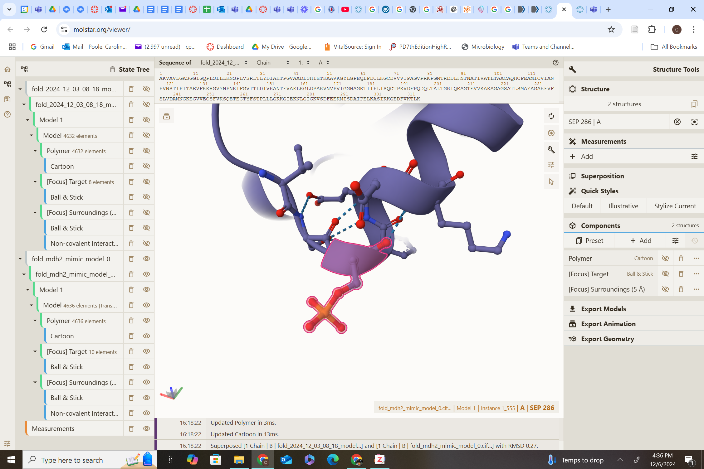
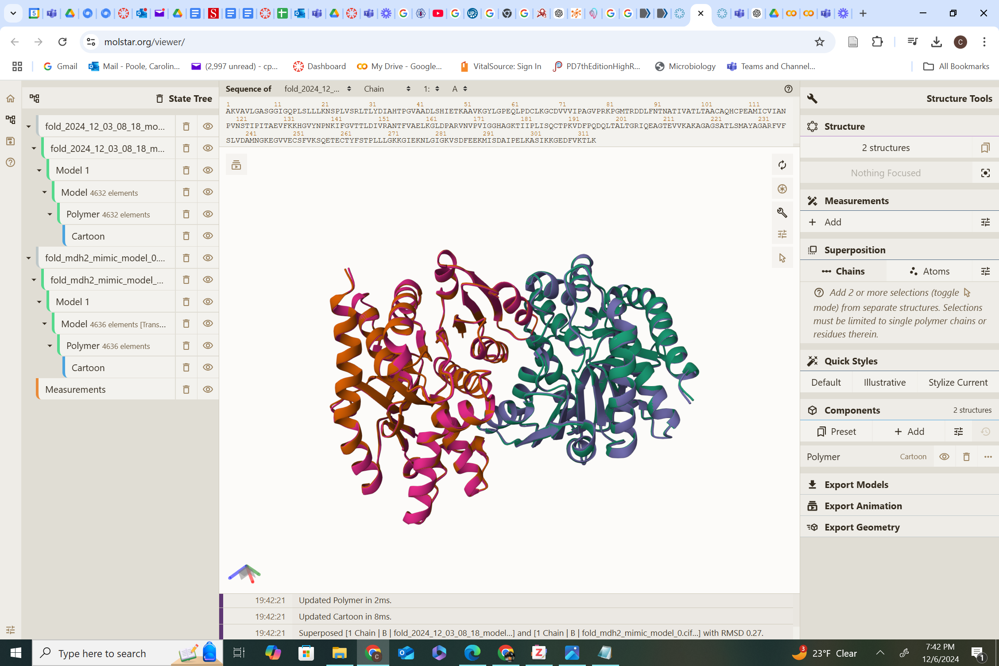
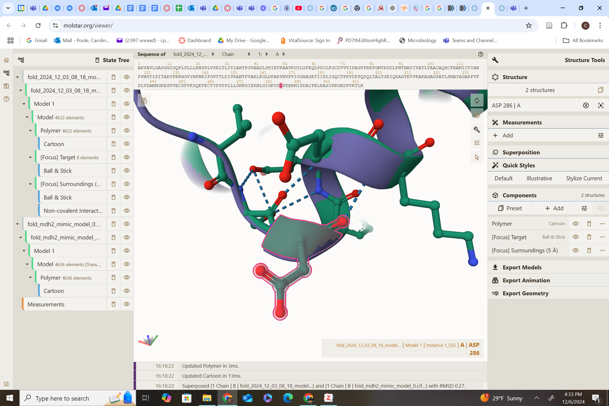
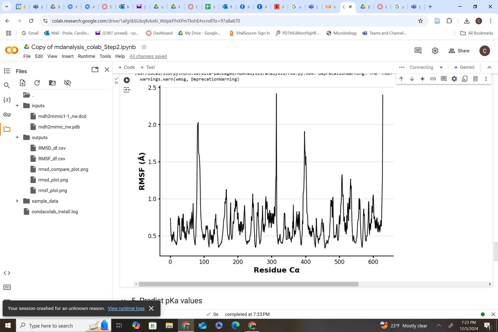
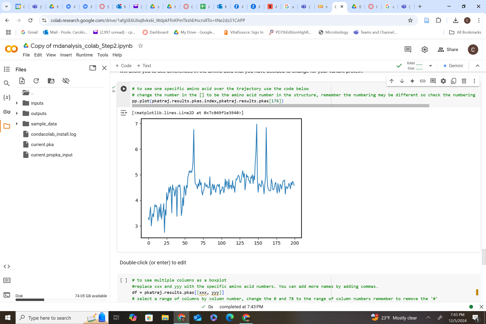

# Malate dehydrogenase MDH2
# Uniprot ID: P40926
# Variation: Phosphorylation of T286 (S286 in structure)

## Description

Amino Acid 286 was modified by phosphorylation causing an S to be substituted for a D using AlphaFold3. The amino acid is positioned on an alpha helix and demonstrates consistent interactions across its variants. In its unmodified form, amino acid 286 is a serine that interacts with serine and phenylalanine via van der Waals forces and forms a hydrogen bond with lysine (Image 3). When modified with a PTM mimic it is a phosphorylated serine, retaining hydrogen bonding with lysine and van der Waals interactions with serine and phenylalanine in the alpha helix (Image 2). In its variant form as aspartic acid, it also resides on the alpha helix and continues to interact with phenylalanine and serine through van der Waals forces, while forming a hydrogen bond with lysine (Image 1). Across all forms, amino acid 286 consistently engages lysine through hydrogen bonding and serine and phenylalanine via van der Waals interactions, emphasizing its role in maintaining local structural and interaction dynamics.

1. image of the unmodified site

2. image of modification site

## Effect of the sequence variant and PTM on MDH dynamics

The introduction of the ASP mimic at position 286 induces nuanced structural and functional effects on the protein. Initially, the ASP variant stabilizes the local region by enhancing packing interactions, as reflected in lower RMSD values early in simulations. However, this stability is transient, with later increases in RMSD suggesting destabilization due to the negatively charged ASP disrupting electrostatic interactions and weakening hydrogen bonds. RMSF analysis reveals localized flexibility near residue 286, though broader stabilization occurs in residues 200–300, potentially compensating for this destabilization. Importantly, the ASP mimic causes a downward pKa shift in histidine 176 at the active site, reducing its likelihood of protonation and impairing catalytic roles in proton transfer or substrate binding. These combined effects—transient stabilization, altered flexibility, and disrupted electrostatic balance—highlight the mimic's inability to fully replicate the regulatory and structural roles of SEP, potentially affecting protein activity and the broader metabolic pathway it influences.

1. Image of aligned PDB files (no solvent)

2. Image of the site with the aligned PDB files (no solvent)

3. Annotated RMSF plot showing differences between the simulations

4. Annotated plots of pKa for the key amino acids

5. If needed, show ligand bound images and how modification affects substrate binding

Description of the data and changes

## Comparison of the mimic and the authentic PTM

The comparison between the ASP mimic and the PTM-modified model highlights both shared structural trends and key functional differences. While the ASP mimic approximates the effects of phosphorylation by introducing a negatively charged side chain, it falls short of replicating the dynamic stability provided by the actual PTM. Early simulations show the mimic variant stabilizing the structure (lower RMSD), but over time, increased flexibility emerges, diverging from the likely enhanced stability and polar environment induced by phosphorylation. The ASP mimic's distinct side chain properties disrupt electrostatic interactions and hydrogen bonds differently, particularly at the active site, where a downward pKa shift in histidine 176 could impair catalytic efficiency. RMSF data further reveal greater flexibility in key regions for the mimic, suggesting less predictable functional responses compared to the tightly regulated behavior of the phosphorylated serine. While the mimic serves as a useful tool for broadly understanding phosphorylation's effects, its inability to replicate the nuanced stability and functional precision of the PTM underscores its limitations as a perfect substitute.

## Authors

Caroline Poole

12/6/2024

## License

Shield: [![CC BY-NC 4.0][cc-by-nc-shield]][cc-by-nc]

This work is licensed under a
[Creative Commons Attribution-NonCommercial 4.0 International License][cc-by-nc].

[![CC BY-NC 4.0][cc-by-nc-image]][cc-by-nc]

[cc-by-nc]: https://creativecommons.org/licenses/by-nc/4.0/
[cc-by-nc-image]: https://licensebuttons.net/l/by-nc/4.0/88x31.png
[cc-by-nc-shield]: https://img.shields.io/badge/License-CC%20BY--NC%204.0-lightgrey.svg

## References

* Regulation of Cellular Metabolism by Protein Lysine Acetylation | Science. https://www.science.org/doi/10.1126/science.1179689 (accessed 2024-12-06). 

* Peng, Y.; Liu, H.; Liu, J.; Long, J. Post-Translational Modifications on Mitochondrial Metabolic Enzymes in Cancer. Free Radical Biology and Medicine 2022, 179, 11–23. https://doi.org/10.1016/j.freeradbiomed.2021.12.264. 

* Marquez, J.; Lee, S. R.; Kim, N.; Han, J. Post-Translational Modifications of Cardiac Mitochondrial Proteins in Cardiovascular Disease: Not Lost in Translation. Korean Circ J 2016, 46 (1), 1–12. https://doi.org/10.4070/kcj.2016.46.1.1. 

* Sargsyan, K.; Grauffel, C.; Lim, C. How Molecular Size Impacts RMSD Applications in Molecular Dynamics Simulations. J. Chem. Theory Comput. 2017, 13 (4), 1518–1524. https://doi.org/10.1021/acs.jctc.7b00 

* Harris, T. K.; Turner, G. J. Structural Basis of Perturbed pKa Values of Catalytic Groups in Enzyme Active Sites. IUBMB Life 2002, 53 (2), 85–98. https://doi.org/10.1080/15216540211468. 

* Bischoff, R.; Schlüter, H. Amino Acids: Chemistry, Functionality and Selected Non-Enzymatic Post-Translational Modifications. Journal of Proteomics 2012, 75 (8), 2275–2296. https://doi.org/10.1016/j.jprot.2012.01.041. 