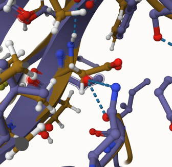
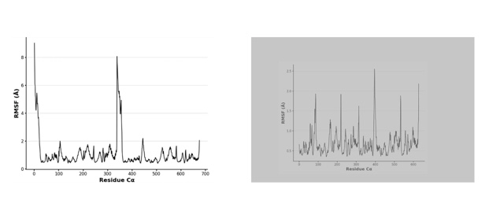

# Homo sapien Malate Dehydrogenase 2

# Uniprot ID: P40926

# Variation: Phosphorylation of T290 (pT290 in structure)

## Description:

No previous research or studies have been conducted on the phosphorylation modification of amino acid site 290 in MDH2. MDH2 does contain a N-terminal transit peptide, allowing it to enter into the mitochondria. This transit peptide resides at residues 1-24, so the modification of site 290 does not affect its ability to translocate to the mitochondria (Eo Et al., 2022). Modified site 290 is part of a beta pleated sheet formed during protein folding. On one side of the modified site there is a beta sheet, and on the opposite side, there is a beta sheet that turns into a loop at site 303. The modified phosphorylation site is located on the edge of the protein, relatively far from the dimer interface. Relative to the tail, the binding site Arg104 is at the top/middle of the protein, while the modified site is towards the bottom right. Another binding site, Asp57, which is responsible for stabilizing the active site, His200, as well as the ligand, is towards the top of the protein and much closer to the dimer interface than the modification site. The active site, His200, is much closer to the modification site than either binding sites, residing in the center of the protein. Due to the close proximity of the active site and the modification site, the phosphorylation of Thr290 could affect the function of the protein due to conformational changes and a shift in steric hindrance (Nishi, Hafumi, et al).

Comparison of MDH2 models and phospho modified MDH2:

In the modified protein the pThr is forming a hydrogen bond with Asn302. Two of the negatively charged oxygens on the phosphate group form hydrogen bonds with an oxygen on Ser280. The hydrogen bonds form here because the phosphate oxygens on pThr can accept hydrogen bonds from the hydroxyl group of Ser. A hydrogen bond also forms between pThr and Ser276. The original protein with Thr290, forms two hydrogen bonds with Asn302. The oxygen on the sidechain of Thr290 forms a hydrogen bond with the oxygen and the nitrogen on the side chain of Asn302. It did not form hydrogen bonds with Ser like the modified protein did. 

1. Unmodified site T290. Two hydrogen bonds in the original protein between Thr290 and Asn302.
  

2. Modified site. Two hydrogen bonds between pThr and Ser on the left image. Hydrogen bond between pThr and Asn302 in the middle image. A hydrogen bond is also present between pThr and Ser276 pictured in the right image. 
  

Effect of the sequence variant and PTM on MDH dynamics:

A molecular dynamics analysis simulation was used in order to view and interpret the differences between MDH2 and the mimic version of MDH2. In order to assess the structural stability of the two proteins, root mean square fluctuation (RMSF) was analyzed. This compares how dynamic a particular amino acid is by measuring an amino acid’s structural displacement from its average position (Bagewadi, Zabin et al.). Similar to the RMSD values, the RMSF values for the mimic protein were higher than the original protein. At about position 350 in the mimic protein, which is the tail of the protein, a dramatic spike is observed which indicates a less stable area with more motion and flexibility. Protein tails are usually less stable than other regions of the protein making it susceptible to becoming more flexible during a conformational change (Uversky 2013).  If Asp in the mimic protein disrupts stabilizing interactions with the tail this could lead to instability of the region. The introduction of the negative charge Asp carries could repel other negatively charged residues near the tail, being another possible explanation of the instability. Other than the spike at position 350, there are little spikes at about position 200 and 290. 
Pka plots were also used in order to tell if the environment around a particular amino acid is changing. The mimic protein’s pKa value at site 290 varies a lot more over the course of the simulation than the original protein, jumping from four to seven.  It eventually levels off to about 5.5 which is much higher than the original protein’s pKa value. The original protein’s pKa values at the active site are a little more stable leveling off to about 4.5.

3. The unmodified MDH2 protein is shown in green while the MDH2 mimic protein is yellow. The mimic protein was used in the molecular dynamic simulations. 
  

4. Modification site of unmodified MDH2 and the MDH2 mimic. In the mimic protein, Asp290, forms two additional hydrogen bonds with Asn302 and Ser276.
  

5. Mimic protein RMSF plot on the left. RMSF plot for original protein on the right. 

6. Pka plot of mimic protein at the active site (200) on the left. Pka plot of original protein at the active site (200) on the right. The mimic protein’s pKa value at site 290 varies a lot more over the course of the simulation than the original protein.
  

7. In terms of the active site, the modified protein and the original protein are structurally similar. They both form one hydrogen bond between His200 and Asp173 and one hydrogen bond between His200 and Asn145. 

  

8. The binding site, Arg104, does not form hydrogen bonds with any amino acids besides the ones right next to it on the chain in the original protein. In the mimic protein and the modified protein it forms two hydrogen bonds with oxygens on Met108. This is the most significant change as a result of the mimic because the hydrogen bonds that occur in the mimic and modified protein are pulling Arg104 away from the ligand and the active site significantly. This change could be significant because it could change the whole function of the protein due to the binding site not being able to support the active site. 

Comparison of the mimic and the authentic PTM:

Although aspartic acid was deemed the most similar to threonine and was used to mimic pThr, analysis through mol* has highlighted a few possible issues with this mimic. At site 290 when comparing the mimic protein to the modified protein in mol*, it is observed that the modified protein forms two hydrogen bonds with Ser280 while the mimic protein only forms one. 
  

9. Modified site 290 of the aligned PTM and mimic protein.

 
10. Modified protein.

11. Mimic protein.
  

In the active site, there is also a difference between the modified protein and the mimic protein. Both the original and modified protein form the same two hydrogen bonds whereas the mimic protein forms three hydrogen bonds. The binding sites Asp57 and Arg104 do not have any differences between the modified and mimic protein. 

12. Modified protein active site.  

8. Mimic protein active site.   

# Authors

Samantha Mullen

# Deposition Date

December 6th, 2024

# License

Shield: 

This work is licensed under a Creative Commons Attribution-NonCommercial 4.0 International License.
 CC BY-NC 4.0 

References:

Bagewadi, Zabin K., et al. “Molecular Dynamics and Simulation Analysis against Superoxide Dismutase (SOD) Target of Micrococcus Luteus with Secondary Metabolites from Bacillus Licheniformis Recognized by Genome Mining Approach.” Saudi Journal of Biological Sciences, vol. 30, no. 9, Sept. 2023, p. 103753. ScienceDirect, https://doi.org/10.1016/j.sjbs.2023.103753.

Eo, Yumi, et al. “Structural Comparison of hMDH2 Complexed with Natural Substrates and Cofactors: The Importance of Phosphate Binding for Active Conformation and Catalysis.” Biomolecules, vol. 12, no. 9, Aug. 2022, p. 1175. PubMed Central, https://doi.org/10.3390/biom12091175.

Nishi, Hafumi, et al. “Phosphorylation in Protein-Protein Binding: Effect on Stability and Function.” Structure (London, England : 1993), vol. 19, no. 12, Dec. 2011, p. 1807. pmc.ncbi.nlm.nih.gov, https://doi.org/10.1016/j.str.2011.09.021.

Uversky, Vladimir N. “The Most Important Thing Is the Tail: Multitudinous Functionalities of Intrinsically Disordered Protein Termini.” FEBS Letters, vol. 587, no. 13, June 2013, pp. 1891–901. DOI.org (Crossref), https://doi.org/10.1016/j.febslet.2013.04.042.