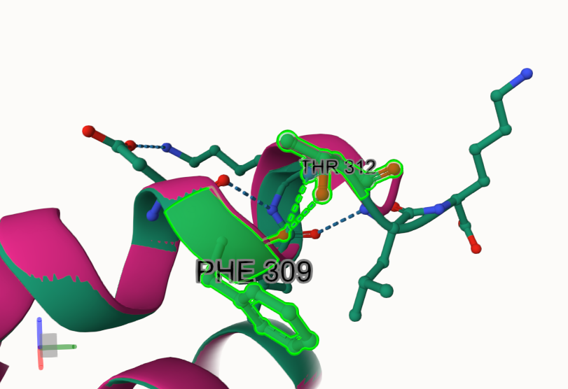
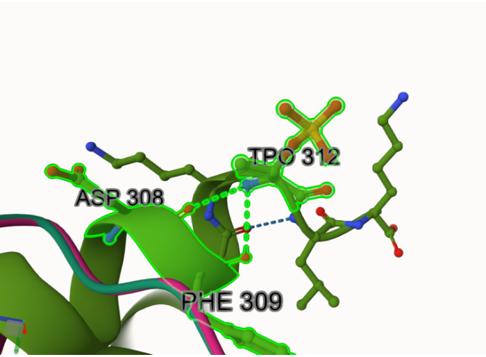
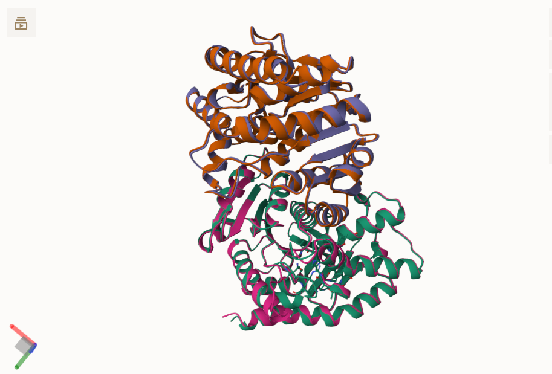
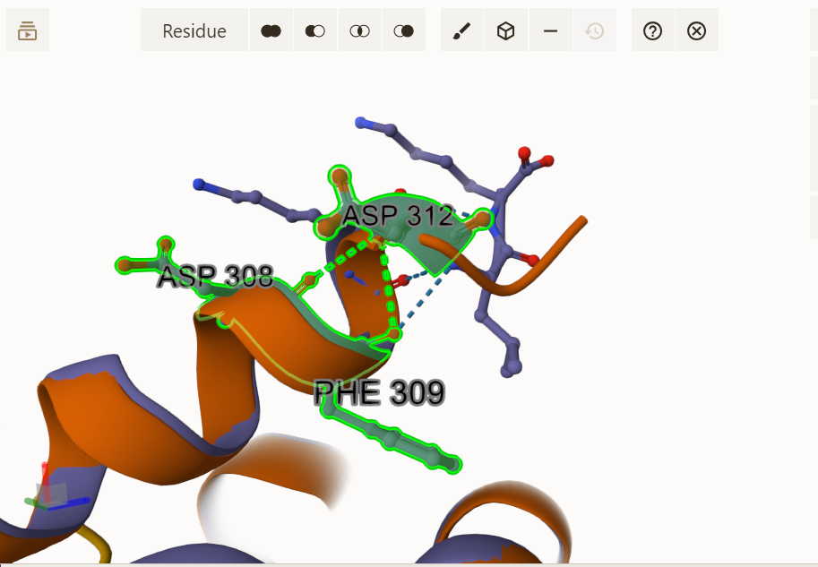
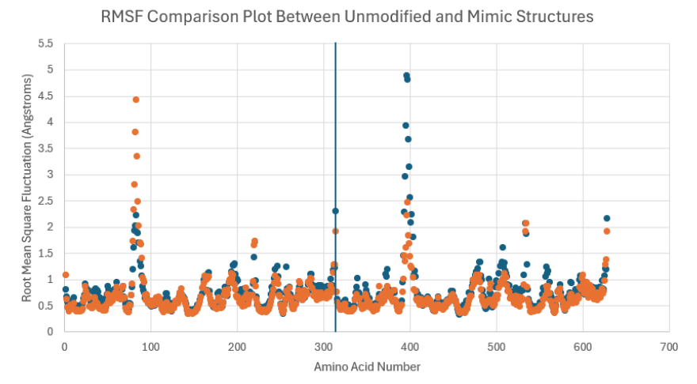
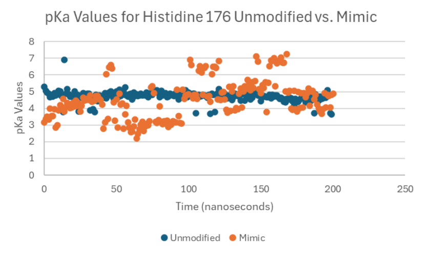
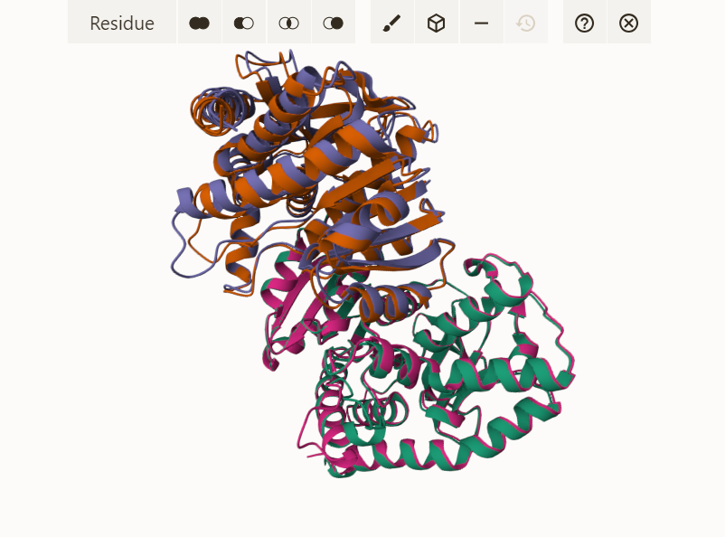
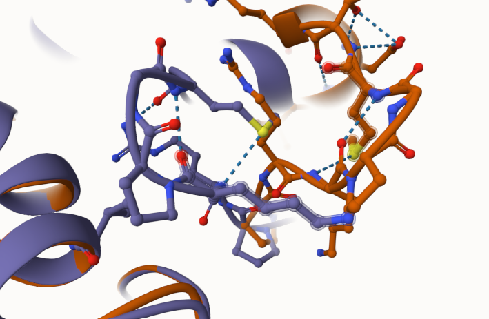

# Mitochondrial Malate Dehydrogenase 2
# Uniprot ID: P40926

# Variation: Phosphorylation of T336

## Description

Much has not been said about the role of threonine 336 in the overall role and function of MDH2. In this project, the PTM for T336 was phosphorylation at that site. A mimic model was used where T336 was changed to aspartate to mimic the PTM modification. The unmodified MDH2, PTM modified, and mimic structures were then compared to analyze any differences and what that could mean for the overall function of MDH2. 

# Effects of Modifications at the Modified site 

1. Unmodified T312 binding to phenylalanine 309 on a superimposed model of all three structures (MDH2, PTM modified, and T336D)

2. PTM modified T312 binding to phenylalanine 309 and aspartate 308 on a superimposed model of all three structures

## The PTM modification has added some differences in the modification site such as the additional hydrogen bond with aspartate 308 at an alpha helix near the end of a protein. This shows possible changes in the proteins structure. 

# Comparison of Simulated Mimic variant and Unmodified MDH2

1. Superimposed image of mimic and unmodified structures using Mol* with an RMSD value of 1.32 �

2. Mimic variant T312 binding to phenylalanine 309 and aspartate 308 on a superimposed model of all three structures

3. Scatterplot comparing RMSF values from simulated mimic and unmodified MDH2 data.

4. Scatterplot comparing pKa values of the active site (H176) from simulated mimic and unmodified MDH2 data with a standard deviation of 1.16 and 0.33, respectively.  

Overall, the structures of the mimic and the unmodified MDH2 might be similar, but there are key structural differences with an RMSD value of 1.32 �. The RMSF plot shows the highest peak for the mimic to be at amino acid 400 which is an area consisting of loops. This indicates that there is more fluctuation and flexibility in that region. Whereas, the unmodified MDH2 structure shows higher fluctuations around amino acid 90 and a little bit of a higher peak at amino acid 400, but not as high as the mimic structure. This further illustrates that there are differences in the two plots in terms of the structures and where the areas are more dynamic. In terms of looking at the active site, histidine 176, the pKa plot showed the unmodified H176  having a steady scatter around 4.8 with some outliers. However, the mimic pKa values have more fluctuation with the values staying around 4.8 and under in the beginning, but then rising as the time goes by. 

## Comparison of the mimic and the authentic PTM

1. Superimposed image of PTM and mimic structures using Mol* with an RMSD value of 1.41 A

2. Superimposed image of PTM modified and mimic models showing zoomed image of disorganized loops

When comparing the mimic to the PTM modified model, the superimposed structure in Mol* shows and RMSD value of 1.41 �. This value indicates that there are key differences between the structures. When looking at the superimposed structure, certain loops between the two are not completely aligned. In terms of the modification sites, both the phosphorylated T336 and the T336D have hydrogen bonds to phenylalanine 309 and aspartate 308. However, in terms of the active site, the amino acids that H176  binds to are different. The H176 in the PTM modified structure binds to asp 149 and asn 121 and the mimic H176 has two bonds with two bonds with asp 149 and one with asn 121. These two extra bonds to aspartate 149 can be a potential way to compensate for the change in dynamics due to the change in amino acid. This further shows that while the T336D substitution does mimic the increased negative charge of the phosphorylation, it can not fully replicate the phosphorylation.

##  Author
Saanvi Patil

## Deposition Date
2025-01-29

## License

Shield: [![CC BY-NC 4.0][cc-by-nc-shield]][cc-by-nc]

This work is licensed under a
[Creative Commons Attribution-NonCommercial 4.0 International License][cc-by-nc].

[![CC BY-NC 4.0][cc-by-nc-image]][cc-by-nc]

[cc-by-nc]: https://creativecommons.org/licenses/by-nc/4.0/
[cc-by-nc-image]: https://licensebuttons.net/l/by-nc/4.0/88x31.png
[cc-by-nc-shield]: https://img.shields.io/badge/License-CC%20BY--NC%204.0-lightgrey.svg

## References

*(1)Zhong, Q.; Xiao, X.; Qiu, Y.; Xu, Z.; Chen, C.; Chong, B.; Zhao, X.; Hai, S.; Li, S.; An, Z.; Dai, L. Protein Posttranslational Modifications in Health and Diseases: Functions, Regulatory Mechanisms, and Therapeutic Implications. MedComm 2023, 4 (3). https://doi.org/10.1002/mco2.261. 

*(2)Jean, A.; Gutierrez-Hartmann, A.; Duval, D. L. A Pit-1 Threonine 220 Phosphomimic Reduces Binding to Monomeric DNA Sites to Inhibit Ras and Estrogen Stimulation of the Prolactin Gene Promoter. Molecular Endocrinology 2009, 24 (1), 91�103. https://doi.org/10.1210/me.2009-0279. 

*(3)Teng, S.; Srivastava, A. K.; Wang, L. Sequence Feature-Based Prediction of Protein Stability Changes upon Amino Acid Substitutions. BMC Genomics 2010, 11 (Suppl 2), S5. https://doi.org/10.1186/1471-2164-11-s2-s5. 
