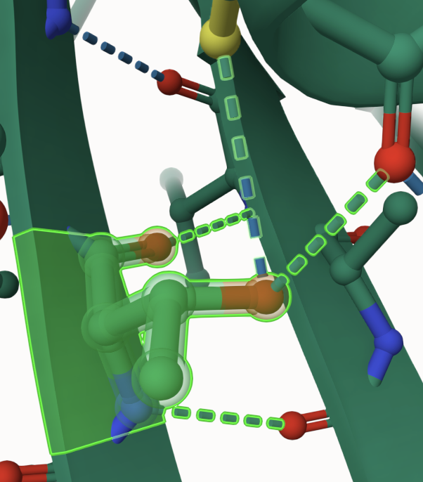
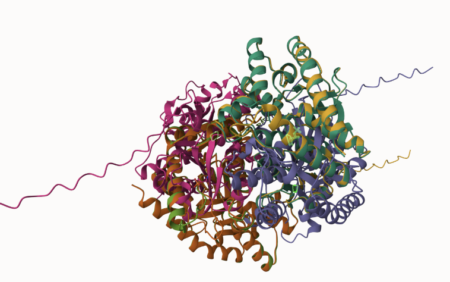
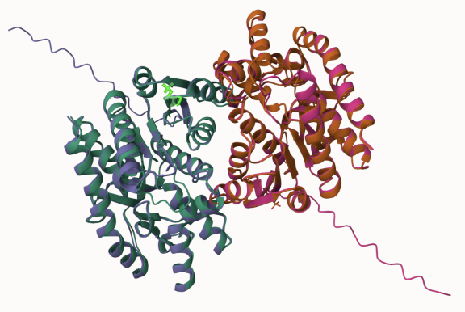
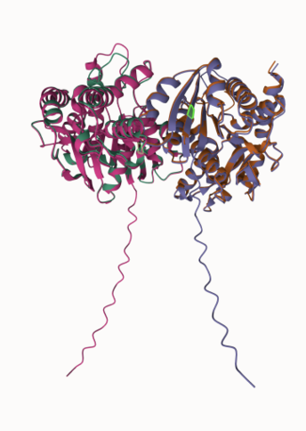
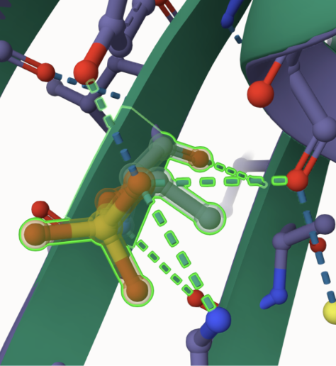
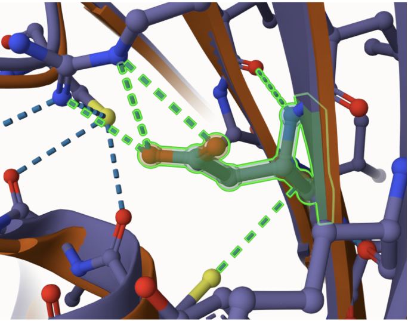
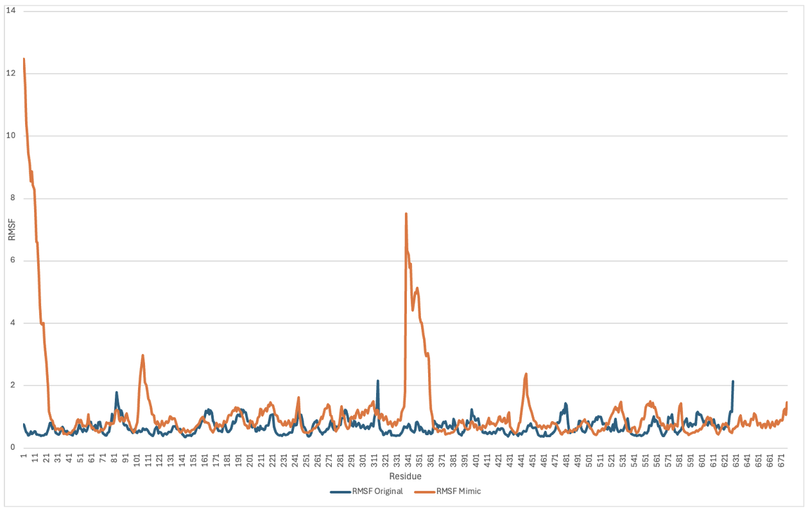
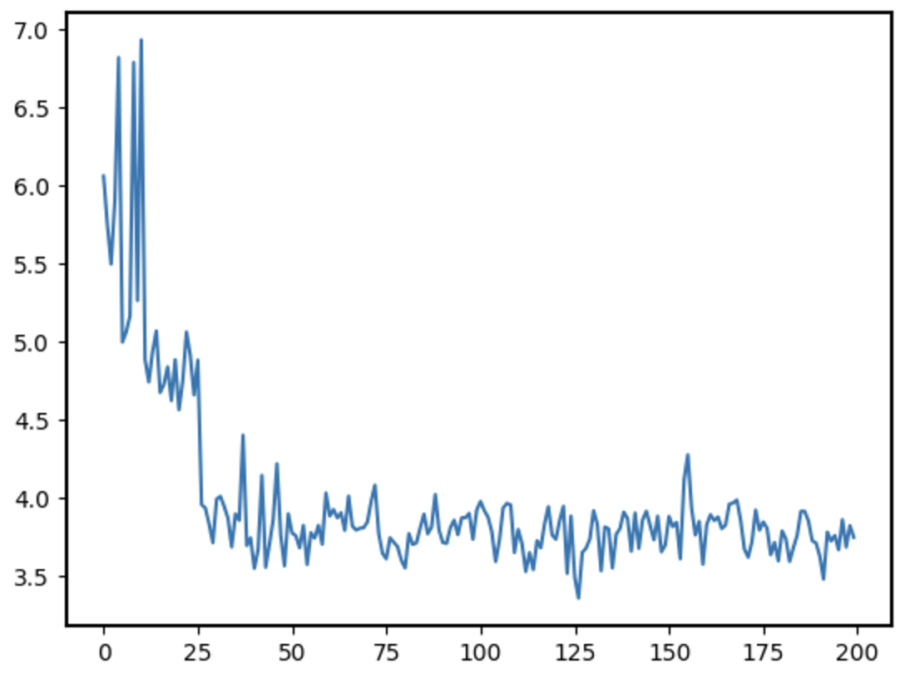

# Homo sapiens Malate Dehydrogenase 2
# P40926
# pT54

## Description

The objective of this study was to investigate post-translational modifications (PTMs) in human mitochondrial malate dehydrogenase 2 (MDH2), specifically focusing on phosphorylation at threonine 54 (T54) and its mimicry through a threonine-to-aspartic acid substitution. Phosphorylation is one of the most prevalent PTMs, affecting approximately 80% of proteins encoded by human genes (Kinexus, 2019). Among the phosphorylated residues, serine is the most commonly modified, followed by threonine, which accounts for about 10% of phosphorylation events (Kinexus, 2019). While spectrometry analyses have identified several phosphorylated threonine residues in human MDH2, the role of T54 in the sequence remains unexplored (Pulido et al., 2024). The substitution of threonine with aspartic acid as a PTM mimic has been studied, with findings suggesting potential disruptions to cellular metabolism particularly within the citric acid cycle and the malate-aspartate shuttle across the mitochondrial membrane, depending on the location of the modification (Broeks et al, 2021). The substitution of threonine with aspartic acid can significantly alter the protein's structure and function, as aspartic acid introduces a negatively charged side chain that differs in size and chemical properties from threonine (Jander, Joshi, 2009). However, much like phosphorylation, limited data exist on the specific impacts of threonine-to-aspartic acid substitutions. This study seeks to address this gap by examining the structural and functional consequences of T54 phosphorylation and its mimetic substitution.

1. image of the unmodified site

2. image of modification site

## Effect of the sequence variant and PTM on MDH dynamics

Part 3 from the Project 4 report

1. Image of aligned PDB files (no solvent)

2. Image of the site with the aligned PDB files (no solvent)

3. Annotated RMSF plot showing differences between the simulations

4. Annotated plots of pKa for the key amino acids

5. If needed, show ligand bound images and how modification affects substrate binding

Despite differences in hydrogen bonding patterns and local structural rearrangements, the overall structure of MDH2 appeared to remain largely unaffected by both phosphorylation and the aspartic acid substitution. The alterations in the amino acid did not induce any significant structural disruptions that would compromise enzymatic function. Given the critical role of MDH2 in mitochondrial ATP production and metabolic pathways, including the citric acid cycle and the malate-aspartate shuttle, substantial structural changes could have impaired the enzyme’s function. However, the findings suggested that these modifications had minimal impacts on MDH2’s enzymatic activity, preserving mitochondrial function in high-energy-demand tissues like the liver and kidneys.

## Comparison of the mimic and the authentic PTM

Part 4 from the Project 4 report outline
include images as needed
Based on the findings, the mimic variant serves as a reliable approximation of the PTM-modified MDH2 enzyme, effectively capturing the structural and functional characteristics of the phosphorylated model. While both the mimic and PTM-modified variants exhibited changes in weak interactions, with the mimic also exhibiting increased molecular dynamics and decreasing the histidine site pKa compared to the unmodified MDH2, their overall structural integrity remained intact. Both variants preserved the dimeric configuration and maintained substrate binding at the histidine active site, ensuring enzymatic functionality. Importantly, these modifications localized away from critical functional sites, did not significantly disrupt MDH2’s role in mitochondrial ATP production or energy metabolism. Given the minimal impact on overall structure and function, the mimic variant accurately reflects the behavior of the PTM-modified enzyme and provides a valuable tool for studying sequence changes in MDH2 without loss of function.

## Authors

Lucia Layden

## 12/6/2024

## License

Shield: [![CC BY-NC 4.0][cc-by-nc-shield]][cc-by-nc]

This work is licensed under a
[Creative Commons Attribution-NonCommercial 4.0 International License][cc-by-nc].

[![CC BY-NC 4.0][cc-by-nc-image]][cc-by-nc]

[cc-by-nc]: https://creativecommons.org/licenses/by-nc/4.0/
[cc-by-nc-image]: https://licensebuttons.net/l/by-nc/4.0/88x31.png
[cc-by-nc-shield]: https://img.shields.io/badge/License-CC%20BY--NC%204.0-lightgrey.svg

## References

* Citation1 

* Citation2 

* Citation3 

* Citation4 !(https://www.kinexus.ca/scienceTechnology/phosphorylation/phosphorylation.html)

* Citation5 
