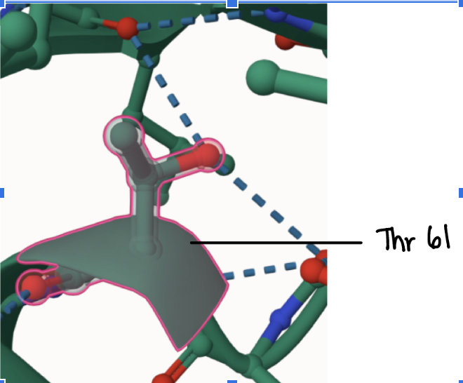
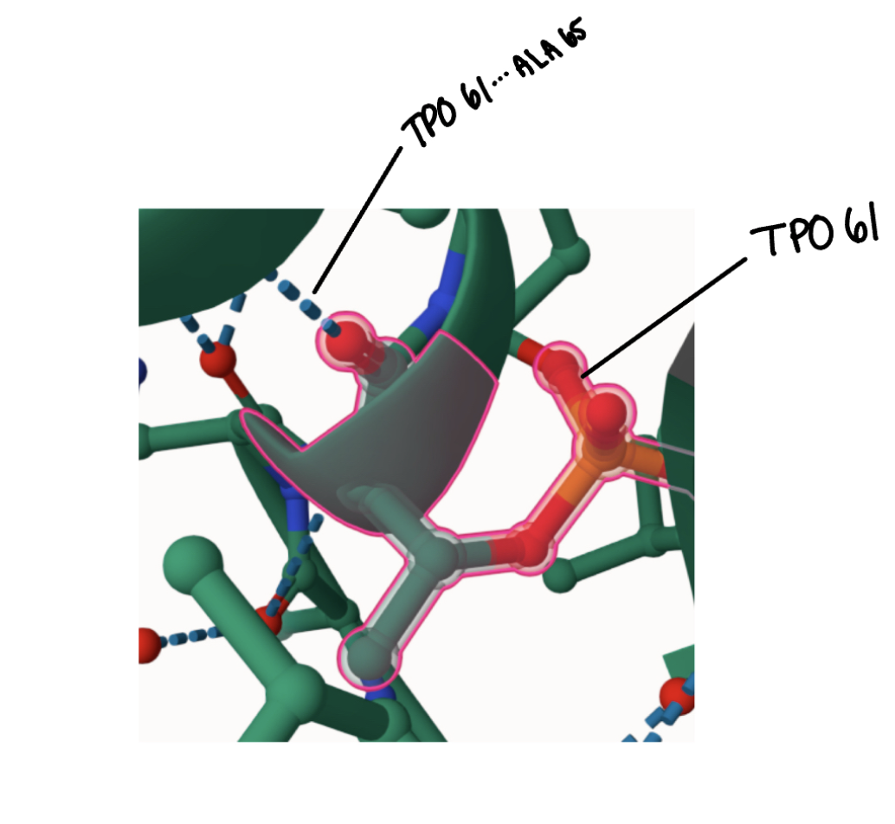
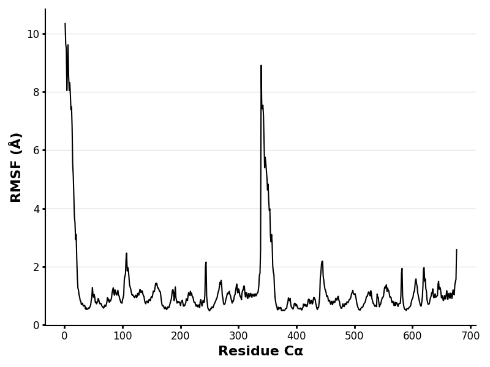
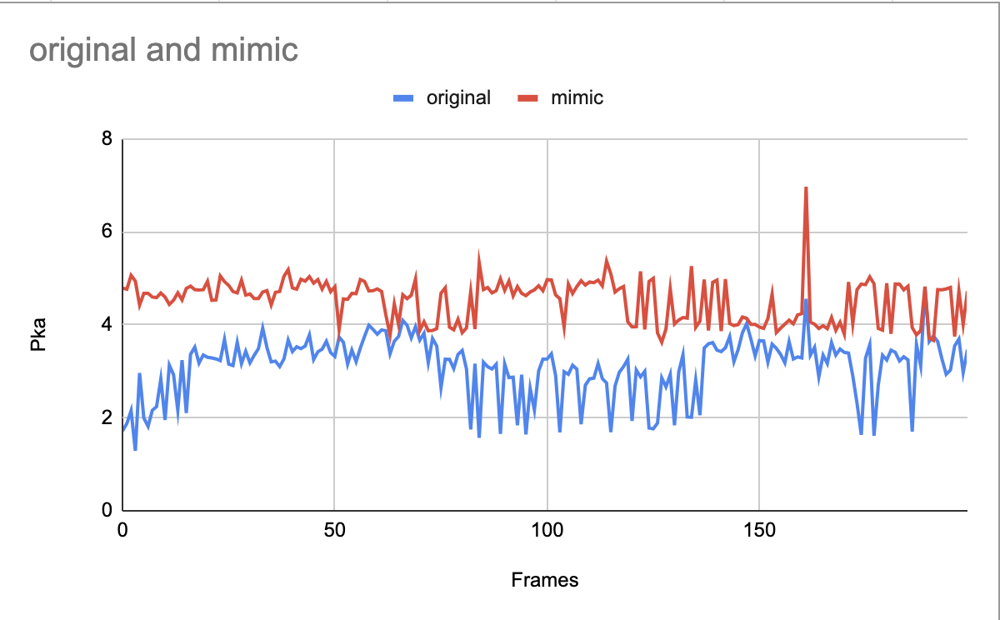

# Human MDH2
# P40926
# Phosphorylation of Theorine 61

## Description

Malate dehydrogenase (MDH2) is an enzyme involved in the Krebs cycle, where it catalyzes the conversion of malate to oxaloacetate using NAD+. Mutations and altered activity of MDH2 have been correlated with cancer and neurodegenerative conditions such as epileptic encephalopathy 2. This experiment aims to investigate and analyze how the structure/function of MDH2 is affected following phosphorylation at amino acid 61, resulting in the substitution of Threonine (T) with Aspartic acid (D). 

1. image of the unmodified site

2. image of modification site

Although there has not been extensive research on the effects of phosphorylation on MDH2 activity, there have been published articles of experiments where they have predicted and identified phosphorylation sites using mass spectroscopy1. However, these articles have not gone in depth about the specific phosphorylation of Threonine to Aspartic acid at Amino Acid 61, but they suggest further research will continue. In addition to this, Uniprot has a section of diseases associated with different changes in amino acids and this specific change was not listed. Figure 1. (above) illustrates the alpha helix at amino acid position 61 of Theorine interacting with Alanine 59 and 65, as well as Tyrosine 80 through hydrogen bonding.  Figure 2. Depicts the  PTM-modified model, where phosphorylated threonine 61(TPO) interacts with Alanine 65– losing the weak interactions that were previously observed in the unmodified structure (Figure 1.). Lastly, Figure 3. shows the mimic variant Aspartic acid 61 to have weak interactions via hydrogen bonding with Alanine 65 and Tyrosine 80. When comparing these modifications to the unmodified structure there are a variety of noticeable changes, such as altered weak interactions and differences in the composition of the alpha helix. Although the structure still forms an alpha helix, the PTM-modified variant shows a distinct change where it forms a “ring” like projection compared to Figures 1 and 3. These structural differences imply that the function of MDH2 may be altered as well as its stability. 

## Effect of the sequence variant and PTM on MDH dynamics

Part 3 from the Project 4 report
The molecular dynamics simulations introduced in Colab 1 and Colab 2 offered insight into the movements of the molecules, as well as produced data regarding root mean square deviation (RMSD) and root mean square fluctuation (RMSF). RMSD is where the distance between an observed atom (target) and another atom that is used as a reference is measured over a certain amount of time (typically in frames), whereas RMSF measures how often an individual atom moves (fluctuates)3-5. Colab 2 produced the data for the mimic variant in  Figure_  of the Pka trajectory over simulation. It can be observed that in the unmodified structure (labeled “original” in blue) the pKa starts at a lower value, around 2, and maintains pKas that don’t go over 4, until until about frame 160. Whereas, the mimic variant pKa starts at about 4.2, and peaks at frame 160 to the pKa value of 7.  This shows that the mimic variant is slightly more stable in the pKa ranges, but because the pKa follows a slightly higher range of pKa values it endures constant shifts of deprotonation and protonation and chemical environments. The unmodified variant (labeled original) shows higher stability because of the lower range of Pkas and the constant peaks between frames ~75 and ~145.

3. Annotated RMSF plot showing differences between the simulations

4. Annotated plots of pKa for the key amino acids

## Comparison of the mimic and the authentic PTM

As previously stated, the Modified enzyme and the mimic variant have identical PTM (0.89) and ipTM (0.88)  scores in AlphaFold 3, regardless of this, there has been a variety of differences between the two molecules. Figure 2 offers a modification site of TPO 61 with a bond to ALA 65, whereas Figure 3 depicts a modification site that consists of ASP 61 forming bonds with TYR 80 and ALA 61 and 65. The modified enzyme and mimic variant can then be compared by their active site at HIS 200, depicted in Figures 4 and 5. Using the unmodified structure as a reference for the basis of comparison, the mimic variant has an extra hydrogen bond to ASN 145, which can result in a decrease in catalytic activity due to this extra bond limiting the number of substrates binding to it, acting as an inhibitor. however, the modified enzyme loses a hydrogen bond, and one hydrogen bond remains interacting with ASP 173. Although both structures diverge from the unmodified structure, the mimic variant still exhibits signs of difference and is not approximated to either the unmodified or modified structure. The mimic variant can be identified as its own structure that is separate from the modified enzyme.  

## Authors

Romina Bernardez

## Deposition Date

## License

Shield: [![CC BY-NC 4.0][cc-by-nc-shield]][cc-by-nc]

This work is licensed under a
[Creative Commons Attribution-NonCommercial 4.0 International License][cc-by-nc].

[![CC BY-NC 4.0][cc-by-nc-image]][cc-by-nc]

[cc-by-nc]: https://creativecommons.org/licenses/by-nc/4.0/
[cc-by-nc-image]: https://licensebuttons.net/l/by-nc/4.0/88x31.png
[cc-by-nc-shield]: https://img.shields.io/badge/License-CC%20BY--NC%204.0-lightgrey.svg

## References

* Chang, N. M.; Rementeria, G. J.; Berquist, B. E.; Provost, J. J. Impact of Phosphorylation on MDH2 Structure, Function and Protein. The FASEB Journal 2020, 34 (S1), 1–1.  

* Ait-El-Mkadem, S.; Dayem-Quere, M.; Gusic, M.; Chaussenot, A.; Bannwarth, S.; François, B.; Genin, E. C.; Fragaki, K.; Volker-Touw, C. L. M.; Vasnier, C.; Serre, V.; van Gassen, K. L. I.; Lespinasse, F.; Richter, S.; Eisenhofer, G.; Rouzier, C.; Mochel, F.; De Saint-Martin, A.; Abi Warde, M.-T.; de Sain-van der Velde, M. G. M.; Jans, J. J. M.; Amiel, J.; Avsec, Z.; Mertes, C.; Haack, T. B.; Strom, T.; Meitinger, T.; Bonnen, P. E.; Taylor, R. W.; Gagneur, J.; van Hasselt, P. M.; Rötig, A.; Delahodde, A.; Prokisch, H.; Fuchs, S. A.; Paquis-Flucklinger, V. Mutations in MDH2, Encoding a Krebs Cycle Enzyme, Cause Early-Onset Severe Encephalopathy. Am J Hum Genet 2017, 100 (1), 151–159. 

* Alder, B. J.; Wainwright, T. E. Studies in Molecular Dynamics. I. General Method. The Journal of Chemical Physics 1959, 31 (2), 459–466. 

* Armougom, F.; Moretti, S.; Keduas, V.; Notredame, C. The iRMSD: A Local Measure of Sequence Alignment Accuracy Using Structural Information. Bioinformatics 2006, 22 (14), e35–e39. 

* Zhang, Y.; Skolnick, J. Scoring Function for Automated Assessment of Protein Structure Template Quality. Proteins 2004, 57 (4), 702–710. 
