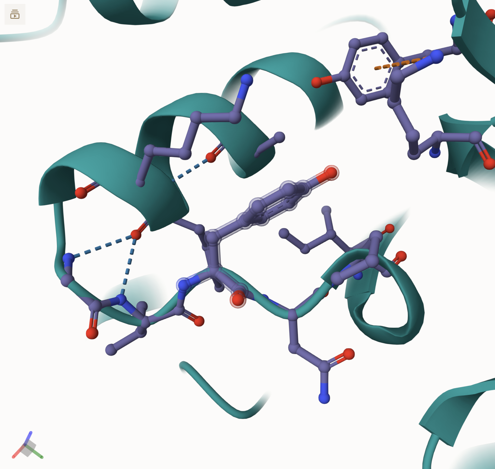
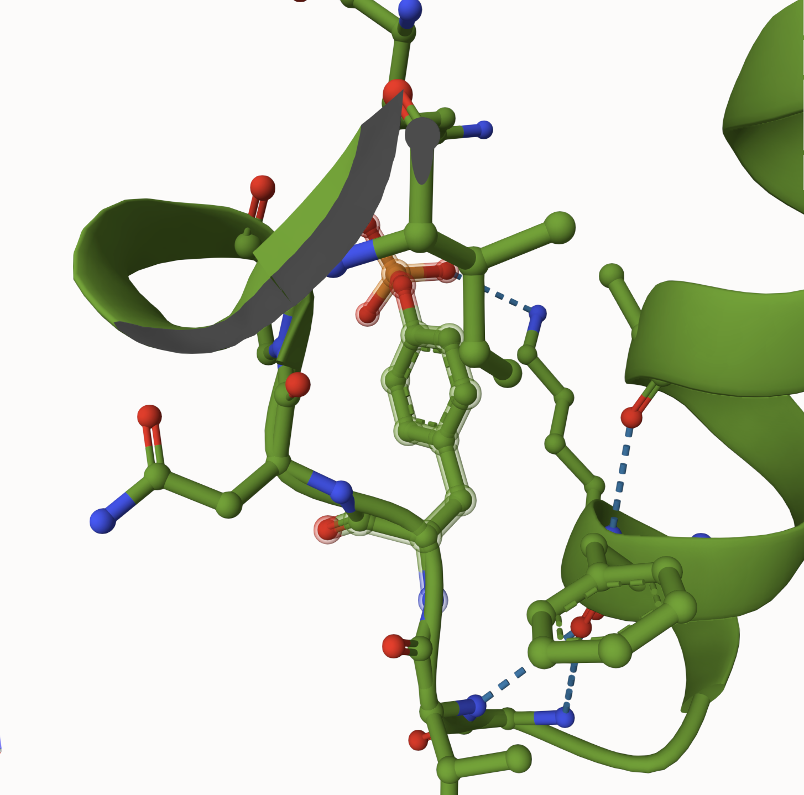
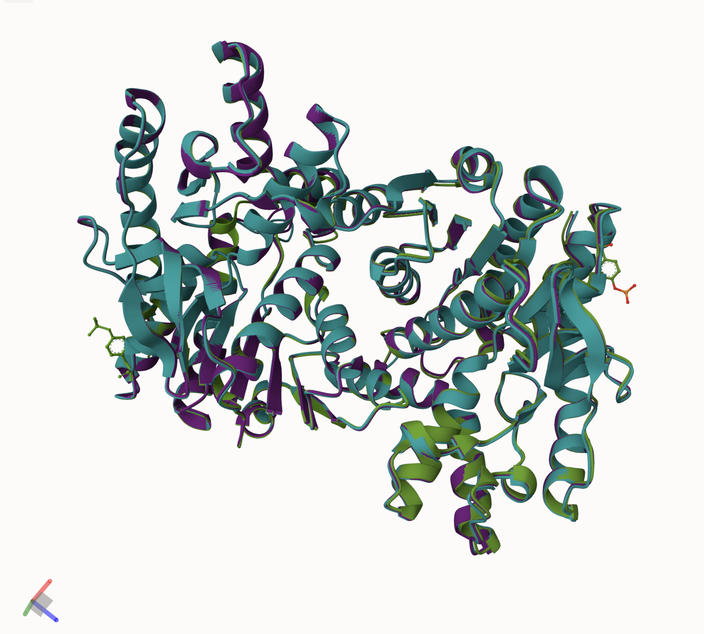
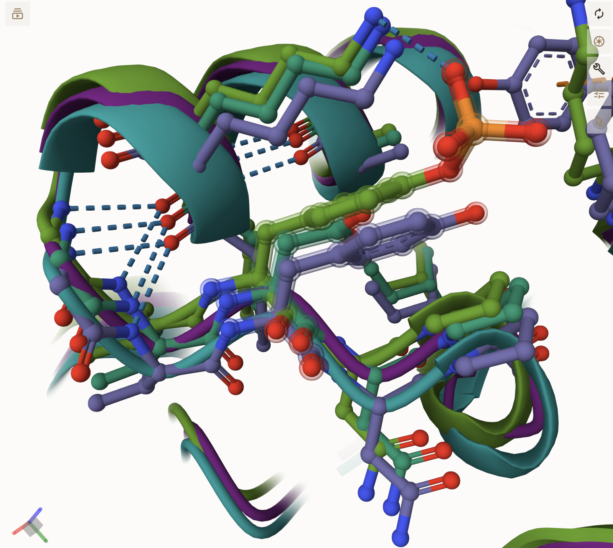
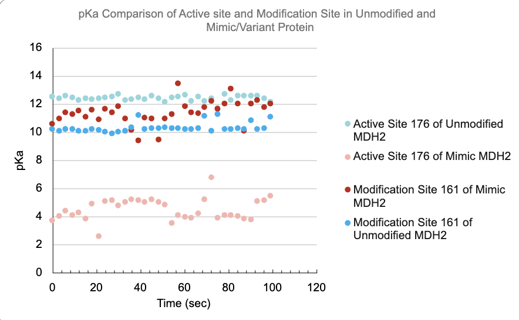
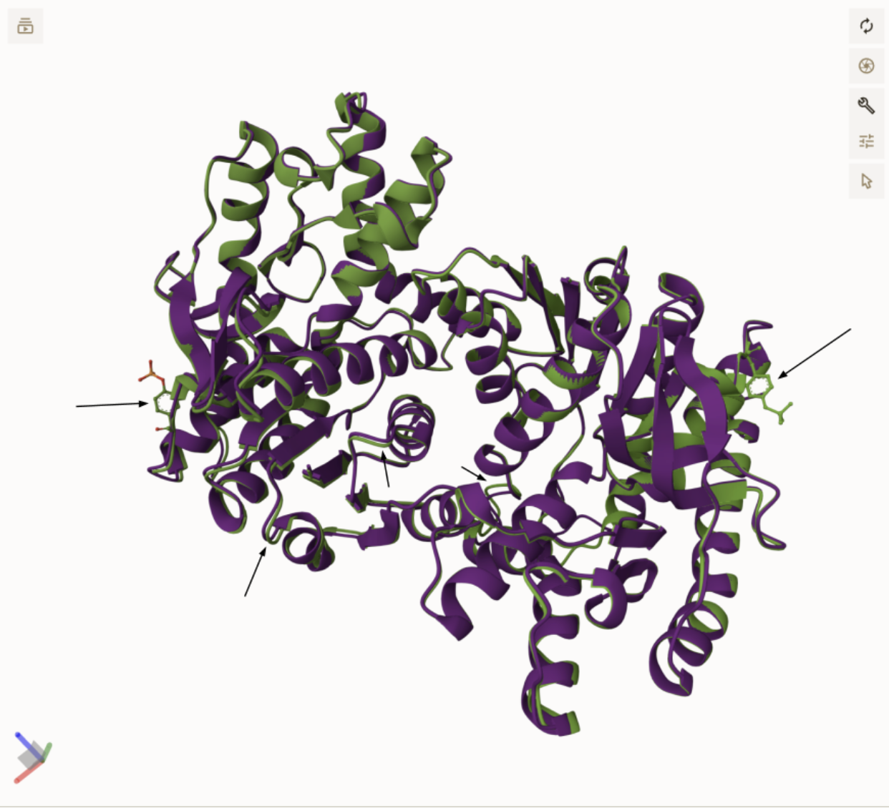

# Human MDH2

# Uniprot ID: P40926

# Variation: phosphorylation of Y161 (Y137 in processed sequence)

## Description

Tyrosine 137 of human MDH2 is located within a loop region in which its position is relative to the substrate-binding site, however, not directly within the catalytic core. In visualisation of the amino acid using MolStar, Y137 is seemingly surface-accessible and is seen to be involved in many amino acid interactions, including that of F131 and V136, two residues connected through hydrogen bonding, and in turn G135, (acts as a backbone with V136) suggesting its possible role in structural stabilisation. No previous studies, however, exist that focus on the phosphorylation and modification of Tyrosine 137

```         
I. Unmodified Y137 Site within MDH2 
```



Above is an image of the Y137 site in the Unmodified MDH2, showing the connection to surrounding amino acids and the loop in which the site is located. This image can be used to compare the weak interactions and other structural modifications to the mimic and the modified variant.

```         
II. Modified Y137 Site within MDH2
```



This image of modified MDH2, in which Y137 is phosphorylated and PTR is substituted, highlights the addition of a O-phosphoY group and the hydrogen bond between PTR137 and K141. The loop in which Y137 is located, is clearly seen to be displaced.

## Effect of the sequence variant and PTM on MDH dynamics

```         
I. Alignment of MDH2 (Teal), MDH2 with phosphoY 137 (Green) and Y137D (Purple)
```



The alignment of the three enzyme states highlights the structural deviations of amino acid 137. In the unmodified enzyme (teal), as stated previously, Y137 can be seen located in a loop, interacting with F131 and V136, contributing to loop stability through hydrophobic interactions and slight (weak) hydrogen bonding. The RMSD of the aligned enzymes was 1.32 Å.

```         
II. Modification site alignment within MDH2
```



The modification site alignment of MDH2 (grayish-purple), phosphoY 137 MDH2 (green), and the Y137D mutant (teal) shows strong overall backbone conservation, with subtle local deviations near residue 137—particularly in the loop and helix region—suggesting that the modified variants may induce localised structural shifts affecting hydrogen bonding and active site geometry.

```         
III. Mimic, or Y137D, RMSF plot 
```


```         
IV. Unmodified MDH2 RMSF plot
```


The mimic RMSF graph illustrates an increase in flexibility around residue 137, compared to the unmodified enzyme RMSF graph. These elevated fluctuations, though slight, suggest that with the substitution of tyrosine instead of aspartic acid, the backbone interactions may be slightly unstabilised and result in more mobility within the structure.

```         
V. The Comparison of the Unmodified and Modified MDH2 Enzyme’s pKa Values 
```



Overall, the modification did affect the pKa values of the active site of histidine. The pKa analysis visualised that with the introduction of D137, the protonation behaviour of the histidine active site is changed. The large shift in pKa further suggests an altered electrostatic environment that could impact catalytic or substrate affinity.

## Comparison of the mimic and the authentic PTM

```         
I. Superposition of the Mimic and Modified MDH2 Enzyme. Black arrows used to show differences. 
```



This MolStar image as well as the modification site alignment image can lead one to conclude that the mimic does preserve *some* charge effects and interactions, but it doesn’t fully reproduce the steric and electrostatic effects of the true phosphorylation model. If needed for analysis of broad trends of effectiveness, the mimic could be used, but for complete and thorough understanding, the PTM-modified enzyme is best.

## Authors

A.J. Nicholson

## Deposition Date

05/06/2025

## License

Shield: [](https://creativecommons.org/licenses/by-nc/4.0/)

This work is licensed under a [Creative Commons Attribution-NonCommercial 4.0 International License](https://creativecommons.org/licenses/by-nc/4.0/).

[](https://creativecommons.org/licenses/by-nc/4.0/)

## References

-   Charles S. Fermaintt, Wacker, S. Malate Dehydrogenase as a Multi-Purpose Target for Drug Discovery. Essays in Biochemistry 2024; 68 (2): 147–160. doi: <https://doi.org/10.1042/EBC20230081>

-   Lee, J. M.; Hammarén, H. M.; Savitski, M. M.; Baek, S. H. Control of Protein Stability by Post-Translational Modifications. Nature Communications 2023, 14 (1), 201. <https://doi.org/10.1038/s41467-023-35795-8>.
