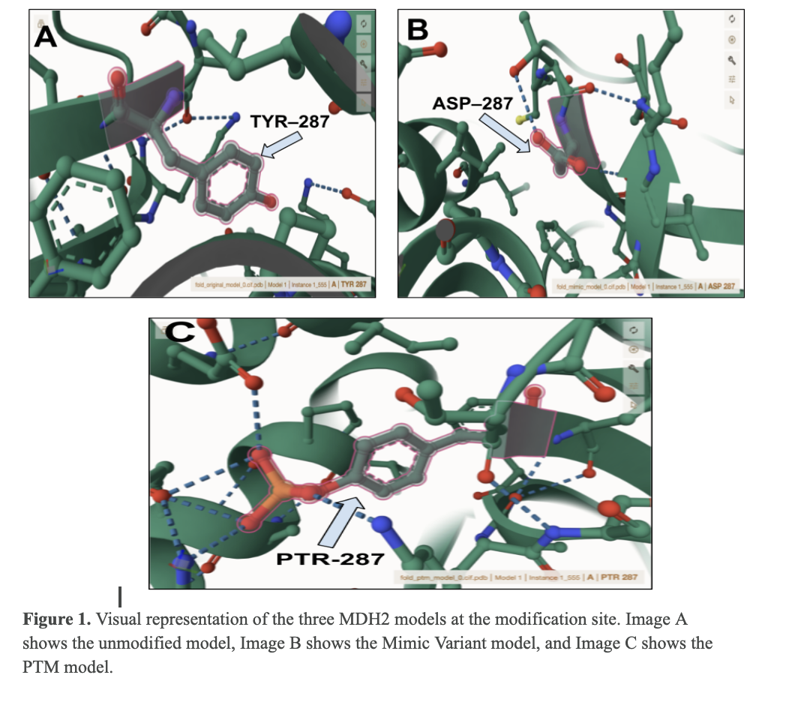
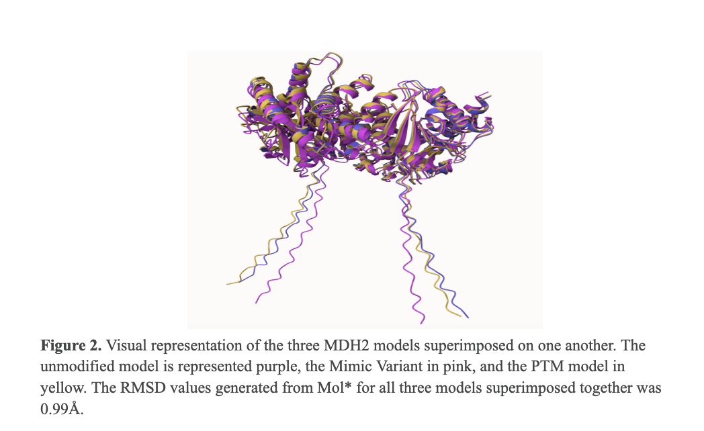
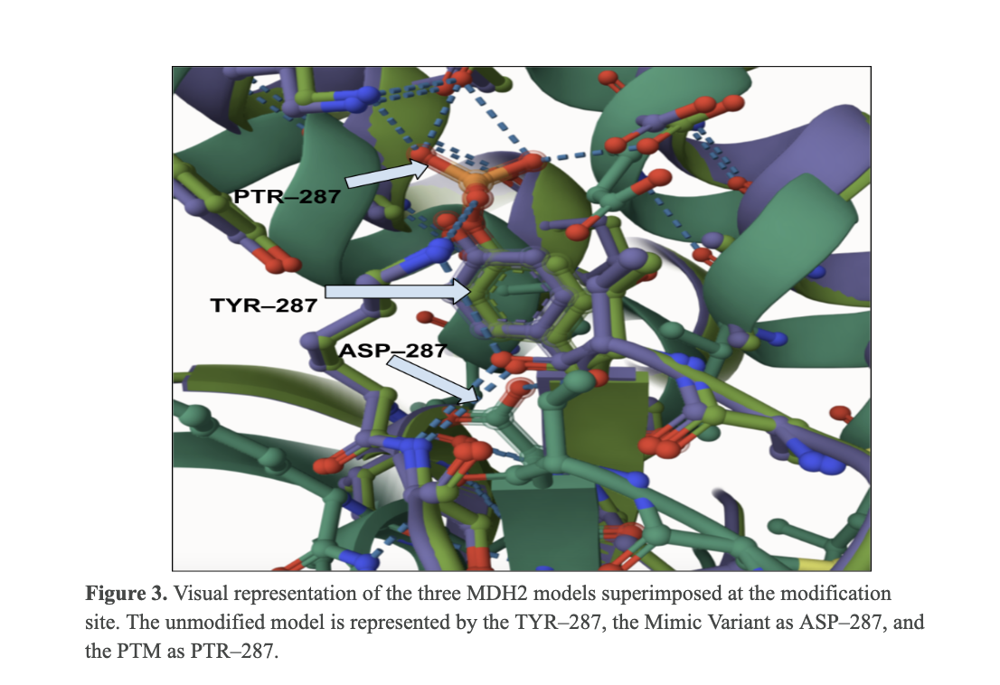
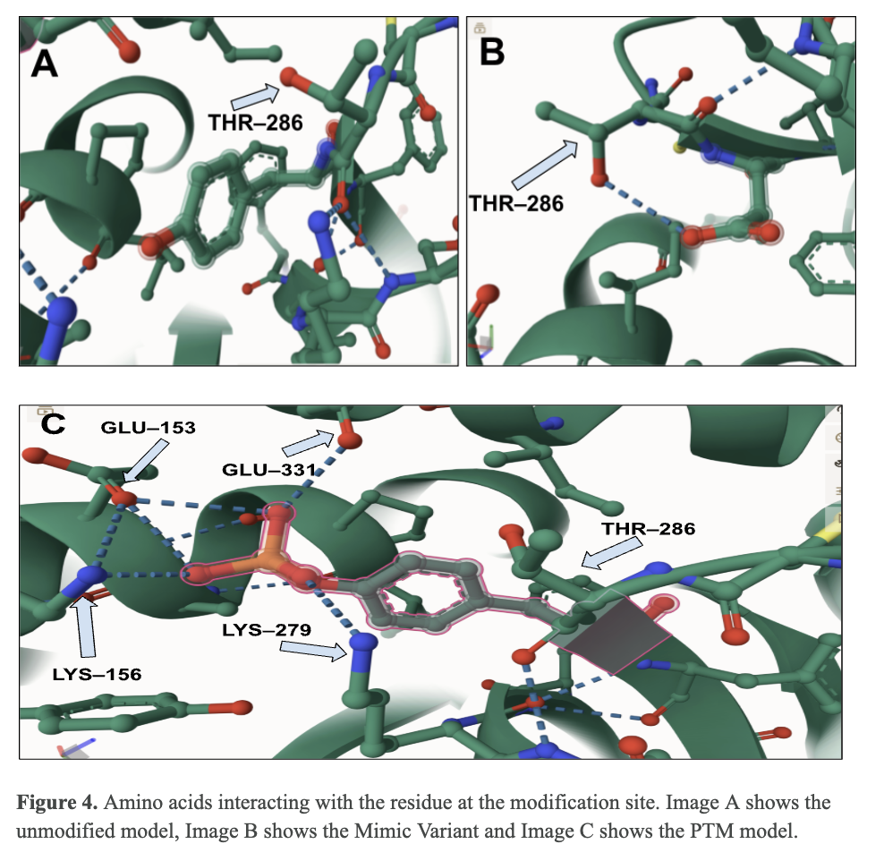
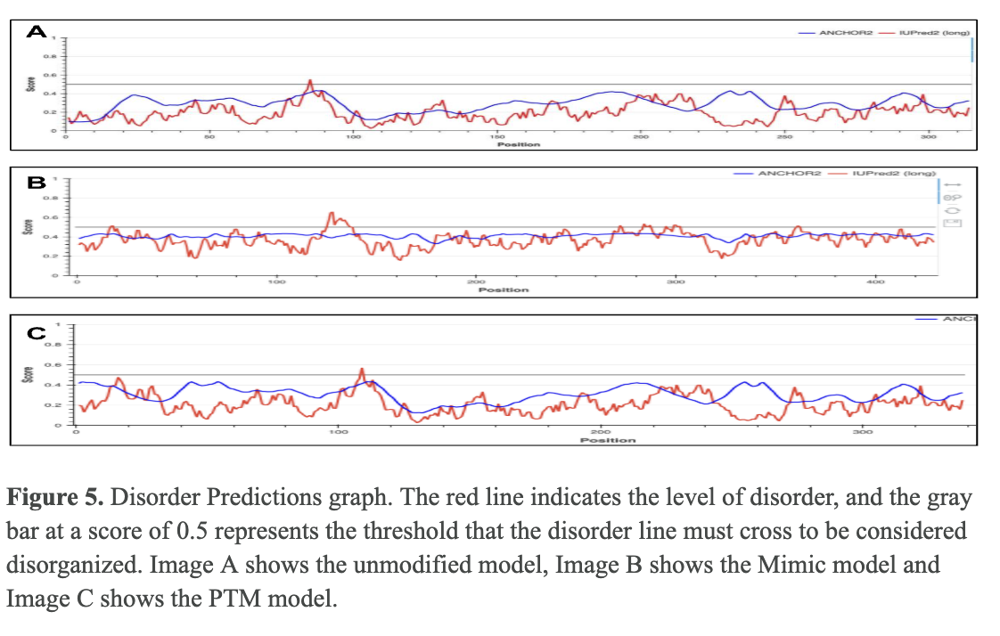
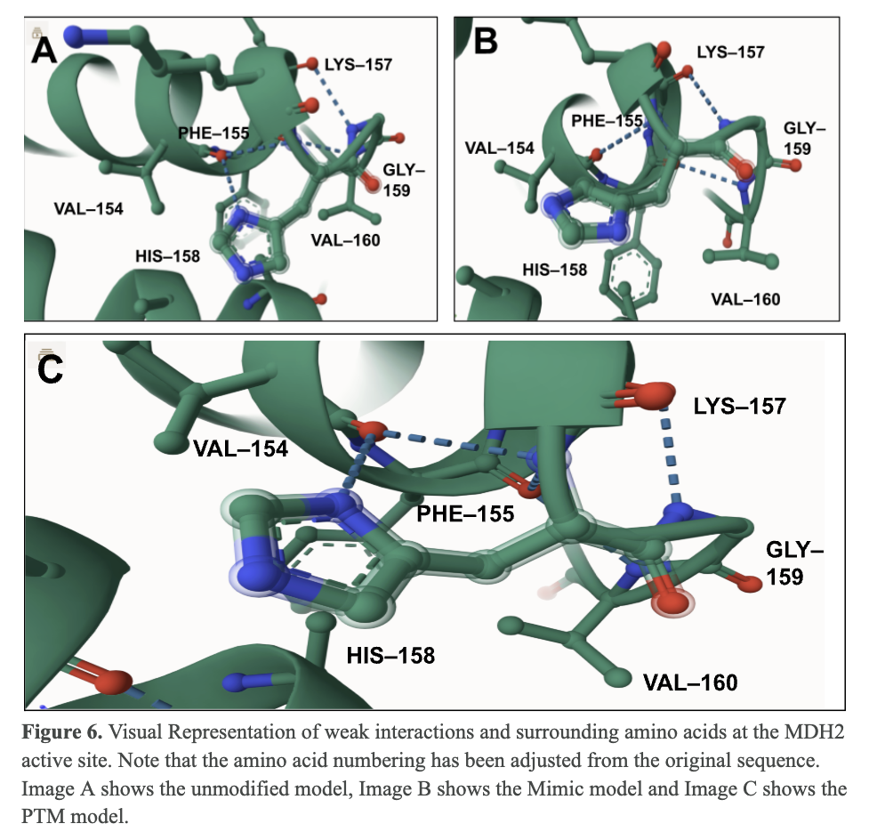
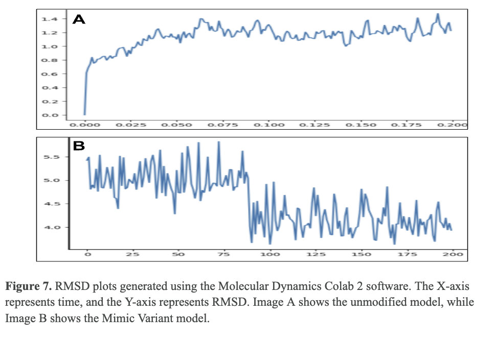
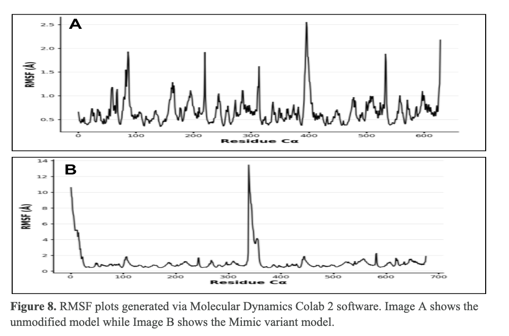

# Malate Dehydrogenase 2
# Uniprot ID: P40926
# Variation: phosphorylation of Y287 (pY287 in structure)

## Description

Tyrosine 287 in the protein MDH2 has not previously been identified as a site for post-translational modification (PTM). This study investigates the structural and functional consequences of introducing a PTM at this site. To achieve this, a mimic variant was created by altering the amino acid sequence at the Y287 site to simulate the effects of PTM. Additionally, a PTM model was developed to examine the impact of adding a post-translational modification directly to the Y287 residue.

#Comparison of unmodified MDH2 model to phosphorylated modified models

1. Alignment of unmodified MDH2 (purple), Mimic Variant of MDH2 (pink), and PTM model of MDH2 (yellow)

2. image of modification site

The modification site is near T286 and could make hydrogen bonds or Van der Waals interactions with each of the side chains when modified.  

## Effect of the sequence variant and PTM on MDH dynamics

The RMSD of the final frame from MD simulations of MDH2 the Mimic Variant was  0.99 Å. The unmodified model is represented in pink and purple, the Mimic Variant in orange and teal, and the PTM model in yellow and green. 

After simulation, the overall protein structures and the regions surrounding the modification sites displayed only minor changes. In the unmodified model, THR-286 interacted with TYR-287 via Van der Waals forces due to their close proximity within the structure. In the Mimic Variant model, THR-286 formed a hydrogen bond with ASP-287. Similarly, in the PTM model, THR-286 interacted with PTR-287 through Van der Waals forces owing to their spatial closeness. Additionally, GLU-331, GLU-153, LYS-156, and LYS-279 formed hydrogen bonds with PTR-287.

 ### Comparison of the enzyme dynamics

After simulation, the dynamics of the protein, assessed through root mean square fluctuation (RMSF) values, were compared between the unmodified model and the Mimic Variant. Significant differences were observed in the Mimic Variant, particularly around amino acid regions 1–25 and 325–375. These regions correspond to loop/coil structures. The 1–25 region comprises the long coiled tail characteristic of the MDH2 protein, while the 325–375 region is located near the C-terminal end of the protein sequence.

The orange-boxed region highlights the coiled loop spanning amino acids 325 to 338, while the blue-boxed region marks the coiled/loop segment from amino acids 1 to 25. The yellow ellipse indicates the interaction between the active site and the NAD+ binding sites.

### Effect of the modification on the pKa values

The modification notably influenced the pKa values of the active site histidine. The Mimic Variant model exhibited significantly higher pKa values compared to the unmodified model. This shift in pKa is likely attributed to differences in the side chains at the modification site, which can alter the local electrostatic environment and impact histidine's ionization properties.

## Comparison of the mimic and the authentic PTM

The root mean square deviation (RMSD) between the Mimic Variant and the unmodified model, when superimposed, was 0.81 Å. The overall structures are highly similar, with no significant differences in overall structure or position, apart from the altered amino acid at the modification site.

## Authors

Nicole E. Castro

## Deposition Date
12/6/2024

## License

Shield: [![CC BY-NC 4.0][cc-by-nc-shield]][cc-by-nc]

This work is licensed under a
[Creative Commons Attribution-NonCommercial 4.0 International License][cc-by-nc].

[![CC BY-NC 4.0][cc-by-nc-image]][cc-by-nc]

[cc-by-nc]: https://creativecommons.org/licenses/by-nc/4.0/
[cc-by-nc-image]: https://licensebuttons.net/l/by-nc/4.0/88x31.png
[cc-by-nc-shield]: https://img.shields.io/badge/License-CC%20BY--NC%204.0-lightgrey.svg

## References

1. AlphaFold Server. https://alphafoldserver.com/fold/5fa2322ca1bb0a66. Accessed 6 Dec. 2024
2. Mol* Viewer. https://molstar.org/viewer/. Accessed 6 Dec. 2024. 
3. UniProt. https://www.uniprot.org/uniprotkb/P40926/entry. Accessed 6 Sept. 2024.

