# Human MDH2

# P40926

# phosphorylation of Y80 (pY56 in structure)

## Description

Analyzing the effects of the phosphorylation of TYR80, seen at residue 56, as well as the variant formed when replacing it with ASP56.

1.  image of the unmodified site 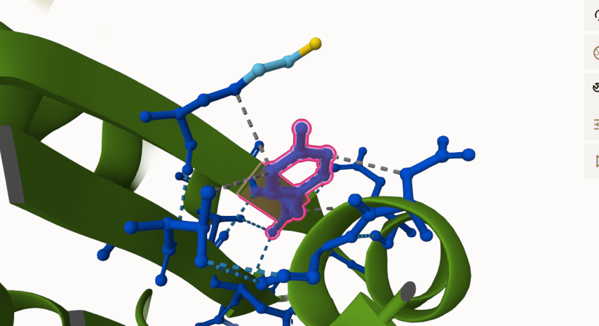

2.  image of modification site 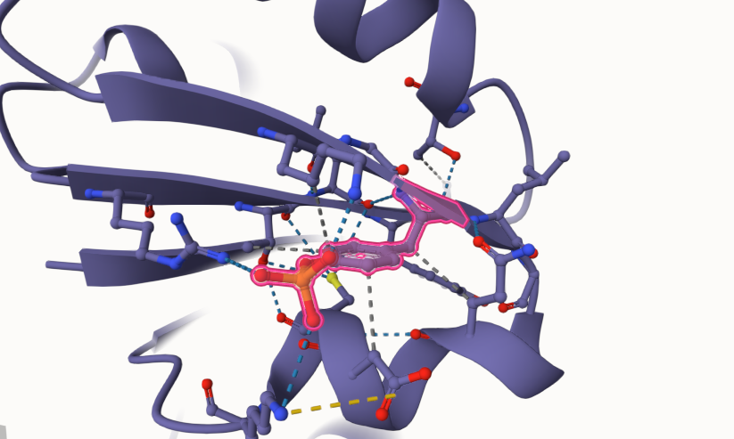

3.  image of the variant site 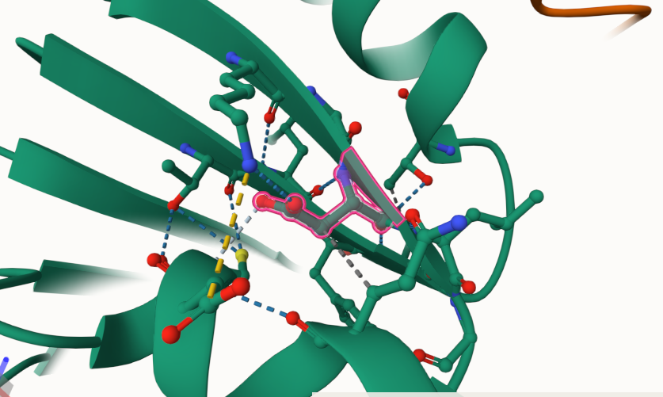

4.  image of boltz-1 original at mimic site 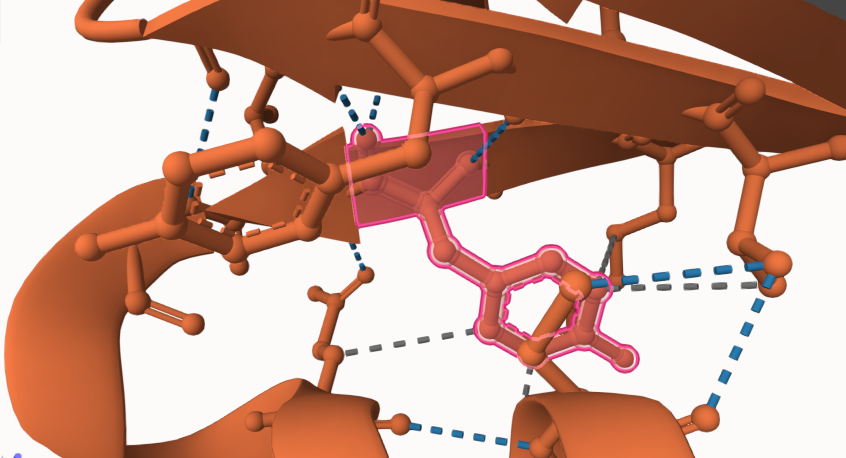

5.  image of boltz-1 mimic at mimic site 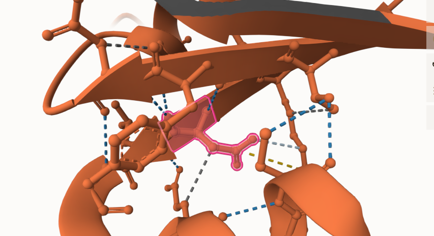

6.  image of the AF3 mimic and AF3 original at active site 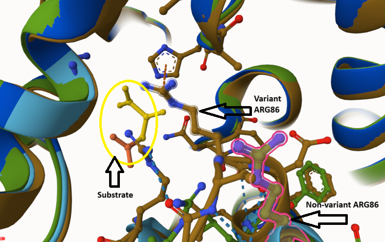

7.  image of the modified and non-modified AF3 structures at active site 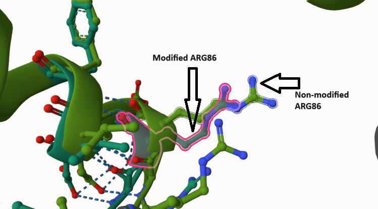

## Effect of the sequence variant and PTM on MDH dynamics

Part 3 from the Project 4 report

1.  Image of the site with the aligned PDB files (no solvent) 

2.  Annotated Original RMSF plot showing differences between the simulations 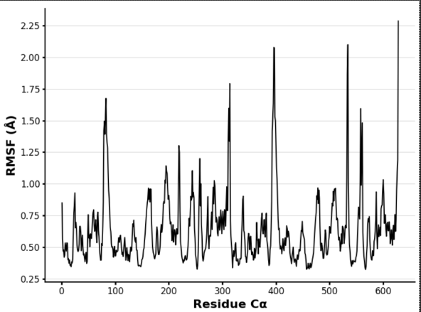

3.  Annotated Variant RMSF plot showing differences between the simulations 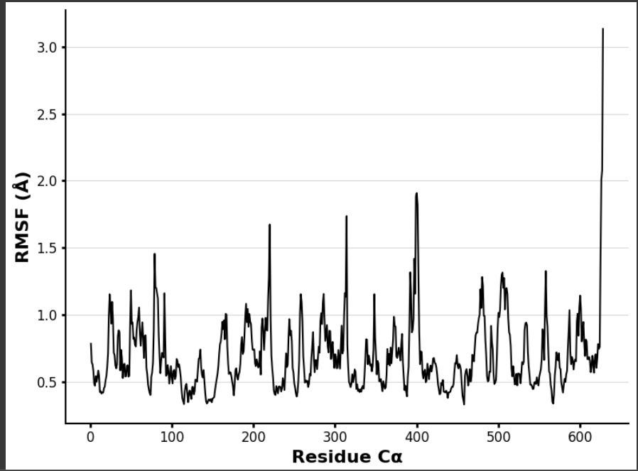

4.  Annotated plots of original pKa for the key amino acids 

5.  Annotated plots of variant pKa for the key amino acids 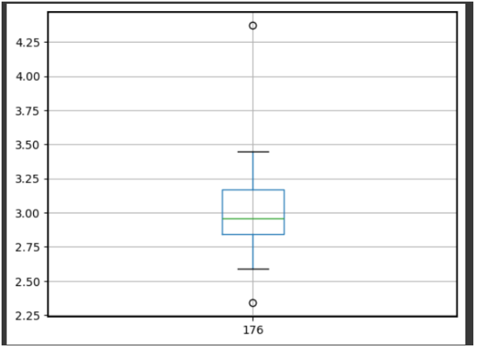

6.  graph showing the pka trajectory in the original structure 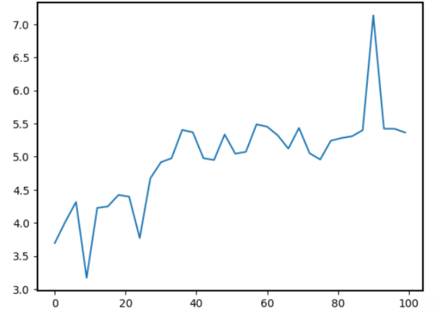

7.  graph showing the pKa trajectory in the variant structure 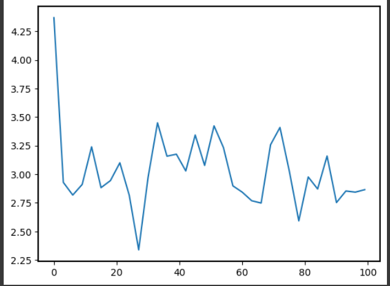

8.  graph showing the RMSD data in the non-variant structure 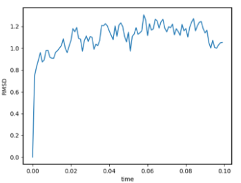

9.  graph showing the PMSD data for the variant structure 

Description of the data and changes

## Comparison of the mimic and the authentic PTM

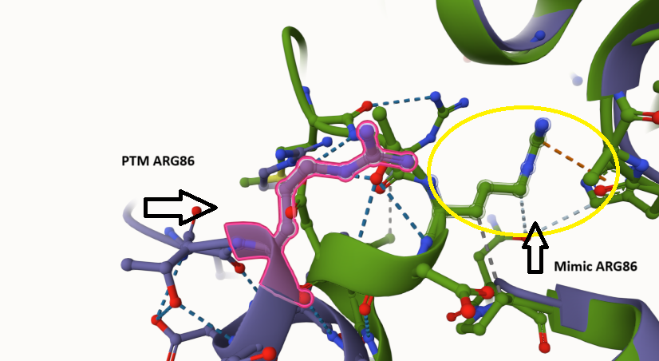

Part 4 from the Project 4 report outline include images as needed

## Authors

Meredith Lawrence

## Date

05/07/2025

## License

Shield: 

This work is licensed under a [Creative Commons Attribution-NonCommercial 4.0 International License](https://creativecommons.org/licenses/by-nc/4.0/).

## References

-   Christopher E. Berndsen, Jessica K. Bell; The structural biology and dynamics of malate dehydrogenases. Essays Biochem 3 October 2024; 68 (2): 57–72.

-   Cannon-Albright, L. A.; Stevens, J.; Teerlink, C. C.; Facelli, J. C.; Allen-Brady, K.; Welm, A. L. A Rare Variant in MDH2 (Rs111879470) Is Associated with Predisposition to Recurrent Breast Cancer in an Extended High-Risk Pedigree. Cancers 2023, 15 (24), 5851–5851.

-   Priestley, J. R. C.; Pace, L. M.; Sen, K.; Aggarwal, A.; Alves, C. A. P. F.; Campbell, I. M.; Cuddapah, S. R.; Engelhardt, N. M.; Eskandar, M.; Jolín García, P. C.; Gropman, A.; Helbig, I.; Hong, X.; Gowda, V. K.; Lusk, L.; Trapane, P.; Srinivasan, V. M.; Suwannarat, P.; Ganetzky, R. D. Malate Dehydrogenase 2 Deficiency Is an Emerging Cause of Pediatric Epileptic Encephalopathy with a Recognizable Biochemical Signature. Molecular Genetics and Metabolism Reports 2022, 33, 100931.! [10.1016/j.ymgmr.2022.100931](https://doi.org/10.1016/j.ymgmr.2022.100931)

-   Laura de Lorenzo; Stack, Tyler M. M.; Fox, K.; Walstrom, K. Catalytic Mechanism and Kinetics of Malate Dehydrogenase. Essays in biochemistry 2024, 68 (2). 

-   Alabduladhem, T. O.; Bordoni, B. Physiology, Krebs Cycle. PubMed. <https://www.ncbi.nlm.nih.gov/books/NBK556032/>.

-   Abramson, J et al. Accurate structure prediction of biomolecular interactions with AlphaFold 3. Nature (2024).

-   Boltz-1, This Colab was adapted by Chris Berndsen at James Madison University (ver 2 2025) from a notebook written by Colabfold in 2024.

-   Mol\* Viewer. <https://molstar.org/viewer/> (accessed 2025-05-06).

-   MD Simulation, Colab adapted and developed by Angela Kayll, Angelina Sardelli, and Christopher Berndsen at James Madison University (ver 2 2025) with input and feedback from students in CHEM260 and members of the MCC community.

-   MD Analysis, Colab developed by Angela Kayll, Angelina Sardelli, and Christopher Berndsen at James Madison University (ver 2 2025) with input and feedback from students in CHEM260 and members of the MCC community.

-   UniProt. UniProt. <https://www.uniprot.org/uniprotkb/P40926/entry> (accessed 2025-05-06)

\*AlphaFold Filled - Model P40926. <https://alphafill.eu/model?id=P40926> (accessed 2025-05-06).
